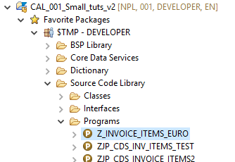
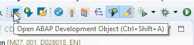
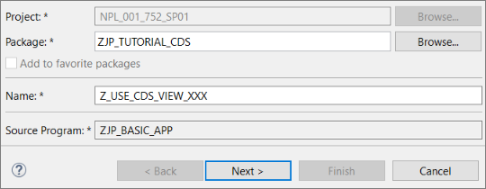
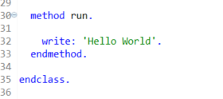
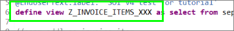
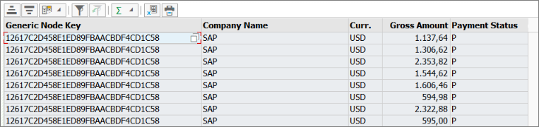
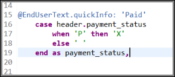
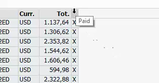
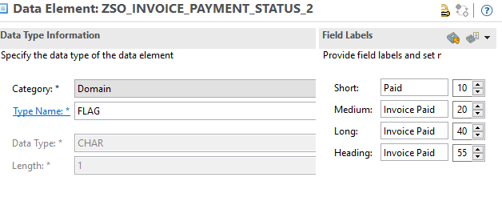
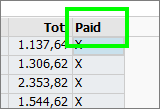

## Prerequisites
- You have a valid instance of an on-premise AS ABAP server, version 7.51 or higher (some ABAP Development Tools may not be available in earlier versions)
- **Tutorial**: [Create and Run an ABAP Program](abap-create-basic-app)

## Details
### You will learn  
- How to consume the CDS view in the SAP List Viewer with Integrated Data Access (ALV with IDA).
- Optional: How to improve the appearance of your SAP List Viewer using a data element and CAST statement.

ALV with IDA lets you display views and tables that contain very large quantities of data.

---

[ACCORDION-BEGIN [Step 1: ](Open the ABAP program)]
Open the ABAP program you created in the previous tutorial, [Create and Run an ABAP Program](abap-create-basic-app).

 - Either choose **Programs > `Z_INVOICE_ITEMS_EURO`**:

    

 - Or choose **Open ABAP Development Object (Ctrl+Shift+A)** and enter the program name, **`Z_INVOICE_ITEMS_EURO`**:

    

[DONE]
[ACCORDION-END]

[ACCORDION-BEGIN [Step 2: ](Duplicate the ABAP program)]

1. Select the program and choose **Duplicate** from the context menu.

    

2. Enter the correct package and a name for your duplicated program, then choose **Next**.

    

3. Assign or create a transport request and choose **Finish**.


[DONE]
[ACCORDION-END]

[ACCORDION-BEGIN [Step 3: ](Add ALV grid to method implementation)]

You will now replace the implementation of the RUN method with a new implementation:

  1.	Delete the existing statements in the method.

    

  2.  Now create an ALV with IDA for your CDS view `Z_Invoice_Items_XXX` and display the ALV in full screen. Don't forget to change `XXX` to your group number or initials:
`cl_salv_gui_table_ida=>create_for_cds_view( 'Z_Invoice_Items_XXX' )->fullscreen( )->display( ).`

    

    The CDS view name is the one defined in the `define view` statement:

    

  3.	Choose **Save (Ctrl+S)**  and **Activate (Ctrl+F3)**.

  4.	Execute your program by choosing **Execute (F8)**.

The invoice items are displayed in ALV with IDA. (Ignore the Generic Node Key field. You can change the visibility of fields in a SAP List Viewer, but this is beyond the scope of this tutorial):



[DONE]
[ACCORDION-END]

[ACCORDION-BEGIN [Step 4: ](Set the tooltip information with an annotation)]

Try to display the tooltip information for the Paid column by positioning the cursor on the column heading.
Notice that, in our case, the information is either missing or incorrect (depending on your version).
We will change this information in the CDS view using an annotation. (For more information, see [Create a CDS view](https://developers.sap.com/tutorials/abap-dev-adt-create-cds-view.html) )

**NOTE: Write the annotation before the CASE statement.**

  1. In the CDS view, **`Z_Invoice_Items_XXX`** set the tooltip information for the `payment_status` to:
    `@EndUserText.quickInfo: 'Paid' `

    

  2. Choose **Save (Ctrl+S)**  and **Activate (Ctrl+F3)**.

  3. Run the program again. The SAP List Viewer should look like this:

    

[DONE]
[ACCORDION-END]

[ACCORDION-BEGIN [Step 5: ](Optional: Create a data element)]
You have created a tooltip for the column "Paid" but there is now no column header for it. You will now resolve this by casting the type of the transformed `payment_status` to a data element - `zso_invoice_payment_status` - by using a CAST statement.

If you have already created a data element in the tutorial [Create a data element](abap-dev-adt-create-data-element), then use this and go to step 5. If not, you will receive an error. Proceed as follows:

  1. Create the data element **`zso_invoice_payment_status`**: Choose **File > New... > Other... > Data... > Dictionary > Data element:** and enter the following:
    - Package, e.g., `Zxx_Tutorial` (where `xx` = your initials)
    - Name = `zso_invoice_payment_status`
    - Description

  2. Choose **Finish**.

  3. Enter the following values:
    - Type Name = Flag
    - Field labels: Short = Paid
    - Field labels, others = Invoice Paid

    

[DONE]
[ACCORDION-END]

[ACCORDION-BEGIN [Step 6: ](Optional: Add a CAST statement)]

  1. Now add the CAST statement. (Ignore the error):

    ```ABAP
    cast(
        case header.payment_status
            when 'P' then 'X'
            else ' '
        end
    as zso_invoice_payment_status )

    as payment_status,
    ```

  2. Save and activate the CDS view **(Ctrl+S, Ctrl+F3).** If you run the program now, your SAP List Viewer should look like this:

    

> Note: You can open the online help for the CAST statement by positioning the cursor on the cast keyword and choosing `F1`

[DONE]
[ACCORDION-END]

[ACCORDION-BEGIN [Step 7: ](Check the code and execute the program)]

Your program code should look like this:

```ABAP
*&---------------------------------------------------------------------*
*& Report zjp_cds_inv_items_test
*&---------------------------------------------------------------------*
*&
*&---------------------------------------------------------------------*
REPORT zjp_cds_inv_items_test.

class lcl_main definition create private.

  public section.
    CLASS-METHODS create
      RETURNING
        value(r_result) TYPE REF TO lcl_main.

    methods run.

  protected section.
  private section.

endclass.

class lcl_main implementation.

  method create.
    create object r_result.
  endmethod.

  method run.

cl_salv_gui_table_ida=>create_for_cds_view(`Z_Invoice_Items`)->fullscreen( )->display( ).
  endmethod.
endclass.

start-of-selection.

lcl_main=>create( )->run( ).

```

Your CDS view should look like this:

```ABAP
@AbapCatalog.sqlViewName: 'ZINVOICEITEMS'
@AbapCatalog.compiler.compareFilter: true
@AccessControl.authorizationCheck: #NOT_REQUIRED
@EndUserText.label: 'CDS View for "Use-cds-view" tutorial'
define view Z_Invoice_Items
  as select from sepm_sddl_so_invoice_item
{
  //sepm_sddl_so_invoice_item

  header.buyer.company_name,
  sepm_sddl_so_invoice_item.sales_order_invoice_key,
  sepm_sddl_so_invoice_item.currency_code,
  sepm_sddl_so_invoice_item.gross_amount,

@EndUserText.quickInfo: 'Paid'  

    case header.payment_status
        when 'P' then 'X'
        else ' '
    end

as payment_status,

//* Associations *//
  header
}
```
Execute `ZCDS_INVOICE_ITEMS_EURO` again by choosing **Execute (F8)**.

The tooltip information for the Paid column has been changed:

[DONE]
[ACCORDION-END]

[ACCORDION-BEGIN [Step 9: ](Test yourself)]

[VALIDATE_1]
[ACCORDION-END]
