## Prerequisites
- You have a valid instance of SAP S/4HANA 1909 or later, on-premise edition - for example, [SAP ABAP Platform 1909, developer edition](https://blogs.sap.com/2021/02/15/sap-abap-platform-1909-developer-edition-available-soon/) or [SAP S/4HANA Fully-Activated Appliance](https://blogs.sap.com/2018/12/12/sap-s4hana-fully-activated-appliance-create-your-sap-s4hana-1809-system-in-a-fraction-of-the-usual-setup-time/)
- You have installed [ABAP Development Tools](https://tools.hana.ondemand.com/#abap), latest version
- You have downloaded the ABAP Flight Reference Scenario. To pull this reference scenario from `Github`, see [ Downloading the ABAP Flight Reference Scenario](https://help.sap.com/viewer/923180ddb98240829d935862025004d6/Cloud/en-US/def316685ad14033b051fc4b88db07c8.html). **IMPORTANT** This scenario is already included in SAP ABAP Platform 1909, developer edition

## Details
### You will learn
- How to create a CDS view
- How to display your CDS view in a Fiori Elements preview
- How to extract the metadata of your CDS view
- How to add semantic annotations
- How to add a search function
- How to add selection fields to the Fiori Elements preview


You can then use some of these features in productive development to make your applications more powerful and more user-friendly. By the end of this tutorial, your application should look like this.

!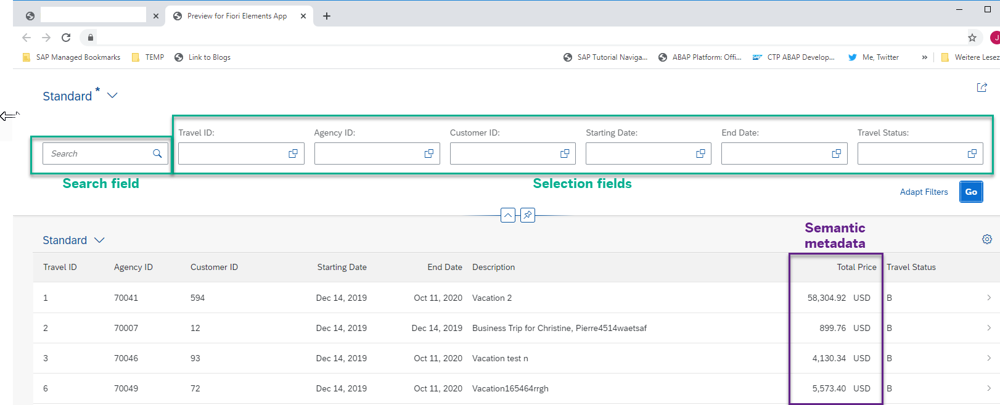

Throughout this tutorial, object names may include a suffix or group number, such as `XXX`. Always replace this with your own group number or initials.

---

[ACCORDION-BEGIN [Step 1: ](Create package)]
1. Create a new package for this tutorial, by choosing **New > ABAP Package**.

    !

2. Enter a name **`Package Z_ENHANCE_CDS_XXX`** and description **Enhance CDS Tutorial 2020**, then follow the wizard.

    !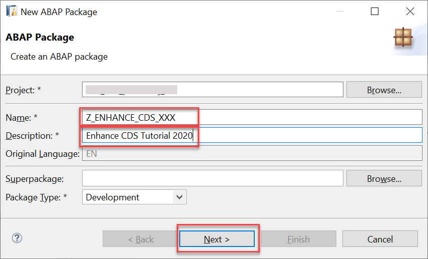

[DONE]
[ACCORDION-END]


[ACCORDION-BEGIN [Step 2: ](Create CDS View)]
1. In your package, create a CDS view. Select the package, then choose **New > Other** from the context menu, then choose **Data Definition**.

    !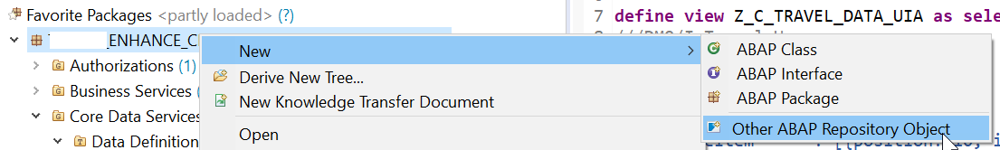

2. Add a name, **`Z_C_TRAVEL_DATA_XXX`**, and description **`Consumption view from /DMO/I_TRAVEL_U`**.

    Your CDS view a consumption view. It is based on the business object (BO) view, `/DMO/I_TRAVEL_U`. which view provides a given data model independent of the consumption layer. It contains all core information required by applications running on top of it.  

    A consumption view is a CDS view defined on top of a BO view and is used:

    - to expose the fields fitting to a given consumption use case
    - to enrich the data model with metadata using annotations (e.g. for UI, search, and OData)

3. Choose or create a transport request, then choose **Next**. Do not choose **Finish.**

4. Choose **Use template** then choose **Define view**.

5. Finally, choose **Finish**.

Your CDS view appears in a new editor.

[DONE]
[ACCORDION-END]

[ACCORDION-BEGIN [Step 3: ](Define CDS View)]
1. Add the following:
    - `sql_view_name` = **`ZCTRAVEL_XXX`**
    - `data_source_name` = **`/DMO/I_Travel_U`**. You can use **Auto-Complete `Ctrl+Space`**

2. Insert all the elements from `/DMO/I_TRAVEL_U` by placing your cursor inside the `as select from` statement (curly brackets) and again choosing **Auto-Complete `Ctrl+Space`** .

      !

3. Add the alias  **`as Travel`** to the **`define View`** statement, so that your code looks like this:

    ```ABAP
    @AbapCatalog.sqlViewName: 'ZCTRAVEL_XXX'
    @AbapCatalog.compiler.compareFilter: true
    @AbapCatalog.preserveKey: true
    @AccessControl.authorizationCheck: #NOT_REQUIRED
    @EndUserText.label: 'Consumption view from /DMO/I_TRAVEL_U'

    define view Z_C_TRAVEL_DATA_XXX
    as select from /DMO/I_Travel_U as Travel

    ```

3. Format, save, and activate your code by choosing **`Shift+F1`, `Ctrl+S, Ctrl+F3`**.

[DONE]
[ACCORDION-END]


[ACCORDION-BEGIN [Step 4: ](Display in Data Preview)]
1. Click anywhere in the editor and choose **Open With > Data Preview** from the context menu.

    !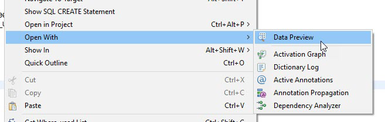

2. The Data Preview is displayed in a new tab. You can investigate the data, by filtering, specifying the number of rows, and so on. The values in **`LastChangedAt`** are not user-friendly, but you solve that by providing a Fiori elements preview in the next step.

    !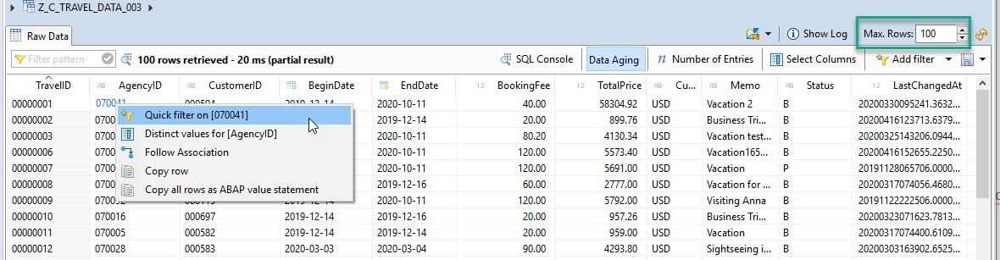


[DONE]
[ACCORDION-END]

[ACCORDION-BEGIN [Step 5: ](Create a service definition)]
You will now expose the CDS view as a **business service**. This will allow you to preview your changes in Fiori elements preview.

A **business service** consists of a **service definition** and a **service binding**.

You use a **service definition** to define which data is to be exposed (with the required granularity) as a Business Service.

You then use the **service binding** to bind a service definition to a client-server communication protocol such as OData. This allows you to provide several bindings for the same definition, e.g. to expose the service to a UI, and to an `A2X` provider.

For more information, see:

- SAP Help Portal: [Creating a Service Definition](https://help.sap.com/viewer/923180ddb98240829d935862025004d6/Cloud/en-US/ade0637f7c554c229cbfd4dc02c7fcaa.html)

- SAP Help Portal: [Creating a Service Binding](https://help.sap.com/viewer/923180ddb98240829d935862025004d6/Cloud/en-US/777e027f61c3490dba0433443d9143a6.html)

1. First, create the service definition, by selecting your CDS view and choosing **New > Service Definition** from the context menu.

    !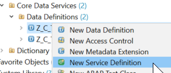

2. Choose a name and description:
    - **`Z_EXPOSE_TRAVEL_XXX`**
    - **Service exposes Travel data**

    !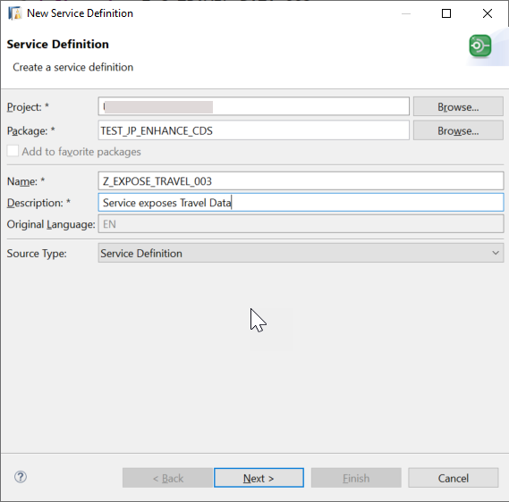

3. Choose the transport request; choose **Next**.

4.  Use the selected template; choose **Finish**. The name of your custom entity is inserted automatically.

    !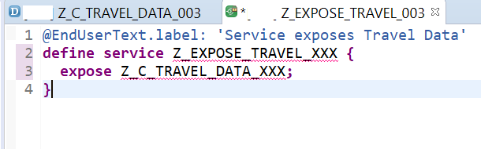

5. To make the service definition more readable, add an alias to the **expose** statement:

    ```CDS
    expose Z_C_TRAVELS_XXX as Travels;

    ```

6. Format, save, and activate ( **`Shift+F1, Ctrl+S, Ctrl+F3`** ) the service definition.

[DONE]
[ACCORDION-END]


[ACCORDION-BEGIN [Step 6: ](Create service binding)]
1. Select your service definition, then choose **Service Binding** from the context menu, then choose **Next**.

    !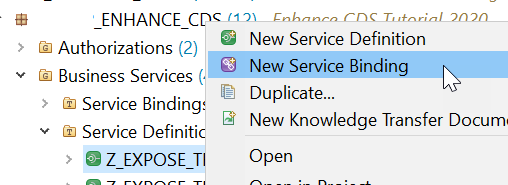

2. Choose:
    - Name = `Z_BIND_TRAVEL_XXX`
    - Description = Service binding for Travel data
    - Binding Type = ODATA V2 (UI...)
    - Service Definition = `Z_EXPOSE_TRAVEL_XXX`

      !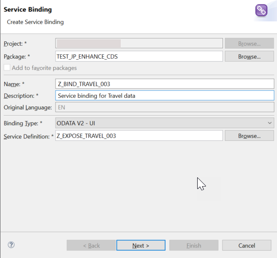

3. Choose the transport request; choose **Finish**.

The service binding automatically references the service definition and thus the exposed custom entity.

[DONE]
[ACCORDION-END]


[ACCORDION-BEGIN [Step 7: ](Activate service binding)]
1. In the editor that appears, choose **Activate**.

    !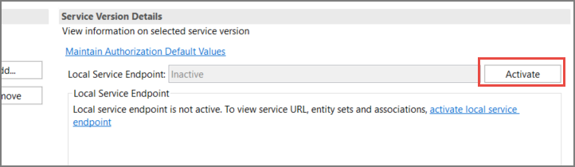

2. You can now see the Service URL and Entity Set.

    !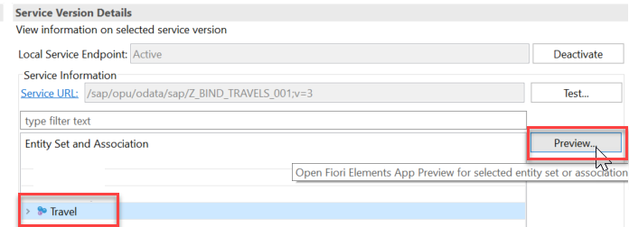

3. To open the Service Document (`XML`) in your browser, choose **Service URL**.

    !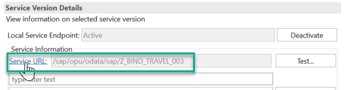

    !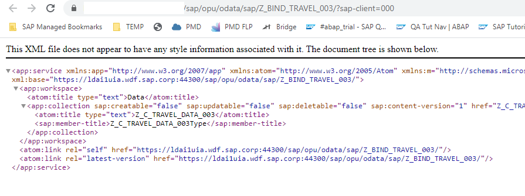

4. In the browser, you can also see the **Metadata Document** of the Business Service by adding $metadata to the URL: `/sap/opu/odata/sap/Z_BIND_TRAVEL_XXX/$metadata`.

    !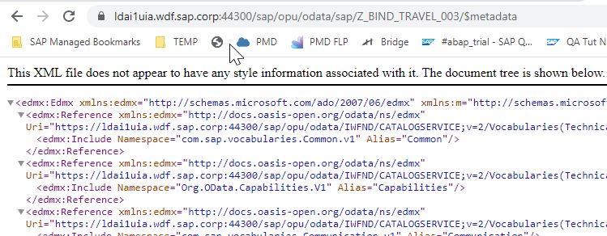

[DONE]
[ACCORDION-END]

[ACCORDION-BEGIN [Step 8: ](Display Fiori Elements Preview)]
1. Select the entity set and choose **Preview**.

    !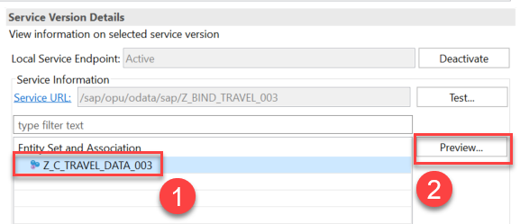

2. Log in using your ABAP Environment user and password; the Fiori Elements preview appears.

3. By default, no columns are selected. To see the data, choose **Settings**, then choose **Select All**.

    !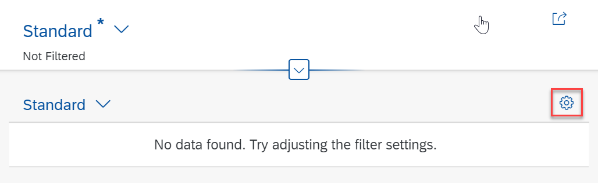

    !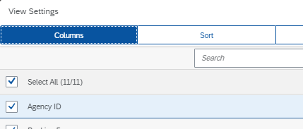

4. Display the data by choosing **Go**.

    !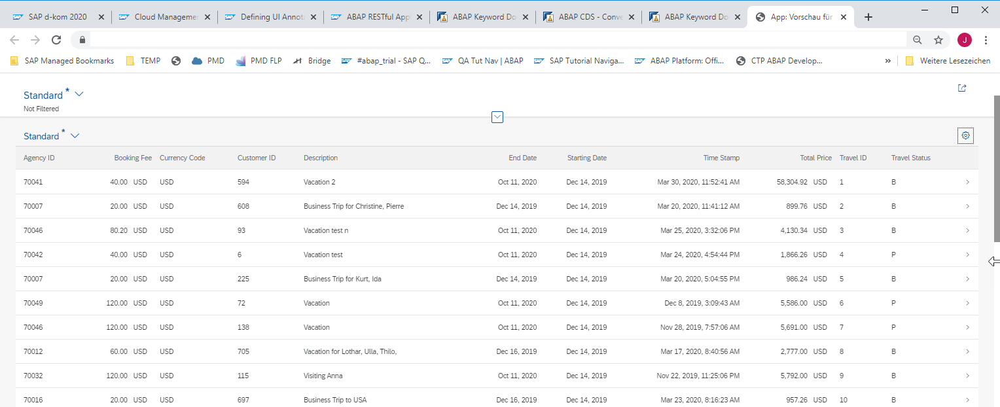

[DONE]
[ACCORDION-END]

[ACCORDION-BEGIN [Step 9: ](Add annotation for automatic display)]
1. It would be nice if at least some fields were displayed immediately for the user. To do this, simply add the following annotation to the relevant fields in **`Z_C_TRAVEL_DATA_XXX`**. The start of your CDS view will then look like this.

    > `BookingFee` is not automatically displayed. The numbers for each field are relative to the other fields and are responsive - they do not refer to a specific pixel position or similar. For larger entities, you can specify *HIGH*,*MEDIUM*, or *LOW*, so that less important fields are automatically hidden on a smaller screen, such as a mobile phone.

    ```CDS
    @UI           : {
    lineItem      : [{position: 10, importance: #HIGH}]
    }
    key TravelID;

    @UI           : {
          lineItem      : [{position: 15, importance: #HIGH}]
          }
    AgencyID,

    @UI           : {
          lineItem      : [{position: 20, importance: #HIGH}]
          }
    CustomerID,

    @UI           : {
          lineItem      : [{position: 30, importance: #HIGH}]
          }
    BeginDate,

    @UI           : {
          lineItem      : [{position: 40, importance: #HIGH}]
          }
    EndDate,

    BookingFee,

    @UI           : {
          lineItem      : [{position: 50, importance: #HIGH}]
          }
    TotalPrice,

    ```
2. If you now refresh your Fiori Elements preview, you will notice that you do not have to choose the fields; you simply have to choose **Go**.

[DONE]
[ACCORDION-END]


[ACCORDION-BEGIN [Step 10: ](Extract UI metadata)]
At present, you only have minimal annotations. As you add more, your CDS view will start to get cluttered. So you should extract your UI annotations to a separate object, a **metadata extensions** object, as follows:

1. First add the annotation **`@Metadata.allowExtensions: true`** to your CDS view.

2. Then, click anywhere in the editor, then choose **Source Code > Extract Metadata Extension** from the context menu.

    !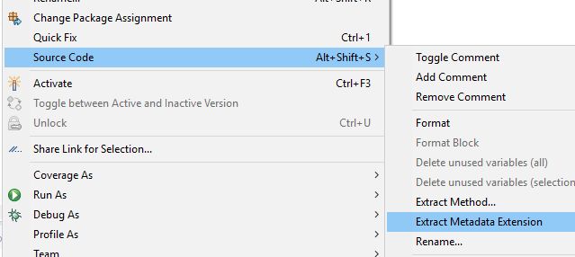

3. Enter a name and description for your metadata extension object, clearly similar to your CDS view name, and choose **Next**:

    - **`Z_TRAVEL_METADATA_XXX`**
    - **`Metadata for Z_C_TRAVEL_DATA_XXX`**

4. Accept the transport request, choose **Next**, select all elements, then choose **Finish**.

    !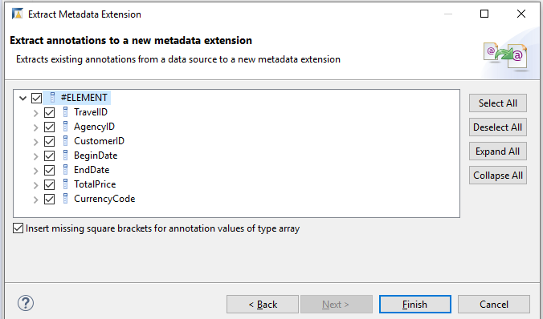

5. You will get an error, because you have not yet assigned the metadata extension to a layer. Since you are in sandbox mode, enter the value **`#CORE`** using auto-complete ( **Ctrl+Space** ).

    !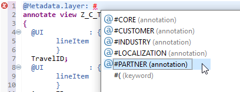

    > Layers allow customers or partners, for example, to enhance the metadata without modifying the CDS entity. You can also add industry- or country-specific enhancements.

    > The metadata extensions are evaluated in a specific order. For more information, see [Annotation Propagation](https://help.sap.com/viewer/f859579898c7494dbe2449bb7f278dcc/Cloud/en-US/df5d534075254682a81b59fb67ebd686.html).

6. Format, save, and activate ( **`Shift+F1, Ctrl+S, Ctrl+F3`** ).

[DONE]
[ACCORDION-END]


[ACCORDION-BEGIN [Step 11: ](Add semantic metadata)]
If you define currency amounts and currency codes semantically, then the system will apply specific rules to handle these fields appropriately.
For example, in this tutorial, if you define `TotalPrice` as a currency amount, and define `CurrencyCode` as a currency code field, then the system will add the appropriate currency to the `TotalPrice` column automatically. There is no need to display `CurrencyCode` as a separate column.

1. To do this, add the following two annotations to your CDS view:

    ```CDS

    @Semantics.amount.currencyCode: 'CurrencyCode'        
    TotalPrice,

    @Semantics.currencyCode
    CurrencyCode,

    ```
2. Format, save, and activate ( **`Shift+F1, Ctrl+S, Ctrl+F3`** ).

3. If you refresh the Fiori Elements preview, the **Total Price** column now looks like this.

    !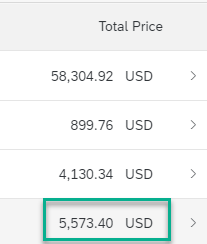

[DONE]
[ACCORDION-END]

[ACCORDION-BEGIN [Step 12: ](Add search field)]
You will now add a fuzzy search capability.

1. First, add the search annotation to your CDS view:

    ```CDS
    @Search.searchable: true
    ```

2. Then add the following two annotations to the field you want to search, in this case **`Memo`**:

    ```CDS
    @Search.defaultSearchElement: true
    @Search.fuzzinessThreshold: 0.90

    ```

3. For convenience, add the following annotation to the metadata extension object, so that the **Memo** field appears by default in the preview, then format, save, and activate ( **`Shift+F1, Ctrl+S, Ctrl+F3`** ):

    ```CDS
    @UI           : {
          lineItem      : [{position: 60, importance: #HIGH}]
          }
    Memo;

    ```

4. Refresh the Fiori elements preview in your browser.

5. There is a new **Search** input field.

    !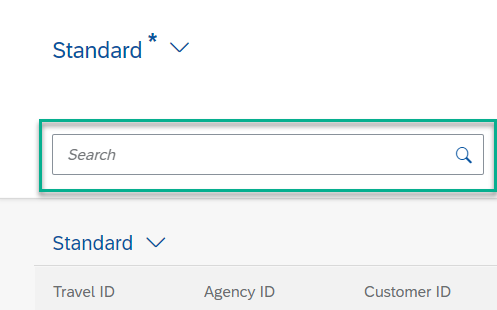

6. Enter the search text **Miami**. The app only displays trips to Miami (to date, eleven trips).

    !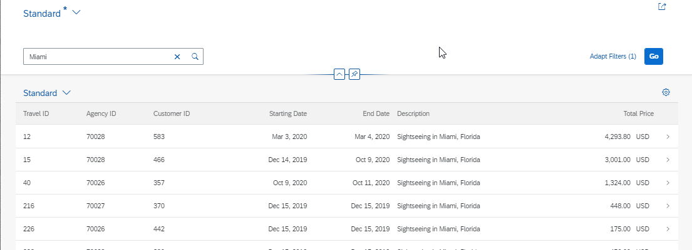

7. Optional: You can test the fuzziness threshold by changing the value to 0.70. After you save and activate, the app will now show trips to Miami and trips involving Matthias. (You may need to empty the cache.)

    !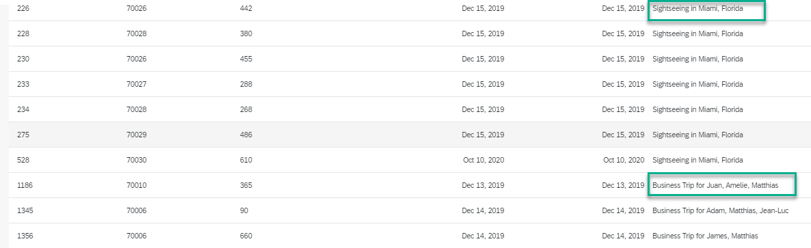

[DONE]
[ACCORDION-END]


[ACCORDION-BEGIN [Step 13: ](Add selection fields)]
As well as search fields, you can filter the list using an input field. In the next tutorial, you will provide input value help for these fields.

1. Add the **`selectionField`** annotation to the field **`TravelID`** in your metadata extension file, so that the whole UI annotation looks like this:

    ```CDS
    @UI           : {
          lineItem      : [{position: 10, importance: #HIGH}],
          selectionField: [{position: 10 }]
          }
    TravelID;
    ```

2. Format, save, and activate ( **`Shift+F1, Ctrl+S, Ctrl+F3`** ). The Fiori elements preview should now look like this:

    !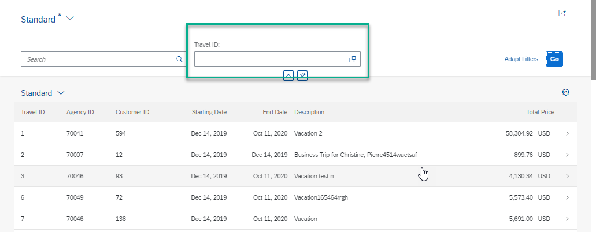

3. Add other fields as input fields by adding the following to the metadata extensions file, so that the file looks like this:

    ```CDS
    @UI           : {
          lineItem      : [{position: 15, importance: #HIGH}],
          selectionField: [{position: 15 }]
          }
    AgencyID;

    @UI           : {
          lineItem      : [{position: 20, importance: #HIGH}],
          selectionField: [{position: 20 }]
          }
    CustomerID;

    @UI           : {
          lineItem      : [{position: 10, importance: #HIGH}],
          selectionField: [{position: 10 }]
          }
    TravelID;

    @UI           : {
          lineItem      : [{position: 30, importance: #HIGH}],
          selectionField: [{position: 30 }]
          }
    BeginDate;

    @UI           : {
          lineItem      : [{position: 40, importance: #HIGH}],
          selectionField: [{position: 40 }]
          }
    EndDate;

    @UI           : {
          lineItem      : [{position: 50, importance: #HIGH}]
          }
    TotalPrice;

    @UI           : {
          lineItem      : [{position: 50, importance: #HIGH}]
          }
    Memo;

    @UI           : {
        lineItem      : [{position: 60, importance: #HIGH}],
        selectionField: [{position: 60 }]
        }
    Status;
    ```

    Your app should now look like this:

    !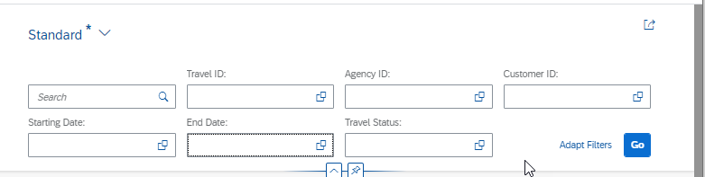

[DONE]
[ACCORDION-END]


[ACCORDION-BEGIN [Step 14: ](Check your code)]
Your CDS entity code should look like this:

```CDS
@AbapCatalog.sqlViewName: 'ZCTRAVEL_XXX'
@AbapCatalog.compiler.compareFilter: true
@AbapCatalog.preserveKey: true
@AccessControl.authorizationCheck: #NOT_REQUIRED
@EndUserText.label: 'Consumption view from /DMO/I_TRAVEL_U'
@Metadata.allowExtensions: true
@Search.searchable: true

define view Z_C_TRAVEL_DATA_XXX as Travel
  as select from /DMO/I_Travel_U
{

      ///DMO/I_Travel_U


  key TravelID,
      AgencyID,
      CustomerID,
      BeginDate,
      EndDate,
      BookingFee,

      @Semantics.amount.currencyCode: 'CurrencyCode'
      TotalPrice,

      @Semantics.currencyCode
      CurrencyCode,

      @Search.defaultSearchElement: true
      @Search.fuzzinessThreshold: 0.90
      Memo,
      Status,
      LastChangedAt,

      /* Associations */
      ///DMO/I_Travel_U
      _Agency,
      _Booking,
      _Currency,
      _Customer

}

```

Your MDE code should look like this:

```CDS
@Metadata.layer: #CORE
annotate view Z_C_TRAVEL_DATA_XXX with
{

@UI           : {
      lineItem      : [{position: 15, importance: #HIGH}],
      selectionField: [{position: 15 }]
      }
AgencyID;

@UI           : {
      lineItem      : [{position: 20, importance: #HIGH}],
      selectionField: [{position: 20 }]
      }
CustomerID;

@UI           : {
      lineItem      : [{position: 10, importance: #HIGH}],
      selectionField: [{position: 10 }]
      }
TravelID;

@UI           : {
      lineItem      : [{position: 30, importance: #HIGH}],
      selectionField: [{position: 30 }]
      }
BeginDate;

@UI           : {
      lineItem      : [{position: 40, importance: #HIGH}],
      selectionField: [{position: 40 }]
      }
EndDate;

@UI           : {
      lineItem      : [{position: 50, importance: #HIGH}]
      }
TotalPrice;

@UI           : {
      lineItem      : [{position: 50, importance: #HIGH}]
      }
Memo;

@UI           : {
    lineItem      : [{position: 60, importance: #HIGH}],
    selectionField: [{position: 60 }]
    }
Status;

}

```


[DONE]
[ACCORDION-END]

[ACCORDION-BEGIN [Step 15: ](Test yourself)]

[VALIDATE_1]
[ACCORDION-END]

---
