## Prerequisites
- You have a valid instance of an on-premise AS ABAP server, version 7.51 or higher (some ABAP Development Tools may not be available in earlier versions)
- You have generated the data for the relevant database table by running the transaction **`SEPM_DG`**.

## Details
### You will learn  
- How to create a global class that retrieves data from the back end
- How to use an internal table
- How to use an ABAP structure as a type for the returning parameter
- How to display data in a SAP List Viewer ("`ALV Grid`")

---

[ACCORDION-BEGIN [Step 1: ](Open your ABAP program and remove the WRITE statement)]

1. First, open your ABAP program, `ZSO_INVOICE_ITEMS_EURO` which you created in the previous tutorial, [Create and run an ABAP application](https://developers.sap.com/tutorials/abap-create-basic-app.html).

    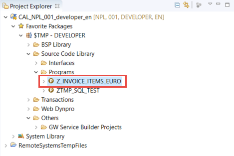

2. Remove the existing method implementation for the `run` method.

    

[DONE]
[ACCORDION-END]

[ACCORDION-BEGIN [Step 2: ](Create an instance of a new global class)]
Now you will create the an object with the type of a new global class, for retrieving backend data.

1.	In the `run` method, create an instance of class `zcl_invoice_retrieval` using the **`new`** operator:

```ABAP
data(invoices) = new ZCL_INVOICE_RETRIEVAL( ).
```

2.	Since this class does not yet exist, you will get a syntax error. To create the class, place the cursor on the class name and open the Quick Assist by choosing **Ctrl+1**. In the Quick Assist menu, double-click on **Create global class `zcl_invoice_retrieval`**:

    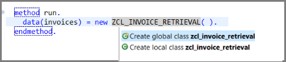

3. A wizard will appear to create a new ABAP class. Enter:
    - a name **`ZCL_INVOICE_RETRIEVAL`**
    - a description **invoice Retrieval**

4. Choose **Finish**:

    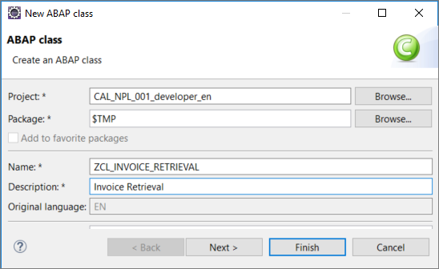

A new editor will be opened showing the class you have created, `ZCL_INVOICE_RETRIEVAL`.

> Since release 7.40, ABAP permits inline declarations. For more information, see:
  - [Old and new ABAP syntax – overview sheet](https://blogs.sap.com/2016/03/02/old-and-new-abap-syntax-overview-sheet/)
  - [7.4 Release News - Inline Declaration I](http://abapmentor.expertise-team.com/post/7-4-release-news-inline-declaration-i.aspx)

[DONE]
[ACCORDION-END]

[ACCORDION-BEGIN [Step 3: ](Check the syntax)]

If necessary, go back to your program and trigger the syntax check using the keyboard shortcut `Ctrl+F2`.

The syntax error should no longer occur.

[DONE]
[ACCORDION-END]

[ACCORDION-BEGIN [Step 4: ](Create a method to get the database records)]

To read the records from the database, you need to call a method `get_items_from_db`.
This method does not yet exist so we will create it with a Quick Assist as follows:

1.	Still in your program, enter an instance method call:

    ```ABAP
    data(invoice_items) = invoices->get_items_from_db( ).

    ```

2. Since the method does not exist, you will get an error. Position the cursor on the name of the missing method and choose **Quick Assist, i.e. `Ctrl+1`**. In the Quick Assist menu, choose **Create method `get_items_from_db`**

    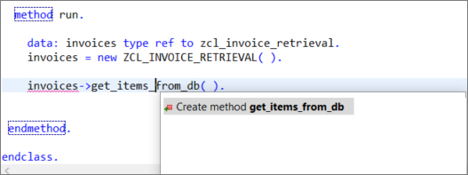

3.  In the *Create class* wizard that appears, create a public method without parameters, simply by choosing **Finish**:

    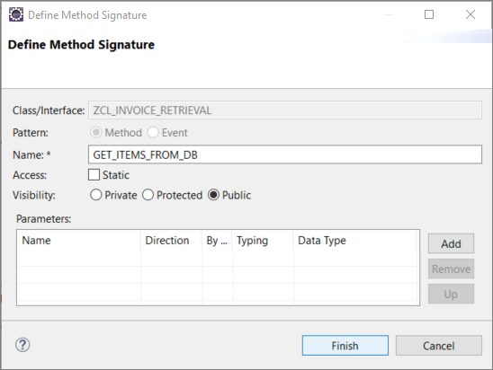

In the class `ZCL_INVOICE_RETRIEVAL`, the Quick Assist creates:

  - a method definition
  - an empty method implementation :

  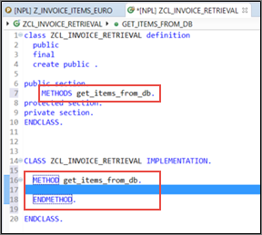

[DONE]
[ACCORDION-END]

[ACCORDION-BEGIN [Step 5: ](Add the method implementation)]
In a previous tutorial ([Display database content and run SQL queries](abap-display-data-queries)), you generated a `SELECT` statement using the SQL console. The advantage of using the SQL console is that you can reduce errors by defining clauses - like `JOIN, WHERE, or ORDER BY` - simply by using the Data Preview. The SQL Console automatically generates the correct SELECT statement for you.

You will now use this generated `SELECT` statement in your class to retrieve the data from the database.

> Note: We strongly recommend that you gain an understanding of the SQL Console by working through this previous tutorial. However, if you no longer have the SQL console open, you can simply copy the following `SELECT` statement into the method implementation (see step 3. below).

1. Go back to the SQL console:

    

2.	Resize the query section and copy the Open SQL statement using the shortcut **Ctrl+C**:

    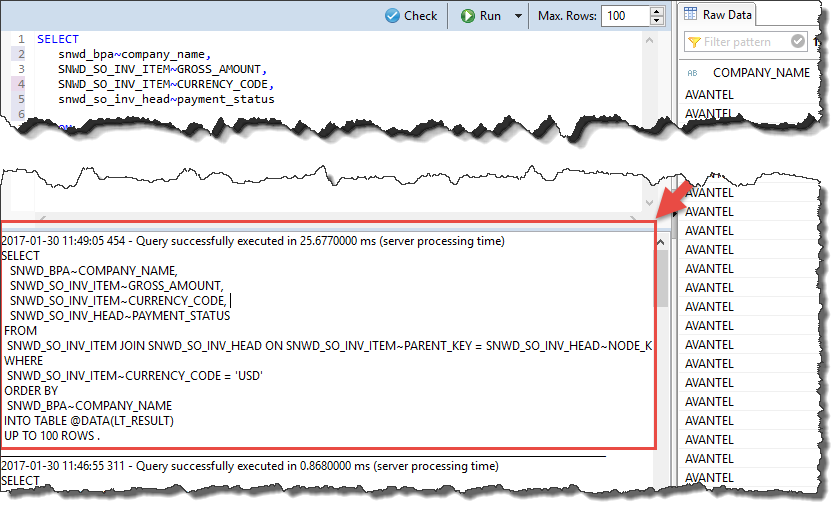

3.	Now, in your class `ZCL_INVOICE_RETRIEVAL`, paste the statement into the method implementation of `get_items_from_db` (using **Ctrl+V**):

The code from the SQL console should look like this. Note that the SQL Console query section automatically adds the INTO clause `INTO TABLE @DATA(LT_RESULT)`.


```ABAP
SELECT
   SNWD_BPA~COMPANY_NAME,
   SNWD_SO_INV_ITEM~GROSS_AMOUNT,
   SNWD_SO_INV_ITEM~CURRENCY_CODE,
   SNWD_SO_INV_HEAD~PAYMENT_STATUS
 FROM
  SNWD_SO_INV_ITEM JOIN SNWD_SO_INV_HEAD ON SNWD_SO_INV_ITEM~PARENT_KEY = SNWD_SO_INV_HEAD~NODE_KEY JOIN SNWD_BPA ON SNWD_SO_INV_HEAD~BUYER_GUID = SNWD_BPA~NODE_KEY
 WHERE
  SNWD_SO_INV_ITEM~CURRENCY_CODE = 'USD'
 ORDER BY  SNWD_BPA~COMPANY_NAME
 INTO TABLE @DATA(LT_RESULT).
 UP TO 100 ROWS.
```

The statement `UP TO 100 ROWS` will cause an error. Delete it.

[DONE]
[ACCORDION-END]

[ACCORDION-BEGIN [Step 6: ](Format your code)]

Now you can format (that is, "pretty-print") the source code.

1. Open the **Source** menu and choose **Format** (or use the shortcut **Shift+F1**).

    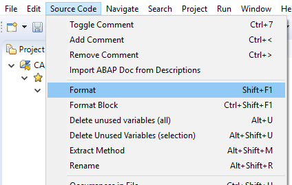

    > If you want to specify your formatting settings, you can do this in the project's properties. Right-click on the Project in the Project Explorer and choose Properties.

2.	To make the `SELECT` statement more readable, add some line breaks in the `JOIN` conditions:

    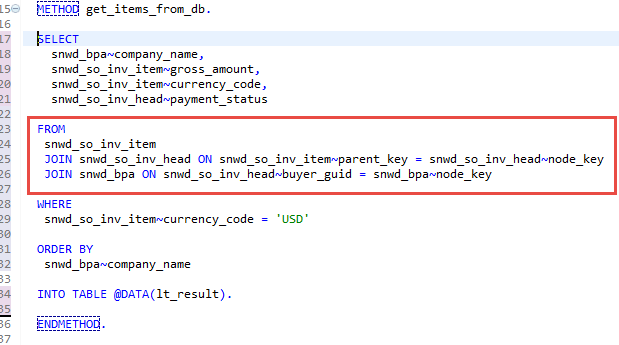

[DONE]
[ACCORDION-END]

[ACCORDION-BEGIN [Step 7: ](Declare the local variable explicitly)]
In a previous tutorial ([Create a structure](abap-dev-adt-create-new-structure)), you created an ABAP Data Dictionary structure. Now, you will use this structure.

First, we will declare an internal table, `lt_result` explicitly. Then we will define the type of the returning parameter for your method `get_items_from_db`.

1.	First position the cursor on the inline declared variable `lt_result` and open Quick Fix by choosing **Ctrl+1**:

    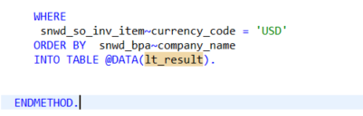

2.	Select Declare local variable `lt_result` explicitly by double clicking in the Quick Fix menu:  

    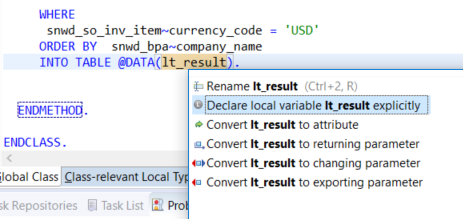

This creates an internal table referring to a local type and automatically generates the following code:

```ABAP

TYPES: BEGIN OF helper_type,
         company_name TYPE snwd_bpa-company_name,
         gross_amount TYPE snwd_so_inv_item-gross_amount,
         currency_code TYPE snwd_so_inv_item-currency_code,
         payment_status TYPE snwd_so_inv_head-payment_status,
       END OF helper_type.
DATA: lt_result TYPE STANDARD TABLE OF helper_type.`

```

It also replaces `INTO TABLE @DATA(lt_result)` with `INTO TABLE @lt_result`.
The `@` character is simply an escape character to comply with the new Open SQL syntax. For more information, see:
  - [7.4 Release News - Inline Declaration I](http://abapmentor.expertise-team.com/post/7-4-release-news-inline-declaration-i.aspx)

[DONE]
[ACCORDION-END]

[ACCORDION-BEGIN [Step 8: ](Replace `helper_type` with a Dictionary structure)]
In the next steps, you will replace the local type `helper_type` with the Data Dictionary structure that you created (in the previous tutorial [Create an ABAP Data Dictionary structure](abap-dev-adt-create-new-structure)).

Still in the editor of your invoice retrieval class `ZCL_INVOICE_RETRIEVAL`:

1.	In the method `get_items_from_db`, change the type of the variable `lt_result` to a standard table of `zso_invoice_item`:

    

2.	Remove the local type `helper_type`:

    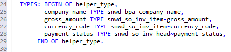


[DONE]
[ACCORDION-END]

[ACCORDION-BEGIN [Step 9: ](Declare the local variable as a returning parameter)]
Your method still does not return any data. Therefore, you will use another Quick Assist to convert your local variable as a returning parameter - so that you can access the result from your program.

1.	To do so place the cursor on the variable `lt_result` and get the Quick Assist by entering **Ctrl+1**.

2.	Choose **Convert `lt_result` to returning parameter**:

    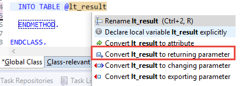

Note that the returning parameter was added to the method and an additional table type based on the structure was generated:

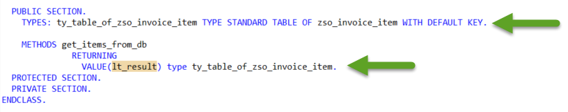


[DONE]
[ACCORDION-END]

[ACCORDION-BEGIN [Step 10: ](Save and activate your class)]
Save ( **Ctrl+S** ) and Activate ( **Ctrl+F3** ) your class.

[DONE]
[ACCORDION-END]

[ACCORDION-BEGIN [Step 11: ](Use the returning parameter in the program)]
Now, in your program, declare an inline declared variable, `data(invoice_items)`, to receive the result of the returning parameter `invoices->get_items_from_db( )` as follows:

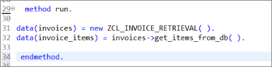

[DONE]
[ACCORDION-END]

[ACCORDION-BEGIN [Step 12: ](Generating the ALV Grid)]
Finally, you can display the invoice items as a SAP List Viewer - or "`ALV Grid`" - using the class `cl_salv_table`.

In your program, `ZSO_INVOICE_ITEMS_EURO`:

1.	Enter **`cl_salv_table=>`** and get the code completion proposals by entering **Ctrl+SPACE**
2.	Select the static method **`factory`** and …
3.	Insert the full signature of the method call by pressing **Shift+Enter** :

    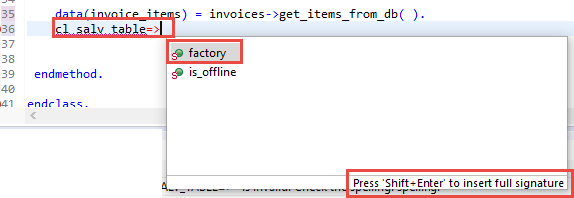

>If you prefer to insert the full signature by default, you can change the behavior of the code completion in the Preferences. Select Window in the menu and click on Preferences. In the Preferences Dialog enter code completion in the filter field or open the following path ABAP Development > Editors > Source Code Editors > Code Completion. In the Code Completion settings, you can activate a checkbox to Always insert full signature on completion.

[DONE]
[ACCORDION-END]

[ACCORDION-BEGIN [Step 13: ](Adapt the ALV Grid factory method)]
In the method call that you have generated:

1.	Remove the commented exporting parameters `list_display, r_container, and container_name` using the shortcut **Ctrl+D**
2.	Uncomment the importing parameter `r_salv_table` using the shortcut **Ctrl+7** and manually assign an inline variable `alv_table` to it
3.	Assign the variable `invoice_items` to the changing parameter `t_table`
4.	Then call the display method of `ALV_TABLE` : `alv_table->display(  )` :

Your method should look like this:

```ABAP
cl_salv_table=>factory(

         IMPORTING
           r_salv_table   =     data(alv_table)

          CHANGING
            t_table        = invoice_items ).

       alv_table->display(  ).
```

[DONE]
[ACCORDION-END]

[ACCORDION-BEGIN [Step 14: ](Check your code)]
Your program code should now look like this:

```ABAP
*&---------------------------------------------------------------------*
*& Report zjp_invoice_items_euro
*&---------------------------------------------------------------------*
*&
*&---------------------------------------------------------------------*
REPORT zjp_invoice_items_euro.


class lcl_main definition create private.

  public section.
    CLASS-METHODS create
      RETURNING
        value(r_result) TYPE REF TO lcl_main.

    methods run.

  protected section.
  private section.

endclass.

class lcl_main implementation.
  method create.
    create object r_result.
  endmethod.

  method run.
    data(invoices) = new ZCL_INVOICE_RETRIEVAL( ).
    data(invoice_items) = invoices->get_items_from_db( ).

       cl_salv_table=>factory(
         IMPORTING
           r_salv_table   =     data(alv_table)
          CHANGING
            t_table        = invoice_items ).

       alv_table->display(  ).

 endmethod.
endclass.

start-of-selection.
lcl_main=>create( )->run( ).

```

Your class code should now look like this:

```ABAP
CLASS zcl_invoice_retrieval DEFINITION
  PUBLIC
  FINAL
  CREATE PUBLIC .

  PUBLIC SECTION.
    TYPES: ty_table_of_zso_invoice_item TYPE STANDARD TABLE OF zso_invoice_item WITH DEFAULT KEY.
    METHODS get_items_from_db
    RETURNING
    VALUE(lt_result) type ty_table_of_zso_invoice_item.
  PROTECTED SECTION.
  PRIVATE SECTION.
ENDCLASS.

CLASS zcl_invoice_retrieval IMPLEMENTATION.

  METHOD get_items_from_db.

  SELECT
    snwd_bpa~company_name,
    snwd_so_inv_item~gross_amount,
    snwd_so_inv_item~currency_code,
    snwd_so_inv_head~payment_status

  FROM
   snwd_so_inv_item
   JOIN snwd_so_inv_head ON snwd_so_inv_item~parent_key = snwd_so_inv_head~node_key
   JOIN snwd_bpa ON snwd_so_inv_head~buyer_guid = snwd_bpa~node_key

   INTO TABLE @lt_result

  WHERE
   snwd_so_inv_item~currency_code = 'USD'

  ORDER BY
   snwd_bpa~company_name.

    ENDMETHOD.
ENDCLASS.

```

[DONE]
[ACCORDION-END]

[ACCORDION-BEGIN [Step 16: ](Save and activate the program)]

Activate your program by clicking the activation icon in the toolbar or using the keyboard shortcut **Ctrl+F3**.
Now run the program. You should get a SAP List Viewer roughly like this:


[DONE]
[ACCORDION-END]


[ACCORDION-BEGIN [Step 17: ](Test yourself)]
Using the METHODS statement, create the definition of an instance method `get_customers_from_db` that returns a value `result` of type `ty_table_of_customers` - similar to `get_items_from_db` above. Do not define any new types.

Do not indent your code.

Enter your code in the box below and choose **Submit Answer**.

[VALIDATE_1]
[ACCORDION-END]
u
