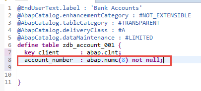
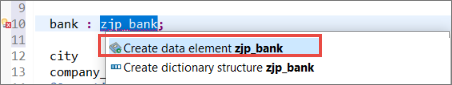
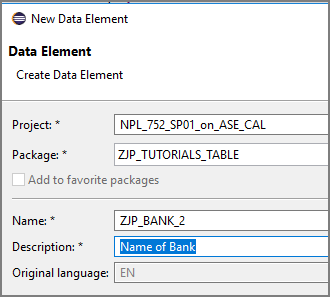
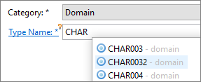
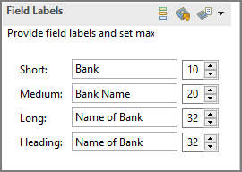

## Details
### You will learn  
- How to create a table in ABAP, representing a table in your database
- How to add an input check to a field

Tables are defined independently of the database in the ABAP Dictionary. When you activate the table in the Data Dictionary, the table is created in the underlying database.

The table in this tutorial will store bank account details for customers. The table will have the following columns (or **fields**):

- `Company_name`
- `account_number`
- `balance`
- `bank_name`
- `account_category`
- `city`
-  `last_entry`

For more information on:

- Database tables and their properties, see the [SAP Help Portal: Database Tables](https://help.sap.com/viewer/ec1c9c8191b74de98feb94001a95dd76/7.5.9/en-US/cf21ea43446011d189700000e8322d00.html)

- Using the ABAP  Development Tools (ADT) editor for database tables, see the application help in ADT: click on the editor and choose `F1`

---

[ACCORDION-BEGIN [Step 1: ](Create a table)]
Create a table in your package:

1. Select (right-click) the package and choose **New > Other ABAP Repository Object** from the context menu:

    

2. Enter the filter text **Table**, choose **Database table**, then choose Next.

3. Enter a name such as `Zxx_ACCOUNT` - always replacing `xx` with your initials - and a description, then choose Next:

4. Accept the proposed transport request and choose Finish.

The code for the table appears in a new editor. Ignore the annotations at the top for now.


[DONE]
[ACCORDION-END]

[ACCORDION-BEGIN [Step 2: ](Understand the table fields concept)]
In the next step, you will define the table fields. First you need to understand your options:
There are 3 ways to create a field for a database table:

  - **Built-in type**: The quickest: You specify a (pre-defined) primitive type, length, and description, but no more. You cannot then reuse this field. For more information, see [ABAP Keyword Documentation: Predefined Dictionary Types](https://help.sap.com/doc/abapdocu_752_index_htm/7.52/en-US/index.htm?file=abenddic_builtin_types.htm).

  - Use an **existing data element**: The most powerful: A data element describes the semantics of a field, such as a currency, or a customer name. You can define properties such as search help and (translatable) column header, and then use the same data element in many contexts. For more information on data elements, see the [Data Elements](https://help.sap.com/doc/abapdocu_751_index_htm/7.51/en-US/index.htm?file=abenddic_data_elements.htm).

  - Create a **new data element**: If you want the benefits of data elements (such as reuse of column headers).

In this tutorial, you will create one data element. For the other fields, you will use a built-in type or existing data element.

One key field has been added automatically:

`client : abap.clnt;`

This specifies that the table is client-specific.
Tables can be cross-client or client-specific. Each client is a self-contained unit within an organization, such as a subsidiary. For client-specific tables, the client is the first key field in the table.

The field is also specified as `not null x`. This means that the field cannot be left blank. In this case, `abap.clnt` is automatically filled with the value of the current client (such as 001).

[DONE]
[ACCORDION-END]

[ACCORDION-BEGIN [Step 3: ](Add the field account number, based on a primitive type)]
Now you will add the field **`acc_num`**, based on a primitive type.

1. Enter the following (including the period), then choose **Code completion (Ctrl+Space)**:

    ```ABAP
      key acc_num : abap.
    ```

    

2. From the dropdown list, choose `numc(len)` and specify `len` as 8. Also, specify this key field as not null:
  `key acc_num : abap.numc(8) not null;`

[DONE]
[ACCORDION-END]

[ACCORDION-BEGIN [Step 4: ](Add the field city, based on an existing data element)]
Add a field based on a built-in data element:

  1. Enter `city : s_`  then choose **Code completion (Ctrl+Space)**
  2.	From the dropdown list, choose `S_CITY`:
      `city : s_city;`

[DONE]
[ACCORDION-END]

[ACCORDION-BEGIN [Step 5: ](Add the field bank, based on a new data element)]
Add the field **`bank`**, based on a new data element, `Zxx_bank`. You will get an error, which you will also fix in this step.

1. Select the new data element and choose **Get Quick Fix (Ctrl+1)**. From the list, choose **Create data element …** :

    

2. The Create data element wizard appears. Enter a name and description and choose **Next**:

    

3. Accept the default transport request and choose **Finish**:

    

4. You want your data element to have a character type. Enter the type name, by entering `CHAR` and choosing **Auto-complete (`Ctrl+Space`)**:

    

5. Now enter the field labels and lengths:

    

6. Save and activate the data element (`Ctrl+S, Ctrl+F3`).

[DONE]
[ACCORDION-END]

[ACCORDION-BEGIN [Step 6: ](Remove error by performing syntax check)]
Go back to your table, **`Zxx_ACCOUNT`**. Run a syntax check (**`F2`**). The error should disappear.

[DONE]
[ACCORDION-END]

[ACCORDION-BEGIN [Step 7: ](Add the other fields)]

  1. Now add other fields, so your code looks as follows. The field `Balance` will cause an error. Ignore this for now.

    ```ABAP
    define table zxx_account {

      key clnt    : abap.clnt not null;
      key acc_num  : abap.numc(8) not null;

      city         : s_city;      
      bank         : Zxx_bank;
      customer_name : s_custname; // from table SCUSTOM
      balance      : abap.curr(16,2);
      currency     : s_curr;
      last_entry   : s_bdate;
      category     : abap.numc(2);
    }
    ```

  2. Then choose Save (`Ctrl+S`) but do not activate your table yet.

[DONE]
[ACCORDION-END]

[ACCORDION-BEGIN [Step 8: ](Fix the error by assigning a currency code reference)]
You will now fix the error caused by the field `Balance`:

1. Place your cursor on the error symbol (it will change from an arrow to a pointing finger). Then click on it:

    

2. The quick fix proposal appears. Choose (double-click on) the proposal **Assign currency code reference to field currency**

    
  The error message disappears.

3. Save your changes (`Ctrl+S`), but again, do not activate the table yet.

[DONE]
[ACCORDION-END]

[ACCORDION-BEGIN [Step 9: ](Change the technical settings)]
Before you activate the table, change the technical settings at the top as follows (or copy the code at the end of this step):

1. The label is derived from the description you entered; leave this.

2. **`EnhancementCategory`** : Place your cursor immediately after the hash symbol (#), delete the existing text, then choose **Auto-complete (`Ctrl+Space`)**:

    

3. Then choose `#EXTENSIBLE_CHARACTER_NUMERIC` from the dropdown list. (your table contains both character-type and numeric-type fields but does not contain any deep structures (such as a structure included within a table row.)

4. Complete the other settings as follows (or copy the code below).
    - **`tableCategory`** : Transparent = your table represents a table in the database.
      Tables are defined independently of the database in the ABAP Dictionary. When you activate the table in the Data Dictionary, the table is created in the underlying database. There is no need for any code to define the data in the database, nor for any vendor-specific code. Your database tables will be created in any database supported by the ABAP server.

    - **`deliveryClass`** : #A = application table, which stores master data and transaction data (default)

    - **`dataMaintenance`** : #ALLOWED = allows users to enter data manually in Table Maintenance (transaction SE16). (Generally, you would not do this, but it is useful for test purposes.)

```ABAP
@EndUserText.label : 'Customer Accounts'
@AbapCatalog.enhancementCategory : #EXTENSIBLE_CHARACTER_NUMERIC
@AbapCatalog.tableCategory : #TRANSPARENT
@AbapCatalog.deliveryClass : #A
@AbapCatalog.dataMaintenance : #ALLOWED
```

[DONE]
[ACCORDION-END]

[ACCORDION-BEGIN [Step 10: ](Save and activate)]
Save (`Ctrl+S`), go back (`F3`), and Activate (`F8`).

[DONE]
[ACCORDION-END]

[ACCORDION-BEGIN [Step 11: ](Create a check table for the field client)]
Now you will create a check table for the field `clnt`. This checks the value of `clnt` against the field `mandt` of the table `t000`, using a foreign key relationship.

  1. You can only provide a check table for a field with a data element as its type, so first, change the type of `clnt` to a data element, `s_mandt`:
     `key clnt      : s_mandt not null;`

  2. Add the foreign key pointing to table `t000`, where your field `clnt = t000.mandt:`

    `with foreign key t000
    where mandt = zxx_account.clnt;`

  3. Add the screen check, which checks user input against the values in `t000.mandt`:
  	`@AbapCatalog.foreignKey.keyType : #KEY
     @AbapCatalog.foreignKey.screenCheck : true`

  4. Your code should look like this:

```ABAP
  @AbapCatalog.foreignKey.keyType : #KEY
  @AbapCatalog.foreignKey.screenCheck : true
  key clnt      : s_mandt not null
      with foreign key [0..*,1] t000
        where mandt = zxx_account.clnt;
```
[DONE]
[ACCORDION-END]

[ACCORDION-BEGIN [Step 12: ](Save, activate, and check code)]
Now, save (`Ctrl+S`) and activate (`Ctrl+F3`) your table. Your code should look like this:

```ABAP
@EndUserText.label : 'Bank Accounts Table'
@AbapCatalog.enhancementCategory : #EXTENSIBLE_CHARACTER_NUMERIC
@AbapCatalog.tableCategory : #TRANSPARENT
@AbapCatalog.deliveryClass : #A
@AbapCatalog.dataMaintenance : #ALLOWED

define table zxx_account {

  @AbapCatalog.foreignKey.keyType : #KEY
  @AbapCatalog.foreignKey.screenCheck : true
  key clnt      : s_mandt not null
    with foreign key [0..*,1] t000
      where mandt = zxx_account.clnt;

  key acc_num   : abap.numc(8) not null;

  bank          : zxx_bank;
  city          : s_city;
  customer_name : s_custname;

  @Semantics.amount.currencyCode : 'sflight.currency'
  balance       : abap.curr(16,2);

  currency      : s_curr;
  last_entry    : s_bdate;
  category      : abap.numc(2);

}

```
[DONE]
[ACCORDION-END]

[ACCORDION-BEGIN [Step 13: ](Test yourself)]
You will now create an input check for the field `city` of type `s_city` , in the table `zxx_account`.
Include the two `foreignKey` annotations.
Use the field `city` in the check table `sgeocity `. Enter your code in the box below and choose **Submit answer** :

[VALIDATE_1]
[ACCORDION-END]
---
