## Prerequisites
**Tutorial**: [Create an ABAP Core Data Services (CDS) View in ABAP On-Premise](abap-dev-create-cds-view)

## Details
### You will learn
- How to add value help using a filter
- How to add textual information using associations
- How to concatenate two elements, using a built-in function for CDS
- How to convert currencies using a built-in function for CDS
- How to use grouping and aggregation


You can then use some of these features in productive development to make your applications more powerful and more user-friendly. By the end of this tutorial, your application should look like this.

!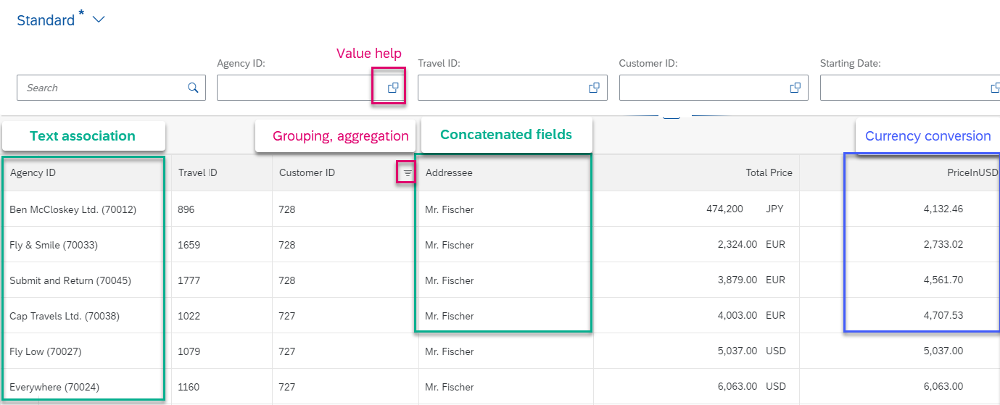

Throughout this tutorial, objects name include a suffix, such as `XXX`. Always replace this with your group number or initials.

---

[ACCORDION-BEGIN [Step 1: ](Add value help)]
To make the input fields more useful, you will now add input value help to the field **`AgencyID`**.

1. Specify the source of the value help. This works a bit like a join: You need to point to an entity, and field common to both the entity and your CDS view. In this case, you will point to **`AgencyID`** in the CDS entity **`/DMO/I_Agency`**. Add the following annotation to your field **`AgencyID`**.

    ```CDS
    @Consumption.valueHelpDefinition: [{  entity: {name: '/DMO/I_Agency', element: 'AgencyID'}  }]

    ```

2. You also need to expose this second entity in the OData service. To do this, add the entity **`/DMO/I_Agency`** to your service definition, so the complete definition looks like this:

    ```CDS
    @EndUserText.label: 'Service exposes Travel Data 005'
    define service Z_EXPOSE_TRAVEL_005 {
      expose Z_C_TRAVEL_DATA_005 as Travel;
      expose /DMO/I_Agency as Agency;
    }

    ```

3. Format, save, and activate both CDS view and service definition ( **`Shift+F1, Ctrl+S, Ctrl+3`** ).

4. Refresh your Fiori Elements preview and choose value help for the input field **`AgencyID`**.

    !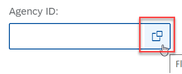

5. Now the value help appears. Enter the country key **DE** and choose **Go**. Only German agencies appear on the list.

    !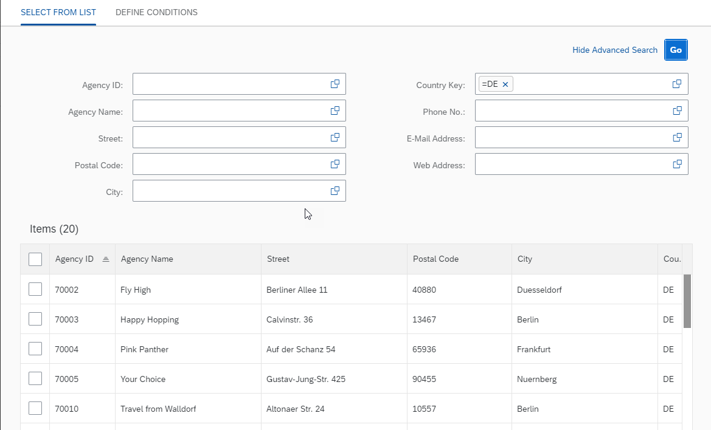

6. Repeat this step for **`CustomerID`**:

    ```CDS
    @Consumption.valueHelpDefinition: [{entity: {name: '/DMO/I_Customer', element: 'CustomerID' }}]
    ```

7. Also, expose this entity in the service definition:

    ```CDS
    expose /DMO/I_Customer as Customer;

    ```


[DONE]
[ACCORDION-END]


[ACCORDION-BEGIN [Step 2: ](Add text associations)]
Next, you will make the **Agency** field more readable by adding the agency name to the ID, using a text association.
CDS associations are simply specifications of joins, always in the same place in the syntax. The main advantage of an association is reuse: Once you have specified an association once, you can conveniently string several associations together in a path. In this case, however, you will use a simple association.

For more information, see:
- ABAP Keyword Documentation: [CDS - Associations](https://help.sap.com/doc/abapdocu_752_index_htm/7.52/en-US/index.htm?file=abencds.htm)

1. Add the following 2 statements to your CDS view, **`Z_C_TRAVEL_DATA_XXX`**, just before the list of fields. The first statement creates an association from the source CDS entity **`Z_C_TRAVEL_DATA_XXX`** to the target CDS entity **`/DMO/I_Agency`**, joined on the field **`AgencyID`**. The source entity is represented by the alias **`$projection`**, because you cannot use the original name in a path statement. The target entity is represented by its alias name **`_Agency`**.

    ```CDS
      association [1..1] to /DMO/I_Agency as _Agency on $projection.AgencyID = _Agency.AgencyID

    ```

    !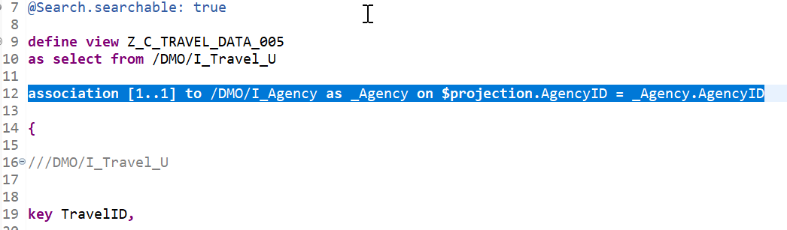

2. Now add the following annotation to the field **`AgencyID`**:

    ```CDS
      @ObjectModel.text.association: '_Agency'

    ```

3. Check that the association has been added to the field list. (This should have been done automatically when you inserted the signature of `/DMO/I_TRAVEL_U`.)

    !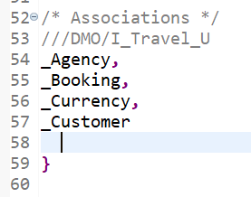

4. Format, save, and activate ( **`Shift+F1, Ctrl+S, Ctrl+F3`** ).

5. Make sure that the entity **`/DMO/I_Agency`** has been added to your service definition. (You should have done this in step 1.)

    !

6. Refresh your Fiori Elements preview. The agency name should now be shown, with the ID number in parentheses.

    !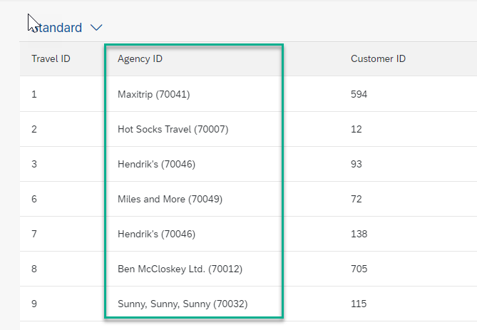

7. Repeat for the fields **`CustomerID`** and **`Currency_Code`**:

    ```CDS
    association [1..1] to /DMO/I_Customer as _Customer    on $projection.CustomerID =   _Customer.CustomerID
    association [0..*] to I_CurrencyText as _CurrencyText on $projection.CurrencyCode = _CurrencyText.Currency

    ```

    ```CDS
    @ObjectModel.text.association: '_Customer'
    @ObjectModel.text.association: '_CurrencyText'

    ```

8. Also make sure these associations are added to the list of fields:

    ```CDS
    //Associations
    _Customer
    _CurrencyText

    ```

      !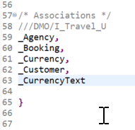

[DONE]
[ACCORDION-END]

[ACCORDION-BEGIN [Step 3: ](Merge two fields)]
ABAP has many built-in SQL functions for both numeric and string fields.

For more information on these functions, see : ABAP Keyword Documentation: [SQL Functions](https://help.sap.com/doc/abapdocu_752_index_htm/7.52/en-US/index.htm?file=abensql_functions.htm).

You will use a simple one to easily merge two fields. The two fields are provided by the association **`_Customer`**.

1. Add an association.

    ```CDS
        association [1..1] to /DMO/I_Customer as _Customer on $projection.CustomerID = _Customer.CustomerID
    ```

2. Ensure there is a comma after `CustomerID`, then add the function **`concat_with_space`** using auto-complete ( **`Ctrl+Space`** ); then add the alias **`as Addressee`**.

    ```CDS
      concat_with_space(_Customer.Title, _Customer.LastName, 1) as Addressee,
    ```

3. Also make sure this association is added to the list of fields:

      ```CDS
      //Associations
      _Customer
      ```
4. Format, save, and activate these objects using **`Shift+F1, Ctrl+S, Ctrl+F3 `**.

5. Check the result in the data preview, by clicking in the editor and choosing **Open With > Data Preview** from the context menu. The result should look like this.

      !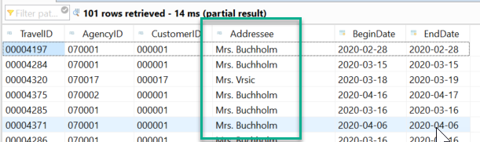

6. Now you have the addressee, you may want to comment out the text association for **`CustomerID`**.

[DONE]
[ACCORDION-END]

[ACCORDION-BEGIN [Step 4: ](Add currency conversion)]
It would be nice to find out how much money each **Agency** has received in total. To do this, you first need to convert all the sums paid to one currency. To do this, you will again use a built-in function. For more information, see the ABAP Keyword Documentation: [ABAP CDS - Conversion Functions for Units and Currencies](https://help.sap.com/doc/abapdocu_752_index_htm/7.52/en-US/index.htm?file=abencds_f1_conv_func_unit_curr.htm)

1. Convert the price (**`TotalPrice`**) of each line item to US Dollars. Again, you do this using a built-in conversion function. You simply have to define the variables you are using for amount, source currency, etc, and the built-in function does the rest.

    You need to cast the character value **` 'USD' `** to the correct type and length, **` abap.cuky( 5 ) `**.

    You may get a warning: "Reference information missing...". Ignore this.

    ```CDS
    currency_conversion(
    amount => TotalPrice,
    source_currency => CurrencyCode,
    round => 'X',
    target_currency => cast('USD' as abap.cuky( 5 )),
    exchange_rate_date => cast('20200429' as abap.dats),
    error_handling => 'SET_TO_NULL' )
    as PriceInUSD,  
    ```
2. Format, save, and activate ( **`Shift+F1, Ctrl+S, Ctrl+3`** )

3. If you check the result in the data preview, it should look like this.

    !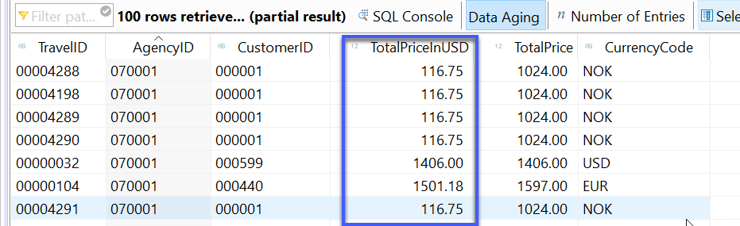

[DONE]
[ACCORDION-END]

[ACCORDION-BEGIN [Step 5: ](Add aggregation and grouping)]
1. Add the following annotation to the element **`total_price`**, using Auto-complete (**`Ctrl+Space`**):

    ```ABAP
    @DefaultAggregation: #SUM
    ```
    By using Auto-complete, you can see the various possibilities for aggregation, e.g. `AVG`, COUNT, SUM. In this case, we aggregate the SUM payable to each company.

2. Format, save, and activate ( **`Shift+F1, Ctrl+S, Ctrl+3`** ).

[DONE]
[ACCORDION-END]

[ACCORDION-BEGIN [Step 6: ](Test aggregation and grouping)]
1. Refresh your Fiori Elements preview. You may notice that a different grid control is used.
2. Right-click on **Agency ID** and choose Group:

    .
    !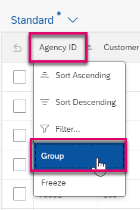

    This groups and aggregates the entries (Travels) by Agency ID. You can also see the sum of all travels for each agency, in US dollars.

    !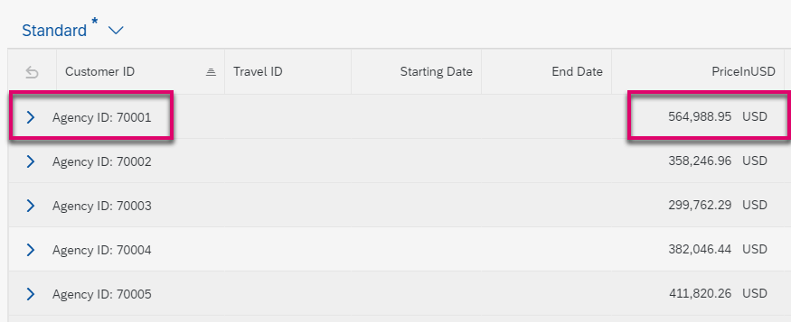

3. Now, right-click on the Customer ID header and again choose Group.
This displays a two-step grouping. You can browse and expand the companies and browse / expand the associated sales orders.

    !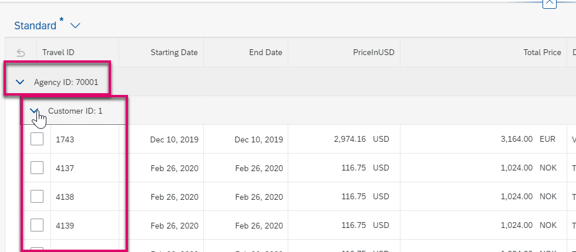

> The grouping will be gone each time you refresh the application. To avoid this, add the following annotation to the metadata extension definition on view level (at the top):

    ```CDS
    @UI.presentationVariant: [{groupBy: [ 'AgencyID' , 'CustomerID' ]}]

    ```

[DONE]
[ACCORDION-END]


[ACCORDION-BEGIN [Step 8: ](Check code)]
The code for your CDS entity should look like this:

```CDS
@AbapCatalog.sqlViewName: 'ZCTRAVEL_xxx'
@AbapCatalog.compiler.compareFilter: true
@AbapCatalog.preserveKey: true
@AccessControl.authorizationCheck: #NOT_REQUIRED
@EndUserText.label: 'Consumption view for Travels XXX'
@Metadata.allowExtensions: true
@Search.searchable: true

define view Z_C_TRAVELS_xxx
  as select from /DMO/I_Travel_U

  association [1..1] to /DMO/I_Agency   as _Agency       on $projection.AgencyID = _Agency.AgencyID
  association [1..1] to /DMO/I_Customer as _Customer     on $projection.CustomerID = _Customer.CustomerID
  association [0..*] to I_CurrencyText  as _CurrencyText on $projection.CurrencyCode = _CurrencyText.Currency

{

      ///DMO/I_Travel_U

  key TravelID,
      @Consumption.valueHelpDefinition: [{entity: {name: '/DMO/I_Agency', element: 'AgencyID'}}]
      @ObjectModel.text.association: '_Agency'
      AgencyID,

//      @Consumption.valueHelpDefinition: [{entity: {name: '/DMO/I_Customer', element: 'CustomerID' }}]
//      @ObjectModel.text.association: '_Customer'
      CustomerID,

      concat_with_space(_Customer.Title, _Customer.LastName, 1) as Addressee,
      BeginDate,
      EndDate,
      BookingFee,

      @DefaultAggregation: #SUM
      @Semantics.amount.currencyCode: 'CurrencyCode'
      TotalPrice,

      //Currency Conversion
      currency_conversion(
      amount => TotalPrice,
      source_currency => CurrencyCode,
      round => 'X',
      target_currency => cast('USD' as abap.cuky( 5 )),
      exchange_rate_date => cast('20200429' as abap.dats),
      error_handling => 'SET_TO_NULL' )                         as PriceInUSD,

      @Semantics.currencyCode
      @ObjectModel.text.association: '_CurrencyText'
      CurrencyCode,


      @Search.defaultSearchElement: true
      @Search.fuzzinessThreshold: 0.90
      Memo,

      Status,
      LastChangedAt,

      /* Associations */
      //DMO/I_Travel_U
      _Agency,
      _Booking,
      _Currency,
      _Customer,
      _CurrencyText

}

```

[DONE]
[ACCORDION-END]

[ACCORDION-BEGIN [Step 9: ](Test yourself)]

[VALIDATE_1]
[ACCORDION-END]

### More information
[From Open SQL Joins to CDS Associations](https://blogs.sap.com/2016/08/12/from-open-sql-joins-to-cds-associations/)

---
