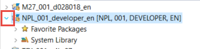
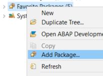
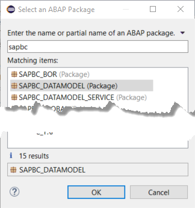
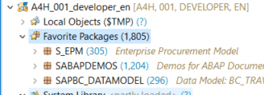
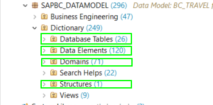
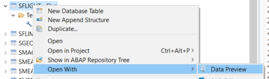
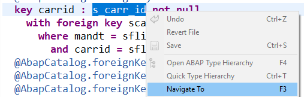
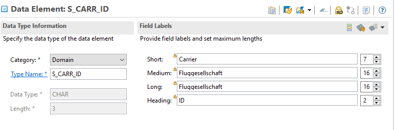
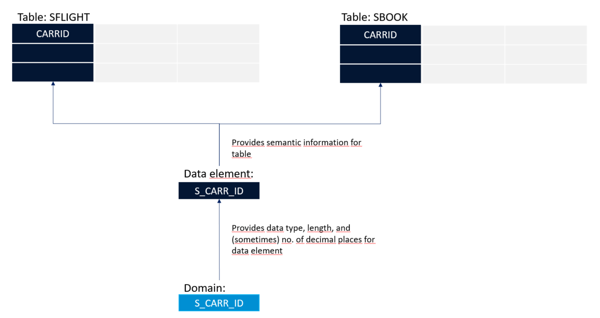
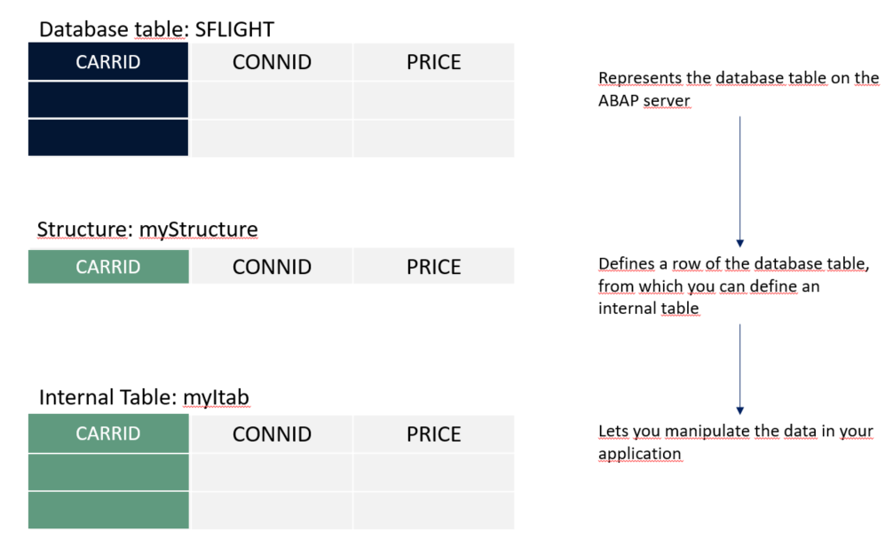

## Prerequisites  
 - **Proficiency:** Beginner
 - You have a running ABAP application server (AS ABAP). This tutorial was created in the AS ABAP developer edition, 752, download version. For more information, see [SAP Developer Community: Trials and Downloads](https://www.sap.com/developer/trials-downloads.html).
 - **Tutorial**: [Create an ABAP project](abap-create-project)

## Details
### You will learn
  - How to find objects in the ABAP Dictionary

The ABAP Dictionary describes and manages all the data definitions (metadata) used in the ABAP system to work with data types, database tables, and views. In this tutorial, you will open an ABAP package containing some of these objects and find out how they fit together.

You will open an ABAP package, **`SAPBC_DATAMODEL`**, and look at the ABAP Dictionary objects in it. This package contains all the object types you will learn about in this tutorial (and more), and is delivered with every ABAP System.

For more information, see [Data Types](https://help.sap.com/doc/abapdocu_750_index_htm/7.50/en-US/index.htm?file=abenddic_data_types.htm) in the ABAP Keyword Documentation.

### Time to Complete
**15 Min**

---

[ACCORDION-BEGIN [Step 1: ](Add package to favorites)]

Before you start exploring the Dictionary objects, you will add the relevant package to your favorites for convenience:

1. In ABAP Development Tools, expand the project that you created, by choosing the arrow on the left:

    

2. Select Favorite Packages, then choose Add Package… from the context menu:

    

3. Enter **`SAPBC`** in the search field, then choose the package **`SAPBC_DATAMODEL`** from the matching items box:

    

The package is added to your favorites:

    

[DONE]

[ACCORDION-END]

[ACCORDION-BEGIN [Step 2: ](Expand package)]

Expand the package **`SAPBC_DATAMODEL`** again by choosing the arrow, then expanding the Dictionary folder:

You will see a long list of folders of Dictionary objects in alphabetical order. For the moment, you will focus on just 3:

  - **Database tables:**  Each database table on the ABAP server represents a table in your database. Tables are defined independently of the database in the ABAP Data Dictionary. When you activate the table in the Dictionary, the table is created in the underlying database. There is no need for any code to define the data in the database, nor for any vendor-specific code. Your database tables will be created in any database supported by the ABAP server.
  - **Data element:** A data element describes the semantic attributes of a **field** or **column** in a complex type – for example a currency, or a customer name. (A complex type can be a database table, table type, or structure.) You can define properties such as **search help** and (translatable) **column header**, and then use the same data element in many contexts.
  You can describe the technical attributes of the field either directly in the data element, or in a domain (see below.)
  - **Domain:** can describes the technical attributes of a data element – such as data type, e.g `NUMC`. Several data elements can then use the same domain with different semantics, e.g field labels.

You will now explore how these concepts fit together.

[DONE]

[ACCORDION-END]

[ACCORDION-BEGIN [Step 3: ](Open transparent table definition)]

> Important: Database tables represented on the ABAP server are known as "transparent tables" - to distinguish them from internal tables (which you will learn about later in this tutorial).

Open the table **`SFLIGHT`** by choosing **`SAPBC_DATAMODEL` -> Dictionary -> Database Tables -> `SFLIGHT Flug` (German for "Flight"):**

The definition of the table appears, including technical settings and key fields:

[DONE]

[ACCORDION-END]

[ACCORDION-BEGIN [Step 4: ](Open table in data preview)]

Now select (right-click) the table **`SFLIGHT`** again, then choose **Open With Data Preview** from the context menu:

Finally, something that looks like a table!

[DONE]

[ACCORDION-END]

[ACCORDION-BEGIN [Step 5: ](Open a data element)]

Now go back to the table definition. Find the field CARRID. This field has been defined using a data element, `S_CARR_ID`. Navigate to the definition of `S_CARR_ID` by selecting it, then choosing **Navigate To (F3)** from the context menu:

The data element opens in another editor:

You can see that the data element is itself based on a domain (with the same name), with the data type `CHAR`, and length 3. You can also see the field labels for the data element. You could simply define `CARRID` as a primitive character type of length 3, but then you cannot reuse either the domain (technical) information, or field labels (semantic information). You will put this into practice in a later tutorial, Creating a database table (coming soon).

The relationship between these Dictionary objects looks like this:

[DONE]

[ACCORDION-END]

[ACCORDION-BEGIN [Step 6: ](Table types and internal tables)]

These are a very powerful feature of ABAP. You will explore them in a later tutorial group, [Start Developing ABAP Tables](group.abap-dev-tables).

  - A **table type** describes the data type of an internal table in ABAP. You can create an internal table, based on the structure of a database table, and then use this internal table to manipulate the data in your application.
  - A **structure** is a data type that consists of a single row of one or more components, such as elementary types. This is a powerful concept: You can create a structure representing a single row of a table, and then use it to manipulate table data in your application.

> **Internal tables** should not be confused with **database tables**, which describe tables in the database.
The relationship between them looks like this:

[DONE]

[ACCORDION-END]

[ACCORDION-BEGIN [Step 7: ](Search helps)]

You use search help to help your users select a valid value for an input field from a dropdown list. For example, if the input field is **Airline code**, you could provide a dropdown list including AA (American Airlines), BA (British Airways) and so on. Alternatively, if the field is **Customer ID**, the search help will show values that have already been entered in the table **Customers.**

This is a very powerful feature, since in many cases, the values have already been provided – you only have to link the input field to the relevant table column. Many data elements have this feature out of the box.

For more information on how to do this, see the [SAP Help Portal](https://help.sap.com/viewer/ec1c9c8191b74de98feb94001a95dd76/7.52.2/en-US/cf21ee5f446011d189700000e8322d00.html).

**And that's it!**

You should now understand six important ABAP Dictionary objects and the relationship between them.
Now, You can either:

  - [Learn about the ABAP Repository for development objects](abap-dev-learn-repo) or
  - [Go back to ABAP for Newbies](https://community.sap.com/topics/abap/abap-for-newbies)

[VALIDATE_1]

[ACCORDION-END]

---
