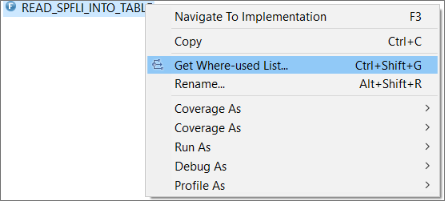
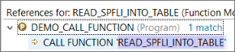
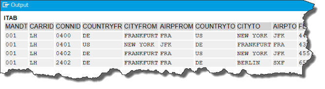

## Prerequisites  
 - **Proficiency:** Beginner
 - You have a running ABAP application server (AS). This tutorial was created in the AS ABAP developer edition, 752, download version. For more information, see [SAP Developer Community: Trials and Downloads](https://developers.sap.com/trials-downloads.html)
 - **Tutorial**: [Create an ABAP project](https://developers.sap.com/tutorials/abap-create-project.html)
 - **Tutorial (Recommended)**: [Exploring the ABAP Dictionary](https://developers.sap.com/tutorials/abap-dev-learn-ddic.html)

## Details
### You will learn  
You will learn how to find development objects in the ABAP Repository

### Time to Complete
**15 Min**

---

[ACCORDION-BEGIN [Step 1: ](Add a package to Favorites)]
You will start by looking at an **ABAP program** (or **report**):

  1. In ABAP Development Tools, expand the project that you created, by choosing the arrow on the left:
  

  2. Select **Favorite Packages**, then choose **Add Package…** from the context menu:
  

  3. Enter **`SABAP`** in the search field, then choose the package **`SABAPDEMOS`** from the matching items box:
  

The package is added to your favorites:

[DONE]

[ACCORDION-END]

[ACCORDION-BEGIN [Step 2: ](Expand the package)]
Expand the package SABAPDEMOS again by choosing the arrow, then expanding the Source Code Library folder:

You will see a list of folders of ABAP Repository objects in alphabetical order. For the moment you will focus on just 3:

- Executable **programs** also known as **reports**
- **Classes** (part of the object-oriented ABAP Objects)
- **Function modules**

You will now explore how these concepts fit together.

[DONE]

[ACCORDION-END]

[ACCORDION-BEGIN [Step 3: ](Expand the programs folder)]
**Programs / reports**
Expand the **Programs** folder, scroll down and choose (double-click) the program **`DEMO_CREATE_STRUCTURED_DATA`**:

Alternatively, choose **Open development object (`Alt+Shift+A`)** from the toolbar and choose the program **`DEMO_CREATE_STRUCTURED_DATA`**:

The program opens in a text-based editor:

The outline also appears:

Also, if you choose the Properties tab, you can see the package and application component:

In the Outline, you can see that the program contains a local class, **Demo**, with a method, **Main**, and, crucially, an event keyword **`START-OF-SELECTION`**. If you look in the main editor, you will see that when the associated event is triggered by the ABAP runtime environment, the program calls the method `Main` of the class `Demo`:

Without a processing block such as this, the program would not do anything. Also note, if you are completely new to ABAP, but experienced in other languages, that every ABAP statement ends with a period (!).
For more information, see [ABAP Keyword Documentation: START-OF-SELECTION](https://help.sap.com/doc/abapdocu_751_index_htm/7.51/en-US/index.htm?file=abapstart-of-selection.htm).

[DONE]

[ACCORDION-END]

[ACCORDION-BEGIN [Step 4: ](Run your program)]
Now run your program by choosing **Run (`F8`)** from the toolbar (ignore the other options for now):

An ABAP console appears. Change the name of the database table, or number of rows if you want, then choose **Enter**:

The console displays 10 rows of the table in a new tab:

Close the console.

[DONE]

[ACCORDION-END]

[ACCORDION-BEGIN [Step 5: ](Open a global class)]
You will now explore ABAP global classes:

  1. Back in the main text editor for the program, scroll down till you find the class **`CL_DEMO_INPUT`**:
  

  2. This is a global class. Select it and choose **Navigate (`F3`)** from the context menu. The definition appears in a text-based editor. (The outline also appears):
  

[DONE]

[ACCORDION-END]

[ACCORDION-BEGIN [Step 6: ](Find the class in the Project Explorer)]
If you looked in the Project Explorer for the class **`CL_DEMO_INPUT`**, you will not find it in the package **`SABAPDEMOS`**. If you look in the Properties tab, you will see that **`CL_DEMO_INPUT`** belongs to another package. You can display it in the hierarchy by right-clicking in the text editor and choosing **Show In > Project Explorer**:

The class appears in its package, **`SABAP_DEMOS_INPUT`**:

[DONE]

[ACCORDION-END]

[ACCORDION-BEGIN [Step 7: ](Open a function module)]
Finally you will look at **function modules**.  . Function modules are procedures that are managed in function groups and provide two main benefits:

  1. They allow you to encapsulate and reuse global functions in an ABAP system.

  2. They are also a very powerful feature, in that SAP delivers many built-in function modules – both general such as date and time, or remote system information, and module specific, such as HCM or FI. See these two lists for more details:     
  [Useful function modules](https://wiki.scn.sap.com/wiki/display/ABAP/Useful+ABAP+Function+Modules)
  [Commonly-used function modules](https://wiki.scn.sap.com/wiki/display/ABAP/List+of+Commonly+Used+Function+Modules)

  3. In the Project Explorer, in the package **`SABAPDEMOS`**, expand **Source Code Library > Function Groups**, then expand the group **`DEMO_SPFLI` > Function Modules**. You will see 2 function modules:
  

  4. Choose (double-click on) **`READ_SPFLI_INTO_TABLE`**. The function module opens in a text-based editor:
  

[DONE]

[ACCORDION-END]

[ACCORDION-BEGIN [Step 8: ](Open the where-used list)]

  1. In the **Outline** view, select (right-click on) the function module **`READ_SPFLI_FROM_TABLE`**, then choose **Get where-used list…**:
  

  2. From the hit list, choose the program **`DEMO_CALL_FUNCTION`**:
  

The program opens in a new editor.

[DONE]

[ACCORDION-END]

[ACCORDION-BEGIN [Step 9: ](Test the function module)]
You can test the function module:

  1. Choose **Execute program (`F8`)**.
  2. In the Input dialog that appears, choose an airline code ("carrier"), such as **LH** or **AA**, then choose **Enter**:

  The system displays all the flights for that airline:
  

In the text area below, enter the following text exactly, then click **Validate**:

``START-OF-SELECTION.``
``demo=>main( ).``

[VALIDATE_1]

[ACCORDION-END]

And that's it. You should now be familiar with the most important ABAP Repository objects and the relationship between them.
You can now work through the tutorial group [Get started with ABAP development](https://developers.sap.com/group.abap-basic-app.html), where you will learn how to create:

  1.	An ABAP application
  2.	Data Dictionary structure
  3.	Global ABAP class
  4.	Data element
  5.	ABAP documentation (`ABAPDocs`) for your class

---
