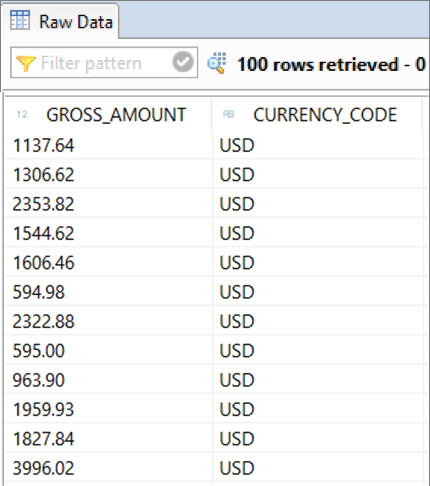
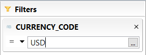
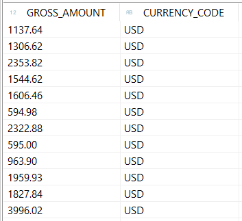
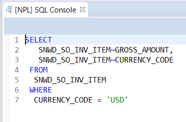
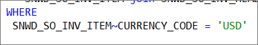
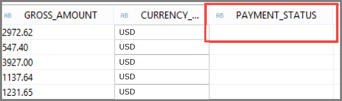
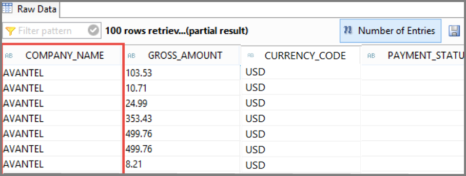

# Display Database Content and Run SQL Queries
<!-- description --> Use Data Preview to display the content of tables and SQL Console to perform ad-hoc SQL queries

## Prerequisites
- You have a valid instance of an on-premise AS ABAP server, version 7.51 or higher (some ABAP Development Tools may not be available in earlier versions)
- **Tutorial**: [Create an ABAP Project in ABAP Development Tools (ADT)](abap-create-project)
- You have generated the data for the relevant database table by running the transaction `SEPM_DG_OIA_NEW` (or program  `RS_EPM_DGC_HANA_NEW` ).


## You will learn  
- How to display the content of tables and views using Data Preview
- How to perform ad hoc SQL queries using SQL Console

## Intro
The tutorial starts from scratch, based on tables of the SAP NetWeaver Demo sample EPM Model. You can find details in the SAP Community [The NetWeaver Enterprise Procurement Model – An Introduction](https://pdfslide.net/documents/the-netweaver-enterprise-procurement-model-an-introduction.html?page=1), so you can repeat the tutorial on any SAP NetWeaver 7.5 system.

---

### Open the Data Preview


In ABAP Development Tools (ADT), open the database table `snwd_so_inv_item` by choosing **Execute ABAP Development Object** (or using `Alt+F8`).
This will open the Data Preview which will allow you to explore the invoice items table.


### Select a database table


Enter `snwd_so_inv_item` in the search field. Once the search has delivered a result or if the table is already in the history list, select **`SNWD_SO_INV_ITEM`**  and choose **OK**.


### Data preview


In the Data Preview Click **Select Columns** to change which fields are retrieved from the database.


### Select columns


First click **Deselect All**. Only select the fields `GROSS_AMOUNT` and `CURRENCY_CODE`. Click **OK** to confirm your selection.


The Data Preview is refreshed accordingly.




### Add a filter


Press **Add Filter** and choose `CURRENCY_CODE`.


### Enter filter criteria


Enter `USD` in the text field to filter the items that are in US dollars and press the **Enter** key.



The Data Preview is refreshed accordingly.




### Open the SQL Console


Click the **SQL Console** button to open the SQL Console.


### Initial SQL SELECT statement


The SQL Console shows the `SELECT` statement which was used to retrieve the data for the Data Preview. In the following steps you will adjust the `SELECT` statement to read the payment status of the order and the company name from the buyer.




### Add a JOIN condition


Adjust the SELECT statement in SQL Console in order to get the payment status from the order header by doing the following: Add a `JOIN` condition for the table `snwd_so_inv_head`
NOTE: You may get an error. You will solve this in the next step.

The `FROM` portion of the query should look like this:

```sql
SNWD_SO_INV_ITEM join SNWD_SO_INV_HEAD
on SNWD_SO_INV_ITEM~parent_key = SNWD_SO_INV_HEAD~node_key
```


### Update the WHERE clause


Modify the WHERE clause to match the following:

```sql
SNWD_SO_INV_ITEM~CURRENCY_CODE = 'USD'
```



### Add a field to the SELECT list


Add the field `payment_status` from the table `snwd_so_inv_head` to the `SELECT` list.


### Run the query


Click **Run** to execute the current query or press **F8**.


### Check the query results


Check that the output on the right hand side contains the payment status.




### Adjust the SELECT statement


Adjust the SELECT statement again in order to retrieve the company name from the table `snwd_bpa` by adding a `JOIN` condition for the table `snwd_bpa`.

```sql
join SNWD_BPA
on SNWD_SO_INV_HEAD~buyer_guid = SNWD_BPA~node_key
```


### Adding the company name field


Add the field `company_name` from the table `snwd_bpa` to the `SELECT` list.

```sql
SNWD_BPA~company_name,
SNWD_SO_INV_ITEM~GROSS_AMOUNT,
SNWD_SO_INV_ITEM~CURRENCY_CODE,
SNWD_SO_INV_HEAD~PAYMENT_STATUS
```


### Add an order by clause


Add an `ORDER BY` clause to sort the result by the company name of the buyer.

```sql
ORDER BY SNWD_BPA~company_name
```


### Run the modified query


Click **Run** to execute the current query or press `F8`.


### Review updated results


Check that the output contains the company name. You will reuse this `SELECT` statement later for data retrieval in an ABAP class. So just leave the SQL Console open.




### Test yourself


