## Prerequisites  
 [Create an ABAP project in Eclipse](http://www.sap.com/developer/tutorials/abap-create-project.html)


## Next Steps
[Create and run an ABAP application](http://www.sap.com/developer/tutorials/abap-create-basic-app.html)


## Details
### You will learn  
In this tutorial you will learn how to use Data Preview to display the content of tables and views and SQL Console to perform ad hoc SQL queries.

The tutorial starts from scratch based on tables of the SAP NetWeaver Demo sample EPM Model (you can find details in the SAP Community [The NetWeaver Enterprise Procurement Model – An Introduction](https://archive.sap.com/documents/docs/DOC-31458) ), so you can repeat the tutorial on any SAP NetWeaver 7.5 system.

### Time to Complete
**15 Min**.

---

[ACCORDION-BEGIN [Step 1: ](Open the Data Preview)]

In Eclipse, click or use the keyboard shortcut `Alt+F8` to execute an ABAP Development Object. You will "execute" the database table `snwd_so_inv_item`. This will open the Data Preview which will allow you to explore the invoice items in the EPM model.

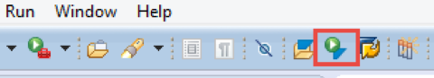

[DONE]
[ACCORDION-END]

[ACCORDION-BEGIN [Step 2: ](Select a database table)]

Enter `snwd_so_inv_item` in the search field. Once the search has delivered a result or if the table is already in the history list, click on the entry **`SNWD_SO_INV_ITEM`**. Click **OK** to open the Data Preview.

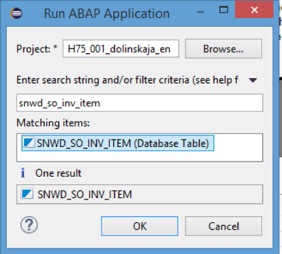

[DONE]
[ACCORDION-END]


[ACCORDION-BEGIN [Step 3: ](Data preview)]

In the Data Preview Click **Select Columns** to change which fields are retrieved from the database.

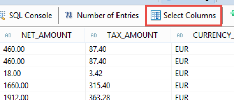

[DONE]
[ACCORDION-END]

[ACCORDION-BEGIN [Step 4: ](Select columns)]

First click **Deselect All**. Only select the fields `GROSS_AMOUNT` and `CURRENCY_CODE`. Click **OK** to confirm your selection.


The Data Preview is refreshed accordingly.

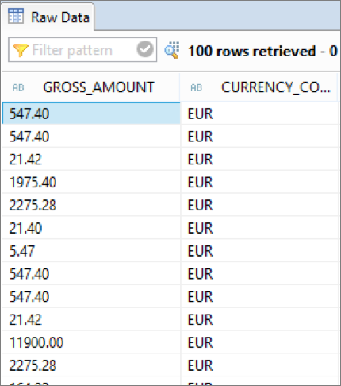

[DONE]
[ACCORDION-END]

[ACCORDION-BEGIN [Step 5: ](Add a filter)]

Press **Add Filter** and choose `CURRENCY_CODE`.


[DONE]
[ACCORDION-END]

[ACCORDION-BEGIN [Step 6: ](Enter filter criteria)]

Enter `EUR` in in the text field to filter the items that are in Euro and press the **Enter** key.

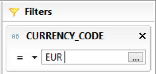

The Data Preview is refreshed accordingly.

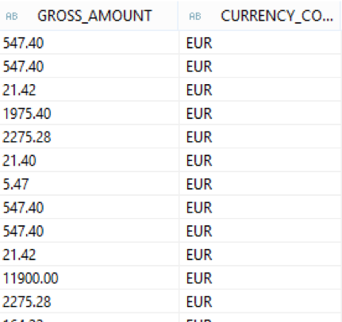

[DONE]
[ACCORDION-END]

[ACCORDION-BEGIN [Step 7: ](Open the SQL Console)]

Click the **SQL Console** button to open the SQL Console.

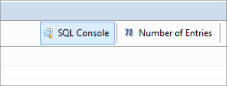


[DONE]
[ACCORDION-END]

[ACCORDION-BEGIN [Step 8: ](Initial SQL SELECT statement)]

The SQL Console shows the `SELECT` statement which was used to retrieve the data for the Data Preview. In the following steps you will adjust the `SELECT` statement to read the payment status of the order and the company name from the buyer.

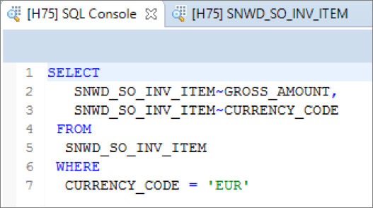

[DONE]
[ACCORDION-END]

[ACCORDION-BEGIN [Step 9: ](Add a JOIN condition)]

Adjust the SELECT statement in SQL Console in order to get the payment status from the order header by doing the following: Add a `JOIN` condition for the table `snwd_so_inv_head`

The `FROM` portion of the query should look like this:

```sql
SNWD_SO_INV_ITEM join SNWD_SO_INV_HEAD
on SNWD_SO_INV_ITEM~parent_key = SNWD_SO_INV_HEAD~node_key
```

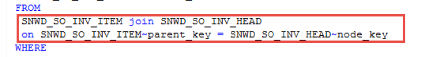

[DONE]
[ACCORDION-END]

[ACCORDION-BEGIN [Step 10: ](Update the WHERE clause)]

Modify the WHERE clause to match the following:

```sql
SNWD_SO_INV_ITEM~CURRENCY_CODE = 'EUR'
```
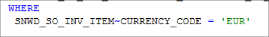

[DONE]
[ACCORDION-END]

[ACCORDION-BEGIN [Step 11: ](Add a field to the SELECT list)]

Add the field `payment_status` from the table `snwd_so_inv_head` to the `SELECT` list.

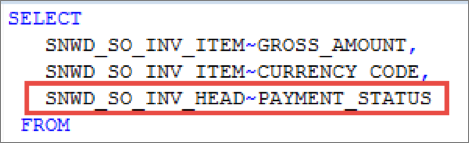

[DONE]
[ACCORDION-END]


[ACCORDION-BEGIN [Step 12: ](Run the query)]

Click **Run** to execute the current query or press **F8**.

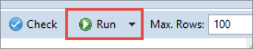

[DONE]
[ACCORDION-END]

[ACCORDION-BEGIN [Step 13: ](Check the query results)]

Check that the output on the right hand side contains the payment status.

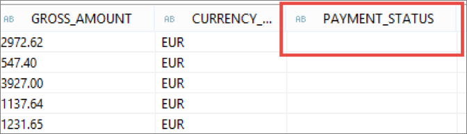

[DONE]
[ACCORDION-END]

[ACCORDION-BEGIN [Step 14: ](Adjust the SELECT statement)]

Adjust the SELECT statement again in order to retrieve the company name from the table `snwd_bpa` by adding a `JOIN` condition for the table `snwd_bpa`.

```sql
join SNWD_BPA
on SNWD_SO_INV_HEAD~buyer_guid = SNWD_BPA~node_key
```

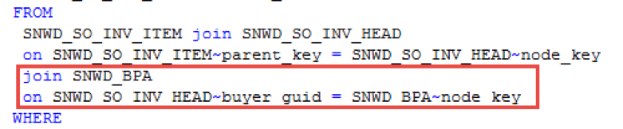

[DONE]
[ACCORDION-END]

[ACCORDION-BEGIN [Step 15: ](Adding the company name field)]

Add the field `company_name` from the table `snwd_bpa` to the `SELECT` list.

```sql
SNWD_BPA~company_name,
SNWD_SO_INV_ITEM~GROSS_AMOUNT,
SNWD_SO_INV_ITEM~CURRENCY_CODE,
SNWD_SO_INV_HEAD~PAYMENT_STATUS
```

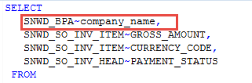


[DONE]
[ACCORDION-END]

[ACCORDION-BEGIN [Step 16: ](Add an order by clause)]

Add an `ORDER BY` clause to sort the result by the company name of the buyer.

```sql
ORDER BY SNWD_BPA~company_name
```

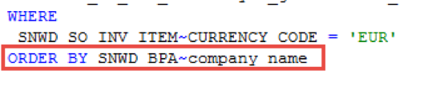

[DONE]
[ACCORDION-END]

[ACCORDION-BEGIN [Step 17: ](Run the modified query)]

Click **Run** to execute the current query or press `F8`.


[DONE]
[ACCORDION-END]

[ACCORDION-BEGIN [Step 18: ](Review updated results)]

Check that the output on the right hand side contains the company name. You will reuse this `SELECT` statement later for data retrieval in an ABAP class. So just leave the SQL Console open.

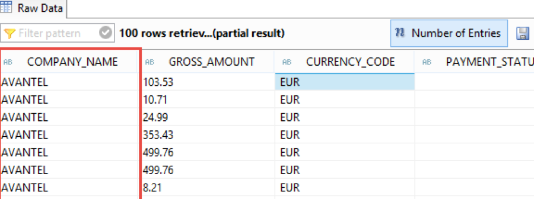

[DONE]
[ACCORDION-END]

## Next Steps
[Create and run an ABAP application](http://www.sap.com/developer/tutorials/abap-create-basic-app.html)
