## Prerequisites
- **IMPORTANT**: This tutorial cannot be completed on a trial account
- A business role has been created containing the business catalog `SAP_CORE_BC_COM`, and is assigned to your user [How to Create a Business Role from Scratch](https://help.sap.com/viewer/65de2977205c403bbc107264b8eccf4b/Cloud/en-US/f65e51a7203443efb58fe535c3d13e5f.html)
- You have opened the SAP Cloud Platform cockpit and navigated to the correct space. See [SAP Help Portal: SAP Cloud Platform Cockpit](https://help.sap.com/viewer/65de2977205c403bbc107264b8eccf4b/Cloud/en-US/e47748b5bb571014afedc70595804f3e.html)
- You have opened an ABAP service instance in SAP Cloud Cockpit
[Connect to the ABAP Environment](https://help.sap.com/viewer/65de2977205c403bbc107264b8eccf4b/Cloud/en-US/7379dbd2e1684119bc1dd28874bbbb7b.html)
- **Tutorial**: [Create Your First ABAP Console Application](https://developers.sap.com/tutorials/abap-environment-console-application.html), steps 1-3

## Details
### You will learn
  - How to create a Communication Arrangement (see below) for SAP CP Cloud Foundry Service Integration. You can then use this communication arrangement, for example to connect your ABAP Environment instance to an external API
  - How to test this arrangement by creating a specific destination pointing to an external API

  The communication scenario `SAP_COM_0276` is predefined by SAP. It allow you to, for example, exchange data between an ABAP Environment instance and an on-premise S/4HANA System, or a third-party API.
  A communication arrangement specifies the metadata for a specific communication scenario, such as your host system and the authentication method. This metadata is contained in a service key.  You can then define one or more specific destinations for this arrangement.

Throughout this tutorial, objects name include the suffix `2` or `XXX`. Replace this suffix with your group number or initials.

---

[ACCORDION-BEGIN [Step 1: ](Create a Cloud Foundry destination service instance)]
1. In SAP Cloud Cockpit: Navigate to your Space (such as Dev).

    

2. Choose **Service Marketplace > Destination**.

    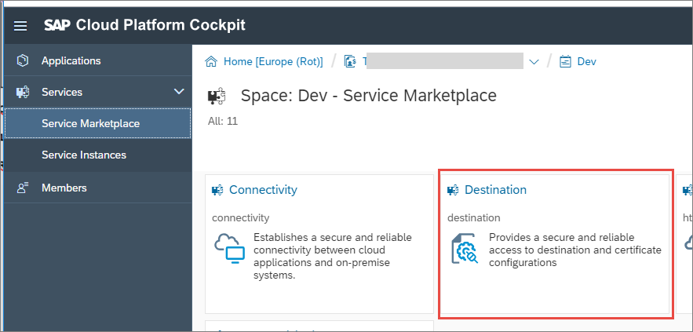

3. Choose **Instances > New Instance**.

    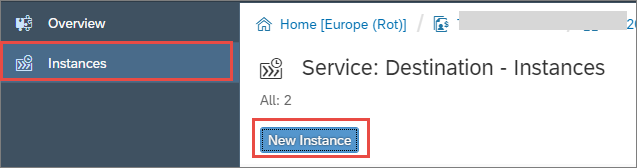

4. Accept the defaults and choose **Next > Next > Next.**

5. On the **Confirm** screen, enter an instance name **`EXTERNAL_API_XXX`**, then choose **Finish**.

    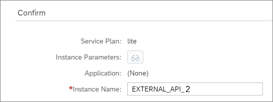

The new instance appears in the list.

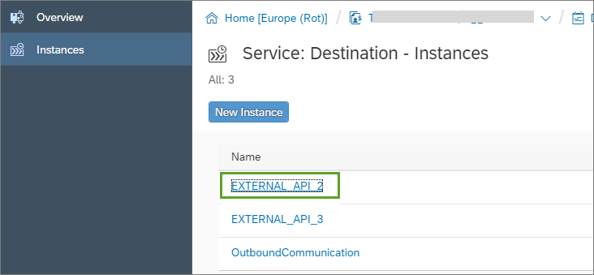

[DONE]
[ACCORDION-END]

[ACCORDION-BEGIN [Step 2: ](Create a new specific destination for the service instance)]

1. Open your destination, **`EXTERNAL_API_XXX`**, by double-clicking it, then choose **Destinations > New Destination**:

    

2. Then enter the following (replacing **`xxx`** with your group number). Then choose **Save**:
    - Name  = `Z_CHUCKNORRIS_xxx`
    - URL = `http://api.icndb.com/jokes/random?limitTo=[nerdy]`
    - Proxy type = Internet
    - Authentication = `NoAuthentication`

    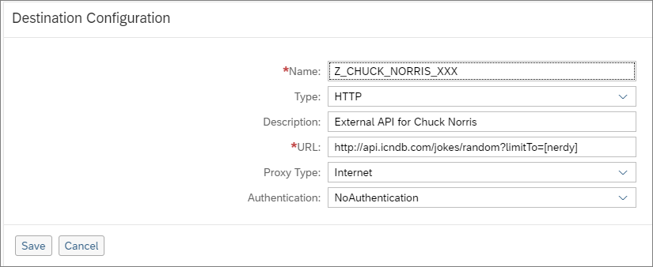  

[DONE]
[ACCORDION-END]

[ACCORDION-BEGIN [Step 3: ](Check the connection)]
Check the connection:

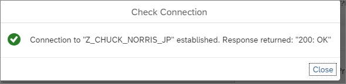  

[DONE]
[ACCORDION-END]

[ACCORDION-BEGIN [Step 4: ](Create a service key)]

1. Choose **Service Keys > Create Service Key**.

     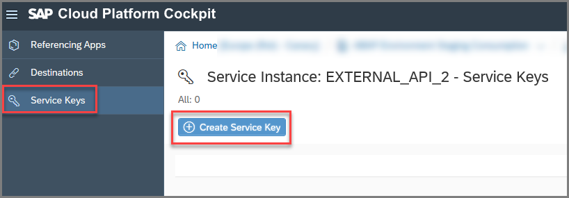

2. Enter the service instance name `EXTERNAL_API_XXX`.

     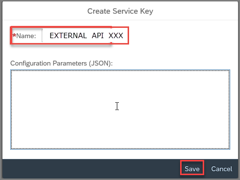

3. Copy the service key to a text file, since you will need it later.

     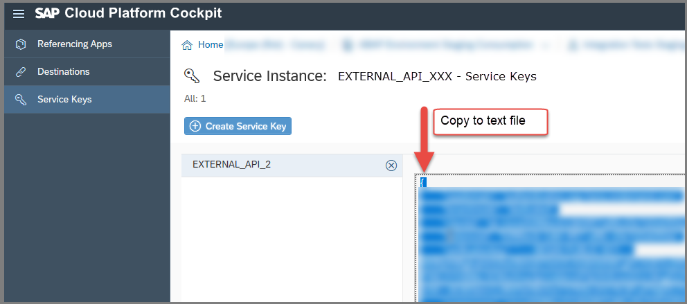

[DONE]
[ACCORDION-END]

[ACCORDION-BEGIN [Step 5: ](Open the dashboard for your ABAP service instance)]
1. Go back to your space, `Dev` and choose **Service Instances >  `your_ABAP_service_instance`**.

    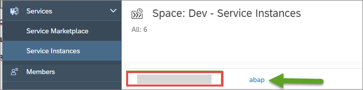

2. Choose **Open Dashboard**.

    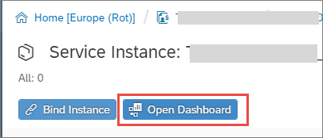

The dashboard opens.

[DONE]
[ACCORDION-END]

[ACCORDION-BEGIN [Step 6: ](Create a communication arrangement using the service key)]
1. Choose **Communication Arrangements > New**.

    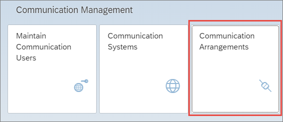
    .
    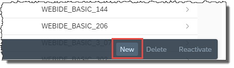

2. Choose the correct communication scenario from the drop-down list, that is **`SAP_COM_0276`** (SAP CP Cloud Foundry Service Integration). These scenarios are pre-configured by SAP.

    
    .
    

3. Enter the name you chose for your destination service instance in SAP Cloud Cockpit, that is **`EXTERNAL_API_XXX`**.

4. Paste in the service key and choose **Create**.

    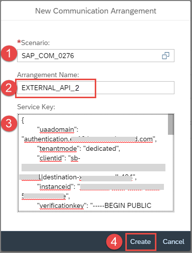

A communication arrangement is created, along with an identically-named communication system.

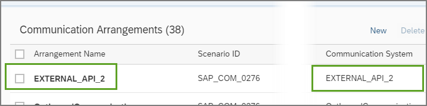
.
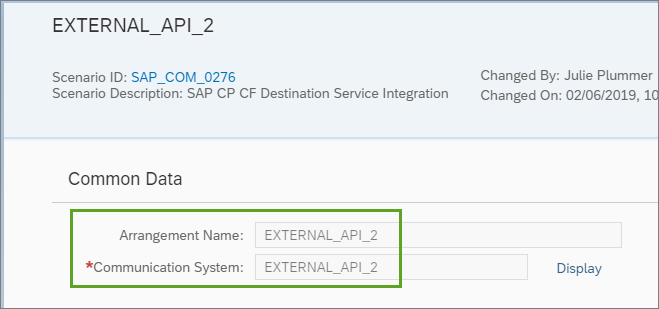

[DONE]
[ACCORDION-END]

[ACCORDION-BEGIN [Step 7: ](Add the service instance name)]
Still in the **Communication Arrangement**, in the **Additional Properties** panel, replace the default value **`EXTERNAL_API_XXX`** of the property **Service Instance Name**, with another value such as `OutboundComm_for_RFCDemo_XXX`.  (To avoid confusion, make the Communication Arrangement name and the service instance name different).

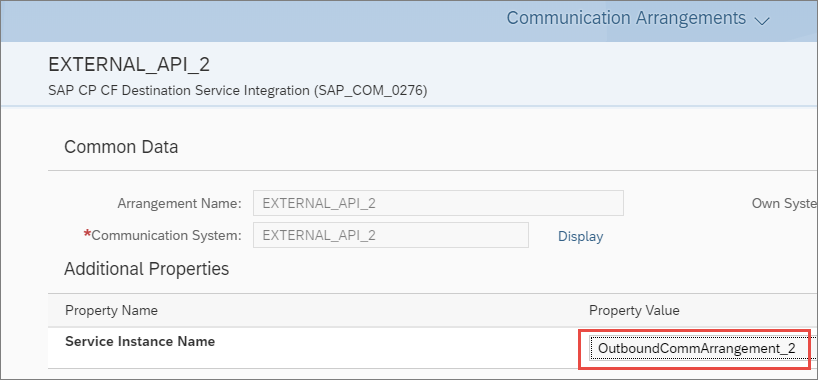

[DONE]
[ACCORDION-END]

[ACCORDION-BEGIN [Step 8: ](Test yourself)]

[VALIDATE_1]
[ACCORDION-END]

### More Information
- [SAP Help Portal: Creating a Communication Arrangement...](https://help.sap.com/viewer/a96b1df8525f41f79484717368e30626/Cloud/en-US/7c1b45781c6f4d9ca23177b61805d179.html)

- [SAP Help Portal: Using Services in the Cloud Foundry Environment](https://help.sap.com/viewer/65de2977205c403bbc107264b8eccf4b/Cloud/en-US/f22029f0e7404448ab65f71ff5b0804d.html)

- [Cloud Foundry: Managing Service Keys](https://docs.cloudfoundry.org/devguide/services/service-keys.html)

For more information on SAP Cloud Platform, accounts, and environments, see [SAP Help Portal: What is SAP Cloud Platform](https://help.sap.com/viewer/65de2977205c403bbc107264b8eccf4b/Cloud/en-US/73beb06e127f4e47b849aa95344aabe1.html)
---
