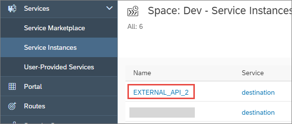

## Prerequisites
- You have connected to an ABAP system and created an ABAP Cloud Project, as described in [Connect to the ABAP System
](https://help.sap.com/viewer/65de2977205c403bbc107264b8eccf4b/Cloud/en-US/7379dbd2e1684119bc1dd28874bbbb7b.html)
-	The business catalog `SAP_CORE_BC_COM` is assigned to your user
- You have opened the SAP Cloud Platform cockpit and navigated to the correct space. See [SAP Help Portal: SAP Cloud Platform Cockpit](https://help.sap.com/viewer/65de2977205c403bbc107264b8eccf4b/Cloud/en-US/e47748b5bb571014afedc70595804f3e.html)

## Details
### You will learn
  - How to create a communication arrangement for SAP CP Cloud Foundry Service Integration. You can then use this communication arrangement, for example to connect your ABAP Environment instance to an external API
  - How to create a specific destination pointing to an external API

 A communication arrangement specifies the metadata for a communication scenario. (For more information, see [Maintain a Communication Arrangement for an Exposed Service](abap-environment-communication-arrangement).)

For more information on SAP Cloud Platform, accounts, and environments, see [SAP Help Portal: What is SAP Cloud Platform](https://help.sap.com/viewer/65de2977205c403bbc107264b8eccf4b/Cloud/en-US/73beb06e127f4e47b849aa95344aabe1.html)

Throughout this tutorial, objects name include the suffix `XXX`. Always replace this with your group number or initials.

---

[ACCORDION-BEGIN [Step 1: ](Create a Cloud Foundry destination service instance)]
1. In SAP Cloud Cockpit: Navigate to your Space (such as Dev).

    

2. Choose **Service Marketplace > Destination**

    

3. Choose **Instances > New Instance.**

    

4. Accept the defaults and choose **Next > Next > Next.**

5. On the **Confirm** screen, enter an instance name and choose **Finish**.

    

The new instance appears in the list.

[DONE]
[ACCORDION-END]

[ACCORDION-BEGIN [Step 2: ](Create a new specific destination for the service instance)]

1. Choose **New Destination**:

      

2. Then enter the following (replacing **`xxx`** with your group number). Then choose **Save**:
    - Name  = `Z_CHUCKNORRIS_xxx`
    - URL = `http://api.icndb.com/jokes/random?limitTo=[nerdy]`
    - Proxy type = Internet
    - Authentication = `NoAuthentication`

      

[DONE]
[ACCORDION-END]

[ACCORDION-BEGIN [Step 3: ](Check the connection)]
Check the connection:

  

[DONE]
[ACCORDION-END]

[ACCORDION-BEGIN [Step 2: ](Open the dashboard for your ABAP service instance)]
1. Go back to your space, `Dev` and choose **Service Instances >  `your_ABAP_service_instance`**.

    

2. Choose **Open Dashboard**.

    

The dashboard opens.

[DONE]
[ACCORDION-END]

[ACCORDION-BEGIN [Step 3: ](Create a communication arrangement using the service key)]
1. Choose **Communication Arrangements > New**.

    
    

2. Choose the correct communication scenario from the drop-down list, that is **`SAP_COM_0276`** (SAP CP Cloud Foundry Service Integration). These scenarios are pre-configured by SAP.

    

    

3. Enter a name, generally the name you chose for your destination service instance, that is **`EXTERNAL_API_XXX`**.

4. Paste in the service key and choose **Create**.

    

A communication arrangement is created, along with an identically-named communication system.

[DONE]
[ACCORDION-END]

[ACCORDION-BEGIN [Step 4: ](Test yourself)]

[VALIDATE_1]
[ACCORDION-END]
---
