## Prerequisites
- You have done one of the following:
    - You have a valid instance of SAP Cloud Platform, ABAP Environment. For more information, see **Tutorial**: [Create Your First ABAP Console Application](abap-environment-console-application), steps 1-2
    - You have a valid instance of an on-premise AS ABAP server, version 7.52 or higher. (The text-based Table Editor is not available for earlier ABAP server versions). For a free AS ABAP server, 7.52, SP04, see [SAP Developers: Trials and Downloads - 7.52](https://developers.sap.com/trials-downloads.html?search=7.52)
- You have installed [ABAP Development Tools 3.0](https://tools.hana.ondemand.com/#abap), latest version
- You have downloaded or pulled the ABAP Flight Reference Scenario. To pull this reference scenario from `Github`, see [ Downloading the ABAP Flight Reference Scenario](https://help.sap.com/viewer/923180ddb98240829d935862025004d6/Cloud/en-US/def316685ad14033b051fc4b88db07c8.html)
- **Tutorial**: [Create a Database Table](abap-dev-create-table)

## Details
### You will learn
  - How to create and edit a table type for an internal table in the new, form-based Table Types editor
  - How to use this table type to retrieve data from a database table

Table types can also be defined in, for example, an ABAP program or class. The differences between the two approaches include:

  -	Table types in the ABAP Data Dictionary are maintained in a form-based editor, table types in ABAP in a text-based editor
  -	**Reuse**: Table types can only be used by other Dictionary types if they are defined in the Data Dictionary
  -	**Modularization**: Table types in the Dictionary are stand-alone objects, whereas table types in ABAP are always part of another Repository object

Throughout this tutorial, objects have the suffix **`XXX`**. Remember to always replace this with your initials or group number.

---

[ACCORDION-BEGIN [Step 1: ](Create a table type)]

1. Open your ABAP Project or ABAP Cloud Project from the previous tutorial, then open the package in which you created the database table.

2. Select your package and choose **New > Other ABAP Repository Object > Dictionary > Table Type** from the context menu.

    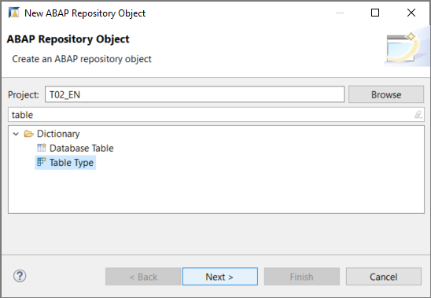

3. Enter a name and description and choose **Next**.

    !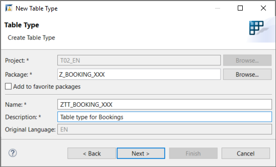

4. Create or assign a transport request and choose **Finish**.

The table type appears in a new editor.  

!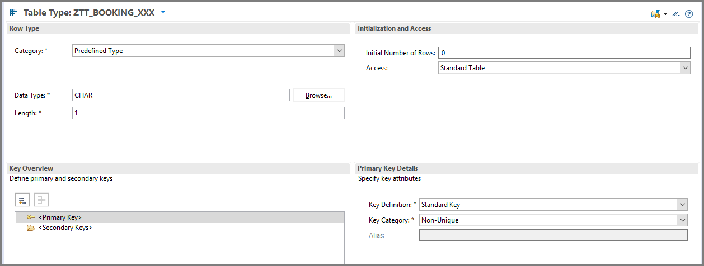

[DONE]
[ACCORDION-END]

[ACCORDION-BEGIN [Step 2: ](Define a type)]
Choose the category **Dictionary Type** For the type name, choose the database table you created in a previous tutorial, for example **`Z_BOOKING_XXX`** (replacing `XXX` with your group number or initials).

> Enter the exact name. The Browse function may not work in some environments.

!

> In the ABAP Environment, you can only work with whitelisted objects. The majority of tables you might expect, such as `SFLIGHT` are not whitelisted. For a complete list of whitelisted objects, see the folder **Released Objects**. To sort objects by object type, not package, use a Duplicate Tree

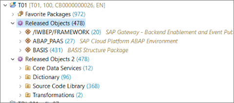

> In ABAP on-premise systems, this is not an issue.

[DONE]
[ACCORDION-END]

[ACCORDION-BEGIN [Step 3: ](Define a primary key)]
1. You cannot define your own primary key for a standard table. First, change the access type to **Sorted Table**.

    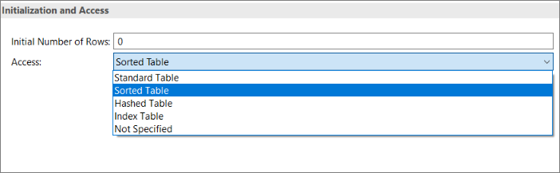

2. Change the Primary Key type to **Key Components**.

    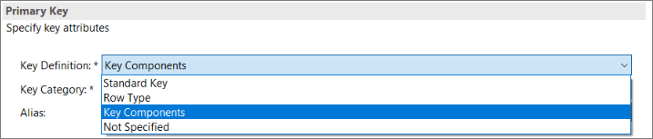

3. You can now choose the key fields from a drop-down list, by choosing **Auto-complete (Ctrl+Space)**.

    !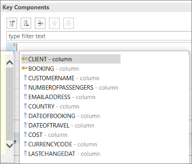

4. Choose each key field in turn, using **Auto-complete (`Ctrl+Space`)**:

    !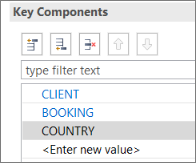


This is for test purposes only. The access type you choose in real life affects performance. For more information, see:

  - [ABAP Keyword Documentation: Internal Tables, Selection of Table Category](https://help.sap.com/doc/abapdocu_752_index_htm/7.52/en-US/index.htm?file=abenitab_kind.htm)

  - [ABAP Examples: Internal Tables, Key Accesses](https://help.sap.com/doc/abapdocu_752_index_htm/7.52/en-US/index.htm?file=abenitab_kind.htm)

[DONE]
[ACCORDION-END]

[ACCORDION-BEGIN [Step 4: ](Define a secondary key)]
Users may want to query a database table using something other than the primary key. To enable this, create a secondary key.

1. First, select **Secondary Key** and choose **Create...** from the context menu:

    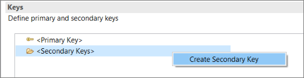

2. Enter a name and choose the component(s) (or fields):

    !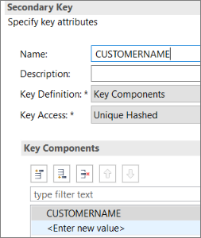

The keys are listed.

  !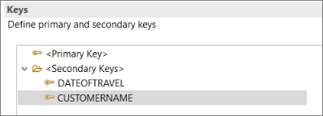

[DONE]
[ACCORDION-END]

[ACCORDION-BEGIN [Step 5: ](Create an ABAP class)]
Finally, you will test your table type by using it to:

- define an internal table
- get database data into this table
- output the table content to the console

1. First create the ABAP Class, by selecting your package and choosing **New > ABAP Class** from the context menu:

    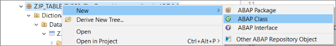

2. Enter a name **`ZCL_GET_ACCOUNT_DATA_XXX`** and description for your class (replacing `XXX` with your group number or initials).

    !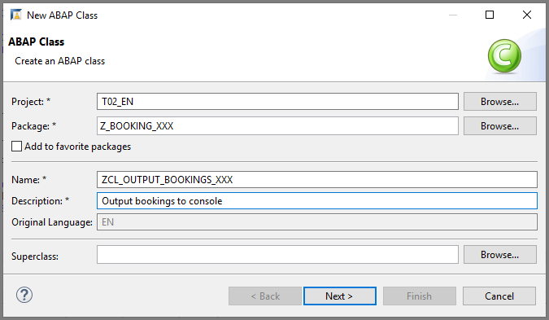

3. Assign a transport request and choose **Finish**.

The class appears in a new editor.

!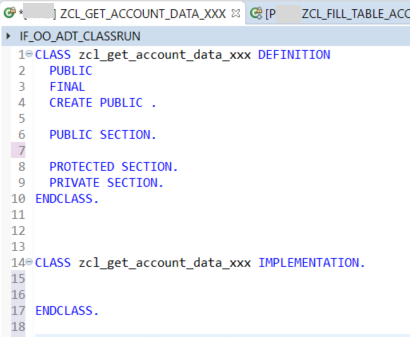

[DONE]
[ACCORDION-END]

[ACCORDION-BEGIN [Step 6: ](Add an interface)]
1. Add the following interface to your class:

    ```ABAP
     interfaces if_oo_adt_classrun.
    ```

This interface provides a light-weight solution for executing an ABAP program without launching a full user interface.
It also lets you display text or data in the Console View.

2. Add the implementation for the **`main`** method of this interface by selecting the interface name and choosing **Add implementation...** from the context menu.

    !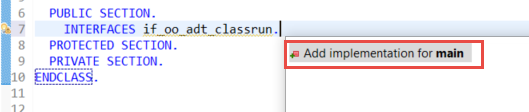

[DONE]
[ACCORDION-END]

[ACCORDION-BEGIN [Step 7: ](Implement the method)]
You will now add the following code to the `main` method, remembering to rename the table type and database table to your own (for example, replacing `XXX` with your group number or initials)..

1. Create an internal table `lt_accounts` with the table type that you just created, `ZTT_ACCOUNTS_XXX`.

    ```ABAP
    DATA: lt_accounts type ZTT_ACCOUNTS_XXX.
    ```
2. Select data from the database table from the previous tutorial `ZTBOOKING_XXX` and add it to the internal table.

    ```ABAP
    select * from ZACCOUNTS_XXX
    into table @lt_accounts.
    ```

3. Output the internal table to the console.

    ```ABAP
    out->write( EXPORTING
    data = lt_accounts
    name = 'Accounts:' ).
    ```


4. Then save and activate your class using **`Ctrl+S, Ctrl+F3`**.

[DONE]
[ACCORDION-END]

[ACCORDION-BEGIN [Step 8: ](Check your code)]
The complete class should look like this:

```ABAP
CLASS zcl_get_account_data_xxx DEFINITION
  PUBLIC
  FINAL
  CREATE PUBLIC .

  PUBLIC SECTION.
    INTERFACES if_oo_adt_classrun.
  PROTECTED SECTION.
  PRIVATE SECTION.
ENDCLASS.

CLASS zcl_get_account_data_xxx IMPLEMENTATION.
  METHOD if_oo_adt_classrun~main.
    DATA: lt_accounts type ZTT_ACCOUNTS_XXX.

    select * from ZACCOUNTS_XXX
    into table @lt_accounts.

    out->write( EXPORTING
    data = lt_accounts
    name = 'Accounts:' ).

  ENDMETHOD.
ENDCLASS.
```


[DONE]
[ACCORDION-END]

[ACCORDION-BEGIN [Step 9: ](Test your class)]
Run your class in the console by choosing **`F9`**. Your output should look like this:

  !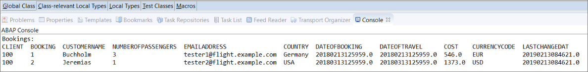

[DONE]
[ACCORDION-END]

[ACCORDION-BEGIN [Step 10: ](Test yourself)]

[VALIDATE_1]
[ACCORDION-END]


---
