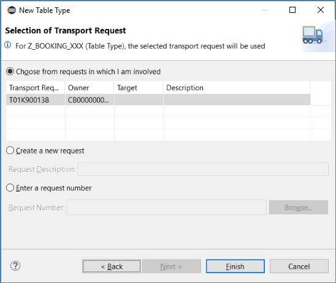
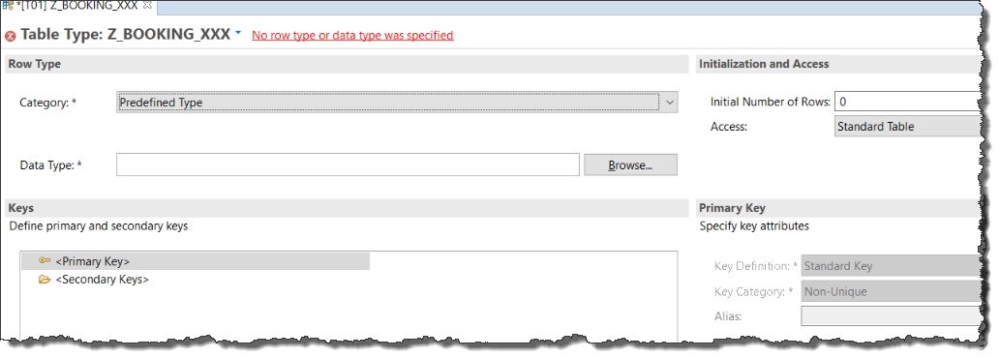

## Prerequisites
- You have a sub-account with the entitlement SAP Cloud Platform, ABAP environment, release 1902 or higher. For more details, see [Getting Started with a Customer Account: Workflow in the ABAP Environment](https://help.sap.com/viewer/65de2977205c403bbc107264b8eccf4b/Cloud/en-US/e34a329acc804c0e874496548183682f.html)
- You have installed [ABAP Development Tools 3.0](https://tools.hana.ondemand.com/#abap)
- You have created an ABAP Cloud Project pointing to this ABAP environment. For more details, see  [Connect to the ABAP System](https://help.sap.com/viewer/65de2977205c403bbc107264b8eccf4b/Cloud/en-US/7379dbd2e1684119bc1dd28874bbbb7b.html)
- **Tutorial**: [Create a Simple Database Table for ABAP Environment](https://developers.sap.com/tutorials/abap-environment-create-table.html)

## Details
### You will learn
  - How to create and edit a table type for an internal table in the new, form-based Table Types editor
  - How to use this table type to retrieve data from a database table

Table types can also be defined in, for example, an ABAP program or class. The differences between the two approaches include:
-	Table types in the ABAP Data Dictionary are maintained in a form-based editor, table types in ABAP in a text-based editor
-	Table types can only be used by other Dictionary types if they are defined in the Data Dictionary
-	Table types in the Dictionary are stand-alone objects, whereas table types in ABAP are always part of another Repository object

---

[ACCORDION-BEGIN [Step 1: ](Create a table type)]

1. Select your ABAP Cloud Project and choose **New > Other ABAP Repository Object > Dictionary > Table Type**.

    

2. Enter a name and description and choose **Next**.

    

3. Create or assign a transport request and choose **Finish**.

    

The table type appears in a new editor:



[DONE]
[ACCORDION-END]

[ACCORDION-BEGIN [Step 2: ](Define a type)]
Choose the category **Dictionary Type** For the type name, choose the database table you created in a previous tutorial, for example **`Z_BOOKING_XXX`** (replacing `XXX` with your group number or initials).


> In the ABAP Environment, you can only work with whitelisted objects. The majority of tables you might expect, such as `SFLIGHT` are not whitelisted. For a complete list of whitelisted objects, see the folder **Released Objects**. To sort objects by object type, not package, use a Duplicate Tree:


[DONE]
[ACCORDION-END]

[ACCORDION-BEGIN [Step 3: ](Define a primary key)]
1. You cannot define your own primary key for a standard table. First, change the access type to **Sorted Table**.

    

2. Change the Primary Key type to **Key Components**.

    

3. You can now choose the key fields from a drop-down list, by choosing **Auto-complete (Ctrl+Space)**.

    

4. Choose each key field in turn:

    


> This is for test purposes only. The access type you choose in real life affects performance. For more information, see:
- [ABAP Keyword Documentation: Internal Tables, Selection of Table Category](https://help.sap.com/doc/abapdocu_752_index_htm/7.52/en-US/index.htm?file=abenitab_kind.htm)
- [ABAP Examples: Internal Tables, Key Accesses](https://help.sap.com/doc/abapdocu_752_index_htm/7.52/en-US/index.htm?file=abenitab_kind.htm)

[DONE]
[ACCORDION-END]

[ACCORDION-BEGIN [Step 4: ](Define a secondary key)]
Users may want to query a database table using something other than the primary key. To enable this, create a secondary key.

1. First, select **Secondary Key** and choose **Create...** from the context menu:

    

2. Enter a name and choose the component(s) (or fields):

    

The keys are listed on the left:

  

[DONE]
[ACCORDION-END]

[ACCORDION-BEGIN [Step 5: ](Create an ABAP class)]
Finally, you will test your table type by using it to

- define an internal table
- get database data into this table
- output the table content to the console

1. First create the ABAP Class, by selecting your package and choosing **New > ABAP Class** from the context menu:

    

2. Enter a name, such as **`Z_OUTPUT_BOOKINGS_XXX`** and description for your class (replacing `XXX` with your group number or initials).

    

3. Assign a transport request and choose **Finish**.

The class appears in a new editor.

[DONE]
[ACCORDION-END]

[ACCORDION-BEGIN [Step 6: ](Add an interface)]
Add the following interface to your class:

```ABAP
 interfaces if_oo_adt_classrun.
```

This interface provides a light-weight solution for executing an ABAP program without launching a full user interface.
It also lets you display text or data in the Console View.

[DONE]
[ACCORDION-END]

[ACCORDION-BEGIN [Step 7: ](Implement the method)]
1. Add the following code, remembering to rename the table type and database table to your own (for example, replacing `XXX` with your group number or initials).
2. Then save and activate your class using **`Ctrl+S, Ctrl+F3`**.


```ABAP
METHOD if_oo_adt_classrun~main.
   DATA:
       lt_bookings type Z_BOOKING_XXX.

select * from zjp_bookings
into table @lt_bookings.
out->write( EXPORTING data = lt_bookings
            name = 'Bookings:' ).
ENDMETHOD.
```

This method simply selects all the fields from your database table (here, `zjp_bookings`) into the internal table whose type is defined by the table type you created.

[DONE]
[ACCORDION-END]

[ACCORDION-BEGIN [Step 8: ](Check your code)]
The complete class should look like this:

```ABAP
class ZJP_OUTPUT_BOOKINGS definition
  public
  final
  create public .

public section.
 interfaces if_oo_adt_classrun.
protected section.
private section.
ENDCLASS.

CLASS Z_OUTPUT_BOOKINGS_XXX IMPLEMENTATION.
  METHOD if_oo_adt_classrun~main.
    DATA:
        lt_bookings type z_booking_xxx.

select * from zjp_bookings
into table @lt_bookings.
out->write( EXPORTING data = lt_bookings
             name = 'Bookings:' ).

 ENDMETHOD.
ENDCLASS.

```


[DONE]
[ACCORDION-END]

[ACCORDION-BEGIN [Step 9: ](Test your class)]
Run your class in the console by choosing **`F9`**. Your output should look like this:

  

[DONE]
[ACCORDION-END]

[ACCORDION-BEGIN [Step 10: ](Test yourself)]

[VALIDATE_1]
[ACCORDION-END]


---
