## Prerequisites
-	A full entitlement to [SAP Cloud Platform, ABAP environment](https://cloudplatform.sap.com/capabilities/product-info.SAP-Cloud-Platform-ABAP-environment.4d0a6f95-42aa-4157-9932-d6014a68d825.html) (not a trial account)
- A full SAP Cloud Platform Neo subaccount. **IMPORTANT**: Your SAP Cloud Platform, Cloud Foundry and SAP Cloud Platform, Neo accounts must be in the same geographical region.
-	An ABAP on-premise system, such as:
    - [SAP S/4HANA 1809 fully activated appliance](https://blogs.sap.com/2018/12/12/sap-s4hana-fully-activated-appliance-create-your-sap-s4hana-1809-system-in-a-fraction-of-the-usual-setup-time/) or:
    - [The SAP Gateway Demo System (ES5)](https://blogs.sap.com/2017/12/05/new-sap-gateway-demo-system-available/)
-	In this on-premise system, a SAP Cloud Connector

## Details
### You will learn
  - How to open a secure tunnel connection between your SAP Cloud Platform ABAP Environment and an on-premise SAP System, e.g. SAP S/4HANA
  - How to create a destination service instance with HTTP and RFC connections
  - How to create a communication arrangement to integrate this destination service
  - How to create a communication arrangement to integrate SAP Cloud Connector
  - How to test the connection using an ABAP handler class

Throughout this tutorial, replace `XXX` with your initials or group number.

**The problem:**

There are two problems when setting up connectivity between the Cloud Platform ABAP Environment and an on-premise:

- The ABAP Environment "lives" in the Internet, but customer on-premise systems are behind a firewall
- RFC is not internet-enabled

**The solution**:

- Set up a connection from the on-premise system to the SAP Cloud Platform Neo Environment using SAP Cloud Connector
- Set up a connection from the SAP Neo to the SAP Cloud Foundry Environment

**Specifically**:

1. Fetch the destination, i.e. from SAP Cloud Foundry to on-premise  (using a Cloud Foundry destination service)
2. Send request to open a tunnel, from Cloud Foundry (i.e. ABAP Environment) to SAP Neo
3. Send request to open a tunnel, from Neo to the on-premise system
4. Open a secure tunnel for HTTP and RFC
5. Communicate through the tunnel via HTTP or RFC

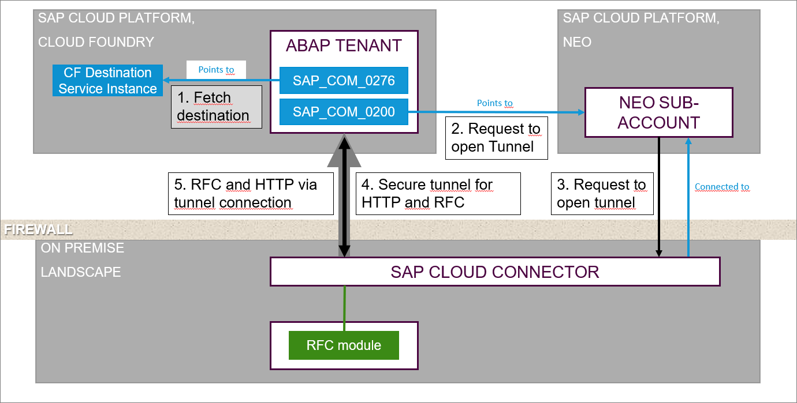

---

[ACCORDION-BEGIN [Step 1: ](Configure SAP Cloud Connector)]
First, you need to connect your ABAP on-premise system to a Neo subaccount by means of SAP Cloud Connector.

1. Log on to SAP Cloud Connector:
    - Address = e.g. `https://localhost:<port>` (Default = 8443)
    - User = Administrator
    - Initial password = Manage (You will change this when you first log in)

2. Choose **Add Subaccount**:
  - **Region** = Your region. You can find this in SAP Cloud Cockpit (see screenshot below). Note that your SAP Cloud Platform Neo and SAP Cloud Foundry accounts need to run in the same region (e.g. here, Europe Rot)
  - **Subaccount** = "Neo Technical Name". You can find this by choosing your Neo subaccount in SAP Cloud Cockpit and choosing the **information (i)** icon. (see screenshot below)
  - **Display Name** = (Neo Subaccount) Display Name. You can find this in by choosing your Neo subaccount in SAP Cloud Cockpit (see screenshot below)
  - **Subaccount User** = for the Neo Subaccount
  - **Password**
  - **Location ID** = Optional here. However, it is mandatory if you want to connect several Cloud Connectors to your subaccount. This can be any text, e.g. your initials

  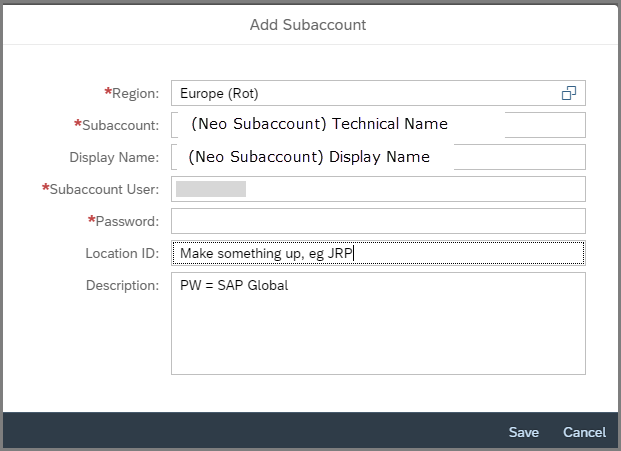
  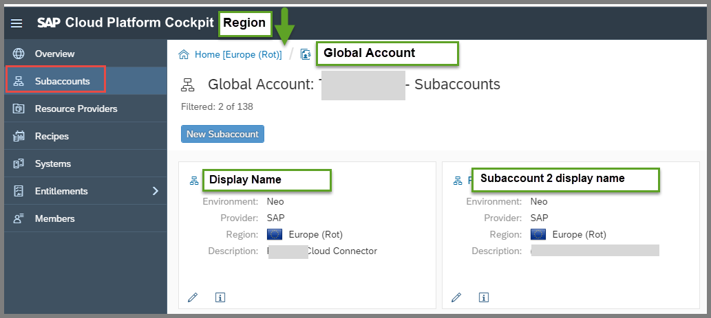
  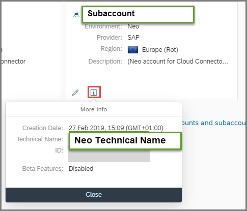

Your configuration should now look like this:

  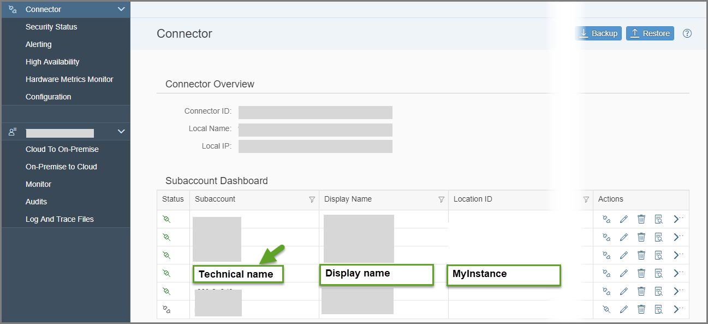

[DONE]
[ACCORDION-END]

[ACCORDION-BEGIN [Step 2: ](Add On-Premise System)]
1. In your sub-account, **Display Name**, choose **Cloud to On-Premise > Access Control**.

  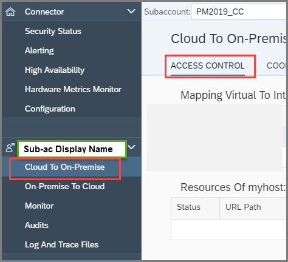

2. In the **Mapping Virtual...** pane, choose **Add (+)**.

  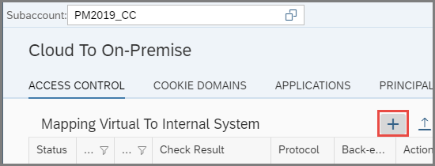

3. Enter the following values, and choose **Save**.

    - Backend Type = ABAP
    - Protocol = RFC
    - **Without** load balancing...
    - Internal Host and port (see below)
    - Virtual Host = e.g. `es5host`. Here, `es5host` represents an external hostname, so that you can hide the internal hostname from the outside world. You will need this external hostname and port later.
    - Virtual Port = usually, enter the internal Port
    - Principal Type = None
    - Check Internal Host = Ticked

    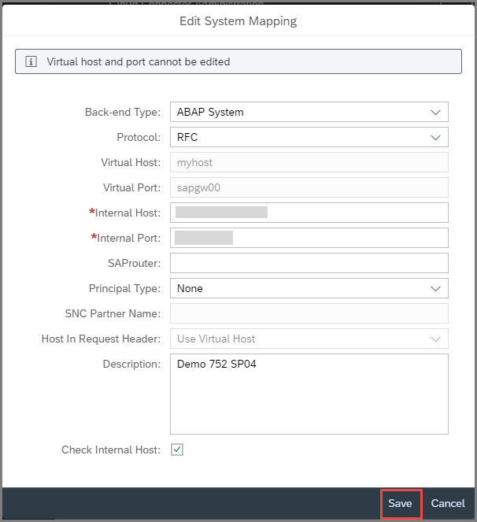

4. To find the port, in your on-premise system, choose the transaction **`SMICM` > `Goto` > Services**, then choose an active `HTTP` port.

The mapping should now look something like this. Check that the status = `Reachable`. If not, check that you chose the correct port, or whether an internal firewall is preventing communication:

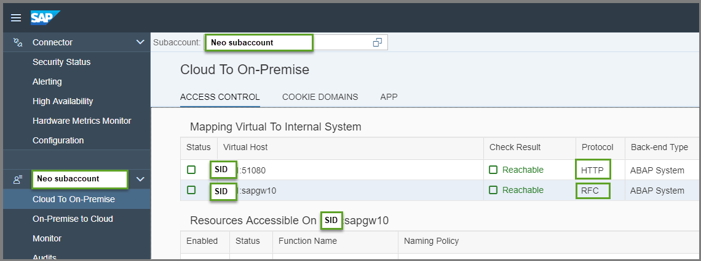  

[DONE]
[ACCORDION-END]

[ACCORDION-BEGIN [Step 3: ](Specify the remote function modules and BAPIs)]
Now, still in the **Cloud to On-Premise > Access Control** tab, enter the resource you need, `RFC_SYSTEM_INFO`.

1. Add the resource **`RFC_SYSTEM_INFO`** by choosing the **Protocol = RFC**, then choosing **+**.

    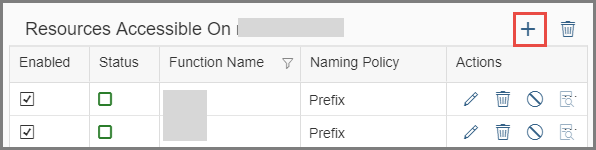

3. Enter the name of the RFC, e.g. **`RFC_SYSTEM_INFO`**. Alternatively, add **`RFC`** as a **Prefix**. Then choose **Save**

    

4. Add BAPIs to the list of resources by choosing **+** again. (You will need this BAPI in a later tutorial.)

5. Enter the name **`BAPI_EPM`** as a **Prefix**, then choose **Save**.

6. The list of resources should now look roughly like this:

    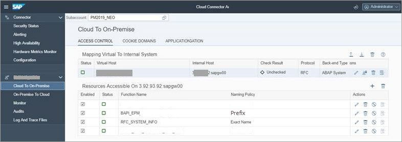

[DONE]
[ACCORDION-END]

[ACCORDION-BEGIN [Step 4: ](Open the destination service instance)]
You will now create two destinations in the ABAP Environment. These must be created at Space level, e.g. `Dev`, not subaccount level.

1. In SAP Cloud Cockpit, open your **ABAP Environment > your space, such as Dev**, then choose **Service Instances**.

    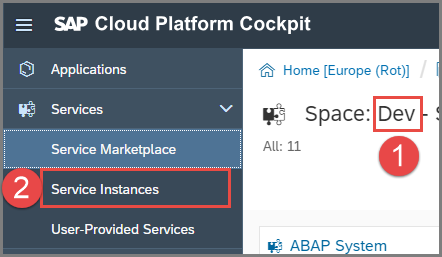

2. Open the destination service you created in [Create a Communication Arrangement for Outbound Communication](abap-env-create-comm-arrangement-api)

    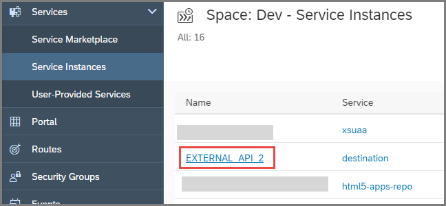  

3. Create a new destination for the destination service instance

    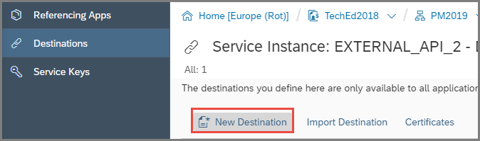

[DONE]
[ACCORDION-END]

[ACCORDION-BEGIN [Step 5: ](Create a new RFC destination for the destination service instance)]
1. Again, choose **New Destination** and enter the following values:
    - Name, e.g. : `ES5_RFC_XXX`
    - Type: `RFC`
    - Description, e.g. Test ES5
    - Location ID: same as in step 1, e.g. your initials
    - User: Your user for the on-premise system
    - Password: Your password

2. Add the following additional properties and values, by choosing **New Property**:
    - `jco.client.ashost` = `<myHost>` - again, the external hostname of your on-premise ABAP System in lower-case
    - `jco.client.client` = `<Your ABAP System client`, e.g. 002
    - `jco.client.sysnr` = `<Your ABAP System number>`, e.g. 11

    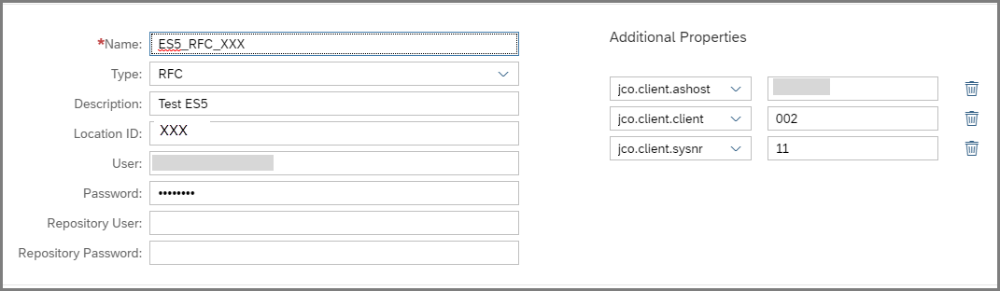    

You have now created a destination service instance destination for your communication arrangement. Take note of the name, here `ES5_RFC_XXX`, since you will need it later.


[DONE]
[ACCORDION-END]

[ACCORDION-BEGIN [Step 6: ](Create a Communication System for SAP Cloud Connector)]
(When you created the Communication System for outbound communication, you created the Arrangement first, then the System. This time, it is easiest to create the System first, then the Arrangement.)

1. Go back to your space **`Dev`** and choose **Service Instances**, then choose your `abap` service instance, e.g. **T02**.

    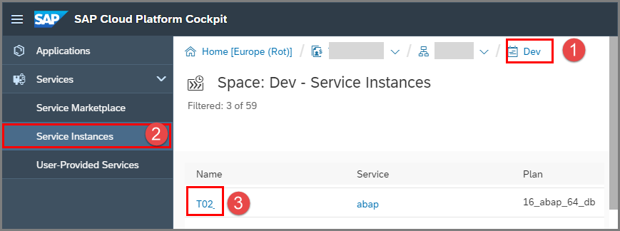

2. Open the Dashboard.

    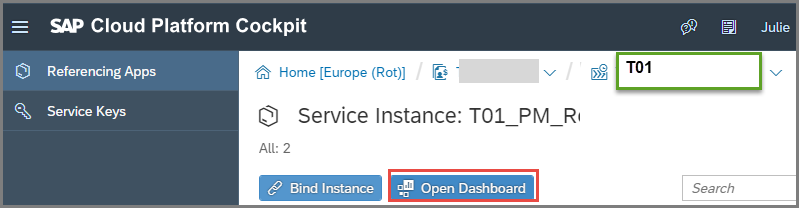

3. In the Dashboard, choose **Communication Systems > New**.

4. Enter the credentials for the SAP Cloud Connector administration user for your  SAP Cloud Platform Neo account.

      - Hostname = URL for your Neo subaccount, without protocol or account, e.g. if your Neo URL = `https://account.hana.ondemand.com/` , then you need **`hana.ondemand.com/`**.

        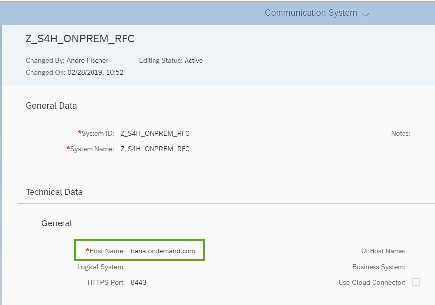

      - User and Password = the same user as in step 1 above

        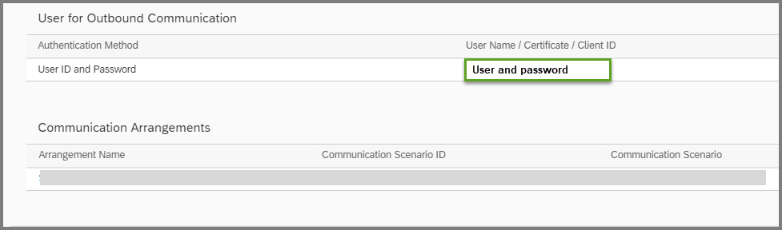


[DONE]
[ACCORDION-END]

[ACCORDION-BEGIN [Step 7: ](Create a Communication Arrangement for SAP Cloud Connector)]
1. Go back to the Dashboard Home, choose **Communication Arrangements** again, then choose **New**.

      

2. Enter the following values and choose **Create**.
    - Scenario: `SAP_COM_0200` (SAP Cloud Connector Integration)
    - Name: `SAP_COM_0200_XXX`

3. Enter the Communication System you have just created.

4. In the details screen, enter the Account Name: **`<NEO Technical Name>`**

      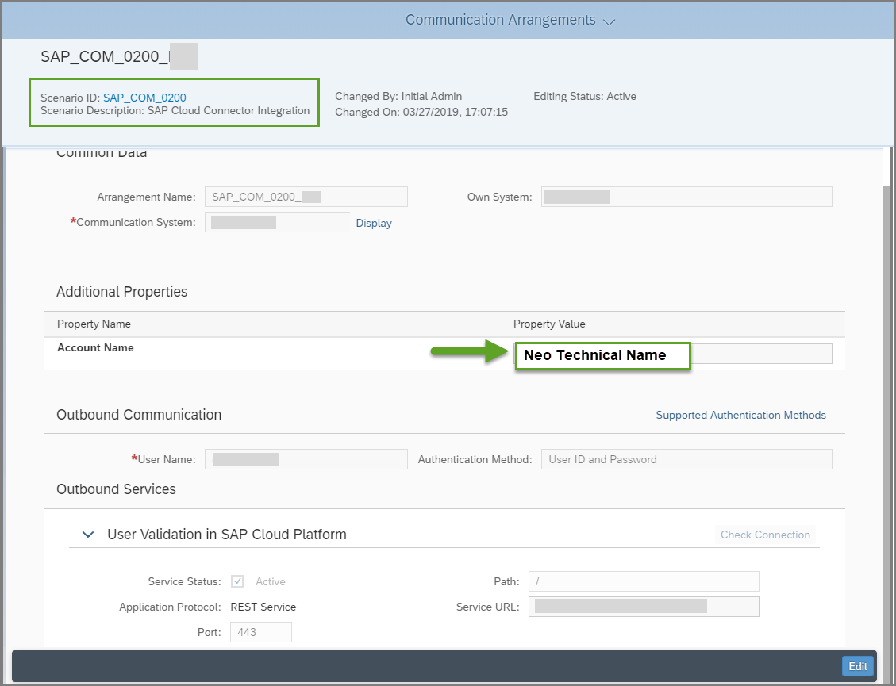

[DONE]
[ACCORDION-END]

[ACCORDION-BEGIN [Step 8: ](Create an ABAP class for the RFC connection)]
1. Create a new ABAP class: Choose **File > New > Other... > ABAP Class**.

2. Enter a name and description. The name should be in the form `ZCL_...RFC_XXX`. Replace `XXX` with your group number or initials.

3. Create or assign a transport request.

[DONE]
[ACCORDION-END]

[ACCORDION-BEGIN [Step 9: ](Add the interfaces statement; implement the main method)]
1. Implement the interface by adding this statement to the public section:

    `interfaces if_oo_adt_classrun.`

    This allows you to test your class by displaying the output in the ABAP Console.

2. In the implementation section, add the METHOD and ENDMETHOD statements:

    `METHOD IF_OO_ADT_CLASSRUN~MAIN.`
    `ENDMETHOD.`

[DONE]
[ACCORDION-END]

[ACCORDION-BEGIN [Step 10: ](Create variables)]
1. Create the data types that specify your remote connection information:

    ```ABAP
    DATA(lo_destination) = cl_rfc_destination_provider=>CREATE_BY_CLOUD_DESTINATION(
                            i_name                  = 'ES5_RFC_XXX'
                            i_service_instance_name = 'OutboundComm_for_RFCDemo_XXX'
                           ).

    DATA(lv_destination) = lo_destination->get_destination_name( ).

    DATA lv_result type c length 200.
    ```

2. Replace the `i_service_instance_name` with your service instance name, specified in the Communication  Arrangement (which you created in [Create a Communication Arrangement for Outbound Communication](abap-env-create-comm-arrangement-api)).


3. Replace the `i_name` with your the name of the specific **RFC** destination (which you created in SAP Cloud Cockpit in the tutorial [Create a Communication Arrangement for Outbound Communication](abap-env-create-comm-arrangement-api)).

    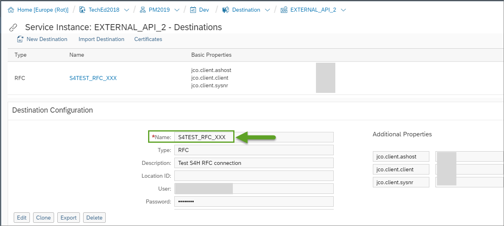

[DONE]
[ACCORDION-END]

[ACCORDION-BEGIN [Step 11: ](Call the remote function from the on-premise system)]
```ABAP
CALL function 'RFC_SYSTEM_INFO'
destination lv_destination
  IMPORTING
    RFCSI_EXPORT      = lv_result.

```

[DONE]
[ACCORDION-END]

[ACCORDION-BEGIN [Step 12: ](Output the result)]
Output the result of the RFC call to the ABAP Console

```ABAP
out->write( lv_result ).
```

[DONE]
[ACCORDION-END]

[ACCORDION-BEGIN [Step 13: ](Wrap the method in an exception)]
Wrap the whole method in an exception using TRY...CATCH.

```ABAP
catch cx_root into data(lx_root).
  out->write( lx_root->get_text( ) ).
endtry.
```    
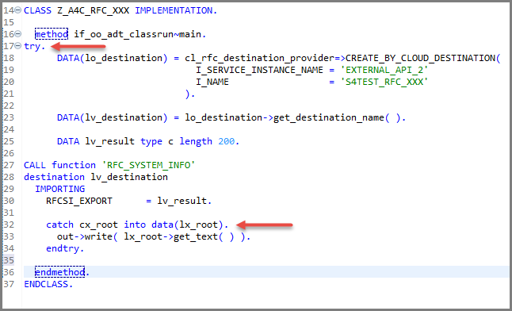

[DONE]
[ACCORDION-END]

[ACCORDION-BEGIN [Step 14: ](Check your code)]
You code should look roughly like this:

```ABAP
class ZCL_A4C_RFC_XXX definition
  public
  final
  create public .

public section.
  interfaces if_oo_adt_classrun.
protected section.
private section.
ENDCLASS.


CLASS ZCL_A4C_RFC_XXX IMPLEMENTATION.
  METHOD IF_OO_ADT_CLASSRUN~MAIN.
    TRY.
      DATA(lo_destination) = cl_rfc_destination_provider=>CREATE_BY_CLOUD_DESTINATION(
                              i_name                  = 'ES5_RFC_XXX'
                              i_service_instance_name = 'OutboundComm_for_RFCDemo_XXX'
                             ).

      DATA(lv_destination) = lo_destination->get_destination_name( ).

      DATA lv_result type c length 200.

      CALL function 'RFC_SYSTEM_INFO'
      destination lv_destination
        IMPORTING
          RFCSI_EXPORT      = lv_result.

        out->write( lv_result ).
    catch cx_root into data(lx_root).
      out->write( lx_root->get_text( ) ).
    endtry.
  ENDMETHOD.

ENDCLASS.
```

[DONE]
[ACCORDION-END]

[ACCORDION-BEGIN [Step 15: ](Test the class)]
1. Save and activate the class, using **`Ctrl+S, Ctrl+F3`**.

2. Run the class by choosing **`F9`**. Some system information, such as the hostname, the System ID ( `<SID>` ), and the IP address should be displayed.

[DONE]
[ACCORDION-END]

[ACCORDION-BEGIN [Step 16: ](Test yourself)]

[VALIDATE_1]
[ACCORDION-END]

[ACCORDION-BEGIN [Step 17: ](Add error handling to the class for the RFC connection )]
1. Go back to your RFC class. Remove the period (.) after the IMPORTING parameter and add the following exception parameters to the function call `RFC_SYSTEM_INFO`:

    ```ABAP

    EXCEPTIONS
      system_failure        = 1 MESSAGE msg
      communication_failure = 2 MESSAGE msg
      OTHERS                = 3.

    ```

2. Now evaluate `sy-subrc` by adding the following CASE...ENDCASE statement:

    ```ABAP

    CASE sy-subrc.
       WHEN 0.
         out->write( lv_result ).
       WHEN 1.
         out->write( |EXCEPTION SYSTEM_FAILURE | && msg ).
       WHEN 2.
         out->write( |EXCEPTION COMMUNICATION_FAILURE | && msg ).
       WHEN 3.
         out->write( |EXCEPTION OTHERS| ).
     ENDCASE.

    ```

    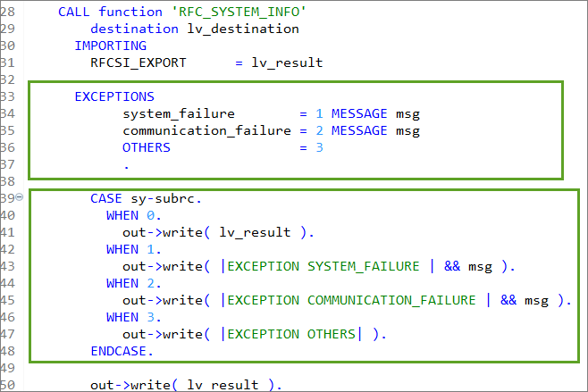

[DONE]
[ACCORDION-END]

## More Information
For more information on setup, see:

- [SAP Help Portal: What is SAP Cloud Platform](https://help.sap.com/viewer/65de2977205c403bbc107264b8eccf4b/Cloud/en-US/73beb06e127f4e47b849aa95344aabe1.html) - basic concepts

- [SAP Help Portal: Connect to the ABAP System](https://help.sap.com/viewer/65de2977205c403bbc107264b8eccf4b/Cloud/en-US/7379dbd2e1684119bc1dd28874bbbb7b.html)

- [SAP Help Portal: SAP Cloud Connector](https://help.sap.com/viewer/368c481cd6954bdfa5d0435479fd4eaf/Cloud/en-US/642e87f1492146998a8eb0779cd07289.html)

- [SAP Help Portal: Integrating On-Premise Systems](https://help.sap.com/viewer/65de2977205c403bbc107264b8eccf4b/Cloud/en-US/c95327fbed6c4efeb1855f12f826301d.html)

For more information on OData services and SAP Gateway in general, see:

- [OData service development with SAP Gateway using CDS](https://blogs.sap.com/2016/06/01/odata-service-development-with-sap-gateway-using-cds-via-referenced-data-sources/) - pertains to on-premise Systems, but contains lots of useful background information on the relationships between CDS views, OData services

- [OData – Everything that you need to know](https://blogs.sap.com/2016/02/08/odata-everything-that-you-need-to-know-part-1/) - especially Parts 1-3 (Community content)

- [How to call a remote function module in your on-premise SAP system from SAP Cloud Platform – ABAP Environment](https://blogs.sap.com/2019/02/28/how-to-call-a-remote-function-module-in-your-on-premise-sap-system-from-sap-cloud-platform-abap-environment/)

---
