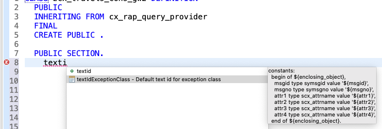

##Prerequisites
- **IMPORTANT**: This tutorial cannot be completed on a trial account  

## Details
### You will learn
  - How to create an HTTP client in an ABAP class
  - How to instantiate a client proxy in this class
  - How to handle errors by creating an exception class and message class

To retrieve data from a remote service, you must:

1. Connect to the provisioning system

2. Instantiate a proxy in the client system that passes an OData request to the remote service

This tutorial is based on: [SAP Help Portal: Creating a Remote Client Proxy](https://help.sap.com/viewer/923180ddb98240829d935862025004d6/Cloud/en-US/08603b70390a411cb984f8a8107a7525.html).

Therefore, this tutorial will only cover in detail those aspects that are different - in particular, handling exceptions.

---

[ACCORDION-BEGIN [Step 1: ](Create auxiliary class)]
First, you create the class that instantiates the client proxy.

1. In ADT, open your package **`Z_A4C_TO_A4C_XXX`** and choose **New > Class**.

2. Enter a name and description:
    - `ZCL_PROXY_TRAVELS_XXX`
    - Create client proxy for Travels

3. Choose the transport request, then choose **Finish**.

[DONE]
[ACCORDION-END]


[ACCORDION-BEGIN [Step 2: ](Copy code)]
Copy the following code.

```ABAP

CLASS zcl_proxy_travels_xxx DEFINITION
  PUBLIC
  FINAL
  CREATE PUBLIC .

  PUBLIC SECTION.
        CLASS-METHODS
    get_client_proxy
      RETURNING VALUE(ro_client_proxy) TYPE REF TO /iwbep/if_cp_client_proxy
*     RAISING /dmo/cx_travel_service_xxx        
      .

  PROTECTED SECTION.
  PRIVATE SECTION.
ENDCLASS.


CLASS zcl_proxy_travels_xxx IMPLEMENTATION.
  METHOD get_client_proxy.
    TRY.
        " 1. Get the destination of foreign system
        " 2. Create http client

        " i_name = name of destination in SAP BTP cockpit; URL = base URL of your provisioning system
        DATA(lo_http_client) = cl_web_http_client_manager=>create_by_http_destination(
                cl_http_destination_provider=>create_by_cloud_destination(
                    i_name                  = 'XXX'
                )
               ).
        "LATER: Handle Exceptions
        CATCH cx_http_dest_provider_error INTO DATA(lx_http_dest_provider_error).             
        CATCH cx_web_http_client_error INTO DATA(lx_web_http_client_error).


    ENDTRY.

    TRY.

          "iv_service_definition_name = the service definition generated with Service Consumption Model (EDMX file)
          " iv_relative_service_root =

          ro_client_proxy = cl_web_odata_client_factory=>create_v2_remote_proxy(
            EXPORTING
                iv_service_definition_name = 'XXX'
                io_http_client             = lo_http_client
                iv_relative_service_root   = '/sap/opu/odata/sap/XXX'
          ).

        "LATER: Handle Exceptions  
        CATCH cx_web_http_client_error INTO DATA(lx_http_client_error).    
        CATCH /iwbep/cx_cp_remote INTO DATA(lx_cp_remote).
        CATCH /iwbep/cx_gateway INTO DATA(lx_gateway).                  

    ENDTRY.
          ENDMETHOD.

ENDCLASS.

```

[DONE]
[ACCORDION-END]

[ACCORDION-BEGIN [Step 3: ](Adapt code)]
1. Specify your provisioning system as the destination, by replacing the defaults:
    - **`i_name`** = name of destination in SAP BTP cockpit, where URL = base URL of provisioning system

    ```ABAP
    i_name                  = 'SID_XXX_HTTP'

    ```

      !    

2. Specify your service definition and the relative path of your inbound service, by replacing the defaults:

    - `iv_service_definition_name` = service definition generated when you created your Service Consumption Model, in the tutorial [Create a Service Consumption Model in ABAP Environment](abap-environment-create-service-consumption-model), step 3

    - `iv_relative_service_root` = **relative path** of your inbound service, (that is, without the base URL), created in the tutorial [Create Inbound Communication Objects for an OData Service](abap-environment-a4c-inbound-communication), step 4, "Create inbound communication arrangement".

    ```ABAP

    EXPORTING
      iv_service_definition_name = 'Z_MODEL_TRAVELS_XXX'
      io_http_client             = lo_http_client
      iv_relative_service_root   = 'sap/opu/odata/sap/Z_BIND_TRAVELS_XXX' ).

    ```

    !
    !


[DONE]
[ACCORDION-END]

[ACCORDION-BEGIN [Step 4: ](Create message class)]
1. Select your package and choose **New > Other ABAP Repository Object** from the context menu.

2. Enter the filter text **message** and choose **ABAP > ... Message Class**, then choose **Next**.

    !

3. Enter a name, **`ZCM_TRAVELS_XXX`**, and description, then choose **Next**. Your message class should have the prefix **`ZCM`**.

4. Accept the proposed transport request and choose **Finish**.

The new message class appears in a new editor.

!

[DONE]
[ACCORDION-END]

[ACCORDION-BEGIN [Step 5: ](Add messages)]
In your code, there are five `CATCH` statements. Enter a number and short text for each one. Enter the five numbers using the **Create** icon.

!

|  Number | Short Text
|  :------| :-------------
|  001    | Access to remote system cannot be established.
|  002    | HTTP Client could not be instantiated.
|  003    | Client Proxy could not be instantiated.
|  004    | Remote HTTP service consumption error.
|  005    | SAP Gateway error.


[DONE]
[ACCORDION-END]

[ACCORDION-BEGIN [Step 6: ](Create exception class)]
You will now handle exceptions that may be raised if, for example, your code points at the wrong HTTP destination.
To do this, you need to create an exception class, which **catches** the exception and a message class, which contains all the appropriate messages.

All exception classes inherit from an exception superclass, which in turn inherits from one of three exception classes, `CX_STATIC_CHECK`, `CX_DYNAMIC_CHECK`, or `CX_NO_CHECK`.
In this case, your exception class must inherit from the superclass **`CX_RAP_QUERY_PROVIDER`**.

1. Start with the exception class: From your package, choose **Source Code Library > Classes > New ABAP Class**.

2. Enter a name, **`ZCX_TRAVELS_CONS_XXX`**, a description, and the superclass **`CX_RAP_QUERY_PROVIDER`**, then choose **Next**. Your exception class should have the prefix **`ZCX`**.

3. Accept the proposed transport request and choose **Finish**.

The new exception class appears with some pre-defined code in a new editor.

[DONE]
[ACCORDION-END]

[ACCORDION-BEGIN [Step 7: ](Define constants)]
For each exception, the exception class defines one or more **constant** structures, which specifies the message class, message number, and attributes. (There should be four attributes for each constant structure, whether or not they are used.)

Define these using a code template:

1. In the private section of your exception class, type **`textID`**, then trigger code completion using **`Ctrl+Space`**, then choose **`textIdExceptionClass...`**

    !

2. Replace the default texts:
    - `begin of <ExceptionClass>` = **`begin of destination_provider_fail`**
    - `msgid` = your message class, that is, **`ZCM_TRAVELS_XXX`**
    - `msgno` = **001**
    - `attr1` - `attr4`= leave as default.

    `destination_provider_fail` is displayed when the exception `cx_http_dest_provider_error` is caught and corresponds to the short text of message 001, "Access to remote system cannot be established."

    Your code should look like this:

    ```ABAP
    constants:
      begin of destination_provider_fail,
        msgid type symsgid value 'ZCM_TRAVELS_XXX',
        msgno type symsgno value '001',
        attr1 type scx_attrname value 'attr1',
        attr2 type scx_attrname value 'attr2',
        attr3 type scx_attrname value 'attr3',
        attr4 type scx_attrname value 'attr4',
      end of destination_provider_fail.

    ```


3. Repeat steps 1-2 for messages 002-005, naming the constants as follows. (End CONSTANTS 1-4 with a comma; end CONSTANT 5 with a period.)


    |  Number     | Name of constant
    |  :------------- | :-------------
    |  002    | `http_client_fail`
    |  003    | `client_proxy_fail`
    |  004    | `remote_access_fail`
    |  005    | `gateway_fail`

[DONE]
[ACCORDION-END]

[ACCORDION-BEGIN [Step 8: ](Handle exceptions)]
1. Add a **`RAISING`** clause to the method **`get_client_proxy`**, pointing to your exception class.

    The addition RAISING is used to declare one or more class-based exceptions that can be propagated from the method to the caller.

    ```ABAP
    CLASS-METHODS
    get_client_proxy
      RETURNING VALUE(ro_client_proxy) TYPE REF TO /iwbep/if_cp_client_proxy
      RAISING /dmo/cx_travel_service_003.
    ```

2. Replace the first two CATCH statements with the following code.

    That is, replace:

    ```ABAP
    CATCH cx_http_dest_provider_error INTO DATA(lx_http_dest_provider_error).             
    CATCH cx_web_http_client_error INTO DATA(lx_web_http_client_error).
    ```

    with:

    ```ABAP
    CATCH cx_http_dest_provider_error INTO DATA(lx_http_dest_provider_error).
            "Handle exceptions
            RAISE EXCEPTION TYPE /dmo/cx_travel_service_003
              EXPORTING
        textid   = /dmo/cx_travel_service_003=>destination_provider_fail
        previous = lx_http_dest_provider_error
        .

    CATCH cx_web_http_client_error INTO DATA(lx_web_http_client_error).
            RAISE EXCEPTION TYPE /dmo/cx_travel_service_003
              EXPORTING
        textid   = /dmo/cx_travel_service_003=>http_client_fail
        previous = lx_web_http_client_error.
    ```

3. Similarly, replace:

    ```ABAP
    CATCH cx_web_http_client_error INTO DATA(lx_http_client_error).    
    CATCH /iwbep/cx_cp_remote INTO DATA(lx_cp_remote).
    CATCH /iwbep/cx_gateway INTO DATA(lx_gateway).
    ```

    with:

    ```ABAP
    CATCH cx_web_http_client_error INTO DATA(lx_http_client_error).
      RAISE EXCEPTION TYPE /dmo/cx_travel_service_003
        EXPORTING
            textid   = /dmo/cx_travel_service_003=>client_proxy_fail
            previous = lx_web_http_client_error.

    CATCH /iwbep/cx_cp_remote INTO DATA(lx_cp_remote).
        RAISE EXCEPTION TYPE /dmo/cx_travel_service_003
            EXPORTING
                " Handle remote Exception
                " It contains details about the problems of your http(s) connection
             textid   = /dmo/cx_travel_service_003=>remote_access_fail
             previous = lx_cp_remote.

    CATCH /iwbep/cx_gateway INTO DATA(lx_gateway).
        RAISE EXCEPTION TYPE /dmo/cx_travel_service_003
            EXPORTING
      textid   = /dmo/cx_travel_service_003=>gateway_fail
      previous = lx_gateway.    
    ```


[DONE]
[ACCORDION-END]

[ACCORDION-BEGIN [Step 9: ](Check code for proxy class)]
The code for your proxy class should look like this:

```ABAP
CLASS zcl_proxy_travels_xxx DEFINITION
  PUBLIC
  FINAL
  CREATE PUBLIC .

  PUBLIC SECTION.
        CLASS-METHODS
    get_client_proxy
      RETURNING VALUE(ro_client_proxy) TYPE REF TO /iwbep/if_cp_client_proxy
     RAISING zcx_travels_cons_xxx
.

  PROTECTED SECTION.
  PRIVATE SECTION.
ENDCLASS.


CLASS zcl_proxy_travels_xxx IMPLEMENTATION.
  METHOD get_client_proxy.
    TRY.
        " 1. Get the destination of foreign system
        " 2. Create http client

        " i_name = name of destination in S.C.Cockpit; URL = base URL of T08
        DATA(lo_http_client) = cl_web_http_client_manager=>create_by_http_destination(
                cl_http_destination_provider=>create_by_cloud_destination(

                    i_name                  = 'T08_ACCESS_HTTP_2'
                    i_authn_mode            = if_a4c_cp_service=>service_specific
                )
               ).

        "Handle Exceptions
        CATCH cx_http_dest_provider_error INTO DATA(lx_http_dest_provider_error).

                RAISE EXCEPTION TYPE ZCX_TRAVELS_CONS_XXX
                  EXPORTING
            textid   = ZCX_TRAVELS_CONS_XXX=>destination_provider_fail
            previous = lx_http_dest_provider_error.


        CATCH cx_web_http_client_error INTO DATA(lx_web_http_client_error).
                RAISE EXCEPTION TYPE ZCX_TRAVELS_CONS_XXX
                  EXPORTING
            textid   = ZCX_TRAVELS_CONS_XXX=>http_client_fail
            previous = lx_web_http_client_error.

     ENDTRY.

    TRY.

          "iv_service_definition_name = the service definition generated with Service Consumption Model (EDMX file)
          " iv_relative_service_root =

          ro_client_proxy = cl_web_odata_client_factory=>create_v2_remote_proxy(
            EXPORTING
                iv_service_definition_name = 'XXX'
                io_http_client             = lo_http_client
                iv_relative_service_root   = '/sap/opu/odata/sap/XXX'
          ).

        "Handle Exceptions
          CATCH cx_web_http_client_error INTO DATA(lx_http_client_error).
            RAISE EXCEPTION TYPE ZCX_TRAVELS_CONS_XXX
              EXPORTING
                  textid   = ZCX_TRAVELS_CONS_XXX=>client_proxy_fail
                  previous = lx_web_http_client_error.

          CATCH /iwbep/cx_cp_remote INTO DATA(lx_cp_remote).
              RAISE EXCEPTION TYPE ZCX_TRAVELS_CONS_XXX
                  EXPORTING
                      " Handle remote Exception
                      " It contains details about the problems of your http(s) connection
                   textid   = ZCX_TRAVELS_CONS_XXX=>remote_access_fail
                   previous = lx_cp_remote.

          CATCH /iwbep/cx_gateway INTO DATA(lx_gateway).
              RAISE EXCEPTION TYPE ZCX_TRAVELS_CONS_XXX
                  EXPORTING
            textid   = ZCX_TRAVELS_CONS_XXX=>gateway_fail
            previous = lx_gateway.

      ENDTRY.
    ENDMETHOD.

ENDCLASS.

```


[DONE]
[ACCORDION-END]

[ACCORDION-BEGIN [Step 10: ](Check code for exception class)]
The code for your exception class should look like this:

```ABAP
CLASS zcx_travels_cons_xxx DEFINITION
  PUBLIC
  INHERITING FROM cx_rap_query_provider
  FINAL
  CREATE PUBLIC .

  PUBLIC SECTION.

    METHODS constructor
      IMPORTING
        !textid   LIKE if_t100_message=>t100key OPTIONAL
        !previous LIKE previous OPTIONAL .

        constants:
          begin of destination_provider_fail,
            msgid type symsgid value 'ZCM_TRAVELS_XXX',
            msgno type symsgno value '001',
            attr1 type scx_attrname value 'attr1',
            attr2 type scx_attrname value 'attr2',
            attr3 type scx_attrname value 'attr3',
            attr4 type scx_attrname value 'attr4',
          end of destination_provider_fail,

        begin of http_client_fail,
            msgid type symsgid value '/DMO/CM_SERVICE_003',
            msgno type symsgno value '002',
            attr1 type scx_attrname value 'attr1',
            attr2 type scx_attrname value 'attr2',
            attr3 type scx_attrname value 'attr3',
            attr4 type scx_attrname value 'attr4',
        end of http_client_fail,

        begin of client_proxy_fail,
          msgid type symsgid value '/DMO/CM_SERVICE_003',
          msgno type symsgno value '003',
          attr1 type scx_attrname value 'attr1',
          attr2 type scx_attrname value 'attr2',
          attr3 type scx_attrname value 'attr3',
          attr4 type scx_attrname value 'attr4',
        end of client_proxy_fail,

        begin of remote_access_fail,
          msgid type symsgid value '/DMO/CM_SERVICE_003',
          msgno type symsgno value '004',
          attr1 type scx_attrname value 'attr1',
          attr2 type scx_attrname value 'attr2',
          attr3 type scx_attrname value 'attr3',
          attr4 type scx_attrname value 'attr4',
        end of remote_access_fail,

        begin of gateway_fail,
          msgid type symsgid value '/DMO/CM_SERVICE_003',
          msgno type symsgno value '005',
          attr1 type scx_attrname value 'attr1',
          attr2 type scx_attrname value 'attr2',
          attr3 type scx_attrname value 'attr3',
          attr4 type scx_attrname value 'attr4',
        end of gateway_fail,

        begin of query_fail,
          msgid type symsgid value '/DMO/CM_SERVICE_003',
          msgno type symsgno value '006',
          attr1 type scx_attrname value 'attr1',
          attr2 type scx_attrname value 'attr2',
          attr3 type scx_attrname value 'attr3',
          attr4 type scx_attrname value 'attr4',
        end of query_fail

          .

  PROTECTED SECTION.
  PRIVATE SECTION.
ENDCLASS.

CLASS zcx_travels_cons_xxx IMPLEMENTATION.
  METHOD constructor ##ADT_SUPPRESS_GENERATION.
    CALL METHOD super->constructor
      EXPORTING
        previous = previous.
    CLEAR me->textid.
    IF textid IS INITIAL.
      if_t100_message~t100key = if_t100_message=>default_textid.
    ELSE.
      if_t100_message~t100key = textid.
    ENDIF.
  ENDMETHOD.
ENDCLASS.

```

[DONE]
[ACCORDION-END]

[ACCORDION-BEGIN [Step 11: ](Test yourself)]
Create a `CONSTANT` structure named **`agency_unknown`** for an exception class, specifying the message class **`/DMO/CM_FLIGHTS`**, message number **`010`**, and four attributes. The first attribute should have the value **`MV_AGENCY_ID`**. Enter your code in the space below and choose **Submit Answer**.

[VALIDATE_1]
[ACCORDION-END]

### More Information
For more information on ABAP class-based exceptions, see:

- [ABAP Keyword Documentation > METHODS > General Instance Methods > 4...RAISING...](https://help.sap.com/doc/abapdocu_753_index_htm/7.53/en-US/index.htm?file=abapmethods.htm)

- [ABAP Keyword Documentation > ABAP Subject Directory > Search > Class-Based Exceptions, Subject](https://help.sap.com/doc/abapdocu_753_index_htm/7.53/en-US/index.htm?file=abenexceptions.htm)

---
