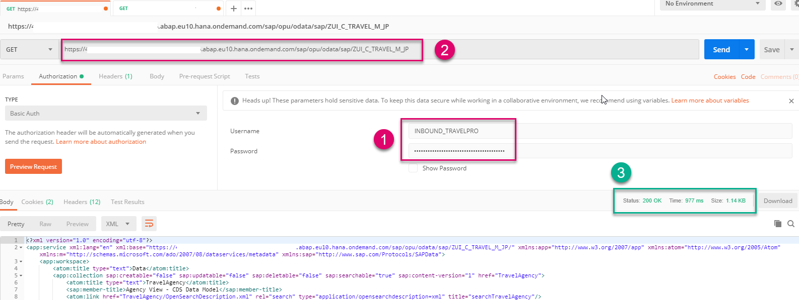

## Prerequisites
- **IMPORTANT**: This tutorial cannot be completed on a trial account
- An existing Service Definition, **`/DMO/TRAVEL_U`**, is available in your **provisioning system**
- Optional: You have installed the [Postman API Platform](https://www.getpostman.com/)

## Details
### You will learn
  - How to expose an OData service for external consumption, using a **Service Binding**
  - How to make the provisioning system available for connection from other ABAP systems
  - How to test your service URL in Postman (optional)

  This involves some overhead for one consumer; however, the advantage is that you can add several consumer systems, or users (for example, with different authentication) pointing to the same HTTP service, wrapped in the same Communication Scenario.

  !

---

[ACCORDION-BEGIN [Step 1: ](Create inbound Communication Scenario)]
1. In your provisioning system, select your package, then choose **New > Other Repository Object...** from the context menu.

    !

2. Add the filter **`scen`**, then choose **Communication Scenario**, then choose **Next**.

    !

3. Add a Name: **`Z_WRAP_TRAVEL_XXX`** and Description, **Inbound for Travel Remote Service**, choose a transport request, then choose **Finish**.

Your Communication Scenario appears in a new editor.

!

You can also see this Scenario in the Project Explorer.

!

[DONE]
[ACCORDION-END]

[ACCORDION-BEGIN [Step 2: ](Add OData service)]
1. On the **Inbound** tab, choose **Add...**.

    !

2. **IMPORTANT**: Choose **Browse**. You cannot simply enter the name. Then add a filter, such as **`Z_BIND_T`**, select your service - with the ending `IWSG`, then choose **Finish**.

    !

3. Your service appears. Choose **Publish Locally**.

    !

[DONE]
[ACCORDION-END]

[ACCORDION-BEGIN [Step 3: ](Create Communication Arrangement)]
1. Open the dashboard for your system in a browser. You can find the URL for the dashboard by selecting your system (that is, ABAP Project in Project Explorer), then choosing **Properties > ABAP Development** from the context menu.

    !

    !

2. From **Communication Management**, choose **Communication Arrangement**. Then choose **New**.

    !

3. Choose your scenario, **`Z_WRAP_TRAVEL_XXX`** from the drop-down list. Accept the default (identical) Arrangement name.

    !

[DONE]
[ACCORDION-END]

[ACCORDION-BEGIN [Step 4: ](Create Communication System)]
1. From the Dashboard Home screen, choose **Communication Systems**.

2. Enter the name of your **Communication Arrangement**, then for **Communication System**, choose **New**.

3. Enter a **System ID** and Accept the default (identical) System name, then choose **Create**.

4. In **Technical Data > General > Host Name**, enter the base URL of your provisioning system **without the protocol** - i.e. the URL should have the form **`<GUID>.abap.<region>.hana.ondemand.com`**. Again, you can find the URL for the dashboard by selecting your system (that is, ABAP Project in Project Explorer), then choosing **Properties > ABAP Development** from the context menu.

5. Leave the other defaults and choose **Save**.

!

[DONE]
[ACCORDION-END]

[ACCORDION-BEGIN [Step 5: ](Create Communication User)]
1. Scroll down to **Users for Inbound Communication**, then create a new user by choosing the **+** icon.

    !

2. Choose **New User** and the **Authentication Method: User name and password**.

    !

3. Enter a name, **`XXX_INBOUND_USER`**, and description, then choose **Propose password**, then choose **Create > OK > Save**. `XXX` is the name of the provisioning system, that is, this system. **IMPORTANT**: Save the proposed password to a text file, since you will need it later.

    !

[DONE]
[ACCORDION-END]

[ACCORDION-BEGIN [Step 6: ](Save Communication Arrangement)]
Save your changes.

Your Communication Arrangement should look roughly like this.
The Service URL / Service Interface = < Base URL of provisioning system > + relative path of your Inbound Service, here `/sap/opu/odata/sap/Z_BIND_TRAVELS_XXX`.

!

[DONE]
[ACCORDION-END]

[ACCORDION-BEGIN [Step 7: ](Optional: Check service URL in Postman)]
1. Open Postman. In the **Authorization** tab, enter your authorization credentials:

    - Type = Basic Auth.
    - Username = `XXX_INBOUND_USER`
    - Password = The password you saved

2. Stick with the default **GET** and paste the complete path of your service, Base URL and relative path, into the input field, then choose **Send**.

    !

3. The response appears in the **Body** field, along with the status **200 OK**.

    !

[DONE]
[ACCORDION-END]

[ACCORDION-BEGIN [Step 8: ](Test yourself)]

[VALIDATE_1]
[ACCORDION-END]

## More information
[Postman: Video Tutorials](https://www.youtube.com/playlist?list=PLM-7VG-sgbtAgGq_pef5y_ruIUBPpUgNJ)

---
