##Prerequisites
- **IMPORTANT**: This tutorial cannot be completed on a trial account
- **Tutorial**: [Create Your First ABAP Console Application](abap-environment-console-application), steps 1-2
- The ABAP Flight Reference Scenario is available in a remote SAP Cloud Platform, ABAP environment instance ( **provisioning system** ). To pull this reference scenario from `Github`, see [ Downloading the ABAP Flight Reference Scenario](https://help.sap.com/viewer/923180ddb98240829d935862025004d6/Cloud/en-US/def316685ad14033b051fc4b88db07c8.html)
- You have read [Developing a UI Service with Access to a Remote Service](https://help.sap.com/viewer/923180ddb98240829d935862025004d6/Cloud/en-US/f4969e551d3049c59715210cbeb4ef56.html) and its [Scenario Description](https://help.sap.com/viewer/923180ddb98240829d935862025004d6/Cloud/en-US/4f539da657fe427f868a95c0bc1b3cfa.html), since this mission is based on this tutorial series

## Details

### You will learn
- How to connect your SAP Cloud Platform, ABAP environment instance ( **client system** ) to a remote ABAP environment instance ( **provisioning system** ) by creating a destination service instance and specific destination
- How to create outbound communication artefacts in your client system, pointing to the provisioning system
- You will later use this connection to get data from the provisioning system. This scenario is useful, for example, if you want to connect two services in a distributed landscape

**Mission Scenario**:

You want to get data that is only available in a remote instance of SAP Cloud Platform, ABAP Environment ( **provisioning system** ) and display it in a second instance ( **client system** ).

You need to:

  1. Create outbound communication artefacts in the **client system**
  2. Create inbound communication artefacts for an OData Service in a **provisioning system**
  3. Create a Service Consumption Model, and save this locally as a `$metadata` XML file; From this you will create proxy artefacts in the client system, representing the remote service, and use this model to generate an **abstract entity**.
  4. Create a Remote Client Proxy
  5. Build a new OData service in the client system, using a CDS custom entity and query implementation class
  6. Finally, display the remote data in Fiori Elements preview in your browser

!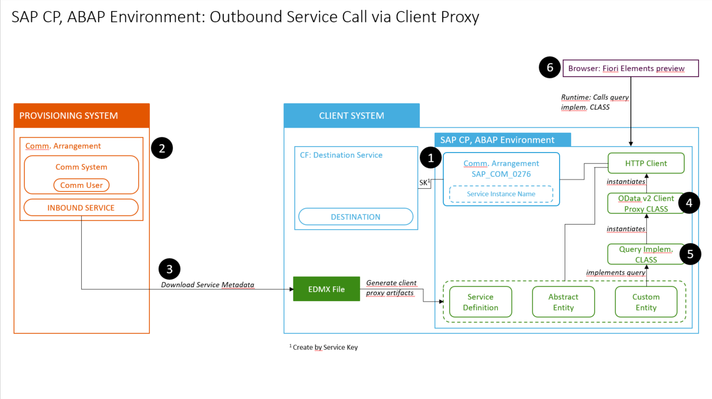

---


[ACCORDION-BEGIN [Step 1: ](Understand communication artefacts)]
The communication scenario `SAP_COM_0276` is predefined by SAP. It allow you to, for example, exchange data between an ABAP Environment instance and an on-premise S/4HANA System, or a third-party API.

A communication arrangement specifies the metadata for a specific communication scenario, such as your host system and the authentication method. This metadata is contained in a service key.  You can then define one or more specific destinations for this arrangement.

For more information, see: [SAP Help Portal: Creating a Communication Arrangement](https://help.sap.com/viewer/a96b1df8525f41f79484717368e30626/Cloud/en-US/7c1b45781c6f4d9ca23177b61805d179.html)

[DONE]
[ACCORDION-END]


[ACCORDION-BEGIN [Step 2: ](Create a Cloud Foundry destination service instance)]
1. In SAP Cloud Cockpit: Navigate to your Space (such as **Dev**).

    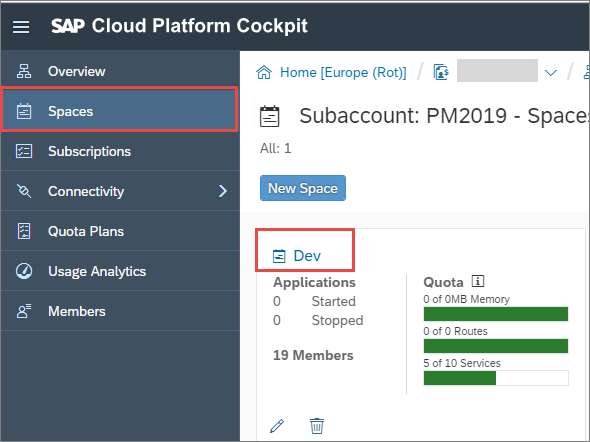

2. Choose **Service Marketplace > Destination**.

    

3. Choose **Instances > New Instance**.

    

4. Accept the defaults and choose **Next > Next > Next.**

5. On the **Confirm** screen, enter the instance name **`Outbound_XXX`**, then choose **Finish**.

    !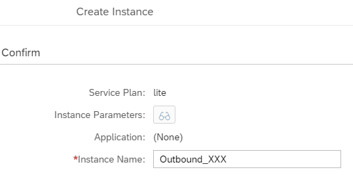

The new instance appears in the list.

!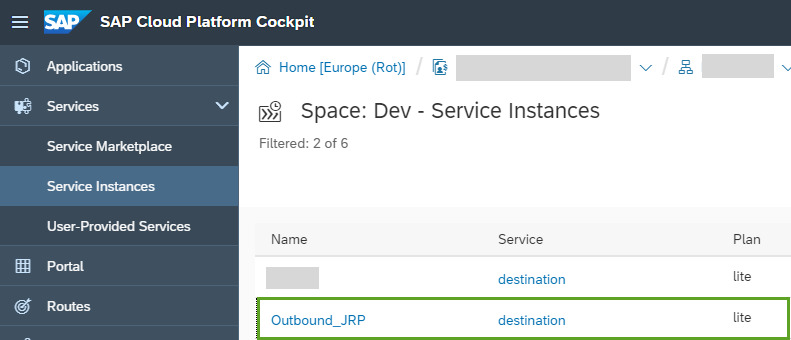

[DONE]
[ACCORDION-END]

[ACCORDION-BEGIN [Step 3: ](Create a new specific destination)]

1. Open your destination, **`Outbound_XXX`**, by double-clicking it, then choose **Destinations > New Destination**:

    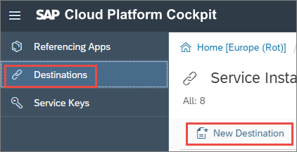

2. Then enter the following (replacing **`XXX`** with your group number). Then choose **Save**.
Take a note of the **Name**.
    - Name  = `A4C_ACCESS_XXX_HTTP`
    - Type = `HTTP`
    - Description = Access A4C to A4C
    - URL = <URL of inbound service **without** relative path (see below)>
    - Proxy type = Internet
    - Authentication = `BasicAuthentication`
    - User and Password = <Select from dropdown list (see below)>

    !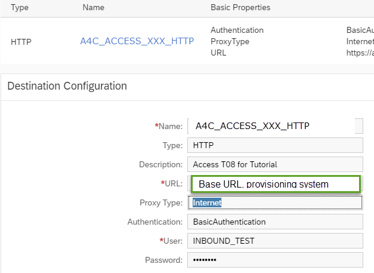

[DONE]
[ACCORDION-END]

[ACCORDION-BEGIN [Step 4: ](Check connection)]
Check the connection:

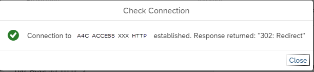

[DONE]
[ACCORDION-END]

[ACCORDION-BEGIN [Step 5: ](Create service key)]

1. Choose **Service Keys > Create Service Key**.

    !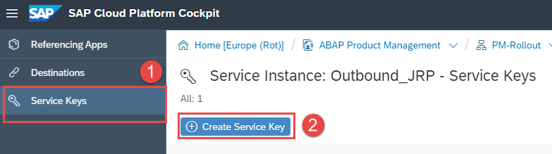

2. Enter the service instance name `Outbound_XXX` and choose **Save**.

3. The Service Key appears. Copy it to a text file, since you will need it later.

[DONE]
[ACCORDION-END]

[ACCORDION-BEGIN [Step 6: ](Open dashboard for ABAP service instance)]
1. Go back to your space, **`Dev`** and choose **Service Instances >   <`your_client_system`>**.

    

2. Choose **Open Dashboard**.

    

The dashboard opens.

!

[DONE]
[ACCORDION-END]

[ACCORDION-BEGIN [Step 7: ](Create communication arrangement)]
1. Choose **Communication Arrangements > New**.

    
    .
    

2. Choose the correct **Communication Scenario** from the drop-down list, that is **`SAP_COM_0276`** (SAP CP Cloud Foundry Service Integration). These scenarios are pre-configured by SAP.

    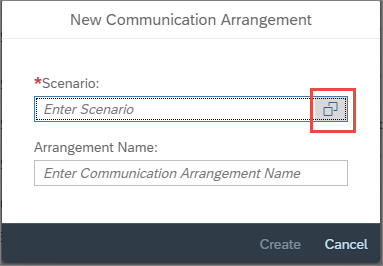
    .
    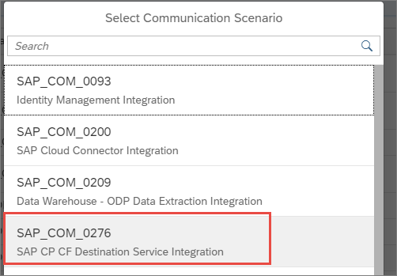

3. Enter the name you chose for your destination service instance in SAP Cloud Cockpit, that is **`OUTBOUND_XXX`**, in upper case. (The names do not have to be the same, but it is then easier to find the correct Arrangement for your destination service, later.)

4. Paste in the service key and choose **Create**.

A communication arrangement is created, along with an identically-named communication system.

[DONE]
[ACCORDION-END]

[ACCORDION-BEGIN [Step 8: ](Add service instance name)]
Still in the **Communication Arrangement**, in the **Additional Properties** panel, replace the default value **`OUTBOUND_XXX`** of the property **Service Instance Name**, with another value, `Outbound-For-Tutorials_XXX`.  

>To avoid confusion, make the Communication Arrangement name and the service instance name different.

[DONE]
[ACCORDION-END]

[ACCORDION-BEGIN [Step 8: ](Check connection in ABAP class)]
1. Create an ABAP class, named **`ZCL_OUTPUT_HTTP_XXX`**.

2. Copy the following code into it.

    ```ABAP

    CLASS ZCL_OUTPUT_HTTP_XXX DEFINITION
      PUBLIC
      FINAL
      CREATE PUBLIC .

      PUBLIC SECTION.
        INTERFACES if_oo_adt_classrun.
      PROTECTED SECTION.
      PRIVATE SECTION.
    ENDCLASS.

    CLASS ZCL_OUTPUT_HTTP_XXX IMPLEMENTATION.
      METHOD if_oo_adt_classrun~main.

         TRY.

            DATA(lo_destination) = cl_http_destination_provider=>create_by_cloud_destination(
              i_name                  = 'A4C_ACCESS_XXX_HTTP'
              i_service_instance_name = 'Outbound-For-Tutorial-XXX'

              i_authn_mode = if_a4c_cp_service=>service_specific ).

            DATA(lo_http_client) = cl_web_http_client_manager=>create_by_http_destination( i_destination = lo_destination ).
            DATA(lo_request) = lo_http_client->get_http_request( ).

            DATA(lo_response) = lo_http_client->execute( i_method = if_web_http_client=>get ).
              out->write( lo_response->get_text( ) ).

          CATCH cx_root INTO DATA(lx_exception).
            out->write( lx_exception->get_text( ) ).

          ENDTRY.

      ENDMETHOD.

    ENDCLASS.

    ```

3. Specify your own provisioning system as the destination, by replacing the defaults:
    - `i_name` = name of destination in SAP Cloud Cockpit, where URL = base URL of provisioning system
    - `i_service_instance_name` = "Service Instance Name" property in Communication Arrangement `SAP_COM_0276_XXX` in the client system Dashboard: points to OAuth Client ID, System ID etc (generated from Service Key for provisioning system). See tutorial [Create an Outbound Communication Arrangement](abap-environment-a4c-outbound-communication)

    ```ABAP

    i_name                  = 'A4C_ACCESS_XXX_HTTP'
    i_service_instance_name = 'Outbound-For-Tutorials_XXX'

    ```

    !    
    !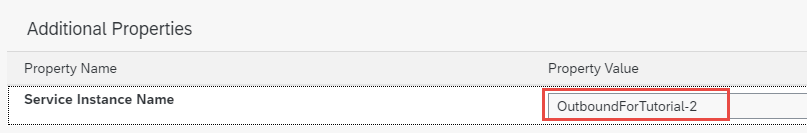

4. Save and activate ( **`Ctrl+S, Ctrl+F3`** ) your changes.

5. Test the class by outputting to the Console ( **F9** ). Your output should look something like this:

    !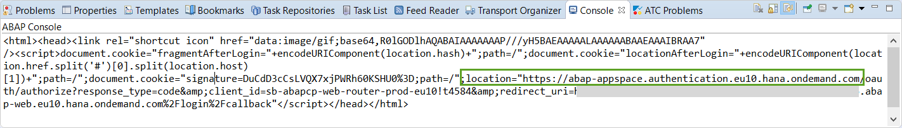

[DONE]
[ACCORDION-END]

[ACCORDION-BEGIN [Step 9: ](Test yourself)]

[VALIDATE_1]
[ACCORDION-END]

## More Information

  - [SAP Help Portal: Using Services in the Cloud Foundry Environment](https://help.sap.com/viewer/65de2977205c403bbc107264b8eccf4b/Cloud/en-US/f22029f0e7404448ab65f71ff5b0804d.html)

  - [Cloud Foundry: Managing Service Keys](https://docs.cloudfoundry.org/devguide/services/service-keys.html)

---
