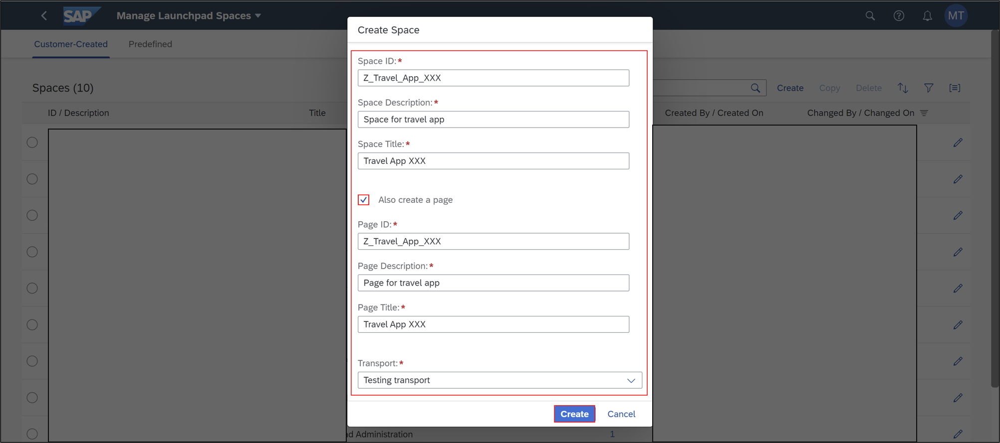
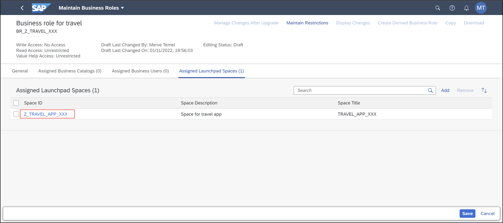

# Integrate List Report into ABAP Fiori Launchpad
<!-- description --> Integrate your list report application into ABAP Fiori launchpad.

## Prerequisites  
- You need an SAP BTP, ABAP environment license.
- You have created the [Travel App Group](group.abap-env-restful-managed) in a licensed system.
- You need to have following business role assigned for your business user `SAP_BR_DEVELOPER` and `SAP_BR_BPC_EXPERT`.
- You need to have business catalog `SAP_CORE_BC_UI_FLD` assigned for the usage of manage launchpad space.
- You need to have business catalog `SAP_CORE_BC_UI` assigned for the usage of manage launchpad settings.
- You need to have business catalog `SAP_CORE_BC_BCT_TRN_MNG_PC` and `SAP_CORE_BC_BCT_TRN_REL_PC` assigned to your user to see the app.
- You need to [enable spaces layout](https://help.sap.com/docs/SAP_S4HANA_CLOUD/4fc8d03390c342da8a60f8ee387bca1a/64a5e1675ce7413791a654d2228a90be.html?locale=en-US&state=TEST&version=2208.502) in SAP Fiori launchpad to see the app tiles, that are added to spaces or pages.

## You will learn  
- How to make use of IAM App and business catalogs
- How to create business roles
- How to pin business catalogs
- How to create spaces and pages

## Intro
Learn how to integrate your list report application into ABAP Fiori launchpad.

---
### Make use of existing IAM App and business catalog

  1. Open ADT, select your package `ZTRAVEL_APP_XXX` and open your IAM App `ZTRAVEL_IAM_XXX`. Add the UI5 application ID to your IAM app and publish it.

    

      If you don't have any IAM App created yet. Please create an IAM App and add the UI5 application to it.

  2. Make use of your business catalog `ZTRAVEL_BC_XXX`.

    

      If you don't have created a business catalog yet, please create one and publish it locally.

### Create business role

  1.  Right-click on your **ABAP system** in the project explorer of ADT and select **Properties**. Click **ABAP Development** and copy the **system URL**.

     

  2. Log in to your ABAP system as an administrator.

     

  3. Select **Maintain Business Roles**.

      

  4. Click **New**.

      

  5. Create new business role:
      - Business Role ID: `BR_Z_TRAVEL_XXX`
      - Business Role Description: Business role for travel

       

      Click **Create**.

  6. Go to **Assigned Business Catalogs** and click **Add**.

       

  7. Search for business catalog `ZTRAVEL_BC_XXX`, select it and click **Apply**.

       

  8. Click **Assign Business Users** and click **Add**.

       

  9. Search your business user, select it and click **Apply** and **OK**.

       

 10. Select **Maintain Restrictions**.

      

 11. Adjust Maintain Restrictions for **Write, Read, Value Help** to **Unrestricted**. Go back.

      

 12. Click **Save**. Now your business catalog and business user is assigned to your business role.

       

### Create transport request or use default transport request

  1. Log in to your system and select the **Export Customizing Transports** tile.

     

  2. Click **Go**.

     

  3. Now you can see all transport request.

      

  4. Click **Create**.

      

  5. Create new transport request:
      - Description: `Transport_Request_XXX`
      - Type: Customizing Request

       

      Click **Create**.

  6. Now you can see an error message. You can only create new transport requests, if there is no default transport request. If there is already a default transport request, then you have to make use of it. Remember the transport request ID for later use.

       

  7. Now cancel and go back to the transport request overview and select the default transport request. You can identify it via ID or the transport category.

       

  8. In your default transport request you can create a new task. Click **Create**.

       

  9. Create a new task:
     - Description: `Transport_Task_XXX` and select the owner.

       

 10. In the description field, search for your user and select it.

      

 11. Click **Create**.

      

### Alternative 1: Manage launchpad spaces and assign business role

Option 1:

  1.  Select the **Manage Launchpad Spaces** tile.

     

  2. Click **Create**.

     

  3. Create new space and page:
       - Space ID: `Z_TRAVEL_APP_XXX`
       - Space description: Space for travel app
       - Space title: Travel App XXX
       - Page ID: `Z_TRAVEL_APP_XXX`
       - Page description: Page for travel app
       - Page title: Travel App XXX
       - Transport: testing transport

      

      Click **Create**.

  4. Check your result.

      

  5. Select **Transports** to check your transport request and click **Save**.

      

  6. Go back to the SAP Fiori homepage and select the **Maintain Business Roles** tile.

      

  7. Search for your business role **`BR_Z_TRAVEL_XXX`** and select it.

      

  8. Click **Edit** and select **Assigned Launchpad Spaces**.

      

  9. Click **Add**.

      

 10. Select **Use Existing Space** and select your space.

      

 11. Search for your space `Z_TRAVEL_APP_XXX` and select it.

      

 12. Check your result and click **Assign Space**.

      

 13. Check your result and click **Save**.

      

 14. Open the Manage Launchpad Pages tile.

      

 15. Select your page `Z_TRAVEL_APP_XXX`.

      

 16. Select **Page Content** and click **Edit**.    

      

 17. Add a description to your section tile, select your business catalog and click **Add** and **Save**.

      

 18. Check your result. Click **Page Preview**.

      

 19. Check the result in the preview.

      

 20. Select your user and **Settings**.

      

 21. Select **Spaces and Pages** and check **Use Spaces**.

      

 22. Select **Travel App XXX** to see your application.

       

### Alternative 2: Assign and manage launchpad spaces

Option 2:

  1. Select the **Maintain Business Roles** tile.

       

  2. Click **Edit** and select **Assigned Launchpad Spaces**.

       

  3. Click **Add**.

      

  4. Select **Create New Space**.

      

  5. Add Launchpad Space:
       - Assign Space to Business Role: Create New Space
       - Space ID: `Z_TRAVEL_APP_XXX`
       - Space description: Space for travel app
       - Space title: Travel App XXX

      Check **Create Page from Business Catalogs and Groups**.

       

      Click **Create and Assign Space**.

  6. Click **Save**.

       

  7. Select your space.

      

  8. Select **Transports**.

      

  9. Check your transport.

      

 10. Open the Manage Launchpad Pages tile.

      

 11. Select your page `Z_TRAVEL_APP_XXX`.

      

 12. Select **Page Content** and click **Edit**.    

      

 12. Add a description to your section tile, select your business catalog and click **Add** and **Save**.

      

 13. Check your result. Click **Page Preview**.

      

 14. Check the result in the preview.

      

 15. Select your user and **Settings**.

      

 16. Select **Spaces and Pages** and check **Use Spaces**.

      

 17. Select **Travel App XXX** to see your application.

       

### Release transport task (Optional)

If you want to release your transport task, do following:

1. Select the **Export Customizing Transports** tile.

       

  2. Click **Go**.

       

  3. Select your transport request.

      

  4. Select your transport task.

      

  5. Check your objects.

      

  6. Go back.

      

  7. Select your transport task and select execute. For testing select simulate.

      

### Release transport request (Optional)

If you want to release your transport task, do following:

1. Select the **Export Customizing Transports** tile.

       

  2. Click **Go**.

       

  3. Select your transport request.

      

  4. Select your transport task and select execute. For testing select simulate.

      

  5. Go back to your transport request, select it and click **Release > Execute** to transport it.

      

### Test yourself

---
