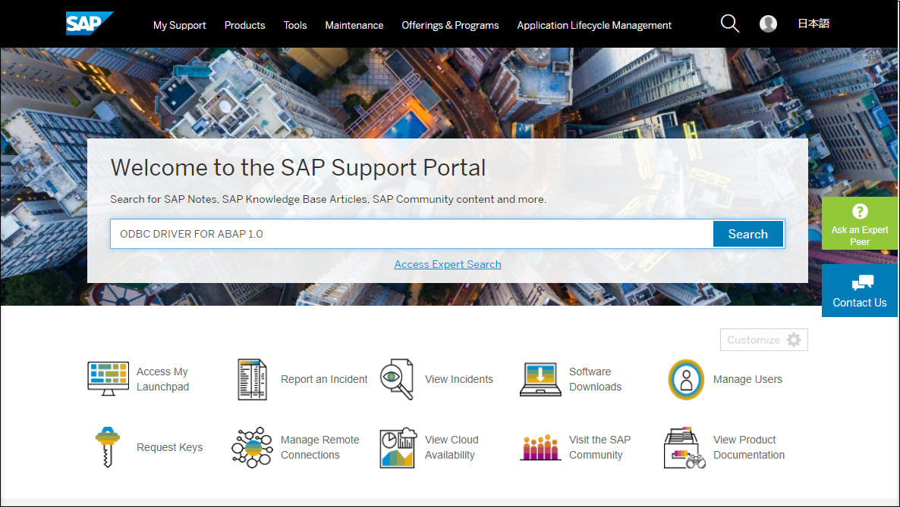
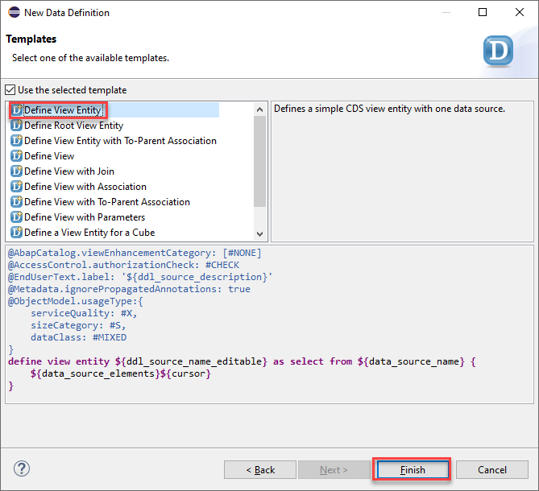
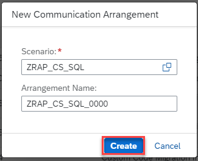
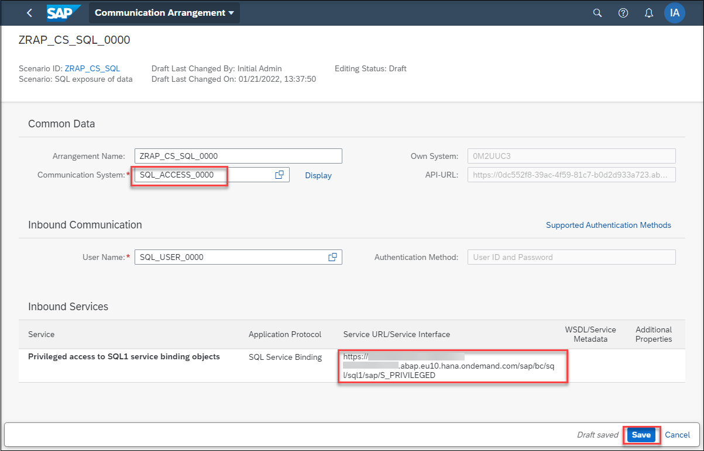

# Using ODBC driver for SQL Service
<!-- description --> Consuming CDS View Entities Using ODBC-Based Client Tools

## Prerequisites
 - You need the standard developer authorization profile to create ABAP development objects.
 - A 64bit Excel version since the ODBC driver for ABAP is a 64bit driver.


## You will learn
  - How to create a service definition and an SQL-typed service binding
  - How to create a communication scenario with object privileges
  - Install the ODBC driver on Windows
  - Create an ODBC data source
  - Open an ODBC connection in Microsoft Excel and access data

## Intro
>Always replace `####` with your initials or group number.
---
You will learn how you can access CDS view entities in an ABAP system using SQL via ODBC. Open Database Connectivity (ODBC) is a standard API for accessing databases.

### Overview

To access CDS view entities in an ABAP system via ODBC, these entities first need to be properly exposed in the back–end system before accessing them via the **ODBC driver for ABAP** in an ODBC application. The ODBC application could be any client tool capable of loading an ODBC driver or it could be a program written in a program language capable of using an ODBC driver (e.g. C, C++, python, node.js, PHP). In this tutorial, we will show the Microsoft Excel use case on Windows. The **ODBC driver for ABAP** itself is available on Windows and Linux.


### Install ODBC driver on Windows


  1. To install the **ODBC driver for ABAP**, you need to visit the SAP Support Portal <https://support.sap.com/en/index.html>

  2. After this you may need to log on and then you can search for components **ODBC DRIVER FOR ABAP 1.0**.

    

  3. Open **ODBC driver for ABAP: Initial delivery** and then click download icon in the next page.

    

      

  4. Now you need to choose the right option for Windows to download.

    

  5. Now you need to download **SAPCRYPTOLIB**. Click on this [link] (https://launchpad.support.sap.com/#/softwarecenter/template/products/%20_APP=00200682500000001943&_EVENT=DISPHIER&HEADER=Y&FUNCTIONBAR=N&EVENT=TREE&NE=NAVIGATE&ENR=01200615320100002625&V=MAINT&TA=ACTUAL&PAGE=SEARCH/SAPCRYPTOLIB)

    open the **COMMONCRYPTOLIB 8** and download the last version for Windows.

    

      

  6. In addition you may need to download **SAPCAR** on Software Center to be able to unpack the SAP files.

  7. Open **Command Prompt** in your windows start menu and unpack your SAP files with this command, you need to address your downloaded **SAPCAR** file and then choose a directory as your ODBC driver location and unpack the SAR files there.

    ```
    C:\Users\D-number\Downloads\sapcar.exe -xvf C:\Users\D-number\Downloads\Your downloaded ODBCforABAP.SAR file
    ```

      

    ```
    C:\Users\D-number\Downloads\sapcar.exe -xvf C:\Users\D-number\Downloads\Your downloaded SAPCRYPTOLIBP.SAR file
    ```

      

  8. After this, you will see at least the following files in your ODBC driver directory:

    - `ODBC_driver_for_ABAP_x64u.msi`
    - `sapcrypto.dll`

  9. Start the Windows installer file to install the ODBC driver for ABAP

    

    Click **Next** and accept the license agreement. On the next screen, you can choose **Typical** as installation type and complete the installation.

  10. The installed files are in `<SystemDrive>:\Program Files\SAP\ODBC driver for ABAP` .

    The ODBC driver is now ready to be used in ODBC data sources.


### Create two test tables


You need first to create and fill two demo tables **ZORDERS** and **ZORDERITEMS** in ADT:

  1. Open ADT and login to your ABAP System.
    If you do not have a package, create a new one like `Z_PACKAGE_SQL_####`.

  2. Right-click your package and choose **New** > **Other ABAP Repository Object**.

      

  3. Choose **Dictionary** > **Database Table** and click **Next**.

      

  4. Enter the following name and description:

    - Name:`ZORDERS_####`
    - Description: `orders table`

    and click **Next**.

      

  5. Select a transport request and click **Next**. Your created Table will be opened.

      

  6. To define the structure of the table copy the code below in your table definition.

    ```ZORDERS_####
      define table zorders_#### {
      key id       : abap.numc(10) not null;
      creationdate : abap.datn;

    }
    ```

    

  7. Save and activate your changes.

      

  8. Create another database table with following name and description:

    - Name:`ZORDERITEMS_####`
    - Description: `order items`

    

  9. Define the second table with this code:

    ```ZORDERITEMS_####
      define table zorderitems_#### {
      key orderid : abap.numc(10) not null;
      key pos     : abap.int4 not null;
      item        : abap.char(100) not null;
      amount      : abap.int4 not null;
    }
    ```

    

  8. Save and activate your changes.

      


### Fill two test tables


  1. Now you need to fill your test table with some test data.

    Right-click your package and choose **New** > **ABAP Class**.

      

  2. Enter the following name and description:

    - Name:`ZCL_FILL_ORDERS_####`
    - Description: `fill orders class`

    Add `IF_OO_ADT_CLASSRUN` as an interface

    and click **Next**.

      

  3. Select a transport request and click **Next**.

  4. Copy the method code below in your class to fill both tables with some test data. Do not forget to replace `####` with your number.

    ```zcl_fill_orders_####

    class zcl_fill_orders_#### definition
    public
    final
    create public .

    public section.
    interfaces if_oo_adt_classrun .
    protected section.
    private section.
    endclass.

    class zcl_fill_orders_#### implementation.

    method if_oo_adt_classrun~main.

        data: lt_orders type table of zorders_####.
        delete from zorders_####.
        lt_orders = value #(
          ( id = '1' creationdate = '20210801' )
          ( id = '2' creationdate = '20210802'  )
          ( id = '3' creationdate = '20210803' )
        ).
        insert zorders_#### from table @lt_orders.
        out->write( sy-dbcnt ).

        data: lt_orderitems type table of zorderitems_####.
        delete from zorderitems_####.
        lt_orderitems = value #(
          ( orderid = '1' pos = '1' item = 'Apple' amount = '5' )
          ( orderid = '1' pos = '2' item = 'Banana' amount = '5' )
          ( orderid = '1' pos = '3' item = 'Orange Juice' amount = '2' )

          ( orderid = '2' pos = '1' item = 'Orange' amount = '10' )
          ( orderid = '2' pos = '2' item = 'Apple' amount = '5' )

          ( orderid = '3' pos = '1' item = 'Bottle Water' amount = '5' )
        ).
        insert zorderitems_#### from table @lt_orderitems.
        out->write( sy-dbcnt ).

      endmethod.
    endclass.
    ```

  5. Save and activate your class and press **F9** to run the class and fill your tables.

    

  6. Go back to your tables and check them with right click each table > **Open With** > **Data Preview**

    

      


    


### Create CDS view entities for tables


  1. Right click on the first table and select **New Data Definition**

    

  2. Enter the following name and description:

    - Name:`ZORDERSVIEW_####`
    - Description: `Orders`

    click **Next**.

    

  3. Select a transport request and click **Next**.

  4. Choose **Define View Entity** and click **Finish**

    

     

  5. Create another data definition entity for the second table with following name and description:

    - Name:`ZORDERITEMSVIEW_####`
    - Description: `Order Items`

    

  6. Save and activate your data definitions.


### Create Service Definition and SQL-typed Service Binding


  Now you need a service definition and a corresponding SQL-typed service binding to define that the new CDS view entities are exposed in a SQL service.

  1. Right click one of the `ZORDERSVIEW_####` and choose **New Service Definition**.

    

  2. Enter following values:

    - Name:`Z_SERVICE_DEF_SQL_####`
    - Description: `Service Definition`

    Click **Next**.

    

  3. Select a transport request and click **Finish**.

  4. The created service definition will be opened. Add the second view and add alias names for both view entities.

    

  5. The newly created service definition can now be used in a service binding. You need a service binding of type SQL - Web API to access the objects using ODBC later.

    Right click the service definition and select **New Service Binding**

    

  6. Enter following values:

    - Name:`ZORDERS_####`
    - Description: `Orders`
    - Binding Type: `SQL - Web API`

    Click **Next**.

    

  7. Select a transport request and click **Finish**.

  8. As you will see later, the service binding name, in your case `ZORDERS_####`, will act as the schema name for external ODBC consumers. Do not forget to activate the service binding.

    


### Create Communication Scenario


To access the service binding, you need a technical user in the ABAP system.
Therefore, you will now to create a communication scenario and a communication arrangement in the SAP BTP ABAP Environment system.

  1. Right-click your package and choose **New** > **Other ABAP Repository Object** > **Communication Scenario**

    

  2. Enter following values:

    - Name:`Z_COM_SCENARIO_SQL_####`
    - Description: `Communication Scenario for SQL test`

    

    Click **Next**.

  3. Select a transport request and click **Finish**.

  4. your communication scenario will be opened. go to the **Inbound** tab.

    

    Since you want to use user/password authentication in your Windows Excel test case, select **Basic** as **Supported Authentication Methods**.

  5. In section **Inbound Services**, choose the **Add…** button and enter `S_PRIVILEGED_SQL1` as **Inbound Service ID** and click **Finish**.

    The `S_PRIVILEGED_SQL1` inbound service is a pre-configured service for the privileged access to CDS view entities, that is, no DCL is applied. (DCL stands for Data Control Language. It provides an access control mechanism to restrict the results returned by the CDS view from the database according to conditions)

    

  6. Now you need to add additional authorizations to enable access to your service binding. Go to the tab **Authorizations**. Below **Authorization Objects**, press the **Insert** button.

    

  7.  Enter `S_SQL_VIEW` in **Authorization Object** field and click **OK**.

    

  8. Select the added authorization object and fill out the authorizations in the details:

      - `SQL_SCHEMA`: `ZORDERS_####`

      - `SQL_VIEW`: `*`

      - `SQL_VIEWOP`: `SELECT`

    

      

    - `SQL_SCHEMA` must contain the name of the service binding that you want to grant access to.
    - The value * for `SQL_VIEW` means that you allow access to all views in the service definition that is attached to the service binding ZORDERS.
    - Since currently only read only access is allowed, `SQL_VIEWOP=SELECT` is mandatory.

  9. Save your entries and press the **Publish Locally** button to publish it in the current development system.

      


### Create a Communication System


  The final preparation tasks in the ABAP system cannot be performed in ADT and need to be done in the administration UI of the system.

  1. Right-click your Project, open **Properties**. In the popup select **ABAP Development** and select **System URL**.

    

      

  2. Log in with your username and password.

  3. Open **Communication System** under **Communication Management**. Click **New**.

    

      

  4. Choose a name for your communication system like **SQL_ACCESS_####** and click **Create**.

    

  5. In communication system, mark it as **Inbound Only**.

    

  6. Under **Users for Inbound Communication** choose the **+** button.

    

  7. A popup will be opened. Choose **New User**.

    

  8. Create a new user with a name and description, and choose **Propose Password** to get a password. Note down this user and password for later. Then click **Create**.

    

  9. In the next step click **OK** to create the user.

    

    The user is now listed in the section **Users for Inbound Communication**.

  10. Choose **Save** to finish the creation of the communication system.

    


### Create a Communication Arrangement


  1. Go back to the administration UI and select **Communication Arrangement**.

    

  2. Select **New**.

    

  3. In the popup choose `ZRAP_CS_SQL` in **Scenario** field. Change the **Arrangement Name** to `ZRAP_CS_SQL_####` and click **Create**.

    

  4. To complete the link between communication scenario and communication system, you need to add your communication system **SQL_ACCESS_####**, and the system will automatically add the user **SQL_USER_####**. Before Saving your changes, you need to note down the service URL, `https://<hostname>/sap/bc/sql/sql1/sap/S_PRIVILEGED`.

    


### Create an ODBC data source


  1. Launch the Windows ODBC data source administrator tool from your Windows **Start**. The **ODBC Data Sources (64bit)** tool is part of a standard Windows installation.

    

     

  2. In this tool, you can create ODBC data sources and assign a data source name (DSN) to a newly created data source. Either choose the **User DSN** or **System DSN** tab, choose **Add**,.

    


  3. Choose the **ODBC driver for ABAP** as ODBC driver. Choose **Finish**.

    

  4. This will start the DSN setup dialog of the ODBC driver for ABAP.

    

     In this dialog, choose a DSN and fill in a few driver-specific parameters as following:

    | Code | Explanation |
    | ------------- | ---------- |
    | Data Source Name | `SQLTEST_####` |
    | Hostname | The first part of the service URL that you saved from your communication arrangement `yourSystemId`.abap.eu10.hana.ondemand.com |
    | Port Number | 443 |
    | Client | 100 |
    | User Type | alias |
    | Language: EN |
    | Service Path | The second part of the service URL that you saved from your communication arrangement `/sap/bc/sql/sql1/sap/S_PRIVILEGED` |
    | Type Mapping | semantic |
    | Crypto Library | Full file name incl. path of the SAP Cryptographic Library  <path>\sapcrypto.dll (Windows) |
    | Additional Attributes | TrustAll={true}; |

    Then click **OK**.

    

      


### Open an ODBC connection in Microsoft Excel


  After creating a DSN, you can use this in an ODBC client tool of your choice. For simplicity reasons, we have chosen Microsoft Excel as an example for this tutorial.

  1. Start Excel and got to **Data** > **Get Data** > **From Other Sources** > **From ODBC**

    

  2. In the following popup, enter your newly defined DSN and click **OK**.

    

  3. In the Database section, Excel will now ask for the user and password to log on to the ABAP system. You need to use the user and password that you noted down when creating the communication system. Click **Connect**

    

  4. The navigator shows all exposed objects in your SQL schema `ZOrders`. You can choose one of the CDS entities and Excel will show a preview of the data content.

    

     

  5. Choose either **LOAD** to load the data into an Excel sheet or you can choose **TRANSFORM DATA** to switch to the power query tool. When you load the data into an Excel sheet, you can always refresh the data if needed.

    

  6. As a last step, you can see that it is possible to execute a free style SQL query on the exposed entities.

    Choose **Data** > **Get Data** > **From Other Sources** > **From ODBC** again in Excel, select your DSN and then click **Advanced Options**. A new control is opened that allows you to enter a SELECT statement directly. In the SELECT statement, you must prefix all view names by your schema name `ZOrders_####`. Apart from this, you can use ANSI-like SQL syntax.

    

     


    ```SQL statement
    SELECT OI.Item , SUM( OI.Amount )
    FROM ZOrders_####.Orders O
    INNER JOIN ZOrders_####.Orderitems OI
    ON O.Id = OI.OrderId
    GROUP BY ITEM

    ```

  7. Click **OK**. The result set will directly show up in an Excel preview window.

    


### Test yourself


---
