## Prerequisites  
- You need an SAP Cloud Platform ABAP Environment [trial user](abap-environment-trial-onboarding) or a license.
- You have finished following tutorial:  [Use `abapGit` to Transform ABAP Source Code to the Cloud](abap-environment-abapgit).

## Details
### You will learn  
- How to create or adapt source code in ABAP instance
- How to open `abapGit` repositories
- How to stage and commit ABAP development objects

---
[ACCORDION-BEGIN [Step 1: ](Create or adapt source code in ABAP instance)]

  1.  Open **ABAP Development Tools** and logon to your ABAP system.

      Add ABAP development object to your already existing package **`TESTABAPGIT`** (e.g. ABAP class).

      Therefore right-click on **Classes** and select **New ABAP Class**.

      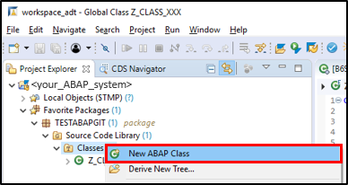

  2. Create a **package**:
      - Name: **`Z_Class_YYY`**
      - Description: **new class**

      

       Click **Next >**.

  3. Click **Finish**

      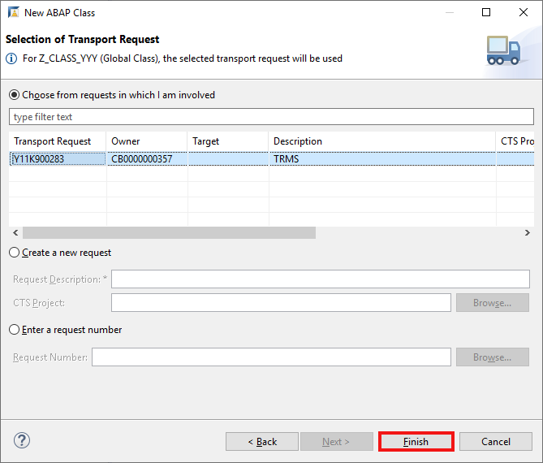

  4. Implement your newly created class.

      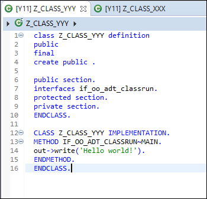

     **Save and activate**.

[DONE]
[ACCORDION-END]

[ACCORDION-BEGIN [Step 2: ](Open abapGit repositories)]

  1. Select your **ABAP system** in the Project Explorer and select **Windows** > **Show View** > **Other** to open the `abapGit` repositories.

      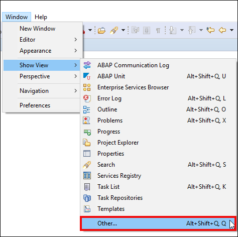

  2. Search for **`abapGit repositories`**, select it and click **Open**.

      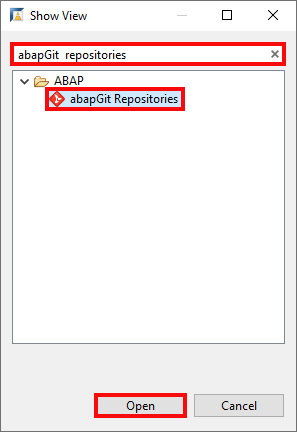

[DONE]
[ACCORDION-END]

[ACCORDION-BEGIN [Step 3: ](Stage and commit ABAP development objects)]

  1. Right-click on your package **`TESTABAPGIT`** and click **Stage and Push**.

      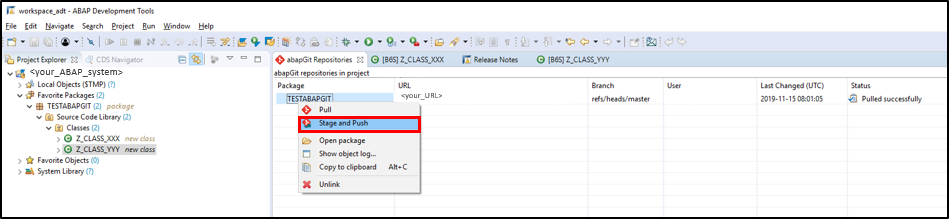

  2. Enter your repository credentials in the popup and click **OK**.

      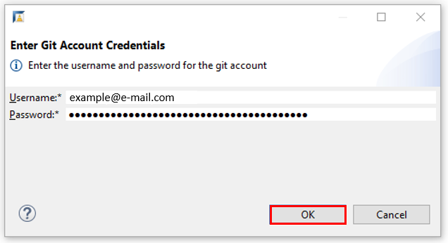

  3. In the staging view you will see a list of changed, created or deleted ABAP development objects which can be transferred to your repository. Furthermore the icon of the respective file indicated whether a file was created, modified or deleted.

      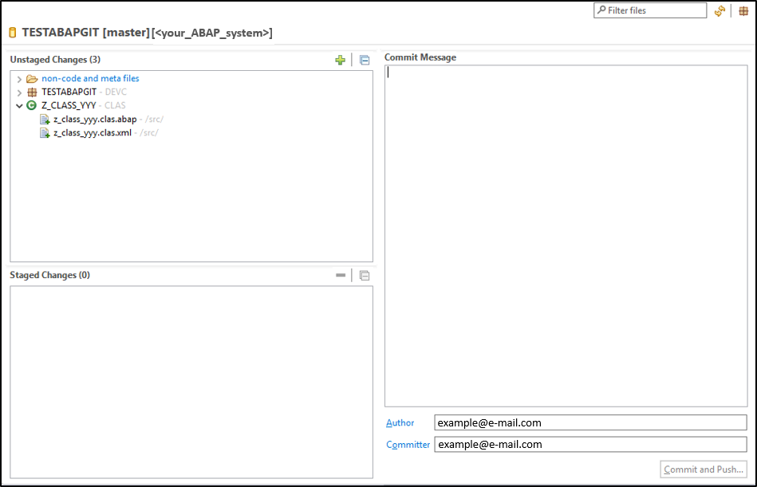

  4. ABAP development objects which should staged can be selected by drag and drop from the `unstaged` box to the staged box or by clicking on the + button.

      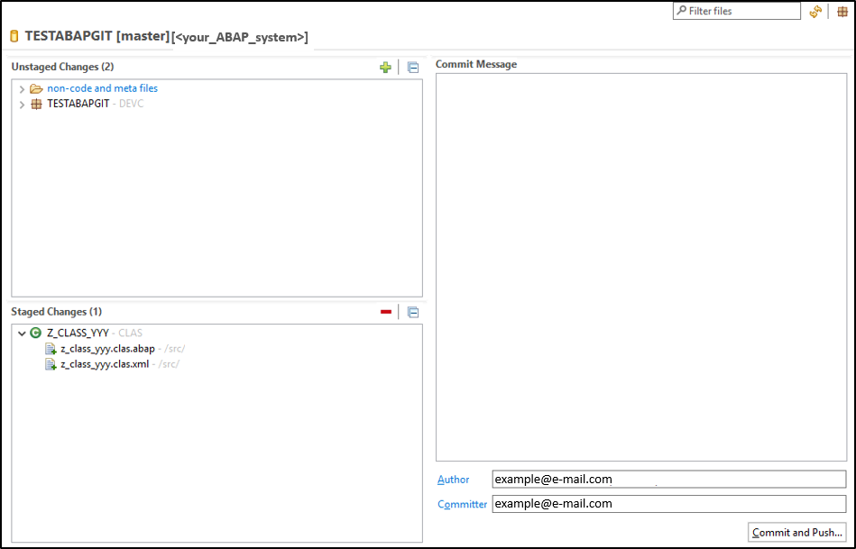

  5. Enter your commit message and click **Commit and Push**.

      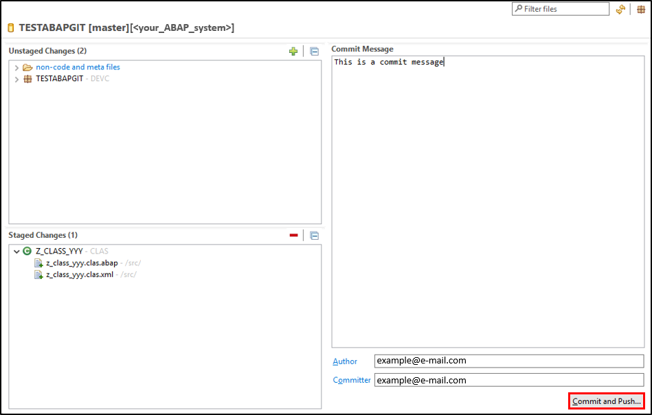

  6. Click **OK**.

      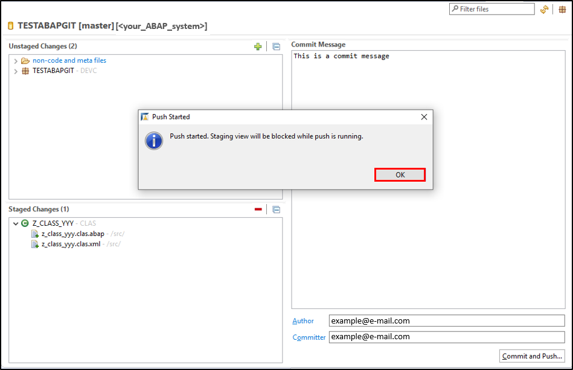

  7. Check your result.

      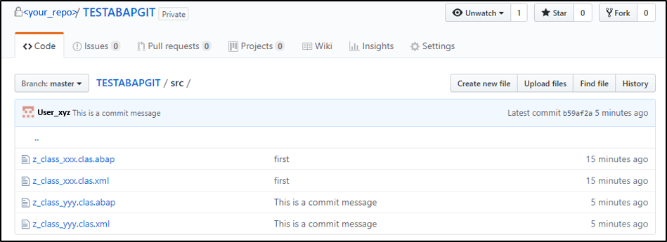

    The staged objects are transferred to your repository.

[DONE]
[ACCORDION-END]

[ACCORDION-BEGIN [Step 4: ](Test yourself)]

[VALIDATE_1]
[ACCORDION-END]
---
