## Prerequisites  
 - `github.com` or similar account
 - SAP Cloud Platform ABAP Environment system and user with developer role
 - `on-premise` system with user and required root CA of `Git` server (STRUST)
 - Download Eclipse Photon or Oxygen and install ABAP Development Tools (ADT). See <https://tools.hana.ondemand.com/#abap>.
 - For More information see [Working with abapGit](https://help.sap.com/viewer/65de2977205c403bbc107264b8eccf4b/Cloud/en-US/d62ed9d54a764c53990f25f0ab6c27f9.html)

## Details
### You will learn  
  - How to create content in an `on-premise` system and push it to `Git` repository
  - How to import the content from `Git` repository into a SAP Cloud Platform ABAP Environment instance

---

[ACCORDION-BEGIN [Step 1: ](Create a Git repository)]
  1. Log in to your `github.com` account.

  2. Create a new repository by clicking on **New repository** button.

      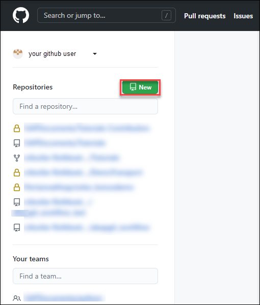

  3. Enter a name and description and check the checkbox **Initialize this repository with a README** and click **Create repository**.

      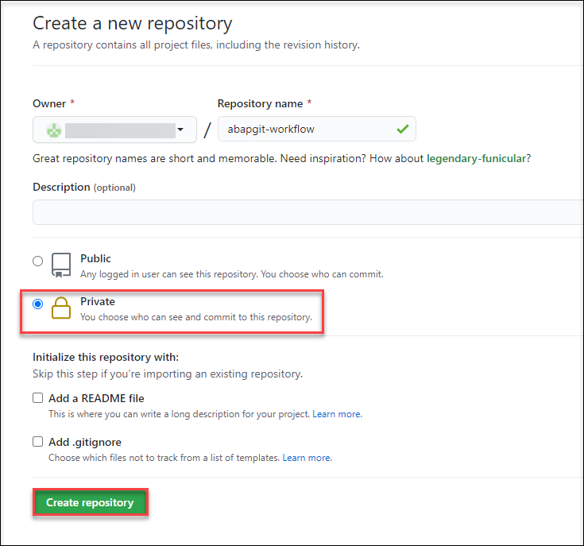

  4. Our repository is all set up for now.

      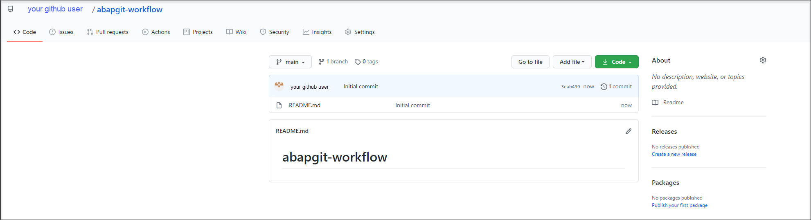

[DONE]
[ACCORDION-END]

[ACCORDION-BEGIN [Step 2: ](Install and set up abapGit)]

  As next you need to install `abapGit` on our `on-premise` system.

> **Important!** Arrange with your system administrator before you install `zabapgit`.

  1. Copy the content of the latest build from the program `zabapgit`, that you will find in the `abapGit` repository `https://github.com/larshp/abapGit`.

  2. Open your `on-premise` system of your choice and create a new program and paste the content from step 1 into it.

  3. Activate and execute the program.

  4. If you have installed `abapGit` before, you need to go to SE38, search for **ZABAPGIT** program and press **Execute**.

      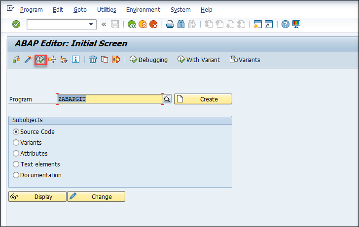

  5. Now `abapGit` is installed and open.
      

  You can find all installation information under `https://github.com/larshp/abapGit` > **Documentation/Guides**.

[DONE]
[ACCORDION-END]

[ACCORDION-BEGIN [Step 3: ](Push ABAP source from on-premise to Git repository)]

> **Important!** Logon with language `EN` to your `on-premise` system. SAP Cloud Platform ABAP Environment just supports `EN` at the moment. Otherwise you'll get problem during import.

  1. Click on **Clone or download** and copy the URL of your repository.

      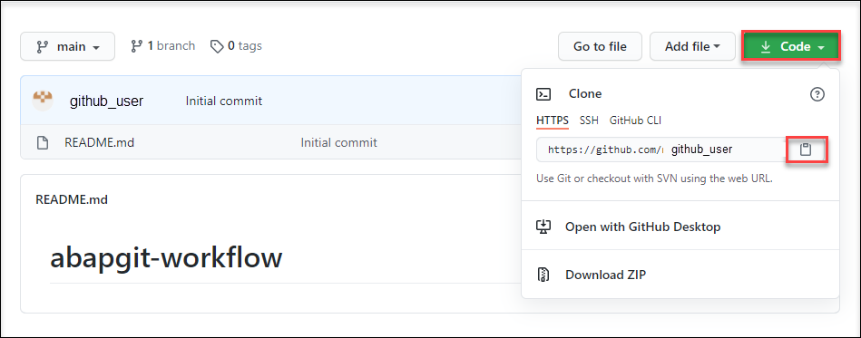

  2. Then go into transaction `ZABAPGIT` and press the **+ Online** button.

      

  3. Paste the repository URL and click on **Create Package**.

      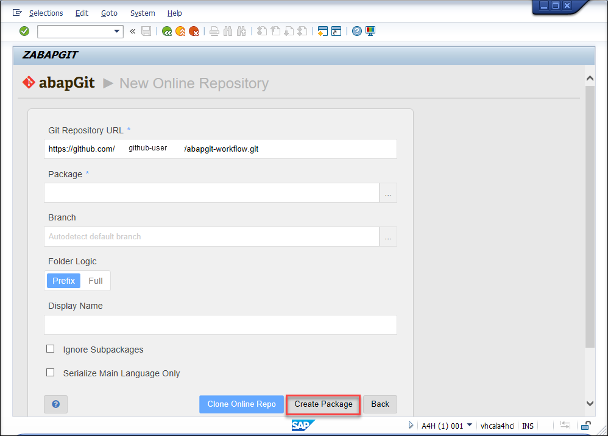

  4. Enter a name and description and LOCAL as **Software Component** and click on **Continue**.

      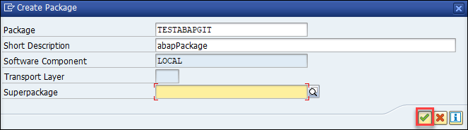

  5. Click on **OK**.

      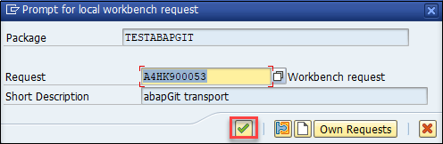

  6. You will see the cloned `Git` repository in `abapGit`.

      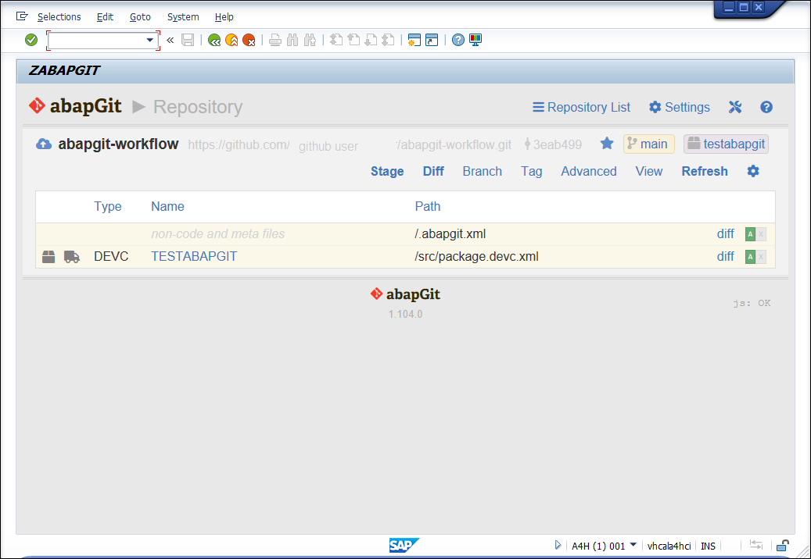

[DONE]
[ACCORDION-END]

[ACCORDION-BEGIN [Step 4: ](Add ABAP development objects)]

  1. Open your `on-premise` system in ADT in Eclipse and find your created Package in the last step.

  2. Add ABAP development objects to your package (e.g. ABAP class).

      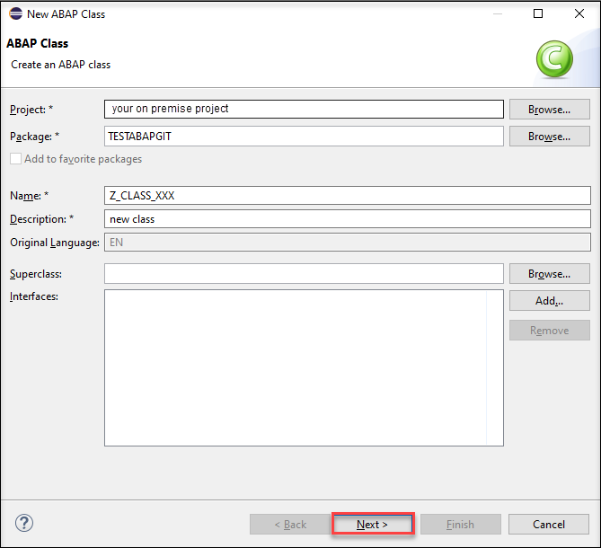

> **Important!** Not supported ABAP object types will be ignored during import.

[DONE]
[ACCORDION-END]

[ACCORDION-BEGIN [Step 5: ](Stage and commit developed objects)]

  1. Go back to the `abapGit` UI and click on **Refresh** to see all developments objects that you created in Eclipse.

      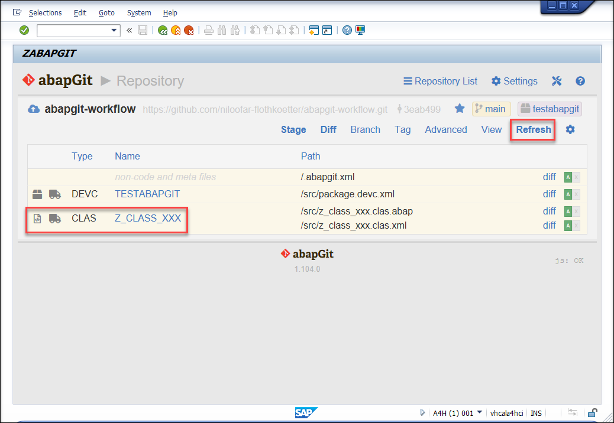

  2. Press **Stage**.

      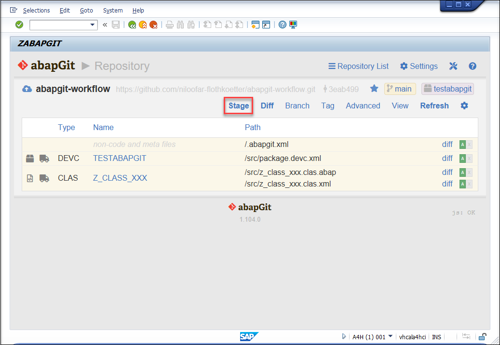

  3. Select single objects to add or **Add all and commit**.

      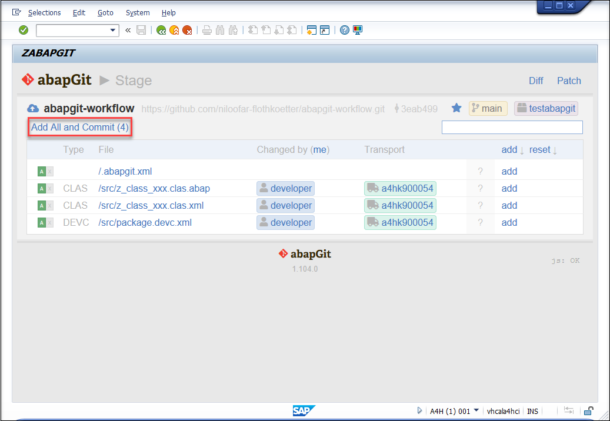

  4. Enter **committer name**, **committer e-mail** and a **comment** and press **Commit**.

      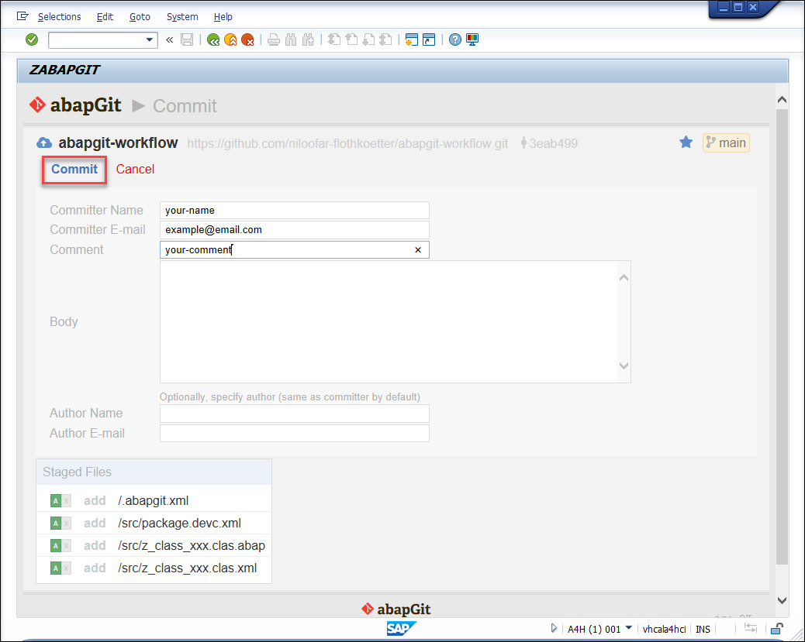

  5. You will be prompted with a credentials popup. Enter your `Git` repository server credentials and click **Execute**.

      

  7. After everything went well, you can see the pushed ABAP objects in your `Git` repository.

      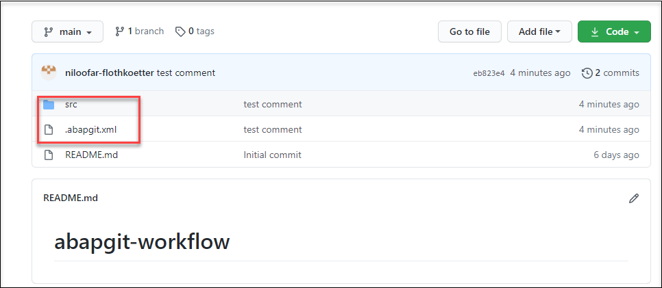

[DONE]
[ACCORDION-END]

[ACCORDION-BEGIN [Step 6: ](Install abapGit Eclipse plugin)]

  1. Open your Eclipse with installed ADT.

  2. In Eclipse, choose in the menu bar **Help** > **Install New Software**.

      

  3. Add the URL `http://eclipse.abapgit.org/updatesite/`and press enter to display the available features. Select **`abapGit`** **for ABAP Development Tools (ADT)** and install the plugin.

      

[DONE]
[ACCORDION-END]

[ACCORDION-BEGIN [Step 7: ](Open abapGit repositories)]

  1. Select your cloud project system in the **Project Explorer** and open the `abapGit` repositories view by opening **Window** > **Show View** > **Other ...**.

      

  2. Expand the category **ABAP** and select **`abapGit Repositories`** and click **Open**

      

[DONE]
[ACCORDION-END]

[ACCORDION-BEGIN [Step 8: ](Clone Git repository into SAP Cloud Platform ABAP Environment)]

  1. Click the clone button (green + button) in the `abapGit` repositories view.

      

  2. Enter your `Git` repository URL and press **Next**.

      

  3. Select **Branch** and a **Package**, where your `Git` repository should be cloned. (If you have no packages, you need to create a new one before) and click **Next**.

      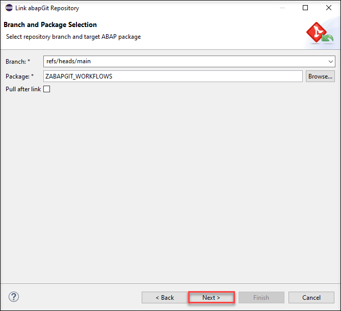

  4. Select a **Transport Request** and click **Finish**.

      

  6. Open the **`abapGit` repositories tab**, right-click on your package and click **pull**.

      

  5. Your imported sources are now available under your package.

      

[DONE]
[ACCORDION-END]

[ACCORDION-BEGIN [Step 9: ](Test yourself)]

[VALIDATE_1]
[ACCORDION-END]

---
