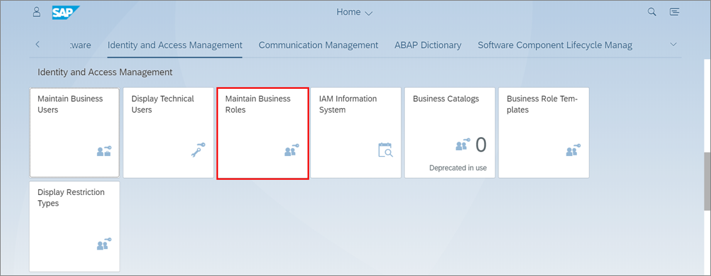
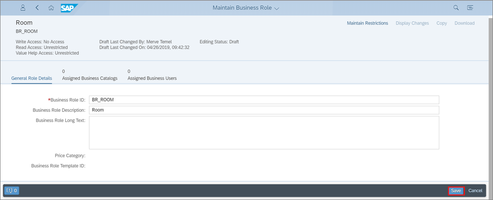
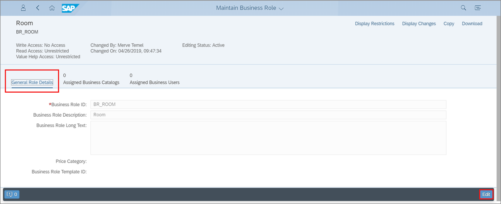
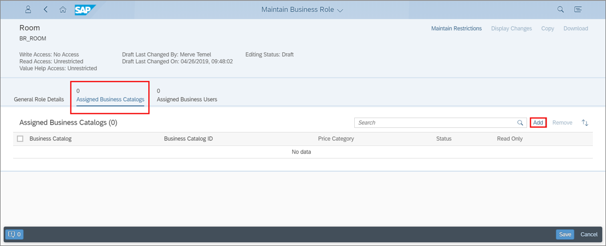
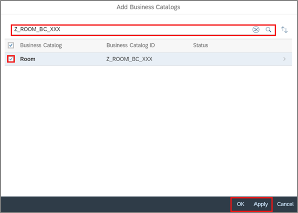
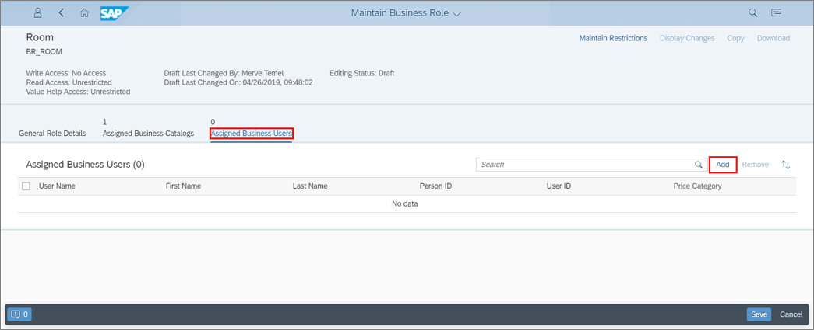
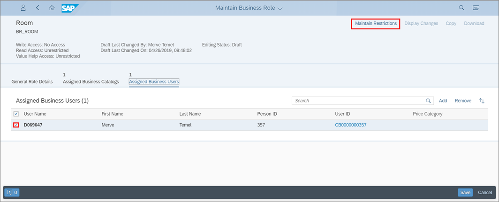
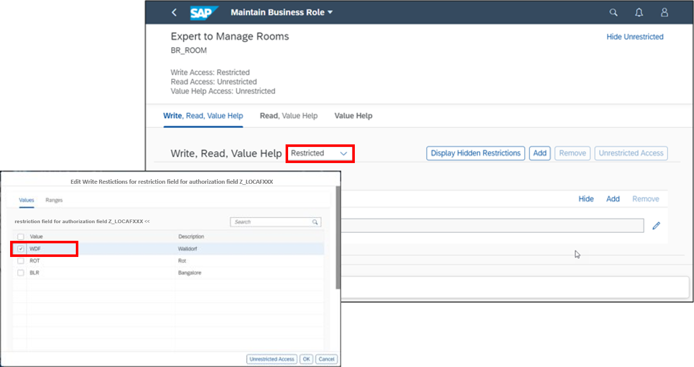
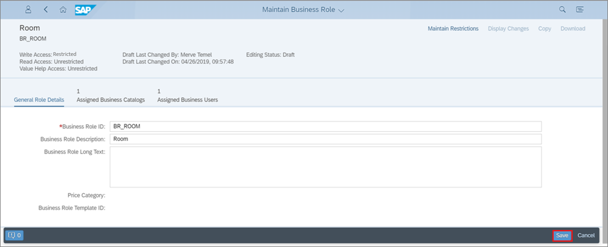

## Prerequisites  
  - You need a SAP BTP, ABAP environment license.
  - ADT version 2.96 or higher

## Details
### You will learn
  - How to create business roles
  - How to add business catalogs
  - How to add business users
  - How to maintain access management

In this tutorial, wherever `XXX` appears, use a number (e.g. `000`).

---

[ACCORDION-BEGIN [Step 1: ](Create business role)]
1. Logon to your ABAP system.

      

2. Search **Identity and Access Management** and select **Maintain Business Roles**.

    

2. Click **New**.

    

3. Create your **business role**:
     - Business Role ID: **`BR_ROOM`**
     - Business Role Description: Room

     Click Save.

    

[DONE]
[ACCORDION-END]

[ACCORDION-BEGIN [Step 2: ](Add business catalog)]
1. Click **General Role Details** and **Edit**.

      

2. Select **Assigned Business Catalogs** and click **Add**.

    

3.  Search for **`Z_ROOM_BC_XXX`**, select **Room** and click **Apply** and **OK**.

       

[DONE]
[ACCORDION-END]

[ACCORDION-BEGIN [Step 3: ](Add business user)]
  1. Select **Assigned Business Users** and click **Add**.

      

  2. Search for your user name, select it and click **Apply** and **OK**.

      

[DONE]
[ACCORDION-END]

[ACCORDION-BEGIN [Step 4: ](Maintain access management)]
  1. Select your user and click **Maintain Restrictions**.
      

  2. Set your write restrictions and click **OK**.

      

  3. Go back to general role details and click **Save**.

      

Save and activate.

[DONE]
[ACCORDION-END]

[ACCORDION-BEGIN [Step 5: ](Test yourself)]

[VALIDATE_1]
[ACCORDION-END]
