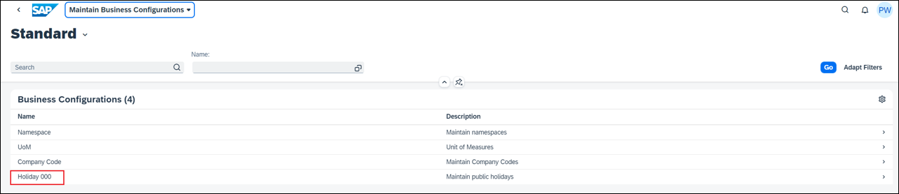
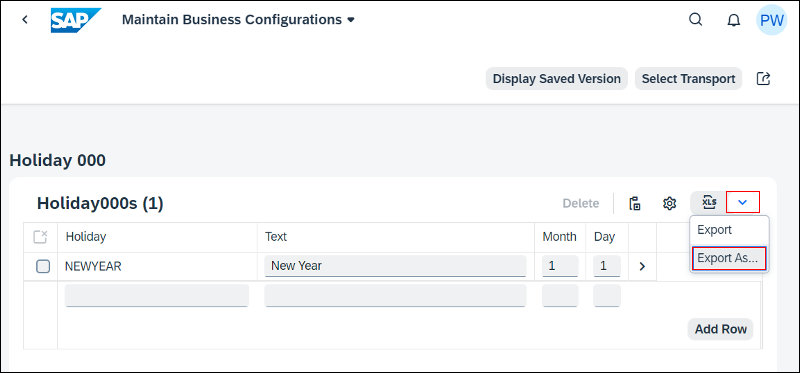
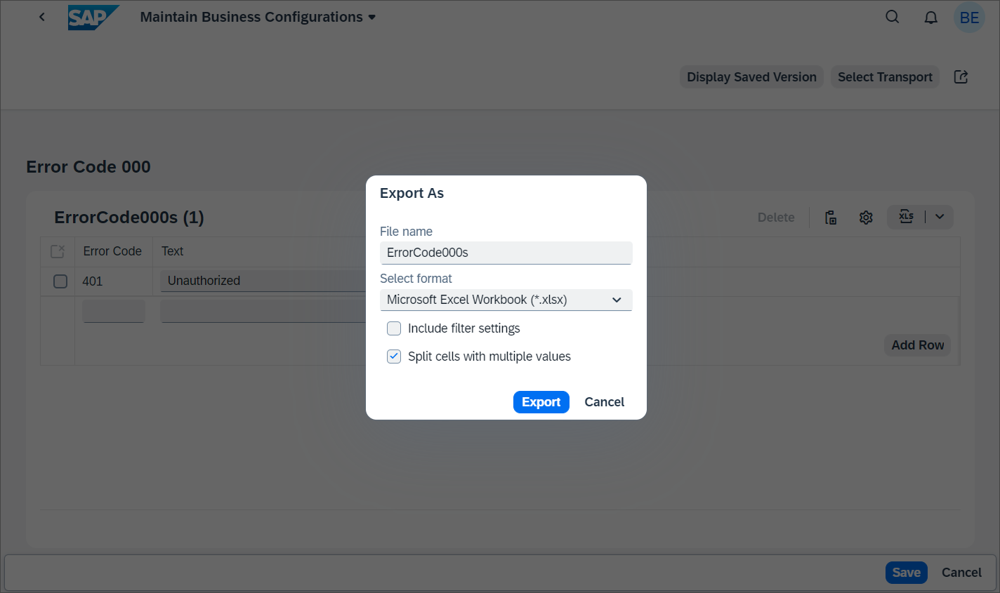
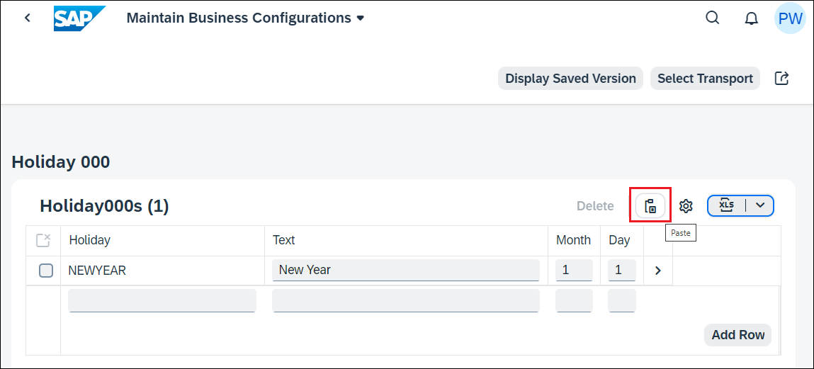
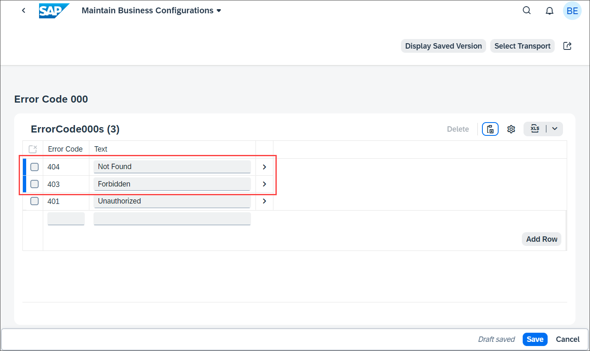
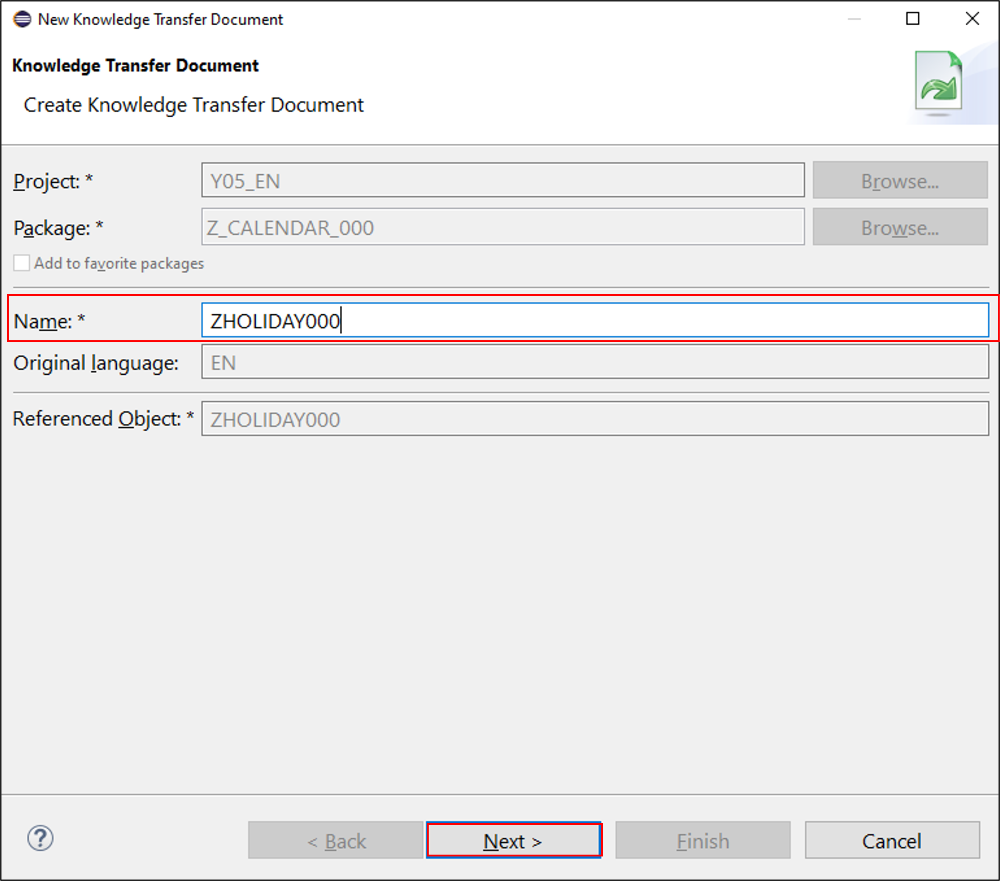

## Prerequisites  
- You need an SAP BTP, ABAP environment [trial user](abap-environment-trial-onboarding) or a license.
- Install [ABAP Development Tools](https://tools.hana.ondemand.com/#abap). You can also follow **step 1** of this [tutorial](abap-install-adt) to install ADT.


## Details
### You will learn  
- How to use copy and paste functionality of Excel documents
- How to create knowledge transfer document
- How to make use of intent navigation

>**Hint:** Don't forget to replace all occurrences of the placeholder ### with your ID of choice in the exercise steps below. You can use the ADT function Replace All (`CTRL+F`) for the purpose.

---
[ACCORDION-BEGIN [Step 1: ](Use copy and paste functionality)]

You can add multiple holidays with copy & paste from [Microsoft Excel](https://ui5.sap.com/#/topic/f6a8fd2812d9442a9bba2f6fb296c42e).

  1. Start the **Maintain Business Configurations** app.

      

  2. Select your business configuration.

      

  3. Click **Edit**.

  4. Select **Export as**.

      

  5. Export the current table content to spreadsheet:
     - File Name: Holiday000s
     - Format: `Microsoft Excel Workbook (*.xlsx)`

      

  6. Open the downloaded file and **Enable Editing**.

  7. Add a new row with following data:
    - Holiday ID: ENDYEAR
    - Description: End of Year
    - Month: 12
    - Day: 31

  8. Select the entire new row and copy it

  9. Back in the `Maintain Business Configurations` app, click **Paste**.

      

10. If prompted, click on **Allow**.

11. After pasting, you can see the new row. Select a transport and click on **Save**.

      

[DONE]
[ACCORDION-END]

[ACCORDION-BEGIN [Step 2: ](Create knowledge transfer document)]

You want to provide a detailed documentation of the business configuration to the user of the Maintain business configuration app.

  1. Open your ABAP package in Eclipse, right-click on your business configuration maintenance object and select **New Knowledge Transfer Document**.

      

  2. Create a new knowledge transfer document:
    - Name: `ZHOLIDAY###`

      

  3. Finish the wizard.

  4. Write the documentation in markdown.

      

  5. Activate your knowledge transfer document.

  6. Reload the maintain business configuration app. A new action will now will be visible on the top right corner. Click **Show Documentation**.

      

  7. Check the documentation in SAP Fiori.

      


[DONE]
[ACCORDION-END]

[ACCORDION-BEGIN [Step 3: ](Make use of intent navigation)]

You want to navigate from your SAP Fiori app to the maintenance view of a business configuration maintenance object.

For this [intent navigation](https://help.sap.com/docs/BTP/65de2977205c403bbc107264b8eccf4b/76384d8e68e646d6ae5ce8977412cbb4.html#intent-navigation) you can use the parameter `TechnicalIdentifier` for the semantic object `BusinessConfiguration` with the action maintain.

You can test this in the browser:

`/ui#BusinessConfiguration-maintain` navigates to the List Report of the MBC app
`/ui#BusinessConfiguration-maintain?TechnicalIdentifier=ZHOLIDAY###` directly navigates to the maintenance view of the business configuration maintenance object `ZHOLIDAY###`
In your SAP Fiori app one option is to use [cross application navigation](https://sapui5.hana.ondemand.com/sdk/#/api/sap.ushell.services.CrossApplicationNavigation):


```Unified Shell
sap.ushell.Container.getServiceAsync("CrossApplicationNavigation").then(function (oService) {
    oService.toExternal({
        target: {
            semanticObject: "BusinessConfiguration",
            action: "maintain"
        },
        params: {
            TechnicalIdentifier: "ZHOLIDAY###"
        }
    });
});
```

[DONE]
[ACCORDION-END]

[ACCORDION-BEGIN [Step 2: ](Test yourself)]

[VALIDATE_1]
[ACCORDION-END]
---
