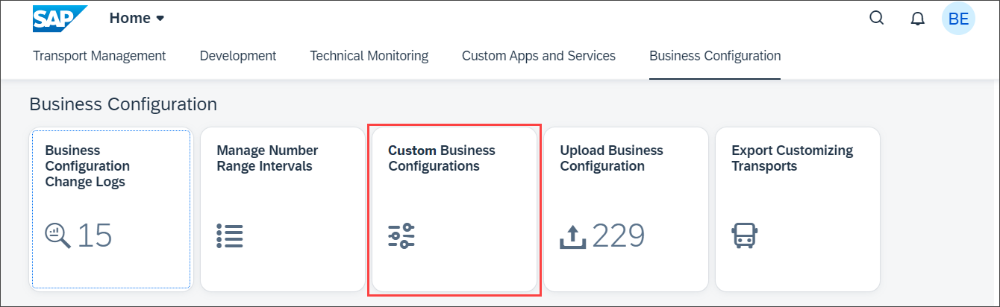
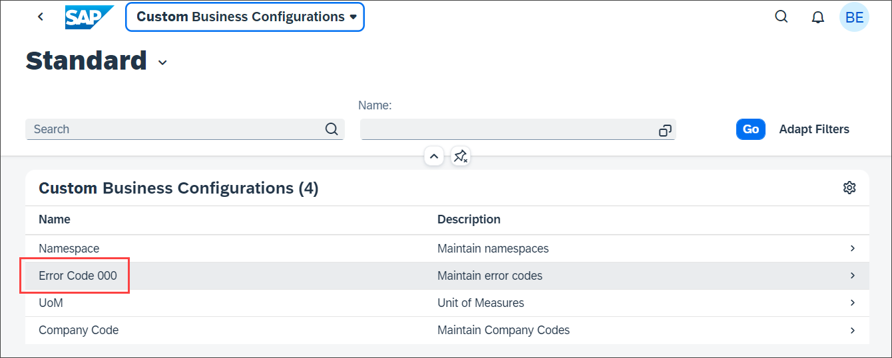
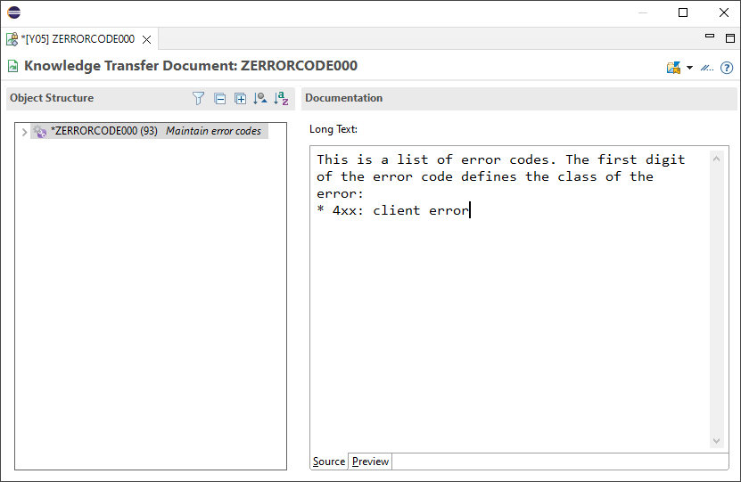

# Get to know additional functionality of the Custom Business Configurations app
<!-- description --> Learn how to copy and paste data from spreadsheet applications. Get to know how to create business configuration documentation and make use of intent navigation.

## Prerequisites  
- You need an SAP BTP, ABAP environment [trial user](abap-environment-trial-onboarding) or a license.
- This is the fourth tutorial of group [Create a SAP Fiori based Table Maintenance app](group.abap-env-factory). You must complete the tutorials in the given order.
- Install [ABAP Development Tools](https://tools.hana.ondemand.com/#abap). You can also follow **step 1** of this [tutorial](abap-install-adt) to install ADT.


## You will learn  
- How to copy and paste data from spreadsheet applications
- How to create business configuration documentation
- How to make use of intent navigation

---
### Copy and paste data from spreadsheet applications


You can add multiple error codes with copy & paste from a [spreadsheet application](https://ui5.sap.com/#/topic/f6a8fd2812d9442a9bba2f6fb296c42e).

  1. Start the **Custom Business Configurations** app.

      

  2. Select your business configuration.

      

  3. Click **Edit**.

  4. Select **Export as**.

      

  5. Export the current table content to spreadsheet:
     - File Name: **`ErrorCode###s`**
     - Format: **`Spreadsheet`**
     - Split cells with multiple values: **`true`**

  6. Open the downloaded file and **Enable Editing**.

  7. Add two new rows with following data:
    - Error Code: **`403`**, Description: **`Forbidden`**
    - Error Code: **`404`**, Description: **`Not Found`**

  8. Select both rows and copy

  9. Back in the **Custom Business Configurations** app, click **Paste**.

      

10. If prompted, click on **Allow**.

11. After pasting, you can see the new rows. Select a transport and click on **Save**.

      


### Create business configuration documentation


You want to provide a detailed documentation of the business configuration to the user of the **Custom Business Configurations** app.

  1. Open your ABAP package in ADT, right-click on your Business Configuration Maintenance Object and select **New Knowledge Transfer Document**.

      

  2. Create a new knowledge transfer document with Name **`ZERRORCODE###`**

  3. Finish the wizard.

  4. Write the documentation in markdown.

      

  5. Activate your Knowledge Transfer Document.

  6. Reload the **Custom Business Configurations** app. A new action will now will be visible on the top right corner.

      

  7. Click **Show Documentation**.

      


### Make use of intent navigation


You want to navigate from your SAP Fiori app to the maintenance view of a Business Configuration Maintenance Object.

For this [intent navigation](https://help.sap.com/docs/BTP/65de2977205c403bbc107264b8eccf4b/76384d8e68e646d6ae5ce8977412cbb4.html#intent-navigation) you can use the parameter `TechnicalIdentifier` for the semantic object `BusinessConfiguration` with the action `maintain`.

- You can test this in the browser:
    - `/ui#BusinessConfiguration-maintain` navigates to the List Report of the **Custom Business Configurations** app.
    - `/ui#BusinessConfiguration-maintain?TechnicalIdentifier=ZERRORCODE###` directly navigates to the maintenance view of the Business Configuration Maintenance Object `ZERRORCODE###`
- In your SAP Fiori app one option is to use [cross application navigation](https://sapui5.hana.ondemand.com/sdk/#/api/sap.ushell.services.CrossApplicationNavigation):


```JavaScript
sap.ushell.Container.getServiceAsync("CrossApplicationNavigation").then(function (oService) {
    oService.toExternal({
        target: {
            semanticObject: "BusinessConfiguration",
            action: "maintain"
        },
        params: {
            TechnicalIdentifier: "ZERRORCODE###"
        }
    });
});
```


### Test yourself


---
