## Prerequisites
- You have one of the following:
    - You have a sub-account with the entitlement SAP Business Technology Platform (BTP) ABAP environment. For more details, see [Getting Started with a Customer Account: Workflow in the ABAP Environment](https://help.sap.com/viewer/65de2977205c403bbc107264b8eccf4b/Cloud/en-US/e34a329acc804c0e874496548183682f.html). You have also created an ABAP Cloud Project pointing to this ABAP environment. For more details, see  [Connect to the ABAP System](https://help.sap.com/viewer/65de2977205c403bbc107264b8eccf4b/Cloud/en-US/7379dbd2e1684119bc1dd28874bbbb7b.html)
      - You have a valid instance of SAP S/4HANA on-premise edition, version 1909 or higher. For a free Cloud Appliance Library (CAL) version, of SAP S/4HANA 1909, see [SAP S/4HANA Fully-Activated Cloud Appliance](https://blogs.sap.com/2019/04/23/sap-s4hana-fully-activated-appliance-demo-guides/)
- You have installed [ABAP Development Tools 3.0](https://tools.hana.ondemand.com/#abap) or higher
- You have downloaded or pulled the ABAP Flight Reference Scenario. To pull this reference scenario from `Github`, see [ Downloading the ABAP Flight Reference Scenario](https://help.sap.com/viewer/923180ddb98240829d935862025004d6/Cloud/en-US/def316685ad14033b051fc4b88db07c8.html)


## Details
### You will learn
  - How to create an ABAP class containing an ABAP Managed Database Procedure (`AMDP`)
  - How to run the ABAP Profiler on this class

Throughout this tutorial, objects name include the suffix `XXX`. Always replace this with your group number or initials.

You should be familiar with ABAP Managed Database Procedures (AMDP). Briefly, AMDP allows you to optimize your ABAP code (for ABAP on SAP HANA) by calling HANA database procedures from a global ABAP class.
For more details, see [ABAP Managed Database Procedures (AMDP): Short introductory blog with two videos and code snippets](https://blogs.sap.com/2014/01/22/abap-managed-database-procedures-introduction/)

---

[ACCORDION-BEGIN [Step 1: ](Create an ABAP package)]
1. Select your project. From the context menu, choose **New > ABAP Package**.

    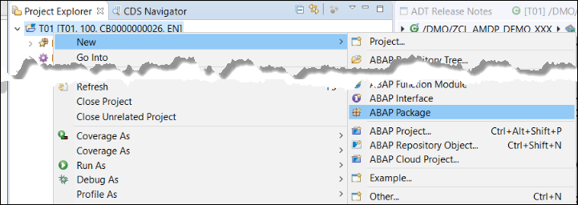

2. Enter a name and description for your package, then choose **Next**.

    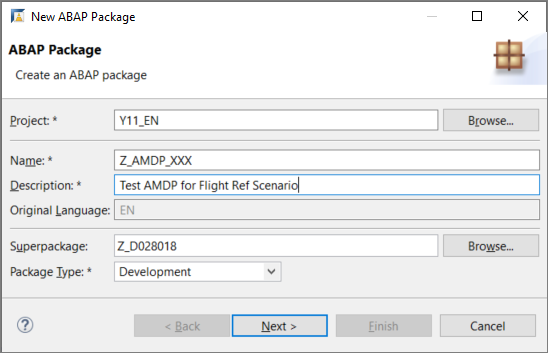

3. Create or assign a transport request and choose **Finish**.

[DONE]
[ACCORDION-END]

[ACCORDION-BEGIN [Step 2: ](Create an ABAP class)]
1. Again, from the context menu  of your package, choose **New > ABAP Class**.

2. Enter a name and description, then choose **Next**.
    - Name: `ZCL_AMDP_DEMO_XXX`
    - Description: AMDP Demo w Flight Ref Scenario

3. Assign the transport request and choose **Finish**.

[DONE]
[ACCORDION-END]

[ACCORDION-BEGIN [Step 3: ](Add two interfaces)]
Add two interfaces by adding this code to the public section. Ignore the warning for now.

- **`if_amdp_marker_hdb`** defines the class as an AMDP class, allowing you to implement AMDP methods - that is, ABAP methods that call a SAP HANA database procedure from within a global ABAP class.

- **`if_oo_adt_classrun`** allows you to output the results to the ABAP Console.

```ABAP
INTERFACES: if_amdp_marker_hdb,
if_oo_adt_classrun.

```

[DONE]
[ACCORDION-END]

[ACCORDION-BEGIN [Step 4: ](Create structures and table types)]
Add these structures and types to the public section, just after the interface definitions.
Note the data elements that you imported earlier.

```ABAP
TYPES:
  BEGIN OF ty_result_line,
    airline           TYPE /dmo/carrier_name,
    flight_connection TYPE /dmo/connection_id,
    old_price         TYPE /dmo/flight_price,
    old_currency      TYPE /dmo/currency_code,
    new_price         TYPE /dmo/flight_price,
    new_currency      TYPE /dmo/currency_code,
  END OF ty_result_line,

  BEGIN OF ty_flights_line,
    airline           TYPE /dmo/carrier_name,
    flight_connection TYPE /dmo/connection_id,
    price             TYPE /dmo/flight_price,
    currency          TYPE /dmo/currency_code,
  END OF ty_flights_line,

  ty_result_table  TYPE STANDARD TABLE OF ty_result_line WITH EMPTY KEY,
  ty_flights_table TYPE STANDARD TABLE OF ty_flights_line WITH EMPTY KEY,
  ty_flights       TYPE STANDARD TABLE OF /dmo/flight.

```

[DONE]
[ACCORDION-END]

[ACCORDION-BEGIN [Step 5: ](Add method definitions)]
Add these two method definitions to your code. Ignore the errors for now.

```ABAP

METHODS:
  get_flights
    EXPORTING
              VALUE(result) TYPE ty_result_table
    RAISING   cx_amdp_execution_error,

  convert_currency
    IMPORTING
              VALUE(flights) TYPE ty_flights_table
    EXPORTING
              VALUE(result)  TYPE ty_result_table
    RAISING   cx_amdp_execution_error.


```
Both of these are AMDP methods.

[DONE]
[ACCORDION-END]

[ACCORDION-BEGIN [Step 6: ](Implement get_flights)]
1. In the class definition, select any one of the methods and choose **Add 3 unimplemented methods**. All three (empty) implementations will appear in the class implementation.

    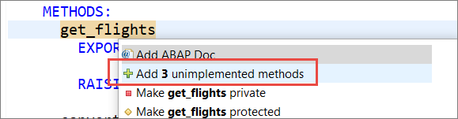

    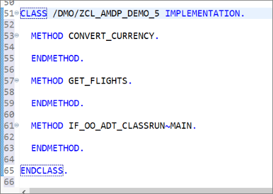

2. Add the following  to the method implementation `get_flights`. Both this and `convert_currency` are `SQLScript`.

    For more information on SAP HANA `SQLScript`, see [SAP HANA SQLScript Reference](https://help.sap.com/doc/6254b3bb439c4f409a979dc407b49c9b/2.0.02/en-us/sap_hana_sql_script_reference_en.pdf)

    ```ABAP

    METHOD GET_FLIGHTS by database procedure
      for hdb
      language sqlscript
      options read-only
      using
        /dmo/flight
        /dmo/carrier
        ZCL_AMDP_DEMO_XXX=>convert_currency.

    ```

    You must specify all ABAP tables, views, and AMDP procedures in the USING clause.
    For more details on these clauses, see [ABAP Keyword Documentation: Method - By Database Procedure, Function ](https://help.sap.com/doc/abapdocu_753_index_htm/7.53/en-US/index.htm?file=abapmethod_by_db_proc.htm)

3. Add the SELECT statement. Ignore the warning for now.

    ```ABAP
    flights = select distinct

      from "/DMO/FLIGHT"  as f
      inner join "/DMO/CARRIER" as c
        on f.carrier_id = c.carrier_id;   

    ```

4. Add the fields. You can do this using Auto-complete (`Ctrl+1`), to make sure you are using the correct field names.

    ```ABAP

    flights = select distinct
      c.name as airline,
      f.connection_id as flight_connection,
      f.price    as price,
      f.currency_code as currency
      from "/DMO/FLIGHT"  as f
      inner join "/DMO/CARRIER" as c
        on f.carrier_id = c.carrier_id;

    ```

5. Finally, call the other AMDP method, `convert_currency`. Your method should look like this:

    ```ABAP

    METHOD get_flights BY DATABASE PROCEDURE
      FOR HDB
      LANGUAGE SQLSCRIPT
      OPTIONS READ-ONLY
      USING
        /dmo/flight
        /dmo/carrier
        ZCL_AMDP_DEMO_XXX=>convert_currency.

      flights = select distinct
        c.name as airline,
        f.connection_id as flight_connection,
        f.price    as price,
        f.currency_code as currency
        from "/DMO/FLIGHT"  as f
        inner join "/DMO/CARRIER" as c
          on f.carrier_id = c.carrier_id;

      call "ZCL_AMDP_DEMO_XXX=>CONVERT_CURRENCY"( :flights, result );

    ENDMETHOD.
```

[DONE]
[ACCORDION-END]

[ACCORDION-BEGIN [Step 7: ](Implement the method convert_currency)]
Similarly, implement the `convert_currency` method.

```ABAP

METHOD convert_currency BY DATABASE PROCEDURE
  FOR HDB
  LANGUAGE SQLSCRIPT
  OPTIONS READ-ONLY.

  declare today date;
  declare new_currency nvarchar(3);

  select current_date into today from dummy;
  new_currency := 'EUR';

  result = select distinct
    airline,
    flight_connection,
    price    as old_price,
    currency as old_currency,
    convert_currency(
      "AMOUNT"          => price,
      "SOURCE_UNIT"     => currency,
      "TARGET_UNIT"     => :new_currency,
      "REFERENCE_DATE"  => :today,
      "CLIENT"          => '100',
      "ERROR_HANDLING"  => 'set to null',
      "SCHEMA"          => current_schema
    ) as new_price,
    :new_currency as new_currency
    from :flights;

ENDMETHOD.

```

[DONE]
[ACCORDION-END]

[ACCORDION-BEGIN [Step 8: ](Implement the method `main` of the interface if_oo_adt_classrun)]
Finally, implement the `main` method of the interface `if_oo_adt_classrun`. This will allow you to output your results to the ABAP Console.

1. Call the method `get_flights` from the current instance of the class:

    ```ABAP
    me->get_flights(
      IMPORTING
        result = DATA(lt_result) ).
    ```

2. Output the result to the console:

    `  out->write( lt_result ).`

3. Wrap this in an exception:

    ```ABAP
    TRY.

    CATCH cx_amdp_execution_error INTO DATA(lx_amdp).
      out->write( lx_amdp->get_longtext( ) ).

    ```

Your method should now look like this:

```ABAP
METHOD if_oo_adt_classrun~main.

  TRY.
      me->get_flights(
        IMPORTING
          result = DATA(lt_result) ).

    CATCH cx_amdp_execution_error INTO DATA(lx_amdp).
      out->write( lx_amdp->get_longtext( ) ).
  ENDTRY.

  out->write( lt_result ).

ENDMETHOD.

```

[DONE]
[ACCORDION-END]

[ACCORDION-BEGIN [Step 9: ](Check your code)]
Your code should look like this.

```ABAP
CLASS ZCL_AMDP_DEMO_XXX DEFINITION
  PUBLIC
  FINAL
  CREATE PUBLIC .

  PUBLIC SECTION.
    INTERFACES: if_amdp_marker_hdb,
                if_oo_adt_classrun.

    TYPES:
      BEGIN OF ty_result_line,
        airline           TYPE /dmo/carrier_name,
        flight_connection TYPE /dmo/connection_id,
        old_price         TYPE /dmo/flight_price,
        old_currency      TYPE /dmo/currency_code,
        new_price         TYPE /dmo/flight_price,
        new_currency      TYPE /dmo/currency_code,
      END OF ty_result_line,

      BEGIN OF ty_flights_line,
        airline           TYPE /dmo/carrier_name,
        flight_connection TYPE /dmo/connection_id,
        price             TYPE /dmo/flight_price,
        currency          TYPE /dmo/currency_code,
      END OF ty_flights_line,

      ty_result_table  TYPE STANDARD TABLE OF ty_result_line WITH EMPTY KEY,
      ty_flights_table TYPE STANDARD TABLE OF ty_flights_line WITH EMPTY KEY,
      ty_flights       TYPE STANDARD TABLE OF /dmo/flight.

    METHODS:
      get_flights
        EXPORTING
                  VALUE(result) TYPE ty_result_table
        RAISING   cx_amdp_execution_error,

      convert_currency
        IMPORTING
                  VALUE(flights) TYPE ty_flights_table
        EXPORTING
                  VALUE(result)  TYPE ty_result_table
        RAISING   cx_amdp_execution_error.

  PROTECTED SECTION.
  PRIVATE SECTION.
ENDCLASS.


CLASS ZCL_AMDP_DEMO_XXX IMPLEMENTATION.
  METHOD get_flights BY DATABASE PROCEDURE
    FOR HDB
    LANGUAGE SQLSCRIPT
    OPTIONS READ-ONLY
    USING
      /dmo/flight
      /dmo/carrier
      ZCL_AMDP_DEMO_XXX=>convert_currency.


    flights = select distinct
      c.name as airline,
      f.connection_id as flight_connection,
      f.price    as price,
      f.currency_code as currency
      from "/DMO/FLIGHT"  as f
      inner join "/DMO/CARRIER" as c
        on f.carrier_id = c.carrier_id;

    call "ZCL_AMDP_DEMO_XXX=>CONVERT_CURRENCY"( :flights, result );

  ENDMETHOD.


  METHOD convert_currency BY DATABASE PROCEDURE
    FOR HDB
    LANGUAGE SQLSCRIPT
    OPTIONS READ-ONLY.

    declare today date;
    declare new_currency nvarchar(3);

    select current_date into today from dummy;
    new_currency := 'EUR';

    result = select distinct
      airline,
      flight_connection,
      price    as old_price,
      currency as old_currency,
      convert_currency(
        "AMOUNT"          => price,
        "SOURCE_UNIT"     => currency,
        "TARGET_UNIT"     => :new_currency,
        "REFERENCE_DATE"  => :today,
        "CLIENT"          => '100',
        "ERROR_HANDLING"  => 'set to null',
        "SCHEMA"          => current_schema
      ) as new_price,
      :new_currency as new_currency
      from :flights;

  ENDMETHOD.


  METHOD if_oo_adt_classrun~main.

    TRY.
        me->get_flights(
          IMPORTING
            result = DATA(lt_result) ).

      CATCH cx_amdp_execution_error INTO DATA(lx_amdp).
        out->write( lx_amdp->get_longtext( ) ).
    ENDTRY.

    out->write( lt_result ).

  ENDMETHOD.
ENDCLASS.

```

[DONE]
[ACCORDION-END]

[ACCORDION-BEGIN [Step 10: ](Format, save, activate, and test your code)]
1. Format, save, and activate your code by choosing **`Shift+F1`, `Ctrl+S, Ctrl+F3`**.

2. Test your class by running it the ABAP Console ( **`F9`** ).

  Your output should look like this:

  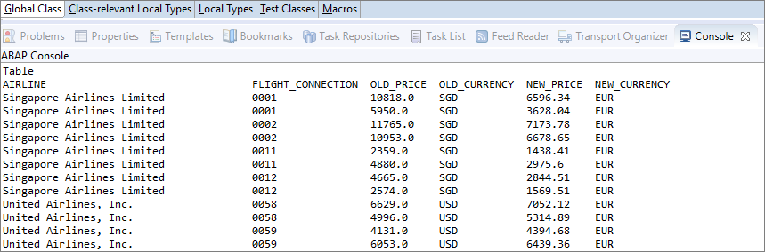

[DONE]
[ACCORDION-END]

[ACCORDION-BEGIN [Step 11: ](Set the Run configuration to ABAP Console)]
You will run your class again in the ABAP Console. First, however, you will specify that the AMDP trace is to be enabled this time.

1. From the context menu of the editor, choose **Profile As > ABAP Application (Console)**.

    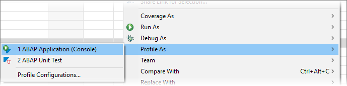

2.  In the dialog that appears, choose **AMDP trace options > Enable AMDP trace**. Leave the other settings as they are, then choose **Finish**.

    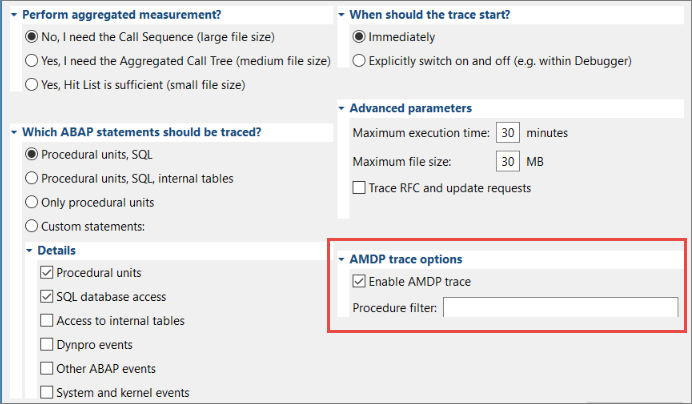

The class will run again, outputting the same data to the Console and also creating an ABAP Trace.

[DONE]
[ACCORDION-END]

[ACCORDION-BEGIN [Step 12: ](Open the AMDP tab)]
Now, you will examine the ABAP Trace you have created.

1. Open the **ABAP Traces** view, by choosing it from  **Quick Access**.

    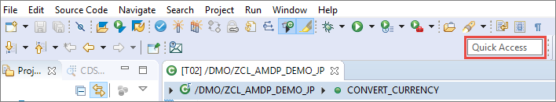
    .
    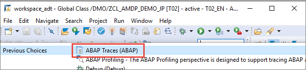

2. The view opens below the Class Editor, beside the Console. If necessary, refresh the view ( **`F5`** ). Double-click on your class.

    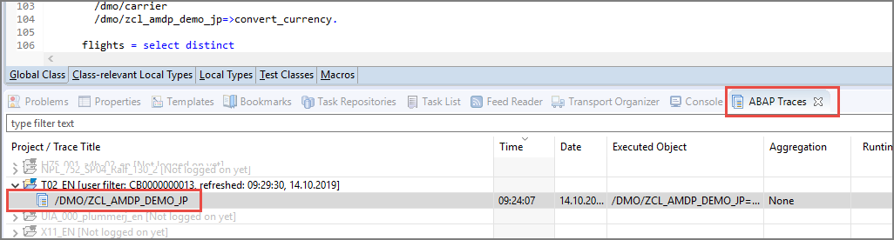

The **Trace Results** view appears. The **ABAP Managed Database Procedures** tab appears to the right.

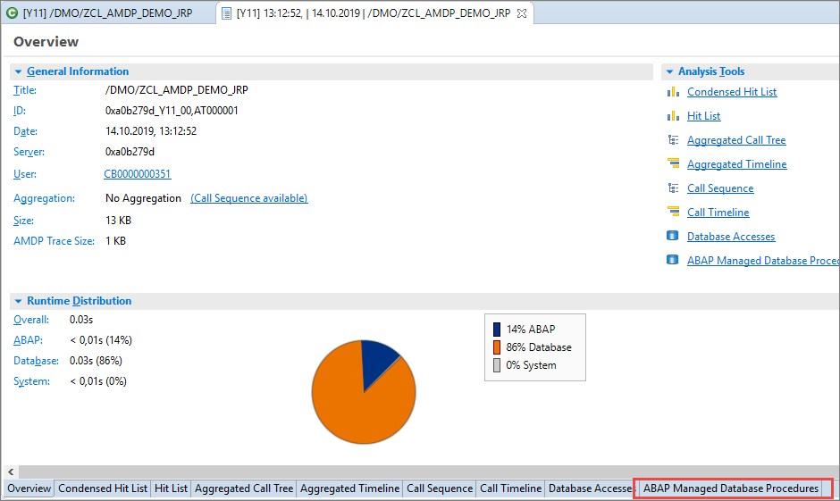

> In older versions of SAP AS ABAP (earlier than 7.55): In the ABAP Profiler display for the AMDP Trace, the column "Execution Time" sometimes contains values that are larger than the values in column "Duration". As the ABAP Profiler usually displays elapsed time, the column "Execution Time" may only be smaller than "Duration", as there might be some "Compile Time" involved in the overall duration.

> This is a known issue and is fixed in SAP AS ABAP Release 7.55.

> For more details, see: [SAP Note 2874907 - Display Elapsed Time Values in AMDP Profiler](https://launchpad.support.sap.com/#/notes/2874907)

[DONE]
[ACCORDION-END]

[ACCORDION-BEGIN [Step 13: ](Test yourself)]

[VALIDATE_1]
[ACCORDION-END]

### More Information

- SAP Help Portal: [ABAP Managed Database Procedures (AMDP)](https://help.sap.com/viewer/6811c09434084fd1bc4f40e66913ce11/7.52.0/en-US/3e7ce62892d243eca44499d3f5a54bff.html)

- SAP Help Portal: [Working with the AMDP Profiler](https://help.sap.com/viewer/DRAFT/090a7cb96c1f45428741601c5c520be8/Dev/en-US/fe9233b2584b45e987b1993b4a9faef3.html?q=loiofe9233b2584b45e987b1993b4a9faef3)

- ABAP Keyword Documentation: [AMDP - ABAP Managed Database Procedures](https://help.sap.com/doc/abapdocu_753_index_htm/7.53/en-US/index.htm?file=abenamdp.htm)


---
