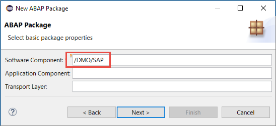
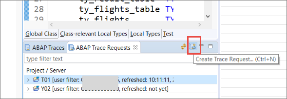
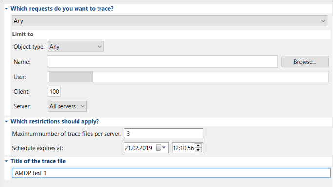
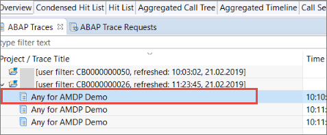
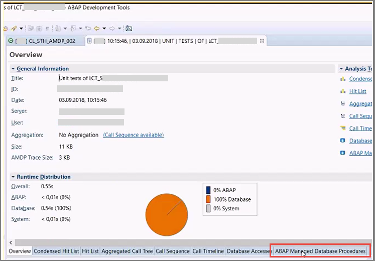

## Prerequisites
- You have a sub-account with the entitlement SAP Cloud Platform, ABAP environment, release 1902 or higher. For more details, see [Getting Started with a Customer Account: Workflow in the ABAP Environment](https://help.sap.com/viewer/65de2977205c403bbc107264b8eccf4b/Cloud/en-US/e34a329acc804c0e874496548183682f.html).
- You have installed [ABAP Development Tools 3.0](https://tools.hana.ondemand.com/#abap).
- You have created an ABAP Cloud Project pointing to this ABAP environment. For more details, see  [Connect to the ABAP System](https://help.sap.com/viewer/65de2977205c403bbc107264b8eccf4b/Cloud/en-US/7379dbd2e1684119bc1dd28874bbbb7b.html).
- You have installed the `abapGit` plug-in for Eclipse from [`abapGit`](http://eclipse.abapgit.org/updatesite/).
- You have fulfilled the prerequisites for ABAP Database Managed Procedures (AMDP). For more details, see [SAP Note 1899222](https://launchpad.support.sap.com/#/notes/1899222).


## Details
### You will learn
  - How to create an ABAP class containing an ABAP Managed Database Procedure (`AMDP`)
  - How to run the ABAP Profiler on this class

Throughout this tutorial, objects name include the suffix `XXX`. Always replace this with your group number or initials.

You should be familiar with ABAP Managed Database Procedures (AMDP). Briefly, AMDP allows you to optimize your ABAP code (for ABAP on SAP HANA) by calling HANA database procedures from a global ABAP class.

For more details, see:
- [SAP Help Portal: ABAP Managed Database Procedures (AMDP)](https://help.sap.com/viewer/6811c09434084fd1bc4f40e66913ce11/7.52.0/en-US/3e7ce62892d243eca44499d3f5a54bff.html)
- [ABAP Keyword Documentation: AMDP - ABAP Managed Database Procedures](https://help.sap.com/doc/abapdocu_753_index_htm/7.53/en-US/index.htm?file=abenamdp.htm)

---

[ACCORDION-BEGIN [Step 1: ](Install the Flight Reference Scenario using `abapGit`)]
1. Create the package `/DMO/FLIGHT` as a sub-package under the package `/DMO/SAP` (keep the default values). **IMPORTANT:** Make sure that the software component is also `/DMO/SAP`.

2. Open the `abapGit` view by choosing **Window > Show View > Other... >  `abapGit` Repositories**. Make sure you have the correct ABAP Cloud Project marked (See the little headline in the `abapGit` view for the current project.)

3. Clone a repository by choosing **`+`** and enter the repository URL: [https://github.com/SAP/abap-platform-refscen-flight.git](https://github.com/SAP/abap-platform-refscen-flight.git).

4. On the next page choose the master branch and provide the package `/DMO/FLIGHT`.

5. Create or assign a transport request and choose **Finish**. This starts the cloning of the repository, which might take a few minutes

6. Once the cloning has finished, refresh your project tree.

7. Finally,  generate some sample data by running the ABAP class `/DMO/CL_FLIGHT_DATA_GENERATOR` by choosing **Run as Console Application (`F9`)**.

[DONE]
[ACCORDION-END]

[ACCORDION-BEGIN [Step 2: ](Create an ABAP package in `/DMO/SAP`)]
One of the restrictions of the ABAP Environment on SAP Cloud Platform is that you can only use other objects if they are released objects (whitelisted) or in the same software component.
 Since you will be using objects in the `/DMO/SAP` software component, you need to create your package in `/DMO/SAP`.

1. Select your project. From the context menu, choose **New > ABAP Package**.

    

2. Enter a name and description for your package, then choose **Next**.
**IMPORTANT**: Make sure that you prefix the name with **`/DMO/`**, for example: Name = `/DMO/AMDP_XXX` (replacing `XXX` with your group number or initials)

    

3. Enter the software component `/DMO/SAP`. You can leave the other fields blank.

    

4. Create or assign a transport request and choose **Finish**.

[DONE]
[ACCORDION-END]

[ACCORDION-BEGIN [Step 3: ](Create an ABAP class)]
1. Again, from the context menu  of your package, choose **New > ABAP Class**.

2. Enter a name and description, then choose **Next**. Make sure that you prefix the class name with `/DMO/`, for example:
    - `/DMO/ZCL_AMDP_DEMO_XXX`
    - AMDP Demo w Flight ref

3. Assign the transport request and choose **Finish**.

[DONE]
[ACCORDION-END]

[ACCORDION-BEGIN [Step 4: ](Add interfaces)]
Add two interfaces by adding this code to the public section.

- **`if_amdp_marker_hdb`** defines the class as an AMDP class, allowing you to implement AMDP methods - that is, ABAP methods that call a SAP HANA database procedure from within a global ABAP class.

- **`if_oo_adt_classrun`** allows you to output the results to the ABAP Console.

```ABAP
INTERFACES: if_amdp_marker_hdb,
if_oo_adt_classrun.

```

[DONE]
[ACCORDION-END]

[ACCORDION-BEGIN [Step 5: ](Create structures and table types)]
Add these structures and types to the public section, just after the interface definitions.
Note the data elements that you imported earlier.

```ABAP
TYPES:
  BEGIN OF ty_result_line,
    airline           TYPE /dmo/carrier_name,
    flight_connection TYPE /dmo/connection_id,
    old_price         TYPE /dmo/flight_price,
    old_currency      TYPE /dmo/currency_code,
    new_price         TYPE /dmo/flight_price,
    new_currency      TYPE /dmo/currency_code,
  END OF ty_result_line,

  BEGIN OF ty_flights_line,
    airline           TYPE /dmo/carrier_name,
    flight_connection TYPE /dmo/connection_id,
    price             TYPE /dmo/flight_price,
    currency          TYPE /dmo/currency_code,
  END OF ty_flights_line,

  ty_result_table  TYPE STANDARD TABLE OF ty_result_line WITH EMPTY KEY,
  ty_flights_table TYPE STANDARD TABLE OF ty_flights_line WITH EMPTY KEY,
  ty_flights       TYPE STANDARD TABLE OF /dmo/flight.

```

[DONE]
[ACCORDION-END]

[ACCORDION-BEGIN [Step 6: ](Add method definitions)]
Add these two method definitions to your code. Ignore the errors for now.

```ABAP

METHODS:
  get_flights
    EXPORTING
              VALUE(result) TYPE ty_result_table
    RAISING   cx_amdp_execution_error,

  convert_currency
    IMPORTING
              VALUE(flights) TYPE ty_flights_table
    EXPORTING
              VALUE(result)  TYPE ty_result_table
    RAISING   cx_amdp_execution_error.


```
Both of these are AMDP methods.

[DONE]
[ACCORDION-END]

[ACCORDION-BEGIN [Step 7: ](Implement `get_flights`)]
1. In the class definition, select any one of the methods and choose **Add 3 unimplemented methods**. All three (empty) implementations will appear in the class implementation.

    

    

2. Add the following  to the method `get_flights`. Both this and `convert_currency` are `SQLScript`.

    For more information on SAP HANA `SQLScript`, see [SAP HANA SQLScript Reference](https://help.sap.com/doc/6254b3bb439c4f409a979dc407b49c9b/2.0.02/en-us/sap_hana_sql_script_reference_en.pdf)

    ```ABAP

    METHOD GET_FLIGHTS by database procedure
      for hdb
      language sqlscript
      options read-only
      using
        /dmo/flight
        /dmo/carrier
        /dmo/zcl_amdp_demo_xxx=>convert_currency.

    ```

    You must specify all ABAP tables, views, and AMDP procedures in the USING clause.
    For more details on these clauses, see [ABAP Keyword Documentation: Method - By Database Procedure, Function ](https://help.sap.com/doc/abapdocu_753_index_htm/7.53/en-US/index.htm?file=abapmethod_by_db_proc.htm)

3. Add the SELECT statement. Ignore the warning for now.

    ```ABAP
    flights = select distinct

      from "/DMO/FLIGHT"  as f
      inner join "/DMO/CARRIER" as c
        on f.carrier_id = c.carrier_id;   

    ```

4. Add the fields. You can do this using Auto-complete (`Ctrl+1`), to make sure you are using the correct field names.

    ```ABAP

    flights = select distinct
      c.name as airline,
      f.connection_id as flight_connection,
      f.price    as price,
      f.currency_code as currency
      from "/DMO/FLIGHT"  as f
      inner join "/DMO/CARRIER" as c
        on f.carrier_id = c.carrier_id;

    ```

5. Finally, call the other AMDP method, `convert_currency`. Your method should look like this:

    ```ABAP

    METHOD get_flights BY DATABASE PROCEDURE
      FOR HDB
      LANGUAGE SQLSCRIPT
      OPTIONS READ-ONLY
      USING
        /dmo/flight
        /dmo/carrier
        /dmo/zcl_amdp_demo_xxx=>convert_currency.

      flights = select distinct
        c.name as airline,
        f.connection_id as flight_connection,
        f.price    as price,
        f.currency_code as currency
        from "/DMO/FLIGHT"  as f
        inner join "/DMO/CARRIER" as c
          on f.carrier_id = c.carrier_id;

      call "/DMO/ZCL_AMDP_DEMO_XXX=>CONVERT_CURRENCY"( :flights, result );

    ENDMETHOD.
```

[DONE]
[ACCORDION-END]

[ACCORDION-BEGIN [Step 8: ](Implement the method `convert_currency`)]
Similarly, implement the `convert_currency` method.

```ABAP

METHOD convert_currency BY DATABASE PROCEDURE
  FOR HDB
  LANGUAGE SQLSCRIPT
  OPTIONS READ-ONLY.

  declare today date;
  declare new_currency nvarchar(3);

  select current_date into today from dummy;
  new_currency := 'EUR';

  result = select distinct
    airline,
    flight_connection,
    price    as old_price,
    currency as old_currency,
    convert_currency(
      "AMOUNT"          => price,
      "SOURCE_UNIT"     => currency,
      "TARGET_UNIT"     => :new_currency,
      "REFERENCE_DATE"  => :today,
      "CLIENT"          => '100',
      "ERROR_HANDLING"  => 'set to null',
      "SCHEMA"          => current_schema
    ) as new_price,
    :new_currency as new_currency
    from :flights;

ENDMETHOD.

```

[DONE]
[ACCORDION-END]

[ACCORDION-BEGIN [Step 9: ](Implement the method `main` of the interface `if_oo_adt_classrun`)]
Finally, implement the `main` method of the interface `if_oo_adt_classrun`. This will allow you to output your results to the ABAP Console.

1. Call the method `get_flights` from the current instance of the class:

    ```ABAP
    me->get_flights(
      IMPORTING
        result = DATA(lt_result) ).
    ```

2. Output the result to the console:

    `  out->write( lt_result ).`

3. Wrap this in an exception:

    ```ABAP
    TRY.

    CATCH cx_amdp_execution_error INTO DATA(lx_amdp).
      out->write( lx_amdp->get_longtext( ) ).

    ```

Your method should now look like this:

```ABAP
METHOD if_oo_adt_classrun~main.

  TRY.
      me->get_flights(
        IMPORTING
          result = DATA(lt_result) ).

    CATCH cx_amdp_execution_error INTO DATA(lx_amdp).
      out->write( lx_amdp->get_longtext( ) ).
  ENDTRY.

  out->write( lt_result ).

ENDMETHOD.

```

[DONE]
[ACCORDION-END]

[ACCORDION-BEGIN [Step 10: ](Check your code)]
Your code should look like this.

```ABAP
CLASS /dmo/zcl_amdp_demo_xxx DEFINITION
  PUBLIC
  FINAL
  CREATE PUBLIC .

  PUBLIC SECTION.
    INTERFACES: if_amdp_marker_hdb,
      if_oo_adt_classrun.

    TYPES:
      BEGIN OF ty_result_line,
        airline           TYPE /dmo/carrier_name,
        flight_connection TYPE /dmo/connection_id,
        old_price         TYPE /dmo/flight_price,
        old_currency      TYPE /dmo/currency_code,
        new_price         TYPE /dmo/flight_price,
        new_currency      TYPE /dmo/currency_code,
      END OF ty_result_line,

      BEGIN OF ty_flights_line,
        airline           TYPE /dmo/carrier_name,
        flight_connection TYPE /dmo/connection_id,
        price             TYPE /dmo/flight_price,
        currency          TYPE /dmo/currency_code,
      END OF ty_flights_line,

      ty_result_table  TYPE STANDARD TABLE OF ty_result_line WITH EMPTY KEY,
      ty_flights_table TYPE STANDARD TABLE OF ty_flights_line WITH EMPTY KEY,
      ty_flights       TYPE STANDARD TABLE OF /dmo/flight.

    METHODS:
      get_flights
        EXPORTING
                  VALUE(result) TYPE ty_result_table
        RAISING   cx_amdp_execution_error,

      convert_currency
        IMPORTING
                  VALUE(flights) TYPE ty_flights_table
        EXPORTING
                  VALUE(result)  TYPE ty_result_table
        RAISING   cx_amdp_execution_error.

  PROTECTED SECTION.
  PRIVATE SECTION.
ENDCLASS.


CLASS /dmo/zcl_amdp_demo_xxx IMPLEMENTATION.

  METHOD get_flights BY DATABASE PROCEDURE
    FOR HDB
    LANGUAGE SQLSCRIPT
    OPTIONS READ-ONLY
    USING
      /dmo/flight
      /dmo/carrier
      /dmo/zcl_amdp_demo_xxx=>convert_currency.

    flights = select distinct
      c.name as airline,
      f.connection_id as flight_connection,
      f.price    as price,
      f.currency_code as currency
      from "/DMO/FLIGHT"  as f
      inner join "/DMO/CARRIER" as c
        on f.carrier_id = c.carrier_id;

    call "/DMO/ZCL_AMDP_DEMO_XXX=>CONVERT_CURRENCY"( :flights, result );

  ENDMETHOD.


  METHOD convert_currency BY DATABASE PROCEDURE
    FOR HDB
    LANGUAGE SQLSCRIPT
    OPTIONS READ-ONLY.

    declare today date;
    declare new_currency nvarchar(3);

    select current_date into today from dummy;
    new_currency := 'EUR';

    result = select distinct
      airline,
      flight_connection,
      price    as old_price,
      currency as old_currency,
      convert_currency(
        "AMOUNT"          => price,
        "SOURCE_UNIT"     => currency,
        "TARGET_UNIT"     => :new_currency,
        "REFERENCE_DATE"  => :today,
        "CLIENT"          => '100',
        "ERROR_HANDLING"  => 'set to null',
        "SCHEMA"          => current_schema
      ) as new_price,
      :new_currency as new_currency
      from :flights;

  ENDMETHOD.


  METHOD if_oo_adt_classrun~main.

    TRY.
        me->get_flights(
          IMPORTING
            result = DATA(lt_result) ).

      CATCH cx_amdp_execution_error INTO DATA(lx_amdp).
        out->write( lx_amdp->get_longtext( ) ).
    ENDTRY.

    out->write( lt_result ).

  ENDMETHOD.
ENDCLASS.

```
[DONE]
[ACCORDION-END]

[ACCORDION-BEGIN [Step 11: ](Save, activate, and test your code)]
1. Save and activate your code by choosing **`Ctrl+S, Ctrl+3`**.

2. Optional: Test your class by running it the ABAP Console (**`F9`**).

  Your output should look like this:

  

[DONE]
[ACCORDION-END]

[ACCORDION-BEGIN [Step 12: ](Create an ABAP trace request)]
1. Switch to the ABAP Profiling perspective.

2. Open the ABAP Trace Requests view.

3. Choose your project and choose **Create Trace Request...** from the toolbar.

    

4. Choose the following options, then choose **Next**:
    - Which requests: Any
    - Object type: Any
    - Server: All servers
    - Maximum trace files... : 3
    - Title: Any for AMDP Demo

      

5. On the next screen, leave the other defaults, choose **Enable AMDP trace**, then choose **Finish**.

    

[DONE]
[ACCORDION-END]

[ACCORDION-BEGIN [Step 13: ](Examine the AMDP Profiling Result)]
1. Refresh your trace request. Once it is finished, return to the ABAP Traces View.

2. Open the Profiling Overview by choosing (double-clicking) your trace.

    

3. Choose the ABAP Database Managed Procedures tab from the bottom.

    

4. The ABAP Managed Database Procedures overview displays the result of the AMDP profiling analysis in a table.

    To get more details about the statement which has been executed at ABAP runtime, view the table and expand the relevant procedure nodes.

5. Optional: To navigate to the relevant position within your ABAP source code, double-click the corresponding statement.
The development object is then opened and the cursor is positioned at the relevant position.

You can now analyze the results of your AMDP profiling. For more details, see [AMDP Profiling](https://help.sap.com/viewer/090a7cb96c1f45428741601c5c520be8/Cloud/en-US/4c247e2ad0624f7a84f361e1324da447.html)

[DONE]
[ACCORDION-END]

[ACCORDION-BEGIN [Step 14: ](Test yourself)]
Define an AMDP method `get_sales_orders` (based on the AMDP method `get_flights`).
Specify the options:
- Database = SAP HANA
- Language = SQLScript
- Options = read-only
- Objects used = `snwd_so, snwd_so_i`, and the method `create_sales_order` of the class `zcl_demo`.
Do not indent your code.

Enter your code in the box below and choose **Submit Answer.**

[VALIDATE_1]
[ACCORDION-END]


---
