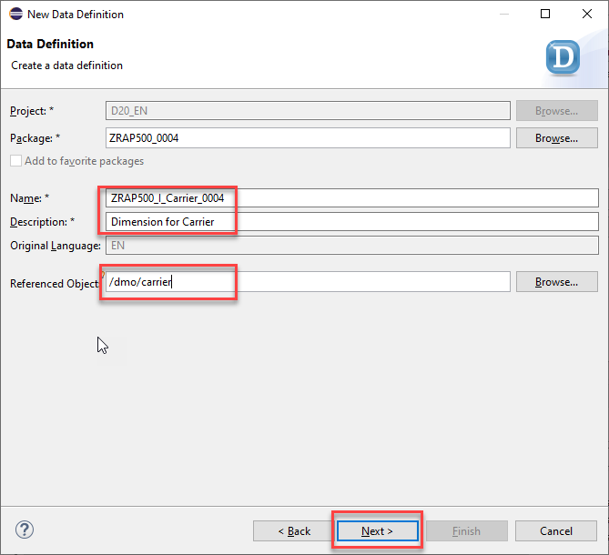
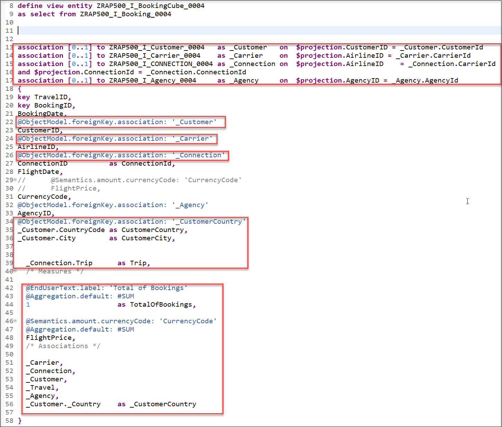
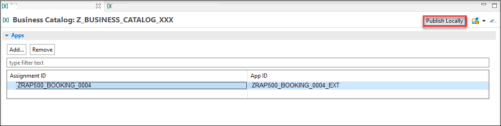
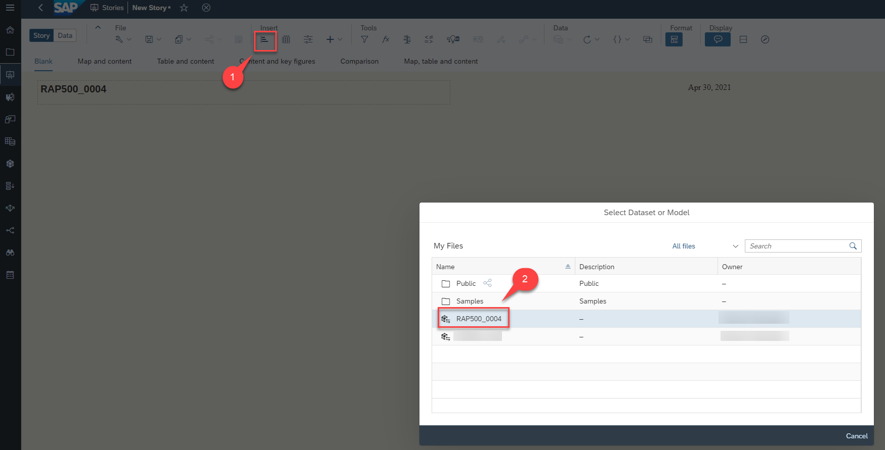

## Prerequisites
 - You need the standard developer authorization profile to create ABAP development objects.
 - You need a SAP Analytics Cloud account.
 - Install `ABAPGit` Plugin in ADT. See <http://eclipse.abapgit.org/updatesite/>
 - To get the Flight Model into the system, follow the description at <https://github.com/SAP/abap-platform-refscen-flight/blob/master/README.md>
 - Requires Customer or Partner License.


## Details
### You will learn
  - How to create an analytical query as CDS View Entities
  - How to connect an ABAP System to SAP Analytics Cloud
  - How to consume analytical queries on SAP Analytics Cloud by creating models and stories

Always replace `####` with your initials or group number.

---

[ACCORDION-BEGIN [Step 1: ](Overview)]
The new **RAP based InA service exposure** enables the SAP Business Technology Platform ABAP Environment developers to develop analytical queries(based on ABAP-CDS analytical data models) and expose them via the `InA` (Information Access) service protocol. In this Tutorial you will create a complete Analytical Data Model for Booking data. This consists out of dimensions for Carrier, Customer, Connection and Agency data, as well as an interface CDS view for Booking data which acts as a data source for the cube and query.
These analytical queries can be further consumed in the SAP Analytics cloud to create analytical models, stories, multi-dimensional reports and more.


[DONE]
[ACCORDION-END]

[ACCORDION-BEGIN [Step 2: ](Import templates for Analytical CDS views)]

As a first task you will start to import templates that you will use in this tutorial to create Analytical CDS views such as dimension views, cubes and queries.

The templates already contain certain annotations that are mandatory for the above mentioned analytical CDS views. If values such as the name of a property have to be added this can then simply be done by using code completion.

  1. Click on the following link to display the file analytical_templates.xml. [Templates](https://raw.githubusercontent.com/SAP-samples/abap-platform-rap-workshops/main/rap5xx/rap500/sources/analytical_templates.xml)

  2. Right-click on the browser window and save the content as an xml-file called **analytical_templates.xml**.

    

  3. Open ADT. In the menu choose **Window** > **Preferences**.

    

  4. In the Templates dialogue choose **Import**.

    

  5. Select the XML file **analytical_templates.xml** that you have saved.

    


    > The Import-Dialog only allows to select files having the extension `.xml.` When you have downloaded the file using a different file extension you have first to rename your file so that it gets the extension `.xml.`

  6. You will see that three new templates have been imported that you will use in the following tutorial.

    Press **Apply and Close**

    

[DONE]
[ACCORDION-END]

[ACCORDION-BEGIN [Step 3: ](Create the first dimension for Carrier)]

>Dimensions views are links to various master data, which are later used in reporting as further attributes (according to which different aggregations can be made) and thus make up the versatility of our Analytical Model.

>In the following you will create four dimension views for Carrier, Customers, Connections and Travel Agencies so that you can visualize our measures Number of bookings and Flight price in relation to these dimensions.

>That means you will be able to create different charts that show how much money was spend for bookings for the connection Frankfurt-->New York compared to the connection Frankfurt-->Sydney or that show how much money was spend for flights with a certain airline.


You will start to create a dimension view that contains the different Airlines / Carriers. Since our model will contain two measures, namely **Number of bookings** and **Flight Price** you will be able to answer questions such as

  - How much bookings are there per Carrier ? or
  - How much money was spend for bookings for a certain Airline?

  1. Open ADT and login to your ABAP System.
    If you do not have a package, create a new one.

  2. Right-click your package and choose **New** > **Other ABAP Repository Object**.

      

  3. Choose **Core Data Services** > **Data Definition** and click **Next**.

      

  4. Enter the following values

    - Name:`ZRAP500_I_CARRIER_###`
    - Description: `Dimension for Carrier`
    - Referenced Object:`/dmo/carrier`

    and click **Next**.

    By selecting a table or another CDS view as Referenced object the wizard will use this object as a data source for the new CDS view and it will automatically add all fields into the DDL source code and it will also create camel Case aliases if needed.

      

  5. Choose a transport request and click **Next**.

    Do **NOT** press **Finish**, because otherwise the wizard will not provide us the option to choose a specific template but would choose the template that you have used the last time.


    

  6. In the **Templates** dialogue choose the **Define a View Entity for a Dimension** and press **Finish**. The **Define a View Entity for a Dimension** template is one of the new data definition templates that you have imported in the last step. This template contains certain annotations which will be explained below that are mandatory for dimension views.

      


[DONE]
[ACCORDION-END]


[ACCORDION-BEGIN [Step 4: ](Edit dimension view)]

  1. Now you need to edit the dimension view. Here you can use code completion to add the values for the annotations

    <pre>@ObjectModel.representativeKey</pre>

      and

    <pre>@ObjectModel.text.element</pre>

    that are needed for our dimension view.

      

  2. Click on `representativeKey`, delete the placeholder `representativKey` so that you get an empty string '' , press CTRL + Space and choose **`CarrierId`**.

    

  3. Click on `textElement`, delete the placeholder string `textElement`, press CTRL + Space and choose **`Name`**.

    

  4. Save and activate the dimension.

    

  5. Your final code should look like following:

    ```ZRAP500_I_Carrier_####
    @AccessControl.authorizationCheck: #CHECK
    @EndUserText.label: 'Dimension for Carrier'
    @Metadata.ignorePropagatedAnnotations: true


    @Analytics.dataCategory: #DIMENSION
    @Analytics.internalName: #LOCAL
    @ObjectModel.representativeKey: 'CarrierId'


    define view entity ZRAP500_I_Carrier_####
    as select from /dmo/carrier
    {
    @ObjectModel.text.element: ['Name']
    key carrier_id    as CarrierId,
    name          as Name,
    currency_code as CurrencyCode
    }
    ```

    **Coding explained**

    | Code | Explanation |
    | ------------- | ---------- |
    | @Metadata.ignorePropagatedAnnotations: true | ignore annotations from tables and base views, because you want to completely control/override the annotations here. |
    | @Analytics.dataCategory | you define this CDS view as a dimension. |
    | @Analytics.internalName: #LOCAL | Create UUIDs. |
    | @ObjectModel.representativeKey: 'CarrierId' | you define **CarrierID** as the representative key to be able to refer to it using @ObjectModel.foreignKey.association in the Cube that you will create later |
    |  @ObjectModel.text.element: ['Name'] | Using this annotation you define that the attribute **Name**, contains the text element for a given CarrierId. |  


[DONE]
[ACCORDION-END]

[ACCORDION-BEGIN [Step 5: ](Create three additional dimensions)]

  ***Customer Dimension***

  The data for customers is contained in the table `/dmo/customer`. So you have to follow all steps above and create a dimension `ZRAP500_I_Customer_####` and use the table `/DMO/customer` as a data source / reference object.  
  The table `/dmo/customer` contains the columns first name and last name, but not the full name of the customer. You will hence add a new field to our CDS view where you calculate the full name so that you can use it as the text element for the key field `CustomerId`.  
  The table `/dmo/customer` also contains fields that are too long to be used in analytics scenarios and it contains administrative fields that you do not want to show. You will hence delete these fields from the field list after having used the  **Define a View Entity for a Dimension** template.

  1. Right click on your **Core Data Services** folder, choose **Data Definition** > **New** > **Data Definition**. Enter following values and press **Next**:

    - **Name**: `ZRAP500_I_Customer_####`
    - **Description**: `Dimension for Customer`
    - **Referenced Object**: `/dmo/customer`

    

  2. Select a transport request and press **Next**
  3. Select again the template **Define a View Entity for Dimension** and press **Finish**
  4. Add a new field `CustomerName` which will later be specified as the text element for the key field.

    `concat_with_space(first_name, last_name, 1) as CustomerName,`

  5. Remove or comment out these fields because they are too long for our analytics scenarios and you do not need any administration fields.

    ```
    //    email_address as EmailAddress,

    //    createdby as Createdby,

    //    createdat as Createdat,

    //    lastchangedby as Lastchangedby,

    //    lastchangedat as Lastchangedat

    ```

  6. Add the association `_Country`

     `association [1] to I_Country as _Country on $projection.CountryCode = _Country.Country `

     and add

     `_Country`

     to the field list so that it is exposed.     

             

   7. Choose the property `CustomerId` for the annotation @ObjectModel.representativeKey and choose the newly created property `CustomerName` for the annotation @ObjectModel.text.element.

      

   8. Save and activate the dimension.

    > You expose the association `_Country` to be able to access country information in the cube and query.   

   9. Your final code should look like following:

    ```ZRAP500_I_Customer_####
      @AccessControl.authorizationCheck: #CHECK
      @EndUserText.label: 'Dimension for Customer'
      @Metadata.ignorePropagatedAnnotations: true

      @Analytics.dataCategory: #DIMENSION
      @Analytics.internalName: #LOCAL
      @ObjectModel.representativeKey: 'CustomerId'

      define view entity ZRAP500_I_Customer_####
        as select from /dmo/customer
        association [1] to I_Country as _Country on $projection.CountryCode = _Country.Country
      {
            @ObjectModel.text.element: ['CustomerName']
        key customer_id                                 as CustomerId,
            first_name                                  as FirstName,
            last_name                                   as LastName,
            concat_with_space(first_name, last_name, 1) as CustomerName,
            title                                       as Title,
            street                                      as Street,
            postal_code                                 as PostalCode,
            city                                        as City,
            country_code                                as CountryCode,
            phone_number                                as PhoneNumber,
            //    email_address as EmailAddress,
            //    createdby as Createdby,
            //    createdat as Createdat,
            //    lastchangedby as Lastchangedby,
            //    lastchangedat as Lastchangedat
            _Country
      }

    ```

  ***Connection Dimension***

  The information about the connections (flights) is stored in the table `/dmo/connection`. In this dimension view you again add a new field. The newly created field **Trip** will show the departure airport and the destination airport in one string.
  For tables such as `/dmo/connection` that contain more than one key field, the key fields that are not annotated as the representative key field have to be annotated with a foreign key relationship.
  Since the key field `ConnectionId` will be annotated as the `representativeKey` you have to add an association that points to the Carrier dimension view which will be added as a foreign key relationship to the key field `CarrierId`.

  1. Right click on the folder **Data Definitions** > **New** > **Data Definition**.    
  2. Enter the following values and press **Next**.

     - **Name**: `ZRAP500_I_Connection_####`
     - **Description**: `Dimension for Connections`
     - **Referenced Object**: `/dmo/connection`

  3. Select a transport request and press **Next**.
  4. Select again the template **Define a View Entity for Dimension** and press **Finish**.
  5. Add a new field **Trip** which will later be specified as the text element for the key field `ConnectionId`.

    `concat(airport_from_id, concat(' -> ', airport_to_id)) as Trip, `

  6. Add an association `_Carrier`

    <pre>
    association [1] to ZRAP500_I_Carrier_#### as _Carrier on $projection.CarrierId = _Carrier.CarrierId
    </pre>  

    and expose it in the field list by adding `_Carrier`

  7. Add the following annotation to the key field `CarrierId`

    `@ObjectModel.foreignKey.association: '_Carrier' `

  8. Select the field  `ConnectionId` for the annotation `@ObjectModel.representativeKey`

  9. Select the field `Trip` for the annotation `@ObjectModel.text.element`

  10. Save and activate the dimension view.

  11. Your final code should look like the following:

    ```ZRAP500_I_Connection_####
      @AccessControl.authorizationCheck: #CHECK
      @EndUserText.label: 'Dimension for Connections'
      @Metadata.ignorePropagatedAnnotations: true

      @Analytics.dataCategory: #DIMENSION
      @Analytics.internalName: #LOCAL
      @ObjectModel.representativeKey: 'ConnectionId'

      define view entity ZRAP500_I_CONNECTION_#### as select from /dmo/connection
      association [1] to ZRAP500_I_Carrier_#### as _Carrier on $projection.CarrierId = _Carrier.CarrierId{
        @ObjectModel.text.element: ['Trip']
        @ObjectModel.foreignKey.association: '_Carrier'
        key carrier_id as CarrierId,
        key connection_id as ConnectionId,
        airport_from_id as AirportFromId,
        airport_to_id as AirportToId,
        concat(airport_from_id, concat('->', airport_to_id)) as Trip,
        departure_time as DepartureTime,
        arrival_time as ArrivalTime,
        distance as Distance,
        distance_unit as DistanceUnit,
        _Carrier
      }
    ```


  ***Agencies Dimension***

  The information about the Agencies that perform the bookings is stored in the table `/dmo/agencies`.

  1. Right click on the folder **Data Definitions** > **New** > **Data Definition**.    
  2. Enter the following values and press **Next**

     - **Name**: `ZRAP500_I_Agency_####`
     - **Description**: `Dimension for Agencies`
     - **Referenced Object**: `/dmo/agency`

  3. Select a transport request and press **Next**  
  4. Select again the template **Define a View Entity for Dimension** and press **Finish**  
  5. Remove these fields because they are too long for our analytics scenarios

    ```
    //   email_address as EmailAddress,

    //   web_address as WebAddress

    ```

  6. Choose the property **Name** for the annotation @ObjectModel.text.element.

     <pre>  @ObjectModel.text.element: ['Name'] </pre>

  7. Choose the property `AgencyId` for the annotation @ObjectModel.representativeKey.

     ` @ObjectModel.representativeKey: 'AgencyId' `

  8. Save and activate the dimension view.

  9. Your final code should look like the following:

    ```ZRAP500_I_Agency_####
      @AccessControl.authorizationCheck: #CHECK
      @EndUserText.label: 'Dimension for Agency'
      @Metadata.ignorePropagatedAnnotations: true

      @Analytics.dataCategory: #DIMENSION
      @Analytics.internalName: #LOCAL
      @ObjectModel.representativeKey: 'AgencyId'

      define view entity ZRAP500_I_Agency_#### as select from /dmo/agency {
          @ObjectModel.text.element: ['Name']
          key agency_id as AgencyId,
          name as Name,
          street as Street,
          postal_code as PostalCode,
          city as City,
          country_code as CountryCode,
          phone_number as PhoneNumber
      //    ,
      //    email_address as EmailAddress,
      //    web_address as WebAddress
      }
    ```

[DONE]
[ACCORDION-END]

[ACCORDION-BEGIN [Step 6: ](Booking interface view)]
You now have to create an interface view that serves as a data source for the Cube.

  1. Right click on the folder **Data Definitions** and choose **New** > **New Data Definition** from the context menu.

  2. Enter the following values and press Next

    - **Name**: `ZRAP500_I_Booking_####`
    - **Description**: `Interface View for Booking`
    - **Referenced Object**: `/dmo/I_Booking_U`

      

  3. Select a transport request and press **Next**.  
     Do **NOT** press finish at this point because you need to select a different template in the next step.  
  4. This time select the template **Define a View Entity** and then press **Finish**

      

  5. Add an annotation `@Semantics.amount.currencyCode` to the property **Flight Price** that points to the property `CurrencyCode`.

       <pre> @Semantics.amount.currencyCode: 'CurrencyCode'</pre>

  6. Add a new field `AgencyId`. The value for this field will be retrieved using the association `_Travel`.
     That points to the parent entity. This way the field `AgencyId` can be used as a dimension field.

       <pre> _Travel.AgencyID as AgencyID, </pre>


      

  7. Save and activate the interface view.

  8. Your final code should look like the following:

    ```ZRAP500_I_Booking_####
    @AbapCatalog.viewEnhancementCategory: [#NONE]
    @AccessControl.authorizationCheck: #CHECK
    @EndUserText.label: 'Interface View for Booking'
    @Metadata.ignorePropagatedAnnotations: true
    @ObjectModel.usageType:{
        serviceQuality: #X,
        sizeCategory: #S,
        dataClass: #MIXED
    }
    define view entity ZRAP500_I_Booking_#### as select from /DMO/I_Booking_U {
        key TravelID,
        key BookingID,
        BookingDate,
        CustomerID,
        AirlineID,
        ConnectionID,
        FlightDate,
        @Semantics.amount.currencyCode: 'CurrencyCode'
        FlightPrice,
        CurrencyCode,
        _Travel.AgencyID as AgencyID,
    /* Associations */
    _BookSupplement,
    _Carrier,
    _Connection,
    _Customer,
    _Travel

    }
    ```

[DONE]
[ACCORDION-END]

[ACCORDION-BEGIN [Step 7: ](Create cube)]
>The Cube is the analytical interface view that is ultimately used in the query and "holds together" the model. In addition to the facts and the measurable key figures (if necessary also calculations), it contains references to the dimensions.


You will now use the Booking interface view as a data source to create a cube. All cubes must have at least one measure. The measurable data are the quantifiable fields that can be calculated, such as number of flight bookings and price of a flight. Using a query, you can SUM these fields. To create a cube, there is a mandatory header annotation:

<pre>@Analytics.dataCategory: #CUBE </pre>

This annotation is part of the template **Define a View Entity for a Cube** that you have imported in your ADT installation at the beginning of this tutorial.

1. Right click **Data Definition** and choose **New** > **New Data Definition**.

2. Enter the following values and press **Next**

     - **Name**: `ZRAP500_I_BookingCube_####`
     - **Description**: `Booking Cube`
     - **Referenced Object**: `ZRAP_I_BOOKING_####` (The booking interface view)

     

3. Choose a transport request and then choose **Define a View Entity for a Cube** and click **Finish**.

    

4. Add the following associations

    ```associations
       association [0..1] to ZRAP500_I_Customer_####   as _Customer   on  $projection.CustomerID = _Customer.CustomerId
       association [0..1] to ZRAP500_I_Carrier_####    as _Carrier    on  $projection.AirlineID = _Carrier.CarrierId
       association [0..1] to ZRAP500_I_Connection_#### as _Connection on  $projection.AirlineID    = _Connection.CarrierId
                                                                      and $projection.ConnectionId = _Connection.ConnectionId
       association [0..1] to ZRAP500_I_AGENCY_####    as _Agency     on  $projection.AgencyID = _Agency.AgencyId
    ```

    you also need to add the following to entries to the field list

    <pre>
        _Agency,
        _Customer._Country    as _CustomerCountry
    </pre>    

5. In the created cube you define `foreignKey associatons` via `_Customer`, `_Carrier`, `_Connection`, and `_Agency` to be able to fetch and expose information in the cube and in the query.

    - Add the annotation `@ObjectModel.foreignKey.association: '_Customer'` to the field `CustomerId`
    - Add the annotation `@ObjectModel.foreignKey.association: '_Carrier'` to the field `AirlineID`  
    - Add the annotation `@ObjectModel.foreignKey.association: '_Connection'` to the field `ConnectionId`
    - Add the annotation `@ObjectModel.foreignKey.association: '_Agency'` to the field `AgencyID`

6. Comment out both lines of annotation `@Semantics.amount.currencyCode` and the property **Flight Price**.

7. Add the following two fields alongside with a foreign key association

    ```foreignKey
        @ObjectModel.foreignKey.association: '_CustomerCountry'
        _Customer.CountryCode as CustomerCountry,
        _Customer.City        as CustomerCity,
    ```

8. You add fields that contain information about the customers

    ```customer
        @ObjectModel.foreignKey.association: '_CustomerCountry'
        _Customer.CountryCode as CustomerCountry,
        _Customer.City        as CustomerCity,
        _Connection.Trip      as Trip,
    ```

9. You now add Measures to our cube.

    You add a field `TotalOfBookings`

    ```totalOfBooking
        @EndUserText.label: 'Total of Bookings'
        @Aggregation.default: #SUM
        1                     as TotalOfBookings,
    ```

     and the field **Flight Price** which is annotated as follows

    ```Flight Price
        @Semantics.amount.currencyCode: 'CurrencyCode'
        @Aggregation.default: #MIN
        FlightPrice,
    ```

10. Save and activate the cube.

    


11. Your final code should be look like following:

    ```ZRAP500_I_BookingCube_####
    @AccessControl.authorizationCheck: #CHECK
    @EndUserText.label: 'Booking Cube'
    @Metadata.ignorePropagatedAnnotations: true

    @Analytics.dataCategory: #CUBE
    @Analytics.internalName: #LOCAL


    define view entity ZRAP500_I_BookingCube_####
      as select from ZRAP500_I_Booking_####

      association [0..1] to ZRAP500_I_Customer_####   as _Customer   on  $projection.CustomerID = _Customer.CustomerId  
      association [0..1] to ZRAP500_I_Carrier_####    as _Carrier    on  $projection.AirlineID = _Carrier.CarrierId

      association [0..1] to ZRAP500_I_Connection_#### as _Connection on  $projection.AirlineID    = _Connection.CarrierId
                                                                     and $projection.ConnectionId = _Connection.ConnectionId

      association [0..1] to ZRAP500_I_Agency_####     as _Agency     on  $projection.AgencyID = _Agency.AgencyId

    {
      key TravelID,
      key BookingID,
          BookingDate,
          @ObjectModel.foreignKey.association: '_Customer'
          CustomerID,
          @ObjectModel.foreignKey.association: '_Carrier'
          AirlineID,
          @ObjectModel.foreignKey.association: '_Connection'
          ConnectionID          as ConnectionId,
          FlightDate,
          //      @Semantics.amount.currencyCode: 'CurrencyCode'
          //      FlightPrice,
          CurrencyCode,
          @ObjectModel.foreignKey.association: '_Agency'
          AgencyID,

          @ObjectModel.foreignKey.association: '_CustomerCountry'
          _Customer.CountryCode as CustomerCountry,
          _Customer.City        as CustomerCity,
          _Connection.Trip      as Trip,

          /* Measures */

          @EndUserText.label: 'Total of Bookings'
          @Aggregation.default: #SUM
          1                     as TotalOfBookings,

          @Semantics.amount.currencyCode: 'CurrencyCode'
          @Aggregation.default: #SUM
          FlightPrice,


          /* Associations */
          _BookSupplement,
          _Carrier,
          _Connection,
          _Customer,
          _Travel,
          _Agency,
          _Customer._Country    as _CustomerCountry
    }
    ```


[DONE]
[ACCORDION-END]

[ACCORDION-BEGIN [Step 8: ](Implement query as CDS view entity)]

Since a query belongs to the projection layer (formerly known as consumption layer) it must have a **C** in its name according to the naming convention used in the Virtual Data Model (VDM) used in SAP S/4HANA. To create a query, there is a mandatory header annotation: **@Analytics.query: true**

Again you can use a template that you have imported at the beginning of this tutorial.


  1. Right click **Data Definition** and choose **New Data Definition**.

  2. Enter the following values and press **Next**

    - **Name**: `ZRAP500_C_BookingQuery_####`
    - **Description**: `Query for Booking`
    - **Referenced Object**: `ZRAP500_I_BookingCube_####`

    

  3. Choose a transport request and then press **Next**.

  4. In the following dialogue choose **Define a View Entity for Query** and click **Finish**.

      

  5. Edit the code of your query and add the annotation **@AnalyticsDetails.query.axis** to all properties except the two measures `FlightPrice` and `TotalOfBookings`. All fields beside the field `CustomerCountry` get the annotation **@AnalyticsDetails.query.axis: #ROWS**, whereas the field `CustomerCountry` gets the annotation **@AnalyticsDetails.query.axis: #COLUMN**.

  6. You add a currency conversion to the field `FlightPrice` to be able to comparison all flight prices in a single currency.    

        ```
              @Semantics.amount.currencyCode: 'CurrencyCode'
              currency_conversion (
              amount => FlightPrice,
              source_currency => CurrencyCode,
              target_currency => cast( 'EUR' as abap.cuky( 5 ) ) ,
              exchange_rate_date => cast ('20200101' as abap.dats),
              exchange_rate_type => 'M'
              ) as FlightPrice
        ```

  7. Save and activate the query.

      

    > Using the template the mandatory annotations for query is set automatically.
    > **@Analytics.query: true**
    > With the annotation **@AnalyticsDetails.query.axis:<VALUE>**, the elements of the view can be positioned on multiple axes: Rows, Columns and Free. The elements can be directly annotated with their axis. All measures (elements which can be aggregated) need to be on the same axis. The annotation of the first measure will therefore be used for all measures of the query. If **@AnalyticsDetails.query.axis:<VALUE>** is not found, the system positions the measures on the columns.

  8. Your final code should look like the following:

    ```ZRAP500_C_BOOKINGQUERY_####
    @AccessControl.authorizationCheck: #CHECK
    @EndUserText.label: 'Query for Booking'


    @Analytics.query: true


    define view entity ZRAP500_C_BOOKINGQUERY_#### as select from ZRAP500_I_BookingCube_#### {
    @AnalyticsDetails.query.axis: #ROWS
    key TravelID,
    @AnalyticsDetails.query.axis: #ROWS
    key BookingID,
    @AnalyticsDetails.query.axis: #ROWS
    BookingDate,
    @AnalyticsDetails.query.axis: #ROWS
    CustomerID,
    @AnalyticsDetails.query.axis: #ROWS
    AirlineID,
    @AnalyticsDetails.query.axis: #ROWS
    ConnectionId,
    @AnalyticsDetails.query.axis: #ROWS
    FlightDate,
    @AnalyticsDetails.query.axis: #ROWS
    CurrencyCode,
    @AnalyticsDetails.query.axis: #ROWS
    AgencyID,
    @AnalyticsDetails.query.axis: #COLUMNS
    CustomerCountry,
    @AnalyticsDetails.query.axis: #ROWS
    CustomerCity,
    @AnalyticsDetails.query.axis: #ROWS
    Trip,


      TotalOfBookings,
      @Semantics.amount.currencyCode: 'CurrencyCode'
      currency_conversion (
      amount => FlightPrice,
      source_currency => CurrencyCode,
      target_currency => cast( 'EUR' as abap.cuky( 5 ) ) ,
      exchange_rate_date => cast ('20200101' as abap.dats),
      exchange_rate_type => 'M'
      ) as FlightPrice    

    }
    ```

[DONE]
[ACCORDION-END]

[ACCORDION-BEGIN [Step 9: ](Data preview)]

Similar to the SAP Fiori Elements preview which is offered for OData V2 UI and OData V4 UI service bindings there is now an Analytical Data Preview available. This can be used by the ABAP developer to test the implementation of an Analytical Query since the preview uses the InA protocol.

Now that you have created the query it is possible to use a data preview to test our implementation.

1. Navigate to the folder **Data Definition**
2. Right click on the query `ZRAP500_C_BOOKINGQUERY_####` and select **Open with** > **Data Preview**

   

3. A new browser tab will open and you might have to authenticate using the credentials of your SAP BTP ABAP environment system.

   

4. You can see the data that has been retrieved using the InA-Protocol. Please note that the measures are grouped by the **Country/Region Key**.

   


[DONE]
[ACCORDION-END]

[ACCORDION-BEGIN [Step 10: ](Create service definition)]
  You use a service definition to define which data is to be exposed as a business service, using one or more business service bindings.

  1. Right-click your created query in step 6 and choose **New Service Definition**.

      


  2. Enter the following values and press **Next**.

    - **Name**: `ZRAP500_UI_BOOKING_####`
    - **Description**: `Booking query service definition`
    - check if Exposed Entity is your created query `ZRAP500_C_BOOKINGQUERY_####`

      

  3. Select transport request and press **Next**.
  4. Select the template **Define Service** and press **Finish**.
  5. After the query is exposed as a service it must be activated by pressing **Ctrl+F3**

[DONE]
[ACCORDION-END]

[ACCORDION-BEGIN [Step 11: ](Create InA UI service binding)]
  The service binding is used to bind a service definition to a communication protocol and in our case, the protocol that enables web-based data access from ABAP systems is the Information Access (InA) protocol.

  1. Right click your newly created service definition and choose New Service Binding.

    

  2. Enter the following values and press **Next**

    - **Name**: `ZRAP500_UI_BOOKING_####`
    - **Description**: `Booking Query Service Binding`
    - Choose **InA - UI** as **Binding Type**
    - Check that in the field **Service Definition** the service definition `ZRAP500_UI_BOOKING_####` is listed that you have created service definition in last step

    

  3. Choose a transport request and click **Finish**.
  4. Activate your service binding.
  5. After activation, the external service name for your query is displayed.

    

    >The analytical query will be displayed with the external service name in SAP Analytics Cloud as the data source.

[DONE]
[ACCORDION-END]

[ACCORDION-BEGIN [Step 12: ](Create IAM App)]
  1. Right-click your package, choose **New** > **Other ABAP Repository Object**.

      

  2. Search for **IAM App** under **Cloud Identity and Access Management**. Click **Next**.

      

  3. Enter the following values and press **Next**

    - **Name**: `ZRAP500_BOOKING_####`
    - **Description**: `IAM App for Booking Query`
    - choose **EXT-External App** as **Application Type**
    - Check if Service Binding is your created service definition in last step

      

  4. Choose a transport request and click **Finish**.
    Your created IAM App name will get an **EXT** automatically in his name like: `RAP500_BOOKING_####_EXT`.

    

  5. Go to the **Services** tab and click on insert button.

    

  6. Select **Service Type** as `InA - UI`and your **Service Name** which is your service binding name `ZRAP500_UI_BOOKING_####`. Click **OK**.

    

  7. Save and **Publish Locally**.

    


[DONE]
[ACCORDION-END]

[ACCORDION-BEGIN [Step 13: ](Create business catalog)]
  1. Right-click **Cloud Identity and Access Management** in your package, choose **New** > **Business Catalog**.

      

  2. Enter a **Name** and **Description** and click **Next**.

      

  3. Choose a transport request and click **Finish**.

  4. To create a **Business Catalog App Assignment**, in your created Business Catalog click **Apps**, click **Add**, assign your previously created external IAM app as **IAM App**. Enter a **Name** and **Description** and click **Next**.

      

      

  5. Choose a transport request and click **Finish**. The **Business Catalog App Assignment** will be opened.

  6. Back to the **Business Catalog**, choose your **Assignment ID** and click **Publish Locally**.

      

[DONE]
[ACCORDION-END]

[ACCORDION-BEGIN [Step 14: ](Add business catalog to developer business role)]
  1. Login to the Fiori launchpad and open **Maintain Business Roles** App under **Identity and Access Management**.

      

  2. Navigate to the **`SAP_BR_Developer`** Role, select **Assign Business Catalogs** and click **Edit**.

      

      

  3. Click **Add** and find your business catalog in the popup and click **OK** to add the business catalog.

      

      

  4. Check in the **Assigned Business Catalogs**, if your business catalog is added in the list. Click **Save**.

      


[DONE]
[ACCORDION-END]

[ACCORDION-BEGIN [Step 15: ](Create communication system and arrangement)]
  1. Back to the main page of Fiori launchpad and open **Communication Systems** App under **Communication Management**.

      

  2. Click **New** to create a new communication system. Enter **System ID** and **System Name**, click **Create**.

      

      

  3. The new communication system will be opened. Switch **Destination Service** to **OFF** and now enter you SAP Analytics Cloud host name (ex: `###.cloud.sap`) as **Host Name** and `443` as **Port**. Click **Save**.

      

  4. Back to the **Communication Management** and open **Communication Arrangements** to create a new one.

      

  5. Click **New** and select `SAP_COM_0065` as **Scenario**.Enter a name for your communication arrangement and click **Create**.

      

  6. The new communication arrangement will be opened. Choose the communication system which you created previously in the **Communication System** field. Provide the **Tenant ID** of your SAP Analytics Cloud tenant.

      

    > **Tenant ID** can be found under the main menu of the SAP Analytics Cloud tenant, click **System** > **About** > **System Name**.

  7. Under the **Outbound Services**, the service status for **UI Link Navigation** should be checked as **Active** and **Retrieve Stories** should be unchecked, click **Save**.

      

[DONE]
[ACCORDION-END]

[ACCORDION-BEGIN [Step 16: ](Connect the ABAP system to SAP Analytics Cloud)]
  1. Login to the SAP Analytics Cloud tenant.

      

  2. Open the main menu and click **Connection** and on the Connection Window click **Add**. In the popup under **Connect to Live Data** click **SAP S/4 HANA**.

      

      

  3. In the **New S/4 HANA Live Connection** dialog enter **Name** and **Description**, **Connection Type** has to be **Direct**, for **Host** copy your Fiori launchpad link like `###.abap-web.stagingaws.hanavlab.ondemand.com`. Enter `443` in **HTTPS Port** field, and `100` for **Client**. As **Authentication Method** choose **SAML Single Sign-on (Standard Compliant)**. Click **OK**.

      

  4. check the result.

      

[DONE]
[ACCORDION-END]

[ACCORDION-BEGIN [Step 17: ](Create model)]
Models transform your raw data into useful information that can then be used to create dynamic visualizations. Since you will use the unique feature Live Data Connection SAP Analytics cloud will create the model based on the analytical query that you have created and published in the previous exercise. Based on such a model you can perform online analysis without the need of data replication.

1. Expand navigation bar.

    

2. Choose Modeler and click **Live Data Model**

    

3. In the popup choose **SAP BW** for **System Type**

    

4. Choose your created connection in the last step as **Connection** and login with your username and password in the second popup.

    

5. Select your created Query in the last exercise as **Data Source**.

    

6. Click **OK** to continue.

    

7. In the model you can check all Dimensions and Measures.

    

    

8. Save the new model and enter the following values and click **OK**:

    - **Name**: `ZRAP500_####`
    - **Description**: `Model ####`

    

9. Check your model in the Modeler page.

    

[DONE]
[ACCORDION-END]

[ACCORDION-BEGIN [Step 18: ](Create Story)]

A story is a presentation-style document that uses various elements such as charts, images or tables to visualize your data.
Adding a chart starts with picking a chart type. Then you select your model and add measures and dimension and start on working how the data is displayed. Here you will create a story including a chart, a table and a Donut chart.


***Open a blank dashboard***

1. Expand navigation bar and click **Stories**.

    

2. Choose **Dashboard** as your template.

    

3. A **Blank Dashboard** will be opened.

    

4. Enter a **Dashboard Title** like `RAP500_####`.

   Now you can insert some charts or tables and use the model you created before based on your analytical query.

***Insert Chart***

1. To insert a chart, click on the **chart icon** in the task menu and select your model with double clicking your model.

    

2. You can move the chart with click and drag around the page.

    

3. After you found a place for your chart, you need to add some measures and dimensions, which should be shown on the chart. You will find all settings on the right hand side under **Builder**.

    

4. Open **+ Add Measure** and choose **Flight Price**. You will see the sum of all flight prices that have been booked on the chart.

    

5. Open **+ Add Dimension** and choose **Country/Region Key**. Now there is a chart which shows how the flight costs are distributed in different countries your customers live in.

    

***Insert Table***

1. To insert a table, click on the **table icon**. A Table will be created and all dimensions and measures will be displayed. You can move the table, make it bigger. You can change dimensions and measures under **Builder**.

  

   In the table you can find all data from your query, what you choose as **ROWS** or **COLUMNS**. You have just one dimension `CustomerCountry` in columns and all other dimensions are in rows.

   

***Insert Donut Chart***

1. Insert another chart and choose **Donut** under **Builder** > **Chart Structure**.

    

2. Choose **Flight Price** under **+ Add Measure** and choose **Airline ID** under **+ Add Dimension**.

    > You now have a visualization how the booking costs are distributed in different airlines.  

    

    

***Save the Story***

1. You are almost done with your story, you need just to save the story. Click on save icon and choose **Save**.

    

2. Enter following values and click **OK**

    - **Name**:  `RAP500_####_Story`
    - **Description**: `Story ###`

    

3. You will find your new created story under **Welcome to Stories**

  

> You have used the preconfigured connection of the SAP Analytics Cloud instance to connect to the SAP BTP ABAP environment system where you have developed an Analytical Query. The data was retrieved using a Live Data Connection so that any change in the data was immediately reflected in the visualization of your query in SAP Analytics Cloud.

[DONE]
[ACCORDION-END]
[ACCORDION-BEGIN [Step 19: ](Test yourself)]

[VALIDATE_1]
[ACCORDION-END]

---
