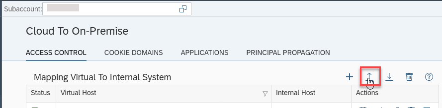
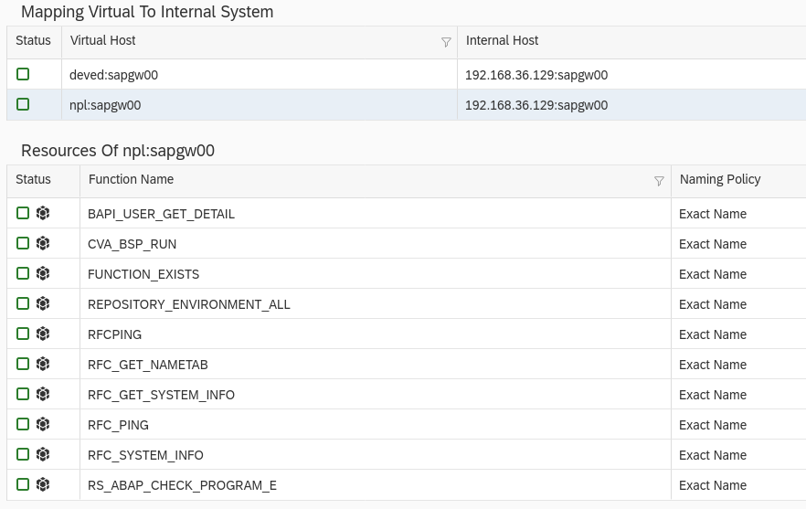
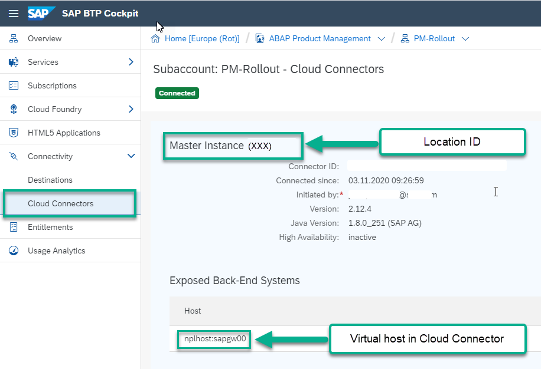
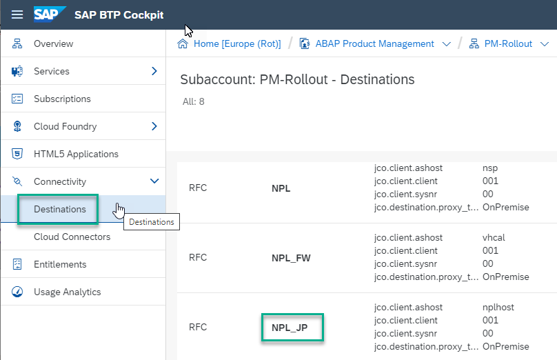

## Prerequisites
- **IMPORTANT**: This tutorial cannot be completed on a trial account (due to connectivity requirements)
- **Tutorial**: [Call a Remote Function Module From SAP Business Technology Platform, ABAP Environment](abap-env-rfc), prerequisites plus steps 1-2, then steps 4-5. (You can test connectivity by performing steps 6-12)
- In SAP Cloud Platform, ABAP environment, you have been assigned the role **`SAP_CORE_BC_CCM`**. This role allows you to connect your SAP Cloud and on-premise instances using communication objects For more information, see Tutorial [Create Communication System to Connect to SAP BTP, ABAP Environment](abap-environment-s4hanacloud), step 2
-	In your on-premise system, you have installed the following:
    - SAP Cloud Connector with Administrator rights. (In the systems listed in the above tutorial, this is pre-installed)
    - Java 8. Uninstall other versions of Java, e.g. Java 11

## Details
### You will learn
  - How to connect your on-premise AS ABAP to a service in SAP BTP, ABAP Environment - specifically, the Custom Code Migration App. This app allows you to see whether your custom ABAP development objects are cloud-ready, or ready for SAP S/4HANA, and what exact changes you have to make

After you set up the connections, your landscape will look roughly like this:

!

Throughout this tutorial, replace the suffix `_XXX` or `_JP` with your initials or group number.

---

[ACCORDION-BEGIN [Step 1: ](Open SAP Cloud Connector)]
In your browser, log on to SAP Cloud Connector for your on-premise system. If your on-premise system is SAP AS ABAP Developer Edition, 7.5x, open the browser inside your virtual machine, e.g. `VMWare`

  - Address = e.g. `https://localhost:<port>` (Default = 8443)
  - User = Administrator
  - Password = Your password. (Initial password = manage)

  !

Your Cloud Connector dashboard should look like this, with:

- At least one Cloud Foundry subaccount connected (1)
- At least one mapping from Cloud to on-premise (2)

Note the Location ID (3) - here, **`XXX`**. You will need it later.

  !

[DONE]
[ACCORDION-END]

[ACCORDION-BEGIN [Step 2: ](Add resources for Custom Code Migration (CCM) App)]
Now you will add the resources you need for the CCM app. Resources are, for example, RFCs or BAPIs that the app check needs to call.

1. Download the attachment in SAP Note [2861842](https://launchpad.support.sap.com/#/notes/2861842), `CustomCodeMigration(1).zip`. If using to the Linux system where your ABAP server is located.

    !

2. Choose **Cloud to On-Premise** on the left, then choose **Import System Mappings...**.

    !

3. Navigate to the `.zip` file you downloaded, then choose **Import**.

    !

4. The resources are downloaded:

!

[DONE]
[ACCORDION-END]

[ACCORDION-BEGIN [Step 3: ](Import SAP Notes)]
1.	Import the following SAP Notes (download, then upload):
    - [2599695 Custom Code Migration Fiori App: Remote Stubs for the Checked System](https://launchpad.support.sap.com/#/notes/2599695)
    - [2888880 Remote analysis: Bulk determination of method names](https://launchpad.support.sap.com/#/notes/2888880)
    - [2820446 Remote Analysis for source system, Release 7.52](https://launchpad.support.sap.com/#/notes/2820446), i.e. run the report **`RS_ABAP_INIT_ANALYSIS`**

2.	Implement SAP Notes.

Also, see SAP Note [2270689 Remote Analysis for source system](https://launchpad.support.sap.com/#/notes/2270689) for reference but do not implement it.

[DONE]
[ACCORDION-END]

[ACCORDION-BEGIN [Step 4: ](Check connectivity in SAP BTP cockpit)]
1. In the SAP BTP Cockpit of your Cloud Foundry subaccount, choose **Cloud Connectors**.

    !

    > The location ID points to the correct SAP Cloud Connector (located in the on-Premise system); The virtual host points to the on-Premise connection mapped in SAP Cloud Connector.

2. Still in the Cockpit, choose **Destinations**, then choose the destination you created previously, here **`NPL_JP`**.

    !

3. Check the following:
    - Destination Name = here, **`NPL_XXX`**
    - `jco.client.ashost` = here, **`nplhost`**
    - Location ID = here, **`XXX`**

      !

4. Check the connection by choosing **Check Connection**. You should get a message like this:

    !

[DONE]
[ACCORDION-END]

[ACCORDION-BEGIN [Step 5: ](Create communication system for Custom Code Migration)]
1. Open the dashboard for your SAP BTP, ABAP Environment instance. To find the URL for this, from the subaccount overview, choose the relevant space, e.g. **`Dev`**, then choose **Service Instances > ABAP System > Your System > View Dashboard**. Log on.

    !
    .
    !

2. Choose **Communication Management > Communication Systems**, then choose **New**.

    !

3. Enter a System ID, e.g. **`NPL_ATC_XXX`**. The application automatically provides an identically-named system name. Accept this.

4. Switch **Destination Service** to **ON**.

    !

5. Choose **Use Default Instance**, then choose the name of your destination service, **`NPL_JP`**, from the drop-down list.

    !

6. Save your changes.

[DONE]
[ACCORDION-END]

[ACCORDION-BEGIN [Step 6: ](Create communication arrangement for Custom Code Migration)]
1. From the home page, choose **Communication Management > Communication Arrangement > New**.

2. Enter the following, then choose **Create**:

    - Communication Scenario **`SAP_COM_0464`** - Choose from the dropdown list. If this communication scenario does not appear, then you are missing the correct authorizations and cannot complete this tutorial
    - Arrangement Name - Overwrite the default (identically-named), e.g. with **`SAP_COM_0464_XXX`** or **`SAP_COM_0464_SID`**.

      !

3. Choose your communication system from the dropdown list, **`SAP_COM_0464_XXX`**.

4. Save your changes.

    !

[DONE]
[ACCORDION-END]

[ACCORDION-BEGIN [Step 7: ](Assign business role for Custom Code Migration App)]
1.	Choose Identity and Access Management > Maintain Business Roles.
2.	Choose **`BR_IT_PROJECT_MANAGER`** > Edit.
3.	In Assigned Business Catalogs, choose Add > **`SAP_CORE_BC_CCM`** > Apply > OK.
The tile should appear in the Launchpad:

  !

[DONE]
[ACCORDION-END]

[ACCORDION-BEGIN [Step 8: ](Run Custom Code Migration App)]
1.	Choose Go.
2.	Choose Create to create new project.
    -	Target release = SAP BTP, ABAP Environment
    -	Destination = `SAP_COM_0464_NPL_XXX`
    -	Transition Scenario = New implementation

[DONE]
[ACCORDION-END]

[ACCORDION-BEGIN [Step 9: ](Test yourself)]

[VALIDATE_1]
[ACCORDION-END]

###More Information
[Custom code analysis for SAP S/4HANA with SAP Fiori App Custom Code Migration](https://blogs.sap.com/2019/02/27/custom-code-analysis-for-sap-s4hana-with-sap-fiori-app-custom-code-migration/)

---
