# Provide authorization control for a Business Configuration Maintenance Object
<!-- description --> Provide authorization control for a Business Configuration Maintenance Object

## Prerequisites  
- You need an SAP BTP, ABAP environment license. If you have only a trial account, you can skip this tutorial.
- This is the second tutorial of group [Create a SAP Fiori based Table Maintenance app](group.abap-env-factory). You must complete the tutorials in the given order.
- Install [ABAP Development Tools](https://tools.hana.ondemand.com/#abap). You can also follow **step 1** of this [tutorial](abap-install-adt) to install ADT.

## You will learn  
- How to create an IAM app
- How to create Business Catalog
- How to create and assign an IAM Business Catalog to a Business Role

## Intro
[Authorization control in RAP](https://help.sap.com/viewer/923180ddb98240829d935862025004d6/Cloud/en-US/375a8124b22948688ac1c55297868d06.html) protects your business object against unauthorized access to data:

 - To protect data from unauthorized read access, ABAP CDS provides its own authorization concept based on a data control language (DCL).
 - Modifying operations, such as standard operations and actions can be checked against unauthorized access during RAP runtime.

For this purposes the generated business object is checking authorization object `S_TABU_NAM` with the CDS entity `ZI_ERRORCODE###` and activity `03` (read) / `02` (modify).

---
### Create IAM app

  1. Right-click on package **`Z_ERROR_CODES_###`**, select **New** > **Other ABAP Repository Object**.

      

  2. Search for **IAM App**, select it and click **Next >**.

      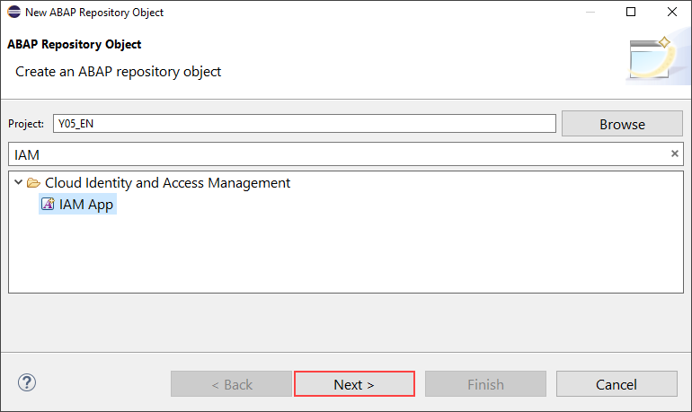

  3. Create a new IAM app:
      - Name: **`Z_ERROR_CODES_###`**
      - Description: **`Error Codes - Maintenance`**
      - Application Type: **`MBC - Business Configuration App`**

     

      Click **Next >**.

  4. Select a Transport Request and click **Finish**.

  5. Select **Services** and add a new service.

      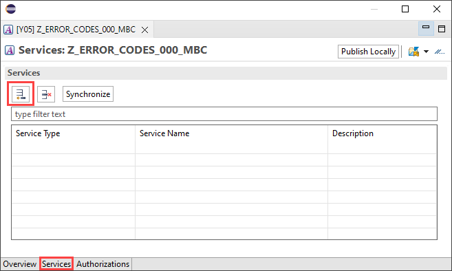

  6. Select your service:
      - Service Type: **`OData V4`**
      - Service Name: **`ZUI_ERRORCODE000_O4`**

     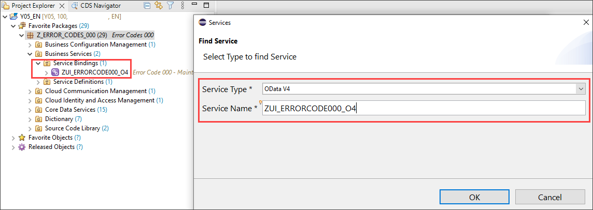

      Click **OK**.

  7. Select **Authorizations** and add a new authorization object.

      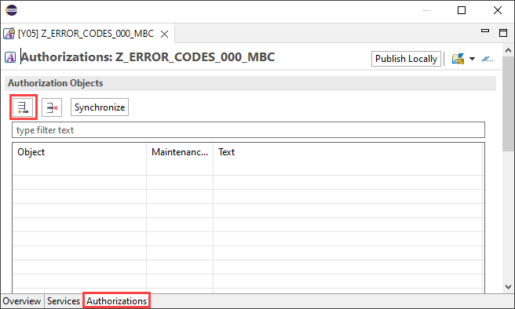

  8. Search for **`S_TABU_NAM`** and click **OK**.

      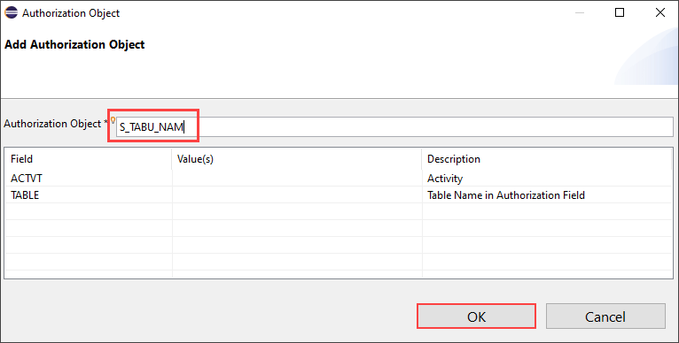

  9. Select **`S_TABU_NAM`**, select **ACTVT** under **Authorization 0001** to check **`Change`** and **`Display`**.

      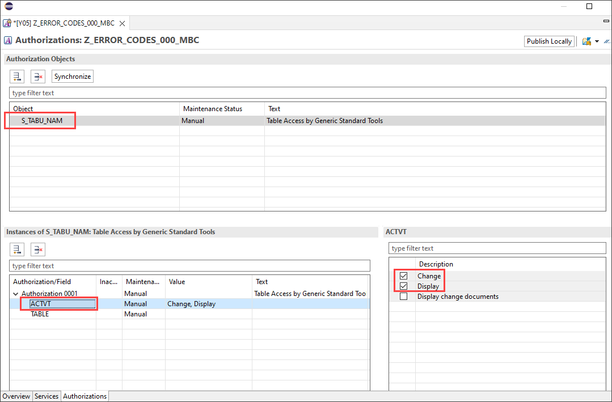

 10. Click **TABLE** and add entity **`ZI_ERRORCODE###`**

      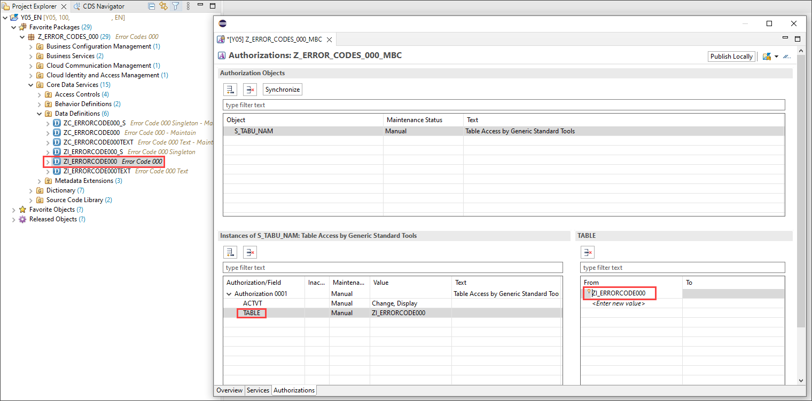

 11. For the user to see the changes in the  [**Business Configuration Change Logs**](https://help.sap.com/viewer/65de2977205c403bbc107264b8eccf4b/Cloud/en-US/5c6cf20499894f1083e80dba7c5963d4.html) app, add an additional instance of the authorization object with **`Display change documents`** for activity and the table names.

      

 12. Save the IAM app. Further information on IAM apps can be found [here](https://help.sap.com/viewer/5371047f1273405bb46725a417f95433/Cloud/en-US/032faaf4f9184484ba9295c81756e831.html).

### Create business catalog

  1. In the overview section of the IAM app, click on **Create a new Business Catalog and assign the App to it**

      
  2. Enter the following and click on **Next >**.

      - Name: **`Z_ERROR_CODES_###`**
      - Description: **`Error Codes - Maintenance`**

     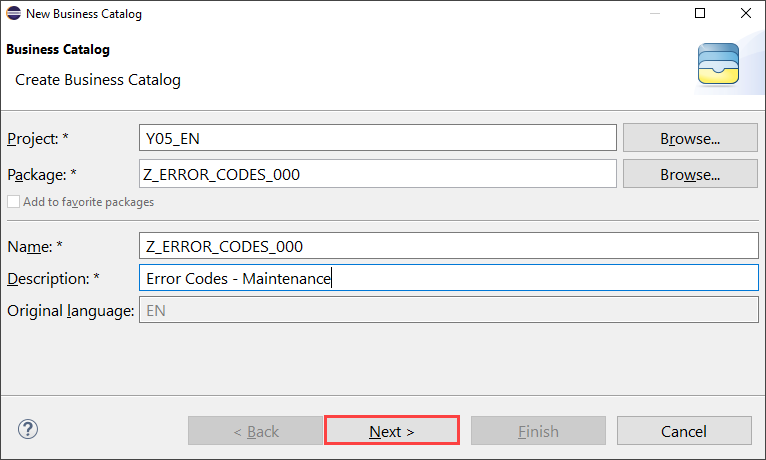

  3. Select a Transport Request and click **Finish**.

  4. Finish the wizard to create the Business Catalog App Assignment.

      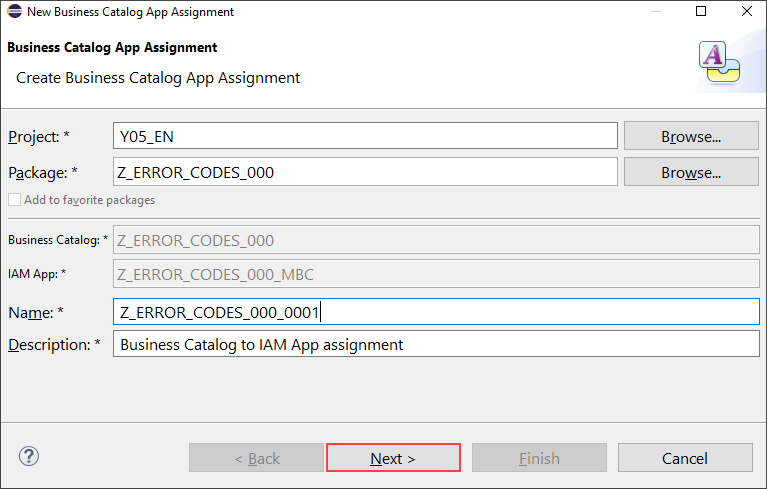

  5. In the Business Catalog click **Publish Locally** to be able to test your app in the development system.

      

### Assign Business Catalog to Business Role and maintain restrictions

  1. To [create a Business Role](https://help.sap.com/docs/BTP/65de2977205c403bbc107264b8eccf4b/8ffb880eafec4078a1e5051227cb64b1.html) and assign it to your user, start the SAP Build Work Zone. Or right-click on your ABAP system and select **Properties**.

      

  2. Select **ABAP Development** and click on the **system URL**.

      

  3. Logon with a user with the role `SAP_BR_ADMINISTRATOR - Administrator`

  4. Click **Maintain Business Roles**.

      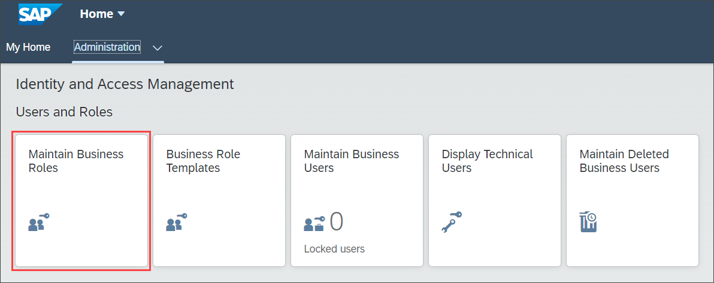

  5. Click **New** to create a new Business Role.

      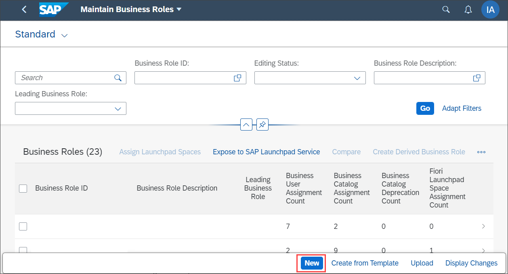

  6. Create a new Business Role:
      - Business Role ID: **`ZBR_ERROR_CODES_EXPERT_###`**
      - Business Role Description: **`Error Codes Expert`**

      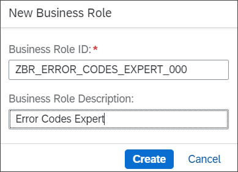

      Click **Create**.

  7. Select **Assigned Business Catalogs** and click **Add**.

      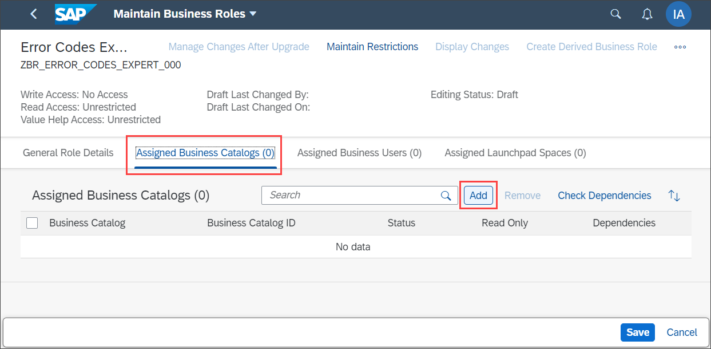

  8. Search for `Z_ERROR_CODES_###`, select it and click **OK**.

      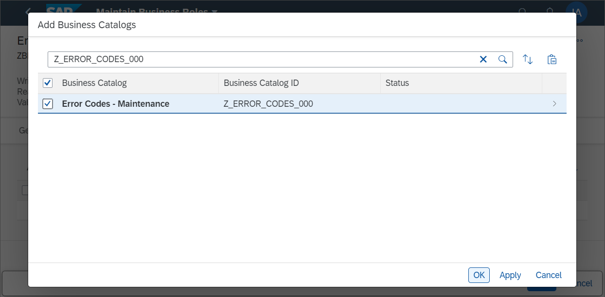

  9. Select **General Role Details** and set Access Category **Write, Read, Value Help** to **`Unrestricted`**

     

10. Select **Assigned Business Users** and click **Add**.

     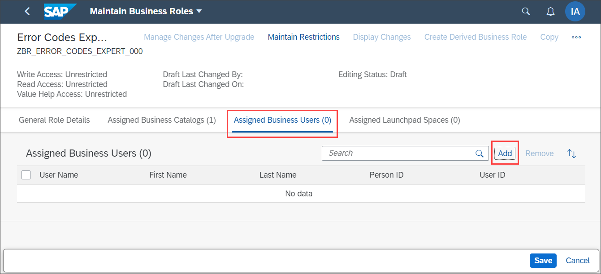

11. Select the user responsible for maintaining the error codes and click **OK**

12. Click **Save** to save the Business Role

### Test yourself

---
