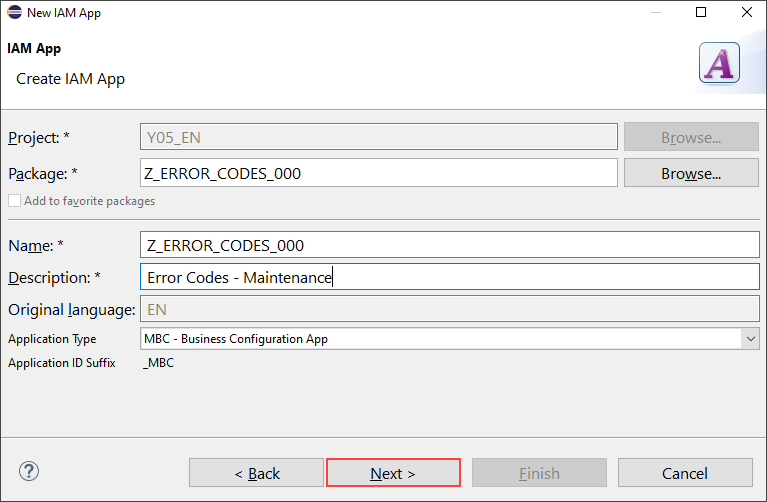
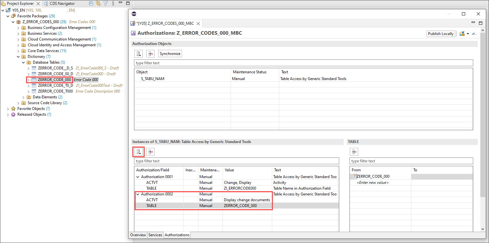
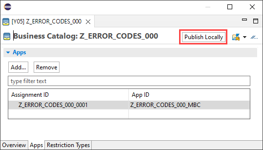
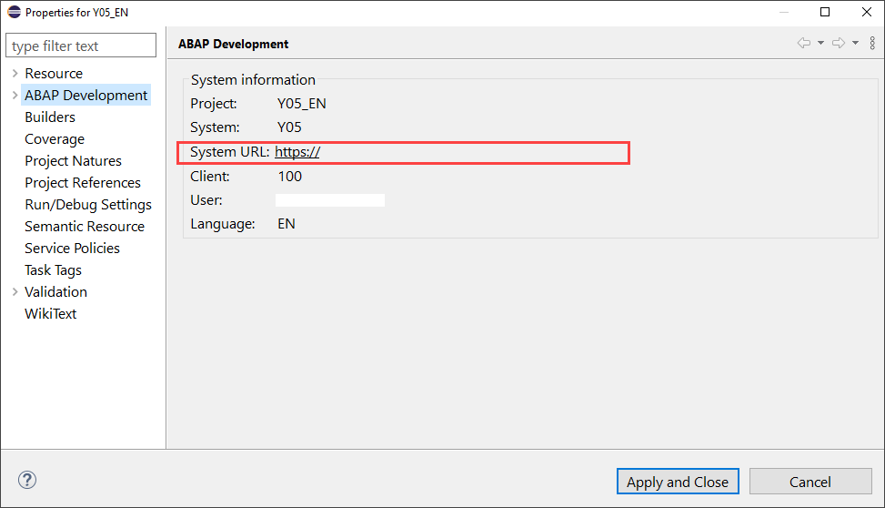
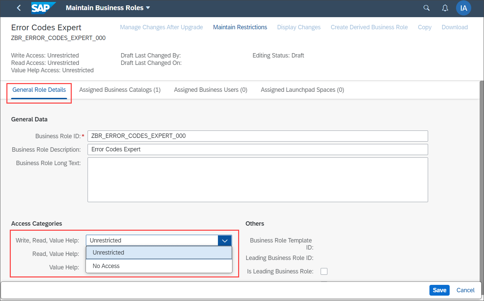

## Prerequisites  
- You need an SAP BTP, ABAP environment [trial user](abap-environment-trial-onboarding) or a license.
- Install [ABAP Development Tools](https://tools.hana.ondemand.com/#abap). You can also follow **step 1** of this [tutorial](abap-install-adt) to install ADT.

## Details
### You will learn  
- How to create an IAM app
- How to create business catalog
- How to create assign an IAM business catalog to a business role
- How to maintain restrictions

[Authorization control in RAP](https://help.sap.com/viewer/923180ddb98240829d935862025004d6/Cloud/en-US/375a8124b22948688ac1c55297868d06.html) protects your business object against unauthorized access to data:

 - To protect data from unauthorized read access, ABAP CDS provides its own authorization concept based on a data control language (DCL).
 - Modifying operations, such as standard operations and actions can be checked against unauthorized access during RAP runtime.

For this purposes the generated business object is checking authorization object `S_TABU_NAM` with the CDS entity `ZI_HOLIDAY###` and activity **03** (read) / **02** (modify).

>**Hint:** Don't forget to replace all occurrences of the placeholder ### with your ID of choice in the exercise steps below. You can use the ADT function Replace All (`CTRL+F`) for the purpose.

---
[ACCORDION-BEGIN [Step 1: ](Create IAM app)]

  1. Right-click on **`Z_Calendar_###`**, select **New** > **Other ABAP Repository Object**.
    

  2. Search for **IAM App**, select it and click **Next >**.
    

  3. Create a new IAM app:
      - Name: `ZUI_HOLIDAY_O4_###`
      - Description: IAM App for factory calendar
      - Application Type: `MBC - Business Configuration App`

     

      Click **Next >**.

  4. Click **Finish**.
    

  5. Select **Services** and add a new service.
    

  6. Select your service:
      - Service Type: `OData V4`
      - Service Name: `ZUI_HOLIDAY000_O4`

     

      Click **OK**.

  7. Select **Authorizations** and add a new authorization object.
    

  8. Search for `S_TABU_NAM` and click **OK**.
    

  9. Select `S_TABU_NAM`, select `ACTVT` under Authorization 0001 to check **Change** and **Display**.
    

10. Click **TABLE** and add entity `ZI_HOLIDAY###`.
    

11. For the user to see the changes in the  [**Business Configuration Change Logs**](https://help.sap.com/viewer/65de2977205c403bbc107264b8eccf4b/Cloud/en-US/5c6cf20499894f1083e80dba7c5963d4.html) app, add an additional instance of the authorization object with `Display change documents` for activity and the table names.
    

12. Save the IAM app.

13. Click **Publish Locally**, if you want to test your app in the development system.

    

      If you don't have a SAP BTP, ABAP environment license you can instead do the following:
      Delete the content of method `GET_GLOBAL_AUTHORIZATIONS` in the `Local types` section of class `ZBP_I_HOLIDAY###_S`. Afterwards activate the class.
      Delete the generated access control objects and publish the service of service binding `ZUI_HOLIDAY###_O4` as a local service endpoint.

      Further information on IAM apps can be found [here](https://help.sap.com/viewer/5371047f1273405bb46725a417f95433/Cloud/en-US/032faaf4f9184484ba9295c81756e831.html).

[DONE]
[ACCORDION-END]

[ACCORDION-BEGIN [Step 2: ](Create business catalog)]

  1. In the overview section of the IAM app, click on `Create a new Business Catalog and assign the App to it`.

      - Name: `Z_BC_HOLIDAY_###`
      - Description: Business catalog for holiday

     

      Click **Next >**.

  4. Click **Finish**.
    

  5. Finish the wizard to create the Business Catalog App Assignment.
      

  6. Click **Publish Locally**, if you want to test your app in the development system.
      

[DONE]
[ACCORDION-END]

[ACCORDION-BEGIN [Step 3: ](Assign IAM business catalog to business role and maintain restrictions)]

  1. Right-click on your ABAP system and select **Properties**.

      

  2. Select **ABAP Development**, copy the system URL and paste it in a browser of choice.

      

  3. Log in to your ABAP system.

      

  4. Click **Maintain Business Roles**.

      

  5. Click **New** to create a new business role.

      

  6. Create a new business role:
      - Business Role ID: `ZBR_Holiday_###`
      - Business Role Description: Business role for holiday calendar

      

      Click **Create**.

  7. Select **Assigned Business Catalogs** and click **Add**.

      

  8. Search for `Z_BC_HOLIDAY_###`, select it and click **OK** and **Apply**.

      

  9. Select **Assigned Business Users** and click **Add**.

     

10. Search for your user, select it and click **OK** and **Apply**.

     

11. Select **Maintain Restrictions**.

     

12. Set write, read and value help to unrestricted and go back.

     

13. Click **Save**.

      

[DONE]
[ACCORDION-END]

[ACCORDION-BEGIN [Step 3: ](Test yourself)]

[VALIDATE_1]
[ACCORDION-END]
---
