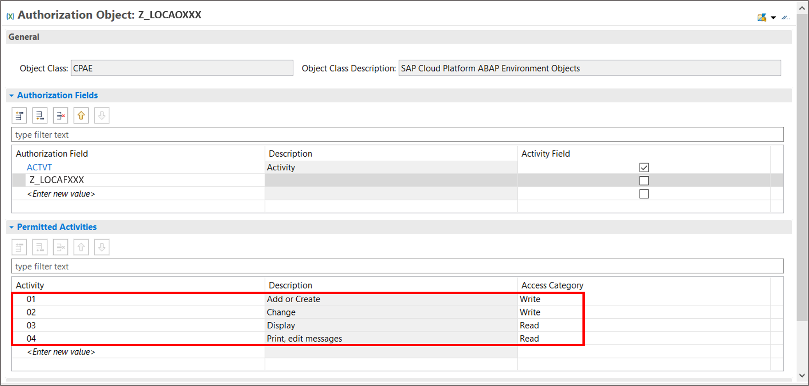
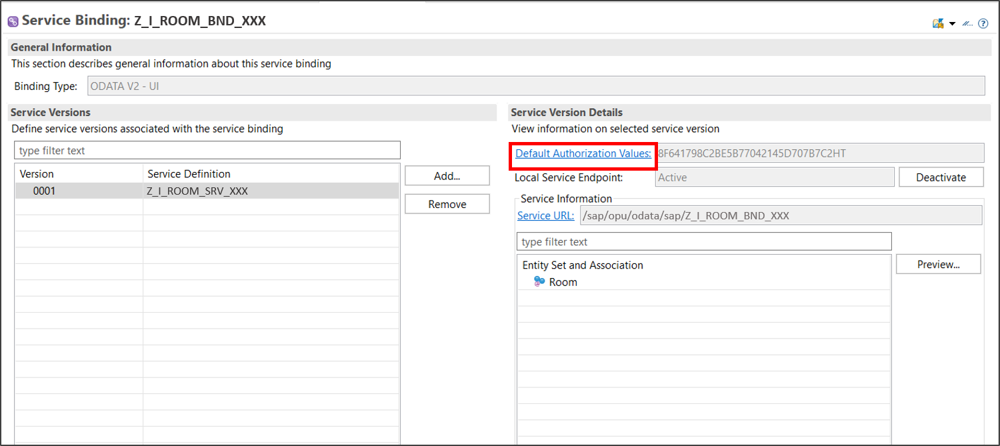
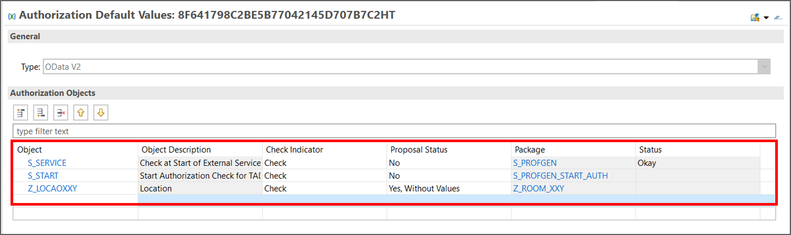
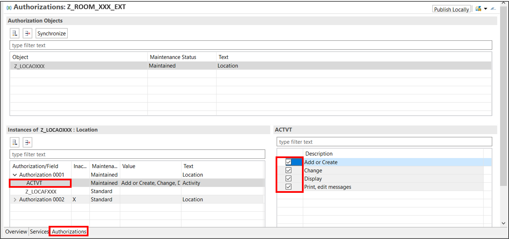
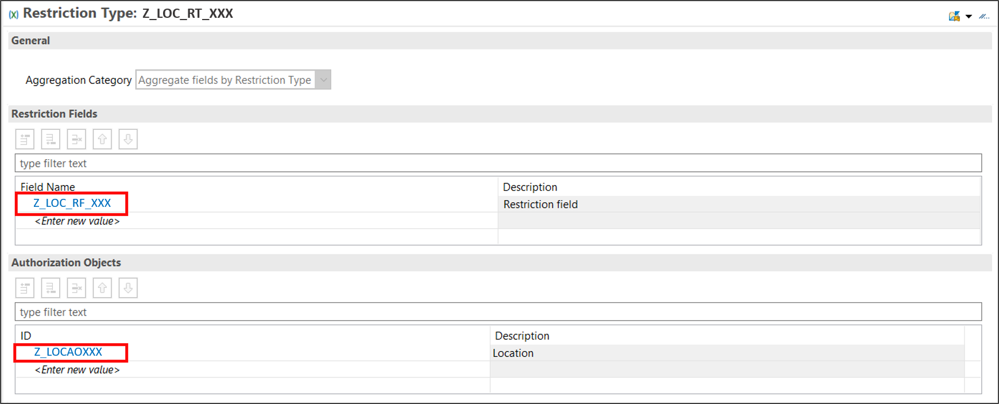

## Prerequisites  
  - You need a SAP BTP, ABAP environment license.
  - ADT version 2.96 or higher

## Details
### You will learn
  - How to create authorization fields
  - How to create access controls
  - How to edit authorization default values
  - How to create IAM Apps and services
  - How to create restriction fields and restriction types
  - How to create business catalogs
  - How to create restriction types

In this tutorial, wherever `XXX` appears, use a number (e.g. `000`).

---


[ACCORDION-BEGIN [Step 1: ](Create authorization field)]
1. Right-click on **`Z_ROOM_XXX`**, select the menu path **New** > **Other ABAP Repository Object**.

      

2. Search for **Authorization Field**, select it and click **Next>**.

    

2. Create your **authorization field**:
     - Name: **`Z_LOCAFXXX`**

     Click **Next>**.

    

3. Click **Finish**.

    

4. Edit your authorization field:
      - Data Element: **`Z_LOCA_DTEL_XXX`**

    Save and activate.

    

[DONE]
[ACCORDION-END]


[ACCORDION-BEGIN [Step 2: ](Create authorization object)]
1. Right-click on **`Z_ROOM_XXX`**, select the menu path **New** > **Other ABAP Repository Object**.

      

2. Search for **Authorization Object**, select it and click **Next>**.

    

3.  Create your **authorization object**:
       - Name: **`Z_LOCAOXXX`**
       - Description: **`Location`**

       Click **Next>**.

       

4. Click **Finish**.

      

5. Edit your authorization object and save it. The description and access category will appear then.

      

      Save and activate.


[DONE]
[ACCORDION-END]

[ACCORDION-BEGIN [Step 3: ](Create access control)]
  1. Right-click on **`Z_ROOM_XXX`**, select the menu path **New** > **Other ABAP Repository Object**.

      

  2. Search for **Access Control**, select it and click **Next>**.

      

  3.  Create your **access control:**
     - Name: **`Z_I_ROOM_XXX`**
     - Description: **`Room`**

     Click **Next>**.

      

  4. Click **Next>**.

      

  5. Select **Define Role with PFCG Aspect** and click **Finish**.

      

  6. Edit your service definition:
    ```ABAP
    @EndUserText.label: 'Room'
    @MappingRole: true
    define role Z_I_Room_XXX
    {
      grant
        select
            on
                Z_I_ROOM_XXX
                    where
                        (location) = aspect pfcg_auth(Z_LOCAOXXX, Z_LOCAFXXX, ACTVT = '03');  
    }
    ```
    Save and activate.

[DONE]
[ACCORDION-END]

[ACCORDION-BEGIN [Step 4: ](Enhance behavior)]
Switch to your behavior implementation, click `CTRL + F` and search for method validate. Edit following as your validate method.
```ABAP
     METHOD validate.
        AUTHORITY-CHECK OBJECT 'Z_LOCAOXXX' ID 'ACTVT' FIELD iv_action ID 'Z_LOCAFXXX' FIELD is_room-location.
        IF sy-subrc <> 0.
          rv_message = 'Not authorized'.
        ENDIF.
    ENDMETHOD.
```

Save and activate.

[DONE]
[ACCORDION-END]

[ACCORDION-BEGIN [Step 5: ](Edit authorization default values)]
  1. Select your service binding`Z_I_ROOM_BND_XXX` and click **Default Authorization Values**.

      

  2. Define following objects:

      

      Save and activate.


[DONE]
[ACCORDION-END]

[ACCORDION-BEGIN [Step 6: ](Create IAM app & add service)]
  1. Right-click on **`Z_ROOM_XXX`**, select the menu path **New** > **Other ABAP Repository Object**.

      

  2. Search for **IAM App**, select it and click **Next>**.

      

  3.  Create your **IAM App:**
     - Name: **`Z_ROOM_XXX`**
     - Description: **`Room`**

     Click **Next>**.

      

  4. Click **Finish**.

      

  5. Select **Services**.

      

  6. Add new services.

      

  7. Find your service:
    - Service Type: `OData V2`
    - Service Name: `Z_I_ROOM_BND_XXX_0001`

    Add `_0001` to your service name to find it.
    Click **OK**.

      

  8. Click **Authorizations**.

      

  9. Select following activity:

      

      Save and activate.

[DONE]
[ACCORDION-END]


[ACCORDION-BEGIN [Step 7: ](Create restriction field and restriction type)]
  1. Right-click on your package **`Z_ROOM_XXX`** and select **New** > **Other ABAP Repository Object**.

    

  2. Search for **restriction field**, select it and click **Next >**.

    

  3. Create your restriction field:
    - Name: **`Z_LOC_RF_XXX`**
    - Description: Restriction field

      

    Click **Next >**.

  4. Click **Finish**.  

    

  5. Add **`Z_LOCAFXXX`** as authorization field, save and activate.

    

  6. Right-click on your package **`Z_ROOM_XXX`** and select **New** > **Other ABAP Repository Object**.

    

  7. Search for **restriction type**, select it and click **Next >**.

    

  8. Create your restriction field:
    - Name: **`Z_LOC_RT_XXX`**
    - Description: Restriction type for location

    

    Click **Next >**.

  9. Click **Finish**.   

    

  10. Add **`Z_LOC_RF_XXX`** as restriction field AND **`Z_LOCAOXXX`** as restriction object.

    

    Save and activate.


[DONE]
[ACCORDION-END]


[ACCORDION-BEGIN [Step 8: ](Create business catalog & add IAM app)]
  1. Right-click on **`Z_ROOM_XXX`**, select the menu path **New** > **Other ABAP Repository Object**.

      

  2. Search for **Business Catalog**, select it and click **Next>**.

      

  3.  Create your **business catalog:**
     - Name: **`Z_ROOM_BC_XXX`**
     - Description: **`Room`**

     Click **Next>**.

      

  4. Click **Finish**.

      

  5. Select **Apps**.

      

  6. Add new Apps.

      

  7. Add your App:
    - App ID: `Z_ROOM_XXX_EXT`
    - Assignment ID: `Z_ROOM_BC_XXX_0001`

    Click **Next>**.

      

  8.  Click **Finish**.

      

  9. Click **Publish Locally**

      

[DONE]
[ACCORDION-END]

[ACCORDION-BEGIN [Step 9: ](Create restriction type)]

Open your business catalog **`Z_ROOM_BC_XXX`**, add **`Z_LOC_RT_XXX`** as a restriction type, select write and click **Publish Locally**.


[DONE]
[ACCORDION-END]

[ACCORDION-BEGIN [Step 10: ](Test yourself)]

[VALIDATE_1]
[ACCORDION-END]
