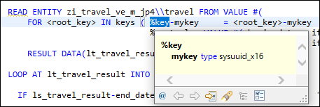
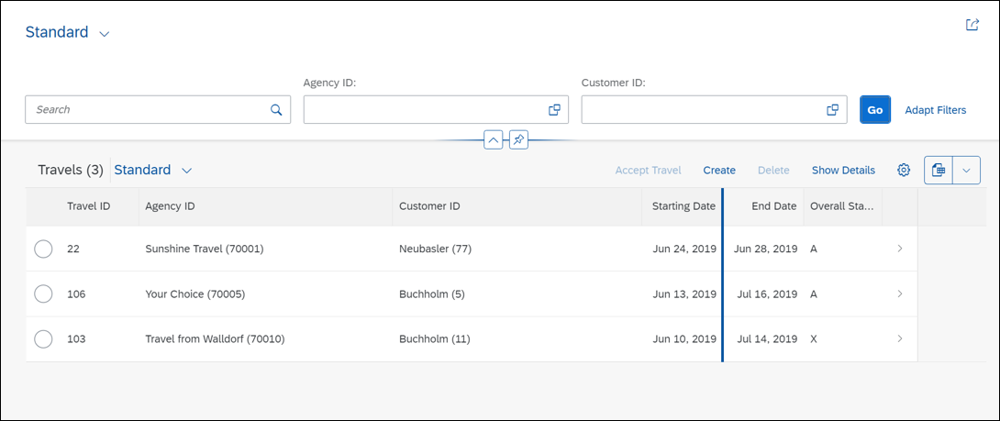

# Enhance Behavior With Action and Validation
<!-- description --> Enhance behavior definition and implementation with action and validation.

## Prerequisites  
- You need an SAP BTP, ABAP environment [trial user](abap-environment-trial-onboarding) or a license.
- You have downloaded and installed the [latest ABAP Development Tools (ADT)] (https://tools.hana.ondemand.com/#abap).


## You will learn  
  - How to enhance behavior definition
  - How to enhance behavior implementation
  - How to enhance behavior definition for projection view
  - How to implement more validation methods
  - How to implement determinations
  - How to implement action


## Intro
In this tutorial, wherever XXX appears, use a number (e.g. 000).

---

### Enhance behavior definition

  1. Switch to your behavior definition `ZI_TRAVEL_M_XXX` and replace your code with following:

    ```ABAP
    managed implementation in class ZBP_I_TRAVEL_M_XXX unique;

    define behavior for ZI_TRAVEL_M_XXX alias Travel
    persistent table ztravel_xxx
    etag master last_changed_at
    lock master
    {
      // key that will be automatically generated by the framework
      field ( readonly, numbering : managed ) mykey;

      // semantic key calculated in a determination
      field ( readonly ) travel_id;

      // administrative fields (read only)
      field ( readonly ) last_changed_at, last_changed_by, created_at, created_by;

      // mandatory fields that are required to create a travel
      field ( mandatory ) agency_id, overall_status, booking_fee, currency_code;

      // mandatory fields that are required to create a travel
      field ( mandatory ) Begin_Date, End_Date, Customer_ID;

      // standard operations for travel entity
      create;
      update;
      delete;

      // instance action and dynamic action control
      action ( features : instance ) acceptTravel result [1] $self;

      // validations
      validation validateCustomer on save { field customer_id; }
      validation validateDates on save { field begin_date, end_date; }
      validation validateAgency on save
      { field agency_id; }

      // determination
      determination CalculateTravelKey on modify
      { create; }

    }
    ```

  2. Save and activate.

      

>**HINT:** `$self` means that the instance of the same type is returned on which the operation is performed – here a travel instance.


### Enhance behavior definition for projection view

  1. Switch to your behavior definition `ZC_TRAVEL_M_XXX` and replace your code with following:

    ```ABAP
    projection;

    define behavior for ZC_TRAVEL_M_XXX alias TravelProcessor
    use etag
    {
      use create;
      use update;
      use delete;

      use action acceptTravel;
    }
    ```

  2. Save and activate.

      

     The **validation** allows you to check the data consistency of your travel booking application.

     By using **actions** your are able to change the status of your booking status.


### Create implementation class

  1. In your behavior definition `ZI_Travel_M_XXX` set the cursor before the implementation class `ZBP_I_TRAVEL_M_XXX` and click **`CTRL` + 1**. Double-click on **Create behavior implementation class `zbp_i_travel_m_xxx`** to create your implementation class.

      

  2. Create a new behavior implementation:

     - Description: Behavior implementation for `ZI_TRAVEL_M_XXX`

     Click **Next >**.

      

  3. Click **Finish** to use your transport request.

      

    >**HINT:** The skeleton code of the class appears in a new editor. The skeleton includes code for the relevant method definitions and implementations, derived from your behavior definition `ZI_TRAVEL_M_XXX`.


### Enhance behavior implementation

  1. Switch to **Local Types**.

  2. First you will implement a validation. This code checks that each `agencyID` is valid. In your **local types**, add the following code, so that the result looks like this:

    ```ABAP
    *"* use this source file for the definition and implementation of
    *"* local helper classes, interface definitions and type
    *"* declarations

    CLASS lhc_travel DEFINITION INHERITING FROM cl_abap_behavior_handler.

      PRIVATE SECTION.

        TYPES tt_travel_update TYPE TABLE FOR UPDATE zi_travel_m_xxx.

        METHODS validate_customer          FOR VALIDATE ON SAVE IMPORTING keys FOR travel~validateCustomer.
        METHODS validate_dates             FOR VALIDATE ON SAVE IMPORTING keys FOR travel~validateDates.
        METHODS validate_agency            FOR VALIDATE ON SAVE IMPORTING keys FOR travel~validateAgency.

        METHODS set_status_completed       FOR MODIFY IMPORTING   keys FOR ACTION travel~acceptTravel              RESULT result.
        METHODS get_features               FOR FEATURES IMPORTING keys REQUEST    requested_features FOR travel    RESULT result.

        METHODS CalculateTravelKey         FOR DETERMINE ON MODIFY IMPORTING keys FOR Travel~CalculateTravelKey.


    ENDCLASS.

    CLASS lhc_travel IMPLEMENTATION.

    ********************************************************************************
    *
    * Implements the dynamic feature handling for travel instances
    *
    ********************************************************************************
      METHOD get_features.

        "%control-<fieldname> specifies which fields are read from the entities

        READ ENTITY zi_travel_m_xxx FROM VALUE #( FOR keyval IN keys
                                                          (  %key                    = keyval-%key
                                                          "  %control-travel_id      = if_abap_behv=>mk-on
                                                            %control-overall_status = if_abap_behv=>mk-on
                                                            ) )
                                    RESULT DATA(lt_travel_result).


        result = VALUE #( FOR ls_travel IN lt_travel_result
                          ( %key                           = ls_travel-%key
                            %features-%action-acceptTravel = COND #( WHEN ls_travel-overall_status = 'A'
                                                                        THEN if_abap_behv=>fc-o-disabled ELSE if_abap_behv=>fc-o-enabled   )
                          ) ).

      ENDMETHOD.

      METHOD validate_agency.

        READ ENTITY zi_travel_m_xxx\\travel FROM VALUE #(
            FOR <root_key> IN keys ( %key-mykey     = <root_key>-mykey
                                    %control = VALUE #( agency_id = if_abap_behv=>mk-on ) ) )
            RESULT DATA(lt_travel).

        DATA lt_agency TYPE SORTED TABLE OF /dmo/agency WITH UNIQUE KEY agency_id.

        " Optimization of DB select: extract distinct non-initial customer IDs
        lt_agency = CORRESPONDING #( lt_travel DISCARDING DUPLICATES MAPPING agency_id = agency_id EXCEPT * ).
        DELETE lt_agency WHERE agency_id IS INITIAL.
        CHECK lt_agency IS NOT INITIAL.

        " Check if customer ID exist
        SELECT FROM /dmo/agency FIELDS agency_id
          FOR ALL ENTRIES IN @lt_agency
          WHERE agency_id = @lt_agency-agency_id
          INTO TABLE @DATA(lt_agency_db).

        " Raise msg for non existing customer id
        LOOP AT lt_travel INTO DATA(ls_travel).
          IF ls_travel-agency_id IS NOT INITIAL AND NOT line_exists( lt_agency_db[ agency_id = ls_travel-agency_id ] ).
            APPEND VALUE #(  mykey = ls_travel-mykey ) TO failed-travel.
            APPEND VALUE #(  mykey = ls_travel-mykey
                            %msg      = new_message( id       = /dmo/cx_flight_legacy=>agency_unkown-msgid
                                                      number   = /dmo/cx_flight_legacy=>agency_unkown-msgno
                                                      v1       = ls_travel-agency_id
                                                      severity = if_abap_behv_message=>severity-error )
                            %element-agency_id = if_abap_behv=>mk-on ) TO reported-travel.
          ENDIF.

        ENDLOOP.


      ENDMETHOD.

      METHOD calculatetravelkey.

      ENDMETHOD.

      METHOD set_status_completed.

      ENDMETHOD.

      METHOD validate_customer.

      ENDMETHOD.

      METHOD validate_dates.

      ENDMETHOD.

    ENDCLASS.
    ```

    >**HINT:** The code does the following:

    >- Read data for the travel instance from the transactional buffer.

    >- Create internal table
        - containing all agencies with a distinct `AgencyID`  
        - Optimize DB select: extract distinct non-initial agency IDs
        - then perform a DB SELECT to validate their existence

    >- Loop over internal table = (`lt_travel`),  
        - check whether an `AgencyID` has been provided and if it exists,  
    >- raise messages if invalid `AgencyID`.  

    >   (If the `AgencyID` is either empty or does not exist in the check-table, a message is raised using exception class `cx_flight_legacy`)

    >---------------------------------------------

    >**NOTE:**   

    >- `mykey` = automatically generated by the framework (see step 1)

    >- `%key` = key of the relevant entity, here travel

    > 

    >- `%control` = Specifies which elements are requested by the consumer


### Implement more validation methods


  1. In your `CLASS lhc_travel IMPLEMENTATION` add two more validation methods, `validate_customer` and `validate_dates`.

    ```ABAP
    **********************************************************************
    *
    * Validate customer data when saving travel data
    *
    **********************************************************************
      METHOD validate_customer.

        READ ENTITY zi_travel_m_xxx\\travel FROM VALUE #(
            FOR <root_key> IN keys ( %key-mykey     = <root_key>-mykey
                                     %control = VALUE #( customer_id = if_abap_behv=>mk-on ) ) )
            RESULT DATA(lt_travel).

        DATA lt_customer TYPE SORTED TABLE OF /dmo/customer WITH UNIQUE KEY customer_id.

        " Optimization of DB select: extract distinct non-initial customer IDs
        lt_customer = CORRESPONDING #( lt_travel DISCARDING DUPLICATES MAPPING customer_id = customer_id EXCEPT * ).
        DELETE lt_customer WHERE customer_id IS INITIAL.
        CHECK lt_customer IS NOT INITIAL.

        " Check if customer ID exist
        SELECT FROM /dmo/customer FIELDS customer_id
          FOR ALL ENTRIES IN @lt_customer
          WHERE customer_id = @lt_customer-customer_id
          INTO TABLE @DATA(lt_customer_db).

        " Raise msg for non existing customer id
        LOOP AT lt_travel INTO DATA(ls_travel).
          IF ls_travel-customer_id IS NOT INITIAL AND NOT line_exists( lt_customer_db[ customer_id = ls_travel-customer_id ] ).
            APPEND VALUE #(  mykey = ls_travel-mykey ) TO failed-travel.
            APPEND VALUE #(  mykey = ls_travel-mykey
                             %msg      = new_message( id       = /dmo/cx_flight_legacy=>customer_unkown-msgid
                                                      number   = /dmo/cx_flight_legacy=>customer_unkown-msgno
                                                      v1       = ls_travel-customer_id
                                                      severity = if_abap_behv_message=>severity-error )
                             %element-customer_id = if_abap_behv=>mk-on ) TO reported-travel.
          ENDIF.
        ENDLOOP.
      ENDMETHOD.


    **********************************************************************
    *
    * Check validity of date
    *
    **********************************************************************
      METHOD validate_dates.

        READ ENTITY zi_travel_m_xxx\\travel FROM VALUE #(
          FOR <root_key> IN keys ( %key-mykey     = <root_key>-mykey
                                   %control = VALUE #( begin_date = if_abap_behv=>mk-on
                                                       end_date   = if_abap_behv=>mk-on ) ) )
          RESULT DATA(lt_travel_result).

        LOOP AT lt_travel_result INTO DATA(ls_travel_result).

          IF ls_travel_result-end_date < ls_travel_result-begin_date.  "end_date before begin_date

            APPEND VALUE #( %key        = ls_travel_result-%key
                            mykey   = ls_travel_result-mykey ) TO failed-travel.

            APPEND VALUE #( %key     = ls_travel_result-%key
                            %msg     = new_message( id       = /dmo/cx_flight_legacy=>end_date_before_begin_date-msgid
                                                    number   = /dmo/cx_flight_legacy=>end_date_before_begin_date-msgno
                                                    v1       = ls_travel_result-begin_date
                                                    v2       = ls_travel_result-end_date
                                                    v3       = ls_travel_result-travel_id
                                                    severity = if_abap_behv_message=>severity-error )
                            %element-begin_date = if_abap_behv=>mk-on
                            %element-end_date   = if_abap_behv=>mk-on ) TO reported-travel.

          ELSEIF ls_travel_result-begin_date < cl_abap_context_info=>get_system_date( ).  "begin_date must be in the future

            APPEND VALUE #( %key        = ls_travel_result-%key
                            mykey   = ls_travel_result-mykey ) TO failed-travel.

            APPEND VALUE #( %key = ls_travel_result-%key
                            %msg = new_message( id       = /dmo/cx_flight_legacy=>begin_date_before_system_date-msgid
                                                number   = /dmo/cx_flight_legacy=>begin_date_before_system_date-msgno
                                                severity = if_abap_behv_message=>severity-error )
                            %element-begin_date = if_abap_behv=>mk-on
                            %element-end_date   = if_abap_behv=>mk-on ) TO reported-travel.
          ENDIF.
        ENDLOOP.
      ENDMETHOD.
    ```

  2. Don't save and activate yet.


### Implement action


  1. Now you will implement an action. In your `CLASS lhc_travel IMPLEMENTATION` implement method `set_status_completed`:

    ```ABAP
    ********************************************************************************
    *
    * Implements travel action (in our case: for setting travel overall_status to completed)
    *
    ********************************************************************************
    METHOD set_status_completed.

      " Modify in local mode: BO-related updates that are not relevant for authorization checks
      MODIFY ENTITIES OF zi_travel_m_xxx IN LOCAL MODE
             ENTITY travel
                UPDATE FROM VALUE #( FOR key IN keys ( mykey = key-mykey
                                                       overall_status = 'A' " Accepted
                                                       %control-overall_status = if_abap_behv=>mk-on ) )
             FAILED   failed
             REPORTED reported.

      " Read changed data for action result
      READ ENTITIES OF zi_travel_m_xxx IN LOCAL MODE
           ENTITY travel
           FROM VALUE #( FOR key IN keys (  mykey = key-mykey
                                            %control = VALUE #(
                                              agency_id       = if_abap_behv=>mk-on
                                              customer_id     = if_abap_behv=>mk-on
                                              begin_date      = if_abap_behv=>mk-on
                                              end_date        = if_abap_behv=>mk-on
                                              booking_fee     = if_abap_behv=>mk-on
                                              total_price     = if_abap_behv=>mk-on
                                              currency_code   = if_abap_behv=>mk-on
                                              overall_status  = if_abap_behv=>mk-on
                                              description     = if_abap_behv=>mk-on
                                              created_by      = if_abap_behv=>mk-on
                                              created_at      = if_abap_behv=>mk-on
                                              last_changed_by = if_abap_behv=>mk-on
                                              last_changed_at = if_abap_behv=>mk-on
                                            ) ) )
           RESULT DATA(lt_travel).

      result = VALUE #( FOR travel IN lt_travel ( mykey = travel-mykey
                                                  %param    = travel
                                                ) ).

    ENDMETHOD.
    ```

    >**NOTE:**

    >- %control = Specifies which elements are requested by the consumer

    >- %param = Holds the import/result type of actions

    >- result: as defined in the behavior definition (step 1) = $self =  a travel instance

  2. Don't save and activate yet.


### Implement determination


  >**HINT:** A determination modifies instances of business objects based on trigger conditions. Here, the code updates the relevant data instance of travel by setting the `overall_status` to A (for accepted.)
  To avoid authorization checks, you add the suffix `IN LOCAL MODE`.
  Determinations must be idempotent – i.e. the result must not differ, even if the determination is executed multiple times for the same key.

  1. Implement method `CalculateTravelKey`:

    ```ABAP
    METHOD calculatetravelkey.
      READ ENTITIES OF zi_travel_m_xxx IN LOCAL MODE
          ENTITY Travel
            FIELDS ( travel_id )
            WITH CORRESPONDING #( keys )
          RESULT DATA(lt_travel).

      DELETE lt_travel WHERE travel_id IS NOT INITIAL.
      CHECK lt_travel IS NOT INITIAL.

      "Get max travelID
      SELECT SINGLE FROM ztravel_xxx FIELDS MAX( travel_id ) INTO @DATA(lv_max_travelid).

      "update involved instances
      MODIFY ENTITIES OF zi_travel_m_xxx IN LOCAL MODE
        ENTITY Travel
          UPDATE FIELDS ( travel_id )
          WITH VALUE #( FOR ls_travel IN lt_travel INDEX INTO i (
                             %key      = ls_travel-%key
                             travel_id  = lv_max_travelid + i ) )
      REPORTED DATA(lt_reported).


    ENDMETHOD.
    ```

    >**HINT:** The code:
    >- Checks if TravelID is already filled
    >- Removes lines where TravelID is already filled
    >- Gets maximum travelID
    >- Sets new travelID by incrementing by 1


### Check your code


  1. Check your result. Your complete **local types** of your behavior implementation should look like this:

    ```ABAP
    *"* use this source file for the definition and implementation of
    *"* local helper classes, interface definitions and type
    *"* declarations

    CLASS lhc_travel DEFINITION INHERITING FROM cl_abap_behavior_handler.

      PRIVATE SECTION.

        TYPES tt_travel_update TYPE TABLE FOR UPDATE zi_travel_m_xxx.

        METHODS validate_customer          FOR VALIDATE ON SAVE IMPORTING keys FOR travel~validateCustomer.
        METHODS validate_dates             FOR VALIDATE ON SAVE IMPORTING keys FOR travel~validateDates.
        METHODS validate_agency            FOR VALIDATE ON SAVE IMPORTING keys FOR travel~validateAgency.

        METHODS set_status_completed       FOR MODIFY IMPORTING   keys FOR ACTION travel~acceptTravel              RESULT result.
        METHODS get_features               FOR FEATURES IMPORTING keys REQUEST    requested_features FOR travel    RESULT result.

        METHODS CalculateTravelKey         FOR DETERMINE ON MODIFY IMPORTING keys FOR Travel~CalculateTravelKey.


    ENDCLASS.

    CLASS lhc_travel IMPLEMENTATION.

    ********************************************************************************
    *
    * Implements the dynamic feature handling for travel instances
    *
    ********************************************************************************
      METHOD get_features.

        "%control-<fieldname> specifies which fields are read from the entities

        READ ENTITY zi_travel_m_xxx FROM VALUE #( FOR keyval IN keys
                                                          (  %key                    = keyval-%key
                                                          "  %control-travel_id      = if_abap_behv=>mk-on
                                                            %control-overall_status = if_abap_behv=>mk-on
                                                            ) )
                                    RESULT DATA(lt_travel_result).


        result = VALUE #( FOR ls_travel IN lt_travel_result
                          ( %key                           = ls_travel-%key
                            %features-%action-acceptTravel = COND #( WHEN ls_travel-overall_status = 'A'
                                                                        THEN if_abap_behv=>fc-o-disabled ELSE if_abap_behv=>fc-o-enabled   )
                          ) ).

      ENDMETHOD.

      METHOD validate_agency.

        READ ENTITY zi_travel_m_xxx\\travel FROM VALUE #(
            FOR <root_key> IN keys ( %key-mykey     = <root_key>-mykey
                                    %control = VALUE #( agency_id = if_abap_behv=>mk-on ) ) )
            RESULT DATA(lt_travel).

        DATA lt_agency TYPE SORTED TABLE OF /dmo/agency WITH UNIQUE KEY agency_id.

        " Optimization of DB select: extract distinct non-initial customer IDs
        lt_agency = CORRESPONDING #( lt_travel DISCARDING DUPLICATES MAPPING agency_id = agency_id EXCEPT * ).
        DELETE lt_agency WHERE agency_id IS INITIAL.
        CHECK lt_agency IS NOT INITIAL.

        " Check if customer ID exist
        SELECT FROM /dmo/agency FIELDS agency_id
          FOR ALL ENTRIES IN @lt_agency
          WHERE agency_id = @lt_agency-agency_id
          INTO TABLE @DATA(lt_agency_db).

        " Raise msg for non existing customer id
        LOOP AT lt_travel INTO DATA(ls_travel).
          IF ls_travel-agency_id IS NOT INITIAL AND NOT line_exists( lt_agency_db[ agency_id = ls_travel-agency_id ] ).
            APPEND VALUE #(  mykey = ls_travel-mykey ) TO failed-travel.
            APPEND VALUE #(  mykey = ls_travel-mykey
                            %msg      = new_message( id       = /dmo/cx_flight_legacy=>agency_unkown-msgid
                                                      number   = /dmo/cx_flight_legacy=>agency_unkown-msgno
                                                      v1       = ls_travel-agency_id
                                                      severity = if_abap_behv_message=>severity-error )
                            %element-agency_id = if_abap_behv=>mk-on ) TO reported-travel.
          ENDIF.

        ENDLOOP.


      ENDMETHOD.

      METHOD calculatetravelkey.
        READ ENTITIES OF zi_travel_m_xxx IN LOCAL MODE
            ENTITY Travel
              FIELDS ( travel_id )
              WITH CORRESPONDING #( keys )
            RESULT DATA(lt_travel).

        DELETE lt_travel WHERE travel_id IS NOT INITIAL.
        CHECK lt_travel IS NOT INITIAL.

        "Get max travelID
        SELECT SINGLE FROM ztravel_xxx FIELDS MAX( travel_id ) INTO @DATA(lv_max_travelid).

        "update involved instances
        MODIFY ENTITIES OF zi_travel_m_xxx IN LOCAL MODE
          ENTITY Travel
            UPDATE FIELDS ( travel_id )
            WITH VALUE #( FOR ls_travel IN lt_travel INDEX INTO i (
                              %key      = ls_travel-%key
                              travel_id  = lv_max_travelid + i ) )
        REPORTED DATA(lt_reported).


      ENDMETHOD.

    ********************************************************************************
    *
    * Implements travel action (in our case: for setting travel overall_status to completed)
    *
    ********************************************************************************
      METHOD set_status_completed.

        " Modify in local mode: BO-related updates that are not relevant for authorization checks
        MODIFY ENTITIES OF zi_travel_m_xxx IN LOCAL MODE
              ENTITY travel
                  UPDATE FROM VALUE #( FOR key IN keys ( mykey = key-mykey
                                                        overall_status = 'A' " Accepted
                                                        %control-overall_status = if_abap_behv=>mk-on ) )
              FAILED   failed
              REPORTED reported.

        " Read changed data for action result
        READ ENTITIES OF zi_travel_m_xxx IN LOCAL MODE
            ENTITY travel
            FROM VALUE #( FOR key IN keys (  mykey = key-mykey
                                              %control = VALUE #(
                                                agency_id       = if_abap_behv=>mk-on
                                                customer_id     = if_abap_behv=>mk-on
                                                begin_date      = if_abap_behv=>mk-on
                                                end_date        = if_abap_behv=>mk-on
                                                booking_fee     = if_abap_behv=>mk-on
                                                total_price     = if_abap_behv=>mk-on
                                                currency_code   = if_abap_behv=>mk-on
                                                overall_status  = if_abap_behv=>mk-on
                                                description     = if_abap_behv=>mk-on
                                                created_by      = if_abap_behv=>mk-on
                                                created_at      = if_abap_behv=>mk-on
                                                last_changed_by = if_abap_behv=>mk-on
                                                last_changed_at = if_abap_behv=>mk-on
                                              ) ) )
            RESULT DATA(lt_travel).

        result = VALUE #( FOR travel IN lt_travel ( mykey = travel-mykey
                                                    %param    = travel
                                                  ) ).

      ENDMETHOD.


    **********************************************************************
    *
    * Validate customer data when saving travel data
    *
    **********************************************************************
      METHOD validate_customer.

        READ ENTITY zi_travel_m_xxx\\travel FROM VALUE #(
            FOR <root_key> IN keys ( %key-mykey     = <root_key>-mykey
                                    %control = VALUE #( customer_id = if_abap_behv=>mk-on ) ) )
            RESULT DATA(lt_travel).

        DATA lt_customer TYPE SORTED TABLE OF /dmo/customer WITH UNIQUE KEY customer_id.

        " Optimization of DB select: extract distinct non-initial customer IDs
        lt_customer = CORRESPONDING #( lt_travel DISCARDING DUPLICATES MAPPING customer_id = customer_id EXCEPT * ).
        DELETE lt_customer WHERE customer_id IS INITIAL.
        CHECK lt_customer IS NOT INITIAL.

        " Check if customer ID exist
        SELECT FROM /dmo/customer FIELDS customer_id
          FOR ALL ENTRIES IN @lt_customer
          WHERE customer_id = @lt_customer-customer_id
          INTO TABLE @DATA(lt_customer_db).

        " Raise msg for non existing customer id
        LOOP AT lt_travel INTO DATA(ls_travel).
          IF ls_travel-customer_id IS NOT INITIAL AND NOT line_exists( lt_customer_db[ customer_id = ls_travel-customer_id ] ).
            APPEND VALUE #(  mykey = ls_travel-mykey ) TO failed-travel.
            APPEND VALUE #(  mykey = ls_travel-mykey
                            %msg      = new_message( id       = /dmo/cx_flight_legacy=>customer_unkown-msgid
                                                      number   = /dmo/cx_flight_legacy=>customer_unkown-msgno
                                                      v1       = ls_travel-customer_id
                                                      severity = if_abap_behv_message=>severity-error )
                            %element-customer_id = if_abap_behv=>mk-on ) TO reported-travel.
          ENDIF.
        ENDLOOP.
      ENDMETHOD.


    **********************************************************************
    *
    * Check validity of date
    *
    **********************************************************************
      METHOD validate_dates.

        READ ENTITY zi_travel_m_xxx\\travel FROM VALUE #(
          FOR <root_key> IN keys ( %key-mykey     = <root_key>-mykey
                                  %control = VALUE #( begin_date = if_abap_behv=>mk-on
                                                      end_date   = if_abap_behv=>mk-on ) ) )
          RESULT DATA(lt_travel_result).

        LOOP AT lt_travel_result INTO DATA(ls_travel_result).

          IF ls_travel_result-end_date < ls_travel_result-begin_date.  "end_date before begin_date

            APPEND VALUE #( %key        = ls_travel_result-%key
                            mykey   = ls_travel_result-mykey ) TO failed-travel.

            APPEND VALUE #( %key     = ls_travel_result-%key
                            %msg     = new_message( id       = /dmo/cx_flight_legacy=>end_date_before_begin_date-msgid
                                                    number   = /dmo/cx_flight_legacy=>end_date_before_begin_date-msgno
                                                    v1       = ls_travel_result-begin_date
                                                    v2       = ls_travel_result-end_date
                                                    v3       = ls_travel_result-travel_id
                                                    severity = if_abap_behv_message=>severity-error )
                            %element-begin_date = if_abap_behv=>mk-on
                            %element-end_date   = if_abap_behv=>mk-on ) TO reported-travel.

          ELSEIF ls_travel_result-begin_date < cl_abap_context_info=>get_system_date( ).  "begin_date must be in the future

            APPEND VALUE #( %key        = ls_travel_result-%key
                            mykey   = ls_travel_result-mykey ) TO failed-travel.

            APPEND VALUE #( %key = ls_travel_result-%key
                            %msg = new_message( id       = /dmo/cx_flight_legacy=>begin_date_before_system_date-msgid
                                                number   = /dmo/cx_flight_legacy=>begin_date_before_system_date-msgno
                                                severity = if_abap_behv_message=>severity-error )
                            %element-begin_date = if_abap_behv=>mk-on
                            %element-end_date   = if_abap_behv=>mk-on ) TO reported-travel.
          ENDIF.
        ENDLOOP.
      ENDMETHOD.


    ENDCLASS.
    ```

  2. Save and activate.

      


### Check result


  1. Now switch to your service binding and double click on `TravelProcessor`.

      

  2. Check your result.

      The behavior implementation is created for travel booking. By using the managed approach, the implementation of create, update and delete is done automatically.

     The accept travel button appears.
     Create a new travel booking with the booking status O.
     O stands for open. Save your travel booking and you are able to accept your created travel booking.

      

    >**Hint:** If your UI buttons don't appear, please add a space anywhere you want in your data definition `ZI_TRAVEL_M_XXX` and behavior definition `ZI_TRAVEL_M_XXX`, activate both and open your SAP Fiori preview again. It takes 120 seconds to make the buttons visible on the user interface.

### Test yourself

---

### Next

You can [deploy your ABAP application with SAP Business Application Studio](abap-environment-deploy-cf-production). Follow therefore the tutorial.

### More Information
[Entity Manipulation Language (EML)](https://help.sap.com/viewer/923180ddb98240829d935862025004d6/Cloud/en-US/af7782de6b9140e29a24eae607bf4138.html )

[Examples of EML](https://help.sap.com/viewer/923180ddb98240829d935862025004d6/Cloud/en-US/ec279ca529d4497ea41e7674a4daf9e2.html )

[Validations](https://help.sap.com/viewer/923180ddb98240829d935862025004d6/Cloud/en-US/171e26c36cca42699976887b4c8a83bf.html )

[Determinations](https://help.sap.com/viewer/923180ddb98240829d935862025004d6/Cloud/en-US/6edb0438d3e14d18b3c403c406fbe209.html )

[Actions](https://help.sap.com/viewer/923180ddb98240829d935862025004d6/Cloud/en-US/83bad707a5a241a2ae93953d81d17a6b.html )

[Feature Control](https://help.sap.com/viewer/923180ddb98240829d935862025004d6/Cloud/en-US/a5055eef86fa492d99a29b3a9c7c2b88.html )

[Implicit Returning Parameters](https://help.sap.com/viewer/923180ddb98240829d935862025004d6/Cloud/en-US/aceaf8453d4b4e628aa29aa7dfd7d948.html )

[RAP course: `openSAP`](https://open.sap.com/courses/cp13 )
