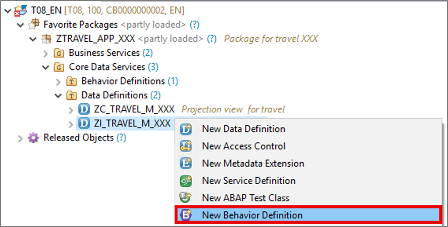
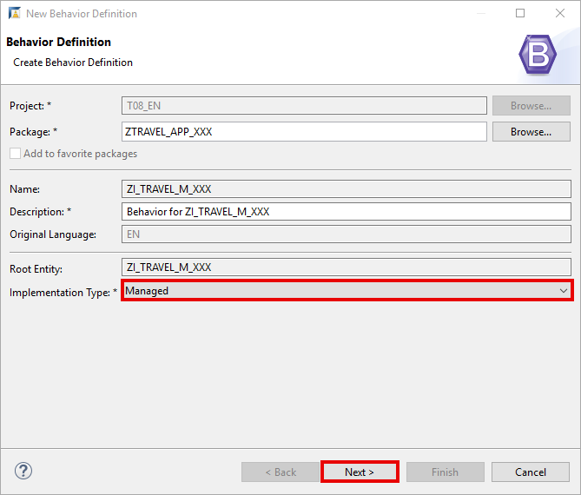
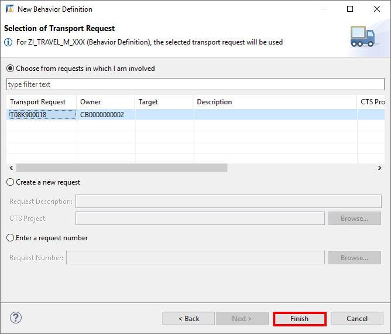
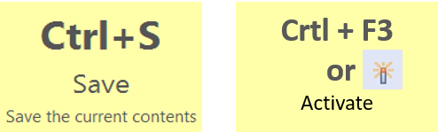
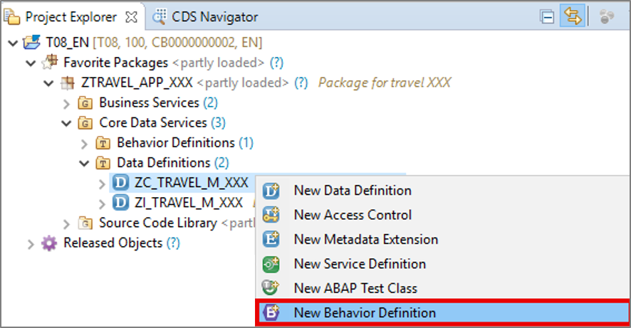
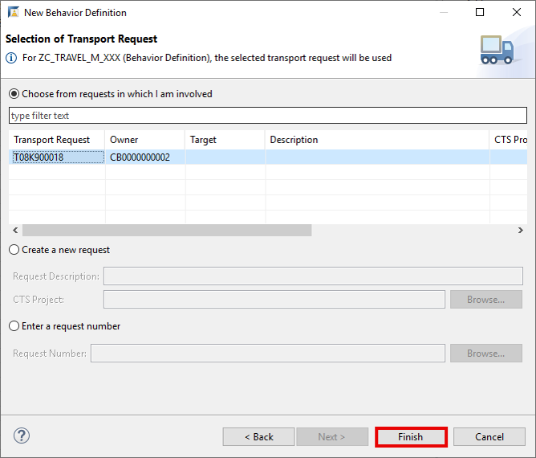
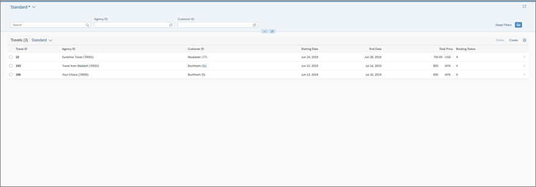

## Prerequisites  
- You need an SAP BTP, ABAP environment [trial user](abap-environment-trial-onboarding) or a license.
- You have downloaded Eclipse Photon or Oxygen and installed ABAP Development Tools (ADT). See <https://tools.hana.ondemand.com/#abap>.

## Details
### You will learn  
  - How to create behavior definition
  - How to create behavior implementation
  - How to create behavior definition for projection view

In this tutorial, wherever XXX appears, use a number (e.g. 000).

---

[ACCORDION-BEGIN [Step 1: ](Create behavior definition)]
  1. Right-click on your data definition `ZI_TRAVEL_M_XXX` and select **New Behavior Definition**. 

      

  2. Check your behavior definition. Your **implementation type** is **managed**.

     Click **Next >**.

      

  3. Click **Finish** to use your transport request.

      

  4. Replace your code with following.

    ```ABAP
    managed implementation in class ZCL_BP_I_TRAVEL_M_XXX unique;

    define behavior for ZI_TRAVEL_M_XXX alias Travel
    persistent table ztravel_xxx
    etag master last_changed_at
    lock master
    {

      // semantic key is calculated in a determination
      field ( readonly ) travel_id;

      // administrative fields (read only)
      field ( readonly ) last_changed_at, last_changed_by, created_at, created_by;

      // mandatory fields that are required to create a travel
      field ( mandatory ) agency_id, overall_status, booking_fee, currency_code;

      // mandatory fields that are required to create a travel
      field ( mandatory ) Begin_Date, End_Date, Customer_ID;

      // standard operations for travel entity
      create;
      update;
      delete;
    }  
    ```

  5. Save and activate.

      

    A warning will appear first, but after the creation of the behavior implementation it will disappear.  

    Now the **behavior definition** is created and determines the create, update and delete functionality for travel booking.


[DONE]
[ACCORDION-END]

[ACCORDION-BEGIN [Step 2: ](Create behavior definition for projection view)]
  1. Right-click on your data definition `ZC_TRAVEL_M_XXX` and select **New Behavior Definition**.

      

  2. Check your behavior definition. Your implementation type is projection.

     Click **Next >**.

      

  3. Click **Finish** to use your transport request.

      

  4. Replace your code with following:

    ```ABAP
    projection;

    define behavior for ZC_TRAVEL_M_XXX alias TravelProcessor
    use etag
    {
      use create;
      use update;
      use delete;
    }
    ```

  5. Save and activate.

      

  6. Now switch to your service binding and double click on `TravelProcessor`.

      

  7. **Refresh** your browser and check your result.

     The create and delete button appears on the UI because of the managed scenario.
     You can create and edit travel bookings or you' re able to delete existing ones.

     Please note that the semantic key Travel ID is not calculated yet. We will do this in the next tutorial.

      

[DONE]
[ACCORDION-END]

[ACCORDION-BEGIN [Step 3: ](Test yourself)]

[VALIDATE_1]
[ACCORDION-END]
---
