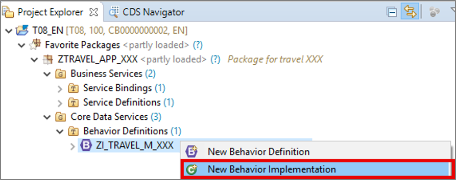
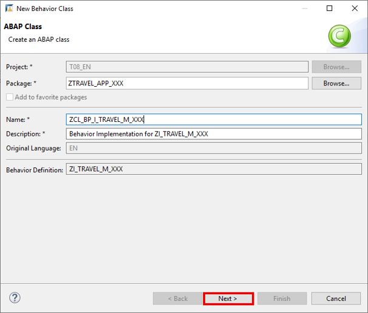

## Prerequisites  
- You have created an SAP Cloud Platform ABAP environment trial user or
- You have created a developer user in an SAP Cloud Platform ABAP Environment system.
- You have downloaded Eclipse Photon or Oxygen and installed ABAP Development Tools (ADT). See <https://tools.hana.ondemand.com/#abap>.

## Details
### You will learn  
  - How to create behavior definition
  - How to create behavior implementation
  - How to create behavior definition for projection view

In this tutorial, wherever XXX appears, use a number (e.g. 000).

---

[ACCORDION-BEGIN [Step 1: ](Create behavior definition)]
  1. Right-click on your data definition `ZI_TRAVEL_M_XXX` and select **New Behavior Definition**. 

      

  2. Check your behavior definition. Your **implementation type** is **managed**.

     Click **Next >**.

      

  3. Click **Finish** to use your transport request.

      

  4. Replace your code with following.

    ```ABAP
    managed implementation in class ZCL_BP_I_TRAVEL_M_XXX unique;

    define behavior for ZI_Travel_M_XXX alias Travel
    persistent table ztravel_xxx
    etag last_changed_at
    lock master
    {
    // administrative fields (read only)
    field ( readonly ) last_changed_at, last_changed_by, created_at, created_by;

    // mandatory fields that are required to create a travel
    field ( mandatory ) agency_id, overall_status, booking_fee, currency_code;

    // dynamic field control
    field (features : instance ) travel_id;

    // standard operations for travel entity
    create;
    update;
    delete;
    }
    ```

  5. Save and activate.

      

    A warning will appear first, but after the creation of the behavior implementation it will disappear.  

    Now the **behavior definition** is created and determines the create, update and delete functionality for travel booking.


[DONE]
[ACCORDION-END]

[ACCORDION-BEGIN [Step 2: ](Create behavior implementation)]
  1. Right-click on your behavior definition `ZI_TRAVEL_M_XXX` and select **New Behavior Implementation**.

      

  2. Create a new behavior implementation:

     - Name: `ZCL_BP_I_TRAVEL_M_XXX`

     Click **Next >**.

      

  3. Click **Finish** to use your transport request.

      

  4. In your **global class** replace your code with following:

    ```ABAP
    CLASS zcl_bp_i_travel_m_xxx DEFINITION
    PUBLIC
    ABSTRACT
    FINAL
    FOR BEHAVIOR OF ZI_Travel_M_XXX.

    ENDCLASS.

    CLASS zcl_bp_i_travel_m_xxx IMPLEMENTATION.
    ENDCLASS.
    ```

  5. In your **local types** replace your code with following:

    ```ABAP
    *"* use this source file for the definition and implementation of
    *"* local helper classes, interface definitions and type
    *"* declarations
    CLASS lhc_travel DEFINITION INHERITING FROM cl_abap_behavior_handler.

      PRIVATE SECTION.

        TYPES tt_travel_update TYPE TABLE FOR UPDATE zi_travel_m_xxx.

        METHODS get_features               FOR FEATURES IMPORTING keys REQUEST    requested_features FOR travel    RESULT result.

    ENDCLASS.

    CLASS lhc_travel IMPLEMENTATION.

      METHOD get_features.
      ENDMETHOD.

    ENDCLASS.
    ```

  6. Save and activate.

      

     The **behavior** implementation is created for travel booking. By using the managed approach, the implementation of create, update and delete is done automatically.

[DONE]
[ACCORDION-END]

[ACCORDION-BEGIN [Step 3: ](Create behavior definition for projection view)]
  1. Right-click on your data definition `ZC_TRAVEL_M_XXX` and select **New Behavior Definition**.

      

  2. Check your behavior definition. Your implementation type is projection.

     Click **Next >**.

      

  3. Click **Finish** to use your transport request.

      

  4. Replace your code with following:

    ```ABAP
    projection;

    define behavior for ZC_TRAVEL_M_XXX alias TravelProcessor
    use etag
    {
    // scenario specific field control
    field ( mandatory ) BeginDate, EndDate, CustomerID;

    use create;
    use update;
    use delete;
    }

    ```

  5. Save and activate.

      

  6. Now switch to your service binding and double click on `TravelProcessor`.

      

  7. Check your result.

     The create and delete button appears on the UI because of the managed scenario.
     You can create and edit travel bookings or you' re able to delete existing ones.

      

[DONE]
[ACCORDION-END]


[ACCORDION-BEGIN [Step 4: ](Test yourself)]

[VALIDATE_1]
[ACCORDION-END]
---
