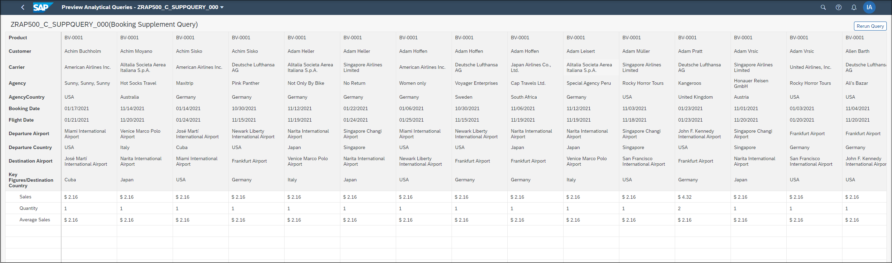
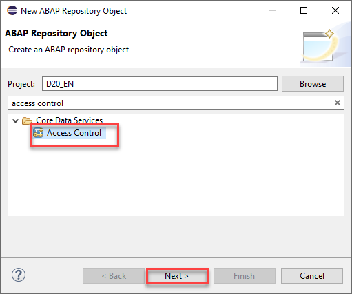
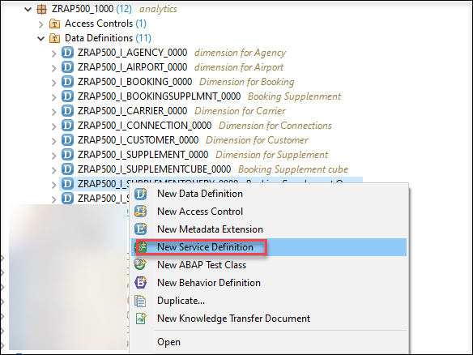
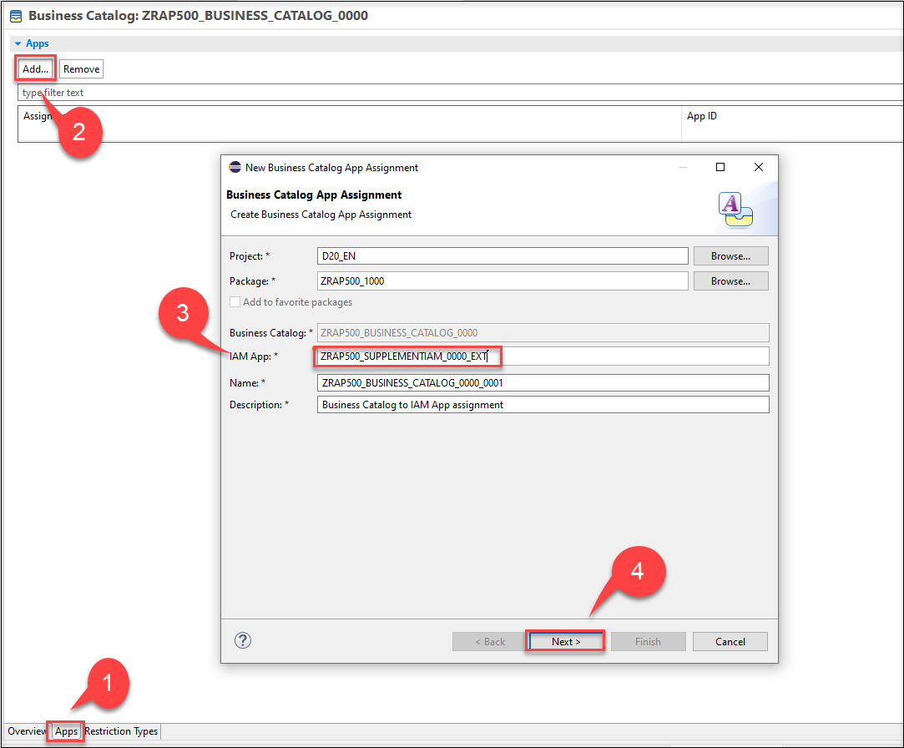

# Develop Queries Based on Booking Supplement and Consume on SAP Analytics Cloud
<!-- description --> Develop analytical queries based on booking supplements from ABAP system as data sources and consume them in the SAP Analytics Cloud to create analytical models, stories and multi-dimensional reports.

## Prerequisites
- You need the standard developer authorization profile to create ABAP development objects.
- You need a SAP Analytics Cloud account.
- Install `ABAPGit` Plugin in ADT. See <http://eclipse.abapgit.org/updatesite/>
- To get the Flight Model into the system, follow the description at <https://github.com/SAP/abap-platform-refscen-flight/blob/master/README.md>
- Requires Customer or Partner License.
- You can find an intermediate tutorial for SAP Analytics Cloud here <https://developers.sap.com/tutorials/abap-environment-analytics.html>.


## You will learn
 - How to create an analytical query based on booking supplement as CDS View Entities
 - How to connect an ABAP System to SAP Analytics Cloud
 - How to consume analytical queries on SAP Analytics Cloud by creating models and stories

## Intro
Always replace `####` with your initials or group number.
---

### Overview

The new **RAP based InA service exposure** enables the SAP Business Technology Platform ABAP Environment developers to develop analytical queries(based on ABAP-CDS analytical data models) and expose them via the `InA` (Information Access) service protocol. In this Tutorial you will create a complete Analytical Data Model for Booking data. This consists out of dimensions for Carrier, Customer, Connection and Agency data, as well as an interface CDS view for Booking data which acts as a data source for the cube and query.
These analytical queries can be further consumed in the SAP Analytics cloud to create analytical models, stories, multi-dimensional reports and more.


### Import templates for Analytical CDS views


As a first task you will start to import templates that you will use in this tutorial to create Analytical CDS views such as dimension views, cubes and queries.

The templates already contain certain annotations that are mandatory for the above mentioned analytical CDS views. If values such as the name of a property have to be added this can then simply be done by using code completion.

  1. Click on the following link to display the file analytical_templates.xml. [Templates](https://raw.githubusercontent.com/SAP-samples/abap-platform-rap-workshops/main/rap5xx/rap500/sources/analytical_templates.xml)

  2. Right-click on the browser window and save the content as an xml-file called **analytical_templates.xml**.

    

  3. Open ADT. In the menu choose **Window** > **Preferences**.

    

  4. In the Templates dialogue choose **Import**.

    

  5. Select the XML file **analytical_templates.xml** that you have saved.

    


    > The Import-Dialog only allows to select files having the extension `.xml.` When you have downloaded the file using a different file extension you have first to rename your file so that it gets the extension `.xml.`

  6. You will see that three new templates have been imported that you will use in the following tutorial.

    Press **Apply and Close**

    


### Create dimension for Agency


>Dimensions views are links to various master data, which are later used in reporting as further attributes (according to which different aggregations can be made) and thus make up the versatility of our Analytical Model.

>In the following you will create seven dimension views for Travel Agencies, Carrier, Customers, Connections, Airport, Booking and Supplements so that you can visualize our measures Quantity, Sales and Average Sales in relation to these dimensions.


  1. Open ADT and login to your ABAP System.
    If you do not have a package, create a new one.

  2. Right-click your package and choose **New** > **Other ABAP Repository Object**.

      

  3. Choose **Core Data Services** > **Data Definition** and click **Next**.

      

  4. Enter the following values

      - **Name**: `ZRAP500_I_Agency_####`
      - **Description**: `Dimension for Agencies`
      - **Referenced Object**: `/dmo/agency`

    and click **Next**.

    By selecting a table or another CDS view as Referenced object the wizard will use this object as a data source for the new CDS view and it will automatically add all fields into the DDL source code and it will also create camel Case aliases if needed.

      

  5. Choose a transport request and click **Next**.

    Do **NOT** press **Finish**, because otherwise the wizard will not provide us the option to choose a specific template but would choose the template that you have used the last time.


    

  6. In the **Templates** dialogue choose the **Define a View Entity for a Dimension** and press **Finish**. The **Define a View Entity for a Dimension** template is one of the new data definition templates that you have imported in the last step. This template contains certain annotations which will be explained below that are mandatory for dimension views.

      


### Edit dimension view


  1. Now you need to edit the dimension view. Here you can use code completion to add the values for the annotations

    <pre>@ObjectModel.representativeKey</pre>

      and

    <pre>@ObjectModel.text.element</pre>

    that are needed for our dimension view.

      

  2. Click on `representativeKey`, delete the placeholder `representativKey` so that you get an empty string '' , press CTRL + Space and choose **`AgencyID`**.
    You define `AgencyID` as the representative key to be able to refer to it using `@ObjectModel.foreignKey.association`

    


  3. Click on `textElement`, delete the placeholder string `textElement`, press CTRL + Space and choose **Name**.

    

    You state that attribute **Name** contains the text element for a given `AgencyId`. With that, you can deliver texts in our analytical query using annotation `'@AnalyticsDetails.query.display: #TEXT'` on attribute `AgencyId` and it is not necessary to expose attribute **name** separately via the query to show the name of an agency.

  4. To make `@ObjectModel.text.element: ['Name']` work, you need to annotate the attribute **Name** as being text via `@Semantics.text: true`

    

  5. Build an association to `I_Country` to be able to retrieve associated texts (country names). Add this association in your code:

        ` association [1] to I_Country as _Country on Agency.country_code = _Country.Country `

    


    > Add **as Agency** to the define view entity line, to avoid any syntax error:

    > `define view entity ZRAP500_I_Agency_#### as select from /dmo/agency as Agency`

  6. Define a `foreignKey association` via `CountryCode` (the `representative key` of `I_Country`) to be able to fetch and expose country information (ID and text) as `AgencyCountry` in the cube and in the query.

    

  7. You expose the Country association to be able to access country information in the cube and query.

      

  8. Remove these fields because they are too long for our analytics scenarios

    ```
    //   email_address as EmailAddress,

    //   web_address as WebAddress

    ```

  9. Change @AccessControl.authorizationCheck: from `#CHECK` to `#NOT_REQUIRED`.

  10. Save and activate the dimension.

    

  11. Your final code should look like following:

    ```ZRAP500_I_AGENCY_####
    @AccessControl.authorizationCheck: #NOT_REQUIRED
    @EndUserText.label: 'dimension for Agency'
    @Metadata.ignorePropagatedAnnotations: true

    @Analytics.dataCategory: #DIMENSION
    @Analytics.internalName: #LOCAL
    @ObjectModel.representativeKey: 'AgencyID'

    define view entity ZRAP500_I_Agency_#### as select from /dmo/agency as Agency
    association [1] to I_Country as _Country on Agency.country_code = _Country.Country
    {
    @ObjectModel.text.element: ['Name']
    key agency_id           as AgencyId,
        @Semantics.text: true
        name                as Name,
        street              as Street,
        postal_code         as PostalCode,
        city                as City,

        @ObjectModel.foreignKey.association: '_Country'
        country_code        as CountryCode,
        phone_number        as PhoneNumber,

        /*Associations*/
        _Country
    }
    ```


### Create dimension for Airport


  1. Right click **Data Definition** > **New Data Definition**. Enter following values and press **Next**:

    - **Name**: `ZRAP500_I_Airport_####`
    - **Description**: `Dimension for Airport`
    - **Referenced Object**: `/dmo/airport`

    

  2. Select a transport request and press **Next**.
  3. Select again the template **Define a View Entity for Dimension** and press **Finish**.
  4. Choose the property `AirportId` for the annotation @ObjectModel.representativeKey and choose `Name` for the annotation @ObjectModel.text.element.

    

  5. The same mechanisms are implemented as with dimension Agency, i.e.,
    - modeling a dimension with a representative key
    - denoting and exposing a text element **Name**
    - modeling and exposing an association to `I_Country`

  6. Change @AccessControl.authorizationCheck: from `#CHECK` to `#NOT_REQUIRED`.

  7. Save and activate the dimension.

    

  8. Your final code should look like following:

    ```ZRAP500_I_Airport_####
    @AbapCatalog.viewEnhancementCategory: [#NONE]
    @AccessControl.authorizationCheck: #NOT_REQUIRED
    @EndUserText.label: 'Airport Dimension'
    @Metadata.ignorePropagatedAnnotations: true

    @Analytics.dataCategory: #DIMENSION
    @ObjectModel.representativeKey: 'AirportId'

    define view entity ZCM_I_Airport
      as select from /dmo/airport as Airport

      association [1] to I_Country as _Country on Airport.country = _Country.Country

    {
    @ObjectModel.text.element: ['Name']
    key airport_id as AirportId,
        @Semantics.text: true
        name as Name,
        city as City,

        @ObjectModel.foreignKey.association: '_Country'
        country as Country,

        /*Associations*/
        _Country
    }
    ```


### Create dimension for Carrier

  1. Right click **Data Definition** > **New Data Definition**. Enter following values and press **Next**:

    - **Name**: `ZRAP500_I_Carrier_####`
    - **Description**: `Dimension for Carrier`
    - **Referenced Object**: `/dmo/carrier`

    


  2. Select a transport request and press **Next**.
  3. Select again the template **Define a View Entity for Dimension** and press **Finish**.
  4. Choose the property `CarrierId` for the annotation @ObjectModel.representativeKey and choose `Name` for the annotation @ObjectModel.text.element.

    

  5. The same mechanisms are implemented as with dimension Agency and Airport except that we do not expose any other association, i.e.,
    - modeling a dimension with a representative key
    - denoting and exposing a text element **Name**

  6. Change @AccessControl.authorizationCheck: from `#CHECK` to `#NOT_REQUIRED`.

  7. Save and activate the dimension.

    

  8. Your final code should look like following:

    ```ZRAP500_I_Carrier_####
    @AbapCatalog.viewEnhancementCategory: [#NONE]
    @AccessControl.authorizationCheck: #NOT_REQUIRED
    @EndUserText.label: 'Carrier View - CDS View Entity Model'
    @Metadata.ignorePropagatedAnnotations: true

    @Analytics.dataCategory: #DIMENSION
    @ObjectModel.representativeKey: 'CarrierId'

    define view entity ZCM_I_Carrier
      as select from /dmo/carrier as Carrier
    {
    @ObjectModel.text.element: ['name']
    key carrier_id as CarrierId,
        @Semantics.text: true
        name       as Name
    }
    ```


### Create dimension for Booking

  1. Right click **Data Definition** > **New Data Definition**. Enter following values and press **Next**:

    - **Name**: `ZRAP500_I_Booking_####`
    - **Description**: `Dimension for Booking`
    - **Referenced Object**: `/dmo/booking`

    

  2. Select a transport request and press **Next**.
  3. Select again the template **Define a View Entity for Dimension** and press **Finish**.
  4. Choose the property `BookingId` for the annotation @ObjectModel.representativeKey.
  5. You need to define and expose a foreign Key for `TravelId` because analytics needs a foreign key relationship on the key attribute `TravelId`.
    - Define the association `association [1..1] to /DMO/I_Travel_U as _Travel on $projection.TravelId = _Travel.TravelID`.
    - Remove the @ObjectModel.text.element annotation and add the annotation @ObjectModel.foreignKey.association: `_Travel` on the top of `travel_id` key.

  6. Although `/dmo/booking` contains more information, we just expose `BookingDate` and `FlightDate` here. Other interesting attributes (Customer, Carrier, Connection) are exposed via their own dimension views. The other potential measure attribute `FlightPrice` is not used in this tutorial (because we analyze Booking Supplements).
  Remove this lines of code:

    ```

    //  customer_id as CustomerId,
    //  carrier_id as CarrierId,
    //  connection_id as ConnectionId,
    //  flight_price as FlightPrice,
    //  currency_code as CurrencyCode,

    ```

    

  7. Add annotations to `BookingDate` and `FlightDate`:

       `@EndUserText.label: 'Booking Date'`
       and
       `@EndUserText.label: 'Flight Date'`

  8. Change @AccessControl.authorizationCheck: from `#CHECK` to `#NOT_REQUIRED`.

  9. Save and activate the dimension.

    

  10. Your final code should look like following:

    ```ZRAP500_I_BOOKING_####
    @AbapCatalog.viewEnhancementCategory: [#NONE]
    @AccessControl.authorizationCheck: #NOT_REQUIRED
    @EndUserText.label: 'Booking View - CDS View Entity Model'
    @Metadata.ignorePropagatedAnnotations: true

    @Analytics.dataCategory: #DIMENSION
    @ObjectModel.representativeKey: 'BookingId'

    define view entity ZCM_I_Booking
      as select from /dmo/booking as Booking

      association [1..1] to /DMO/I_Travel_U as _Travel on $projection.TravelId = _Travel.TravelID

    {
    @ObjectModel.foreignKey.association: '_Travel'
    key travel_id     as TravelId,
    key booking_id    as BookingId,

        @EndUserText.label: 'Booking Date'
        booking_date  as BookingDate,

        @EndUserText.label: 'Flight Date'
        flight_date   as FlightDate,

        /* Associations */
        _Travel
    }
    ```


### Create dimension for Connection

  1. Right click on the folder **Data Definitions** > **New** > **Data Definition**.    
  2. Enter the following values and press **Next**.

     - **Name**: `ZRAP500_I_Connection_####`
     - **Description**: `Dimension for Connections`
     - **Referenced Object**: `/dmo/connection`

    

  3. Select a transport request and press **Next**.
  4. Select again the template **Define a View Entity for Dimension** and press **Finish**.
  5. Choose the property `connectionId` for the annotation @ObjectModel.representativeKey.
  6. Add three associations for `_Carrier`, `_DepartureAirport` and `_DestinationAirport`:

    <pre>
    association [1] to ZRAP500_I_Carrier_#### as _Carrier on $projection.CarrierId = _Carrier.CarrierId
    association [1..1] to ZRAP500_I_Airport_####  as _DepartureAirport   on $projection.DepartureAirportId   = _DepartureAirport.AirportId
    association [1..1] to ZRAP500_I_Airport_####  as _DestinationAirport on $projection.DestinationAirportId = _DestinationAirport.AirportId
    </pre>  

    and expose them in the field list by adding `_Carrier`, `_DepartureAirport` and `_DestinationAirport`

      

    > The Connection dimension shall expose attributes around departure and destination locations. It therefore references the same dimension Airport twice, as Departure Airport and as Destination Airport.

  7. Add the following annotation to the key field `CarrierId`

    `@ObjectModel.foreignKey.association: '_Carrier' `

  8. Add two annotations `@EndUserText.label: 'Departure Airport'` and `@ObjectModel.foreignKey.association: '_DepartureAirport'` to the field `airport_from_id as AirportFromId` to referring to the `AirportId` of the departure airport to expose the ID and text of the airport. You can change `AirportFromId` to `DepartureAirportId`.

  9. Add two annotations `@EndUserText.label: 'Destination Airport'` and `@ObjectModel.foreignKey.association: '_DestinationAirport'` to the field `airport_to_id as AirportToId` to referring to the `AirportId` of the destination airport to expose the ID and text of the airport. You can change `AirportToId` to `DestinationAirportId`.


  10. Add  @EndUserText.label: annotations for `DepartureTime` and `ArrivalTime`.

  11. Remove these two elements because we do not need them:

    ```
        connection.distance as Distance,
        connection.distance_unit as DistanceUnit
    ```
    

  12. Add `DepartureCity`, `DepartureCountry`, `DestinationCity` and `DestinationCountry` with  @EndUserText.label: annotation and expose them in the field list by adding `_DepartureAirport._Country as _DepartureCountry` and `_DestinationAirport._Country as _DestinationCountry`

  13. Change @AccessControl.authorizationCheck: from `#CHECK` to `#NOT_REQUIRED`.
  14. Save and activate the dimension view.

  15. Your final code should look like the following:

    ```ZRAP500_I_Connection_####

      @AccessControl.authorizationCheck: #NOT_REQUIRED
      @EndUserText.label: 'Dimension for Connections'
      @Metadata.ignorePropagatedAnnotations: true

      @Analytics.dataCategory: #DIMENSION
      @Analytics.internalName: #LOCAL
      @ObjectModel.representativeKey: 'ConnectionId'

      define view entity ZRAP500_I_Connection_#### as select from /dmo/connection as connection
      association [1] to ZRAP500_I_Carrier_#### as _Carrier on $projection.CarrierId = _Carrier.CarrierId
      association [1..1] to ZRAP500_I_Airport_####  as _DepartureAirport   on $projection.DepartureAirportId   = _DepartureAirport.AirportId
      association [1..1] to ZRAP500_I_Airport_#### as _DestinationAirport on $projection.DestinationAirportId = _DestinationAirport.AirportId

      {
      @ObjectModel.foreignKey.association: '_Carrier'
      key connection.carrier_id as CarrierId,
      key connection.connection_id as ConnectionId,

        @EndUserText.label: 'Departure Airport'
        @ObjectModel.foreignKey.association: '_DepartureAirport'
        connection.airport_from_id as DepartureAirportId,

        @EndUserText.label: 'Departure City'   
        _DepartureAirport.City as DepartureCity,

        @EndUserText.label: 'Departure Country'
        @ObjectModel.foreignKey.association: '_DepartureCountry'
        _DepartureAirport.Country as DepartureCountry,

        @EndUserText.label: 'Destination Airport'
        @ObjectModel.foreignKey.association: '_DestinationAirport'
        connection.airport_to_id as DestinationAirportId,

        @EndUserText.label: 'Destination City'   
        _DestinationAirport.City as DestinationCity,

        @EndUserText.label: 'Destination Country'
        _DestinationAirport.Country as DestinationCountry,

        @EndUserText.label: 'Departure Time'
        connection.departure_time as DepartureTime,

        @EndUserText.label: 'Arrival Time'
        connection.arrival_time as ArrivalTime,

      /*Associations*/    
        _Carrier,
        _DepartureAirport,
        _DepartureAirport._Country as _DepartureCountry,
        _DestinationAirport,
        _DestinationAirport._Country as _DestinationCountry

      }
    ```


### Create dimension for Customer

  1. Right click on the folder **Data Definitions** > **New** > **Data Definition**.    
  2. Enter the following values and press **Next**.

     - **Name**: `ZRAP500_I_Customer_####`
     - **Description**: `Dimension for Customer`
     - **Referenced Object**: `/dmo/customers`

    
  3. Select a transport request and press **Next**.
  4. Select again the template **Define a View Entity for Dimension** and press **Finish**.
  5. Choose the property `CustomerId` for the annotation @ObjectModel.representativeKey.
  6. Remove all elements and insert them again with pressing CTRL + Space > **Insert All Elements**. Because you have used a select from `/dmo/customer as Customer` and your elements will be inserted with `Customer.`
  7. Add an associations for `_Country`:

      <pre>
        association [1] to I_Country as _Country on Customer.country_code = _Country.Country
      </pre>  

      and expose it in the field list by adding `_Country`.

  8. Choose `CustomerName` for the annotation @ObjectModel.text.element and define `CustomerName` with first name and last name:

    

  9. Add annotation the following annotation to the `CountryCode`:

    <pre>
      @ObjectModel.foreignKey.association: '_Country'
    </pre>

  10. Remove all these elements because they are too much for your analytics case:

    ```
      Customer.title as Title,
      Customer.email_address as EmailAddress,
      Customer.createdby as Createdby,
      Customer.createdat as Createdat,
      Customer.lastchangedby as Lastchangedby,
      Customer.lastchangedat as Lastchangedat,
    ```

  11. Change @AccessControl.authorizationCheck: from `#CHECK` to `#NOT_REQUIRED`.
  12. Save and activate the dimension view.

  13. Your final code should look like the following:  

    ```ZRAP500_I_Customer_####
    @AccessControl.authorizationCheck: #NOT_REQUIRED
    @EndUserText.label: 'Dimension for Customer'
    @Metadata.ignorePropagatedAnnotations: true

    @Analytics.dataCategory: #DIMENSION
    @Analytics.internalName: #LOCAL
    @ObjectModel.representativeKey: 'CustomerId'

    define view entity ZRAP500_I_Customer_#### as select from /dmo/customer as Customer
    association [1] to I_Country as _Country on Customer.country_code = _Country.Country
    {
        @ObjectModel.text.element: ['CustomerName']
        key Customer.customer_id as CustomerId,
        Customer.first_name as FirstName,
        Customer.last_name as LastName,

        @Semantics.text: true
        concat_with_space(first_name, last_name, 1) as CustomerName,
        Customer.street as Street,
        Customer.postal_code as PostalCode,
        Customer.city as City,

        @ObjectModel.foreignKey.association: '_Country'
        Customer.country_code as CountryCode,
        Customer.phone_number as PhoneNumber,

        /*Associations*/
        _Country

    }
    ```


### Create dimension for Supplement

  1. Right click on the folder **Data Definitions** > **New** > **Data Definition**.    
  2. Enter the following values and press **Next**.

     - **Name**: `ZRAP500_I_Supplement_####`
     - **Description**: `Dimension for Supplement`
     - **Referenced Object**: `/dmo/supplement`

     

  3. Select a transport request and press **Next**.
  4. Select again the template **Define a View Entity for Dimension** and press **Finish**.
  5. Choose the property `SupplementId` for the annotation @ObjectModel.representativeKey.
  6. Add an associations for `_SupplText`:

      <pre>
        association [1..*] to ZRAP500_I_SUPPTEXT_#### as _SupplText on $projection.SupplementId = _SupplText.SupplementId
      </pre>  

      and expose it in the field list by adding `_SupplText`.
  7. Choose `_SupplText` for the annotation @ObjectModel.text.association.
  8. Remove price and currency elements.
  9. Change @AccessControl.authorizationCheck: from `#CHECK` to `#NOT_REQUIRED`.
  10. Remove all these elements because they are too much for your analytics case:

    ```
    supplement_category as SupplementCategory,
    local_created_by as LocalCreatedBy,
    local_created_at as LocalCreatedAt,
    local_last_changed_by as LocalLastChangedBy,
    local_last_changed_at as LocalLastChangedAt,
    last_changed_at as LastChangedAt,

    ```

  11. Change @AccessControl.authorizationCheck: from `#CHECK` to `#NOT_REQUIRED`.
  12. Save and activate the dimension view. You will have an error that `SupplementText` is not exist, you need to create it in the next step.  

  13. Your final code should look like the following:  

    ```ZRAP500_I_Supplement_####
    @AccessControl.authorizationCheck: #NOT_REQUIRED
    @EndUserText.label: 'Dimension for Supplement'
    @Metadata.ignorePropagatedAnnotations: true

    @Analytics.dataCategory: #DIMENSION
    @Analytics.internalName: #LOCAL
    @ObjectModel.representativeKey: 'SupplementId'

    define view entity ZRAP500_I_Supplement_#### as select from /dmo/supplement

    association [1..*] to ZRAP500_I_SUPPTEXT_#### as _SupplText on $projection.SupplementId = _SupplText.SupplementId

     {
        @ObjectModel.text.association: '_SupplText'
        key supplement_id as SupplementId,

          /* Associations */
        _SupplText
    }
    ```


### Create Supplement text view

  1. Right click on the folder **Data Definitions** > **New** > **Data Definition**.    
  2. Enter the following values and press **Next**.

     - **Name**: `ZRAP500_I_SuppText_####`
     - **Description**: `Supplement Text view`
     - **Referenced Object**: `/dmo/suppl_text`

     

  3. Select a transport request and press **Next**.
  4. Select the template **Define View Entity** and press **Finish**.

    

  5. Add two annotations for data category and representative key:
    ```
      @ObjectModel.dataCategory: #TEXT
      @ObjectModel.representativeKey: 'SupplementId'
    ```

  6. Add another two annotations to `LanguageCode` and Description:
    <pre>
      @Semantics.language:true
      @Semantics.text:true
    </pre>

  7. Change @AccessControl.authorizationCheck: from `#CHECK` to `#NOT_REQUIRED`

  8. Save and activate the dimension view.

  9. Do not forget to activate your `ZRAP500_I_Supplement_####` dimension to solve the error in the last step.

  10. Your final code should look like the following:  

    ```ZRAP500_I_SuppText_####
    @AbapCatalog.viewEnhancementCategory: [#NONE]
    @AccessControl.authorizationCheck: #NOT_REQUIRED
    @EndUserText.label: 'Supplement Text view'
    @Metadata.ignorePropagatedAnnotations: true
    @ObjectModel.usageType:{
        serviceQuality: #X,
        sizeCategory: #S,
        dataClass: #MIXED
    }

    @ObjectModel.dataCategory: #TEXT
    @ObjectModel.representativeKey: 'SupplementId'

    define view entity ZRAP500_I_SUPPTEXT_#### as select from /dmo/suppl_text as SupplText {

        key supplement_id as SupplementId,

        @Semantics.language:true
        key language_code as LanguageCode,

        @Semantics.text:true
        description as Description
    }
    ```


### Create Booking Supplement interface view


  You need to create a helper interface view to expose the necessary elements from `/dmo/book_suppl` as well as from associated Travel and Booking views. The cube is based on this view.

  1. Right click on the folder **Data Definitions** > **New** > **Data Definition**.    
  2. Enter the following values and press **Next**.

     - **Name**: `ZRAP500_I_BookingSupplmnt_####`
     - **Description**: `Booking Supplement`
     - **Referenced Object**: `/dmo/book_suppl`

     

  3. Select a transport request and press **Next**.
  4. Select the template **Define View Entity** and press **Finish**.
  5. Define associations to retrieve `CustomerId`, `AgencyId` (Travel) and `CarrierId`, `ConnectionId` (Booking) information.

    Add two annotations:

    ```
    association [1..1] to /dmo/travel     as _Travel     on  $projection.TravelId     = _Travel.travel_id
    association [1..1] to /dmo/booking    as _Booking    on  $projection.TravelId     = _Booking.travel_id
                                                        and $projection.BookingId    = _Booking.booking_id   
    ```

  6. Define the sales per booked supplement based on the price of the supplement (with currency code annotation).

    Add annotation @Semantics.amount.currencyCode: to the `currencyCode` field.

    > Currency conversion will be defined in the query.

  7. Change @AccessControl.authorizationCheck: from `#CHECK` to `#NOT_REQUIRED`

  8. Save and activate the dimension view.

  9. Your final code should look like the following:  

    ```ZRAP500_I_BookingSupplmnt_####
    @AbapCatalog.viewEnhancementCategory: [#NONE]
    @AccessControl.authorizationCheck: #NOT_REQUIRED
    @EndUserText.label: 'Booking Supplement'
    @Metadata.ignorePropagatedAnnotations: true
    @ObjectModel.usageType:{
      serviceQuality: #X,
      sizeCategory: #S,
      dataClass: #MIXED
    }

    @ObjectModel.representativeKey: 'BookingSupplementId'

    define view entity ZRAP500_I_BookingSupplmnt_####

      as select from /dmo/book_suppl as BSupplement

      association [1..1] to /dmo/travel     as _Travel     on  $projection.TravelId     = _Travel.travel_id
      association [1..1] to /dmo/booking    as _Booking    on  $projection.TravelId     = _Booking.travel_id
                                                           and $projection.BookingId    = _Booking.booking_id                                                            
    {
    key travel_id             as TravelId,
    key booking_id            as BookingId,
    key booking_supplement_id as BookingSupplementId,

        supplement_id as SupplementId,

        _Travel.customer_id    as CustomerId,
        _Travel.agency_id      as AgencyId,
        _Booking.carrier_id    as CarrierId,
        _Booking.connection_id as ConnectionId,

        @Semantics.amount.currencyCode: 'CurrencyCode'
        price as Sales,
        currency_code as CurrencyCode,

       /* Associations */
       _Travel,
       _Booking
    }
    ```


### Create Booking Supplement Cube


>The Cube is the analytical interface view that is ultimately used in the query and holds the model together. In addition to the facts and the measurable key figures (if necessary also calculations), it contains references to the dimensions.

  1. Right click on the folder **Data Definitions** > **New** > **Data Definition**.    
  2. Enter the following values and press **Next**.

     - **Name**: `ZRAP500_I_SupplCube_####`
     - **Description**: `Booking Supplement Cube`
     - **Referenced Object**: `ZRAP500_I_BookingSupplmnt_####` (your booking supplement interface)

     

  3. Select a transport request and press **Next**.
  4. Select the template **Define a View Entity for cube** and press **Finish**.

    

  5. Your created booking supplement interface is implemented in this cube, add as `BSupplement` in this line:

    <pre>
      define view entity ZRAP500_I_SuppCube_#### as select from ZRAP500_I_BookingSupplmnt_#### as BSupplenment
    </pre>


  6. You can separate keys, dimensions and measures.

    

  7. Add the following associations

    ```associations

        association [1..1] to ZRAP500_I_Supplement_#### as _Supplement on  $projection.SupplementId = _Supplement.SupplementId
        association [1..1] to ZRAP500_I_Customer_####   as _Customer   on  $projection.CustomerId   = _Customer.CustomerId
        association [1..1] to ZRAP500_I_Agency_####     as _Agency     on  $projection.AgencyId     = _Agency.AgencyId
        association [1..1] to ZRAP500_I_Booking_####    as _Booking    on  $projection.BookingId    = _Booking.BookingId
                                                          and $projection.TravelId     = _Booking.TravelId
        association [1..1] to ZRAP500_I_Connection_#### as _Connection on  $projection.CarrierId    = _Connection.CarrierId
                                                          and $projection.ConnectionId = _Connection.ConnectionId      
        association [1..1] to ZRAP500_I_Carrier_####     as _Carrier    on  $projection.CarrierId    = _Carrier.CarrierId   

    ```

      you also need to add the following entries to the field list

      <pre>
        _Agency,
        _Booking,
        _Supplement,
        _Customer,
        _Connection,
        _Carrier
      </pre>

      

  9. In the created cube you define `foreignKey associations` via `_Supplement`, `_Customer`, `_Agency`, `_AgencyCountry`, `_Carrier` and `_Connection` to be able to fetch and expose information in the cube and in the query. And you need to provide an end user text label.

      - Add the annotation `@ObjectModel.foreignKey.association: '_Supplement'` and `@EndUserText.label: 'Product'` to the field `SupplementId`
      - Add the annotation `@ObjectModel.foreignKey.association: '_Customer'` and `@EndUserText.label: 'Customer'` to the field `CustomerId`
      - Add the annotation `@ObjectModel.foreignKey.association: '_Agency'` and `@EndUserText.label: 'Agency'` to the field `AgencyID`
      - Add the annotation `@ObjectModel.foreignKey.association: '_Carrier'` and  `@EndUserText.label: 'Carrier'` to the field `CarrierId`  
      - Add the annotation `@ObjectModel.foreignKey.association: '_Connection'` to the field `ConnectionId`

    

  10. Now you need to expose other attributes like booking date, flight date, departure and destination Country, departure and destination Airport, etc. Add these attributes with all needed annotations:

    ```
    @EndUserText.label: 'AgencyCountry'
    @ObjectModel.foreignKey.association: '_AgencyCountry'
    _Agency.CountryCode as AgencyCountry,

    @EndUserText.label: 'Booking Date'
    _Booking.BookingDate as BookingDate,

    @EndUserText.label: 'Flight Date'
    _Booking.FlightDate  as FlightDate,

    @EndUserText.label: 'Departure Airport'
    @ObjectModel.foreignKey.association: '_DepartureAirport'
    _Connection.DepartureAirportId as DepartureAirport,

    @EndUserText.label: 'Departure Country'
    @ObjectModel.foreignKey.association: '_DepartureCountry'
    _Connection.DepartureCountry as DepartureCountry,

    @EndUserText.label: 'Destination Airport'
    @ObjectModel.foreignKey.association: '_DestinationAirport'
    _Connection.DestinationAirportId as DestinationAirport,

    @EndUserText.label: 'Destination Country'
    @ObjectModel.foreignKey.association: '_DestinationCountry'
    _Connection.DestinationCountry as DestinationCountry,

    ```

    and expose them all in the field list by adding them in the field list:

    <pre>
       _Agency._Country as _AgencyCountry,
       _Connection._DepartureAirport as _DepartureAirport,
       _Connection._DepartureCountry as _DepartureCountry,
       _Connection._DestinationAirport as _DestinationAirport,
       _Connection._DestinationCountry as _DestinationCountry,
    </pre>

    

  11. You need to add some annotations to your measures:

    ```
       @Semantics.amount.currencyCode: 'CurrencyCode'
       @Aggregation.default: #SUM
       Sales,
       CurrencyCode,

       @EndUserText.label: 'Quantity'
       @Aggregation.default: #SUM
       cast ( 1 as abap.int8 ) as Quantity,
    ```
  12. Change @AccessControl.authorizationCheck: from `#CHECK` to `#NOT_REQUIRED`

  13. Save and activate the dimension view.

  14. Your final code should look like the following:  

    ```ZRAP500_I_SupplCube_####

        @AccessControl.authorizationCheck: #NOT_REQUIRED
        @EndUserText.label: 'Booking Supplement cube'
        @Metadata.ignorePropagatedAnnotations: true

        @Analytics.dataCategory: #CUBE
        @Analytics.internalName: #LOCAL


        define view entity ZRAP500_I_SupplCube_0000 as select from ZRAP500_I_BookingSupplmnt_0000 as BSupplenment
        association [1..1] to ZRAP500_I_Supplement_0000 as _Supplement on  $projection.SupplementId = _Supplement.SupplementId
              association [1..1] to ZRAP500_I_Customer_0000   as _Customer   on  $projection.CustomerId   = _Customer.CustomerId
              association [1..1] to ZRAP500_I_Agency_0000     as _Agency     on  $projection.AgencyId     = _Agency.AgencyId
              association [1..1] to ZRAP500_I_Booking_0000    as _Booking    on  $projection.BookingId    = _Booking.BookingId
                                                                and $projection.TravelId     = _Booking.TravelId
              association [1..1] to ZRAP500_I_Connection_0000 as _Connection on  $projection.CarrierId    = _Connection.CarrierId
                                                                and $projection.ConnectionId = _Connection.ConnectionId      
              association [1..1] to ZRAP500_I_Carrier_0000     as _Carrier    on  $projection.CarrierId    = _Carrier.CarrierId  
        {

            /* keys */
            key TravelId,
            key BookingId,
            key BookingSupplementId,

            /* dimensions */

            @EndUserText.label: 'Product'
            @ObjectModel.foreignKey.association: '_Supplement'
            SupplementId,

            @EndUserText.label: 'Customer'
            @ObjectModel.foreignKey.association: '_Customer'
            CustomerId,

            @EndUserText.label: 'Agency'
            @ObjectModel.foreignKey.association: '_Agency'
            AgencyId,

            @EndUserText.label: 'AgencyCountry'
            @ObjectModel.foreignKey.association: '_AgencyCountry'
            _Agency.CountryCode as AgencyCountry,

            @EndUserText.label: 'Carrier'
            @ObjectModel.foreignKey.association: '_Carrier'
            CarrierId,

            @ObjectModel.foreignKey.association: '_Connection'
            ConnectionId,

            @EndUserText.label: 'Booking Date'
            _Booking.BookingDate as BookingDate,

            @EndUserText.label: 'Flight Date'
            _Booking.FlightDate  as FlightDate,

            @EndUserText.label: 'Departure Airport'
            @ObjectModel.foreignKey.association: '_DepartureAirport'
            _Connection.DepartureAirportId as DepartureAirport,

            @EndUserText.label: 'Departure Country'
            @ObjectModel.foreignKey.association: '_DepartureCountry'
            _Connection.DepartureCountry as DepartureCountry,

            @EndUserText.label: 'Destination Airport'
            @ObjectModel.foreignKey.association: '_DestinationAirport'
            _Connection.DestinationAirportId as DestinationAirport,

            @EndUserText.label: 'Destination Country'
            @ObjectModel.foreignKey.association: '_DestinationCountry'
            _Connection.DestinationCountry as DestinationCountry,

            /* Measures */
            @Semantics.amount.currencyCode: 'CurrencyCode'
            @Aggregation.default: #SUM
            Sales,
            CurrencyCode,

            @EndUserText.label: 'Quantity'
            @Aggregation.default: #SUM
            cast ( 1 as abap.int8 ) as Quantity,   

            /* Associations */
             _Agency,
            _Agency._Country as _AgencyCountry,
            _Booking,
            _Supplement,
            _Customer,
            _Travel,
            _Connection,
            _Connection._DepartureAirport as _DepartureAirport,
            _Connection._DepartureCountry as _DepartureCountry,
            _Connection._DestinationAirport as _DestinationAirport,
            _Connection._DestinationCountry as _DestinationCountry,
            _Carrier

        }

    ```


### Create Booking Supplement Query


Since a query belongs to the projection layer (formerly known as consumption layer) it must have a **C** in its name according to the naming convention used in the Virtual Data Model (VDM) used in SAP S/4HANA. To create a query, there is a mandatory header annotation: **@Analytics.query: true**

Again you can use a template that you have imported at the beginning of this tutorial.

  1. Right click on the folder **Data Definitions** > **New** > **Data Definition**.    
  2. Enter the following values and press **Next**.

     - **Name**: `ZRAP500_C_SuppQuery_####`
     - **Description**: `Booking Supplement Query`
     - **Referenced Object**: `ZRAP500_I_SuppCube_####` (your created cube)

     

  3. Select a transport request and press **Next**.
  4. Select the template **Define a View Entity for Query** and press **Finish**.

      

  5. Change @AccessControl.authorizationCheck: from `#CHECK` to `#PRIVILEGED_ONLY`. It only allows privileged access to this query to avoid that it is queried from regular ABAP programs. Remove all associations.

    > If using regular ABAP selects, the analytical processor to execute the query is not used, which might lead to unwanted / wrong results.

    >The DCL0 (see below) blocks all unprivileged access (SQL queries return 0 rows)

  6. Define a parameter to control the currency conversion

    

  7. Expose dimension attributes:
    - Annotate them to appear on **COLUMNS** in tabular views of the query with @AnalyticsDetails.query.axis: #COLUMNS
    - Annotate them to appear either as **KEY** (Supplement) or **TEXT** (all others) on views of the query with @AnalyticsDetails.query.display: #KEY or @AnalyticsDetails.query.display: #TEXT

    

  8. Define a currency conversion with a fixed reference date ('20200101') based on the Sales attribute.

    ```
     @EndUserText.label: 'Sales'
     @AnalyticsDetails.query.axis: #ROWS
     @Semantics.amount.currencyCode: 'DisplayCurrency'
     @Aggregation.default: #SUM // requires @Aggregation.default: #FORMULA on 2105 systems
     currency_conversion (
       amount => Sales,
       source_currency => CurrencyCode,
       target_currency => $parameters.P_DisplayCurrency,
       exchange_rate_date => cast ('20200101' as abap.dats),
       exchange_rate_type => 'M'
     ) as SalesInDispCrcy,
    ```

    > Currency conversion could also be defined on the cube level, however, then it would be applied to all selected rows instead of the final (aggregated) result, usually having lower performance.

  9. Use the view parameter to define the Display Currency attribute with a default value 'USD' (US Dollar)

    ```
      @Consumption.defaultValue: 'USD'
      @EndUserText.label: 'Display Currency'
      $parameters.P_DisplayCurrency as DisplayCurrency,
    ```
  10. expose the quantity measure.

    ```
      @AnalyticsDetails.query.axis: #ROWS
      @Aggregation.default: #SUM
      Quantity,
    ```

  11. define a calculated measure Average Sales using a formula
    > The expression `1 as AverageSales` is required to create an attribute which carries the result of the formula (the number '1' has no semantics).

    ```
      @EndUserText.label: 'Average Sales'
      @AnalyticsDetails.query.axis: #ROWS
      @Aggregation.default: #FORMULA
      @AnalyticsDetails.query.formula: '$projection.SalesInDispCrcy / $projection.Quantity'
      1 as AverageSales
    ```
  12. Save and activate the dimension view.

  13. Your final code should look like the following:  

    ```ZRAP500_C_SuppQuery_####

    @AccessControl.authorizationCheck: #PRIVILEGED_ONLY
    @EndUserText.label: 'Booking Supplement Query'


    @Analytics.query: true

    define view entity ZRAP500_C_SuppQuery_0000

        with parameters
        P_DisplayCurrency: abap.cuky  

        as select from ZRAP500_I_SuppCube_0000

        {

        /* keys */
        key TravelId,
        key BookingId,
        key BookingSupplementId,


        @AnalyticsDetails.query.axis: #COLUMNS
        @AnalyticsDetails.query.display: #KEY
        SupplementId as Supplement,

        @AnalyticsDetails.query.axis: #COLUMNS
        @AnalyticsDetails.query.display: #TEXT
        CustomerId as Customer,

        @AnalyticsDetails.query.axis: #COLUMNS
        @AnalyticsDetails.query.sortDirection: #ASC
        @AnalyticsDetails.query.display: #TEXT
        AgencyId as Agency,

        @AnalyticsDetails.query.axis: #COLUMNS
        @AnalyticsDetails.query.display: #TEXT
        AgencyCountry,

        @AnalyticsDetails.query.axis: #COLUMNS
        @AnalyticsDetails.query.display: #TEXT
        CarrierId as Carrier,

        @AnalyticsDetails.query.axis: #COLUMNS
        BookingDate,

        @AnalyticsDetails.query.axis: #COLUMNS
        FlightDate,

        @AnalyticsDetails.query.axis: #COLUMNS
        @AnalyticsDetails.query.display: #TEXT
        DepartureAirport,

        @AnalyticsDetails.query.axis: #COLUMNS
        @AnalyticsDetails.query.display: #TEXT
        DepartureCountry,

        @AnalyticsDetails.query.axis: #COLUMNS
        @AnalyticsDetails.query.display: #TEXT
        DestinationAirport,

        @AnalyticsDetails.query.axis: #COLUMNS
        @AnalyticsDetails.query.display: #TEXT
        DestinationCountry,

        @EndUserText.label: 'Sales'
        @AnalyticsDetails.query.axis: #ROWS
        @Semantics.amount.currencyCode: 'DisplayCurrency'
        @Aggregation.default: #SUM // requires @Aggregation.default: #FORMULA on 2105 systems
        currency_conversion (
          amount => Sales,
          source_currency => CurrencyCode,
          target_currency => $parameters.P_DisplayCurrency,
          exchange_rate_date => cast ('20200101' as abap.dats),
          exchange_rate_type => 'M'
        ) as SalesInDispCrcy,

        @Consumption.defaultValue: 'USD'
        @EndUserText.label: 'Display Currency'
        $parameters.P_DisplayCurrency as DisplayCurrency,

        @AnalyticsDetails.query.axis: #ROWS
        @Aggregation.default: #SUM
        Quantity,

        @EndUserText.label: 'Average Sales'
        @AnalyticsDetails.query.axis: #ROWS
        @Aggregation.default: #FORMULA
        @AnalyticsDetails.query.formula: '$projection.SalesInDispCrcy / $projection.Quantity'
        1 as AverageSales
    }
    ```


### Data preview


  Similar to the SAP Fiori Elements preview which is offered for OData V2 UI and OData V4 UI service bindings there is now an Analytical Data Preview available. This can be used by the ABAP developer to test the implementation of an Analytical Query since the preview uses the InA protocol.

  Now that you have created the query it is possible to use a data preview to test our implementation.

  1. Navigate to the folder **Data Definition**
  2. Right click on the query `ZRAP500_C_SuppQuery_####` and select **Open with** > **Data Preview**

     

  3. A new browser tab will open and you might have to authenticate using the credentials of your SAP BTP ABAP environment system.

  4. Choose US Dollar as **Display Currency** with clicking **OK**.

    

   5. You can see the data that has been retrieved using the InA-Protocol.

     


### Access Controls

  You need to create an access control DCL0 for booking supplement query to block all unprivileged access (SQL queries return 0 rows).
  Use "Standard" DCL (aka DCL0) to make the protected CDS view return 0 results.

  1. Right click your package > **New** > **Other ABAP Repository Object** > search for **Access control** and click **Next**

    

  2. Enter the following values and press **Next**.

     - **Name**: `ZRAP500_C_BOOKINGQUERY_####`
     - **Description**: `access control for query`
     - **Referenced Object**: `ZRAP500_C_SuppQuery_####` (Your created query)


     


  3. Select a transport request and press **Finish**.

  4. Remove lines 9 and 10 and enter **false**.

      

  5. Save and activate your access control.
  6. Your final code should look like the following:

    ```ZRAP500_C_BOOKINGQUERY_####
    @EndUserText.label: 'Disallow access to Booking Supplement Q'
    @MappingRole: true
    define role ZRAP500_C_BOOKINGQUERY_#### {
      grant
        select
          on
            ZRAP500_C_SuppQuery_####
              where
                false;
    }

    ```


### Create service definition

  You use a service definition to define which data is to be exposed as a business service, using one or more business service bindings.

  1. Right-click your created query and choose **New Service Definition**.

      


  2. Enter the following values and press **Next**.

    - **Name**: `ZRAP500_C_SupplmntService_####`
    - **Description**: `Booking Supplement Analysis Service`
    - check if Exposed Entity is your created query `ZRAP500_I_SUPPQUERY_####`

      

  3. Select transport request and press **Next**.
  4. Select the template **Define Service** and press **Finish**.
  5. After the query is exposed as a service it must be activated by pressing **Ctrl+F3**

    


### Create InA UI service binding

  The service binding is used to bind a service definition to a communication protocol and in our case, the protocol that enables web-based data access from ABAP systems is the Information Access (InA) protocol.

  1. Right click your newly created service definition and choose New Service Binding.

    

  2. Enter the following values and press **Next**

    - **Name**: `ZRAP500_UI_SuppIna_####`
    - **Description**: `Booking Suplement Query Service Binding`
    - Choose **InA - UI** as **Binding Type**
    - Check if the service definition `ZRAP500_C_SUPPLMNTSERVICE_####` which you created before, is listed in the field **Service Definition**.

    

  3. Choose a transport request and click **Finish**.
  4. Activate your service binding.
  5. After activation, the external service name for your query is displayed.

    

    >The analytical query will be displayed with the external service name in SAP Analytics Cloud as the data source.


### Create IAM App

  1. Right-click your package, choose **New** > **Other ABAP Repository Object**.

      

  2. Search for **IAM App** under **Cloud Identity and Access Management**. Click **Next**.

      

  3. Enter the following values and press **Next**

    - **Name**: `ZRAP500_SUPPLEMENTIAM_####`
    - **Description**: `IAM App for Booking Supplement Query`
    - Choose **EXT-External App** as **Application Type** and click **Next**

      

  4. Choose a transport request and click **Finish**.

    Your created IAM App name will get an **EXT** automatically in his name like: `ZRAP500_SUPPLEMENT_####_EXT`.

    

  5. Go to the **Services** tab and click on insert button.

    

  6. Select **Service Type** as `InA - UI`and your **Service Name** which is your service binding name `ZRAP500_UI_SUPPLEMENT_####`. Click **OK**.

    

  7. Save and activate your App.

  8. You need to **Publish Locally** this IAM App.

    


### Create business catalog

  1. Right-click your package, choose **New** > **Other ABAP Repository Object** and search for **Business Catalog**.

      

  2.  Enter the following values and press **Next**

    - **Name**: `ZRAP500_BUSINESS_CATALOG_####`
    - **Description**: `Business catalog`

      

  3. Choose a transport request and click **Finish**.

  4. To create a **Business Catalog App Assignment**, in your created Business Catalog click **Apps**, click **Add**, assign your previously created external IAM app as **IAM App** and click **Next**.

      


  5. Choose a transport request and click **Finish**. The **Business Catalog App Assignment** will be opened.

      

  6. Back to the **Business Catalog**, choose your **Assignment ID** and click **Publish Locally**.

      


### Add business catalog to developer business role

  1. Login to the Fiori launchpad and open **Maintain Business Roles** App under **Identity and Access Management**.

      

  2. Navigate to the **`SAP_BR_Developer`** Role, select **Assign Business Catalogs** and click **Edit**.

      

      

  3. Click **Add** and find your business catalog in the popup and click **OK** to add the business catalog.

      

      

  4. Check in the **Assigned Business Catalogs**, if your business catalog is added in the list. Click **Save**.

      


### Create communication system and arrangement

  1. Back to the main page of Fiori launchpad and open **Communication Systems** App under **Communication Management**.

      

  2. Click **New** to create a new communication system. Enter **System ID** and **System Name**, click **Create**.

      

      

  3. The new communication system will be opened. Switch **Destination Service** to **OFF** and now enter you SAP Analytics Cloud host name (ex: `###.cloud.sap`) as **Host Name** and `443` as **Port**. Click **Save**.

      

  4. Back to the **Communication Management** and open **Communication Arrangements** to create a new one.

      

  5. Click **New** and select `SAP_COM_0065` as **Scenario**.Enter a name for your communication arrangement and click **Create**.

      

  6. The new communication arrangement will be opened. Choose the communication system which you created previously in the **Communication System** field. Provide the **Tenant ID** of your SAP Analytics Cloud tenant.

      

    > **Tenant ID** can be found under the main menu of the SAP Analytics Cloud tenant, click **System** > **About** > **System Name**.

  7. Under the **Outbound Services**, the service status for **UI Link Navigation** should be checked as **Active** and **Retrieve Stories** should be unchecked, click **Save**.

      


### Connect the ABAP system to SAP Analytics Cloud

  1. Login to the SAP Analytics Cloud tenant.

      

  2. Open the main menu and click **Connection** and on the Connection Window click **Add**. In the popup under **Connect to Live Data** click **SAP S/4 HANA**.

      

      

  3. In the **New S/4 HANA Live Connection** dialog enter **Name** and **Description**, **Connection Type** has to be **Direct**, for **Host** copy your Fiori launchpad link like `###.abap-web.stagingaws.hanavlab.ondemand.com`. Enter `443` in **HTTPS Port** field, and `100` for **Client**. As **Authentication Method** choose **SAML Single Sign-on (Standard Compliant)**. Click **OK**.

      

  4. check the result.

      


### Create model

  Models transform your raw data into useful information that can then be used to create dynamic visualizations. Since you will use the unique feature Live Data Connection SAP Analytics cloud will create the model based on the analytical query that you have created and published in the previous exercise. Based on such a model you can perform online analysis without the need of data replication.

  1. Expand navigation bar, choose **Modeler** and Click **Live Data Model** .

    

    

  2. In the popup choose **SAP BW** for **System Type**. Choose your created connection in the last step as **Connection**.Choose your created connection in the last step as **Connection** and if needed login with your username and password in the second popup.

      

  4. Expand Data source and select your created Query in the last exercise as **Data Source**.

      

  6. Click **OK** to continue.

      

  7. In the model you can check all Measures and dimensions which are from `@EndUserText.label` annotations.

      

      

  8. Save the new model and enter the following values and click **OK**:

      - **Name**: `ZRAP500_####`
      - **Description**: `Model ####`

      

  9. Check your model in the Modeler page.

      


### Create Story


A story is a presentation-style document that uses various elements such as charts, images or tables to visualize your data.
Adding a chart starts with picking a chart type. Then you select your model and add measures and dimension and start on working how the data is displayed. Here you will create a story including a chart, a table and a Donut chart.


***Open a blank dashboard***

1. Expand navigation bar and click **Stories** and choose **Dashboard** as your template.

    

    

2. A **Blank Dashboard** will be opened.

    

4. Enter a **Dashboard Title** like `RAP500_####`.

    

***Insert Charts***

1. To insert a chart, click on the **chart icon** in the task menu and select your model with double clicking your model.

    

2. Set Currency as US Dollar with clicking **Set**.

    

3. You can move the chart with click and drag around the page. After you found a place for your chart, you need to add some measures and dimensions, which should be shown on the chart. You will find all settings on the right hand side under **Builder**.

    

4. Open **+ Add Measure** and choose **Sales**.

    

5. Open **+ Add Dimension** and choose **Product**. Now there is a chart which shows how the sales are distributed in different products.

    

6. SAP Analytics Cloud can read the text fields defined in the supplement dimension with annotation `@ObjectModel.text.association: '_SupplText'` and therefore the product names from supplement cube with the annotation @EndUserText.label: 'Product'

    

7. To insert another chart with a different structure, click on the **chart icon** in the task menu, click **Comparison** and choose **Waterfall**.

    

8. Choose a measure (Average Sales) and a dimension (Agency) for your chart.

    

9. SAP Analytics Cloud can read the text fields defined in the query with annotation @AnalyticsDetails.query.display: #TEXT.

    

***Insert indicator***

1. Click the chart icon in the task menu, click **Indicator** and choose **Numeric Point**.

    

2. Choose **Average Sales** as **Primary Values** under **Measures**.

    

3. You will find the calculated measure in this chart.

    


   ***Save the Story***

1. You are almost done with your story, you need just to save the story. Click on save icon and choose **Save**.

       

2. Enter following values and click **OK**

    - **Name**:  `RAP500_####_Story`
    - **Description**: `Story ###`

    

3. You will find your new created story under **Welcome to Stories**.

    

> You have used the preconfigured connection of the SAP Analytics Cloud instance to connect to the SAP BTP ABAP environment system where you have developed an Analytical Query. The data was retrieved using a Live Data Connection so that any change in the data was immediately reflected in the visualization of your query in SAP Analytics Cloud.


### More analytics charts and tables

  You can create more different and complicated analytics charts and tables with your query. Here there is some more examples.

  1. Click the chart icon in the task menu, click **Trend** and choose **Line**.

      

  2. Choose **Average Sales** and **Sales** as left and right axis and **Booking Date** as dimension. You can change the color of axis and make the chart bigger or move it around your dashboard.

      

  3. Click again chart icon in the task menu, click **Correlation** and choose **Cluster Bubble**

      

  4. Choose **Sales** as Measure, **Product** as Dimension and **Agency Country** as Color. You can make a filter on agency country and choose some of countries for your chart. You can change the color of your chart as well.

      

    In this chart you can find out how much of a product has been sold in a country and you can find the more sold products in each country.

  5. Do not forget to save your story.  

      

### Test yourself


---
