## Prerequisites  
  - SAP BTP, ABAP environment user
  - ADT version 2.96 or higher
  - Administrator role assigned to user

## Details
### You will learn
  - How to create software component
  - How to pull software component
  - How to release transport request
  - How to create master branch
  - How to create branches

In this tutorial, wherever `XXX` appears, use a number (e.g. `000`).

---


[ACCORDION-BEGIN [Step 1: ](Create software component)]
1. Logon to ADT, right-click on your ABAP cloud project and select **Properties**.

    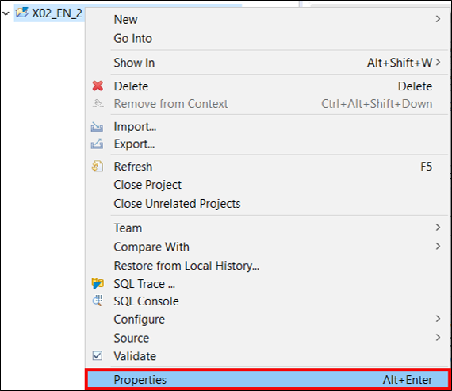

2. Click on your system URL.

    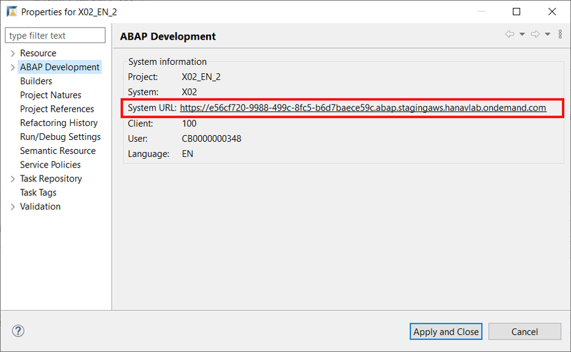

3. Logon to your ABAP system in your SAP Fiori launchpad and select **Manage Software Component**.

    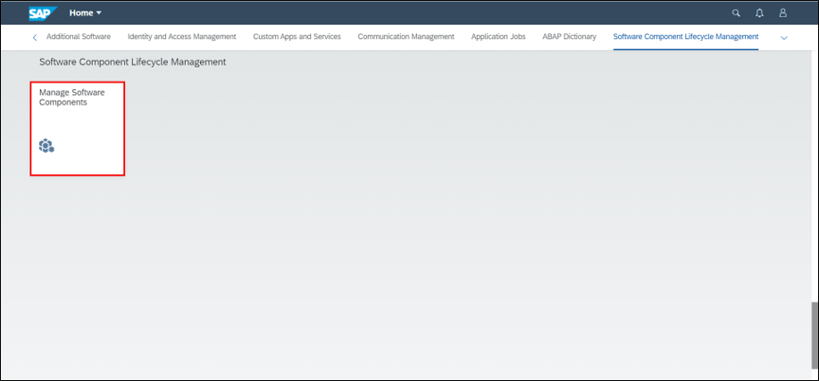

4. Select **`+`** to add a new software component.

    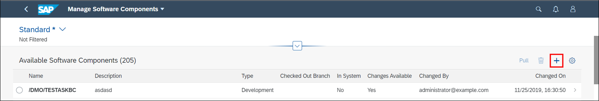

5. Create a new software component:
      - Name: **`Z_SWCT_XXX`**
      - Type: **Development**

    Click **Save**.

    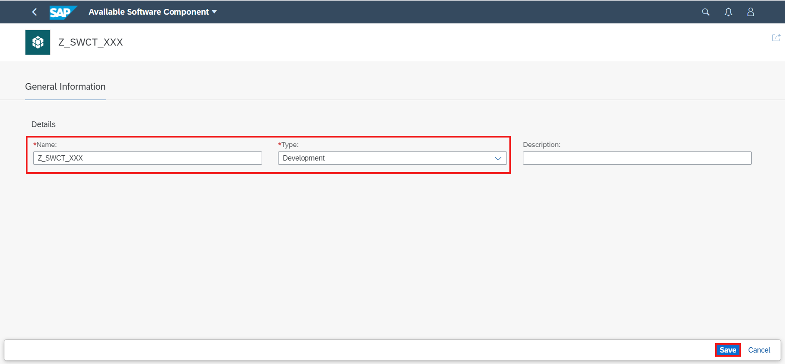

[DONE]
[ACCORDION-END]


[ACCORDION-BEGIN [Step 2: ](Pull software component)]
1. In your available software component **`Z_SWCT_XXX`** click **Pull**.

    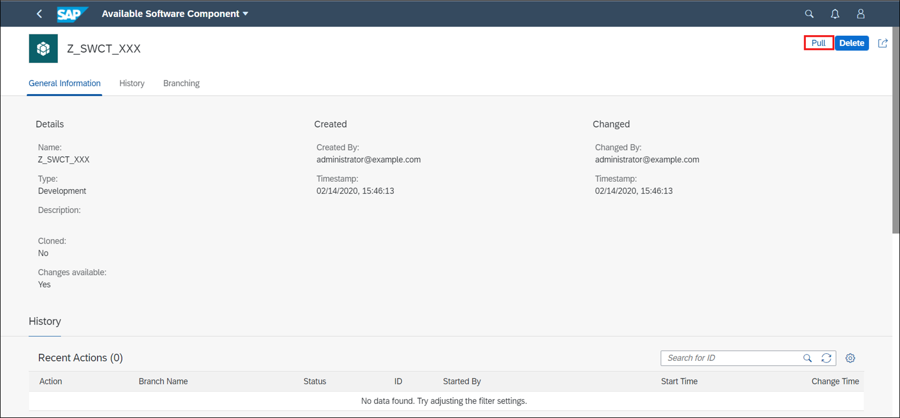

    Note:  In the initial system, the 'master' branch will not be visible until you've released a transport request. If you are pulling in the production system, all branches will be available before you've released an ABAP transport request.

2. Click **OK**.

    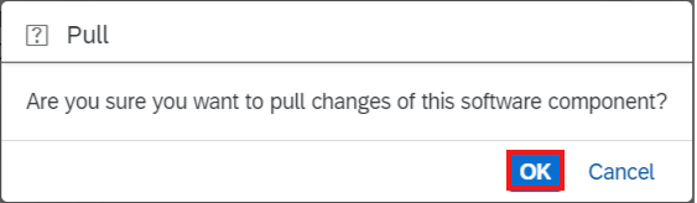

3. Check your result. Your pull is successful.

    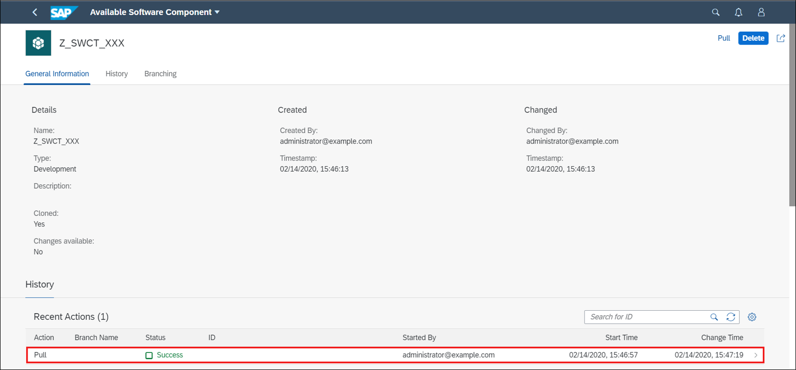


[DONE]
[ACCORDION-END]

[ACCORDION-BEGIN [Step 3: ](Create ABAP class)]
  1. Switch to your ADT, right-click on **Favorite Packages** and select **Add Package**.

      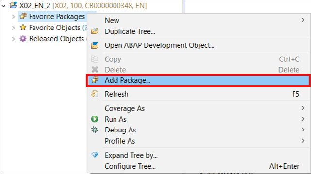

  2. Search for **`Z_SWCT_XXX`**, select it and click **OK**.

      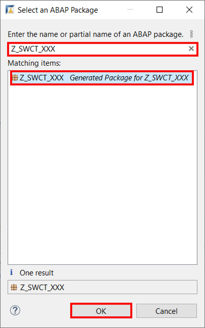

  3. Right-click on your `superpackage` **`Z_SWCT_XXX`** and select **Add Package**.

      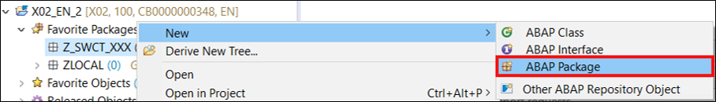

  4.  Create your **package:**
     - Name: **`Z_PCK_XXX`**
     - Description: **`Package XXX`**

      Click **Next>**.

      

  5. Click **Next >**.

      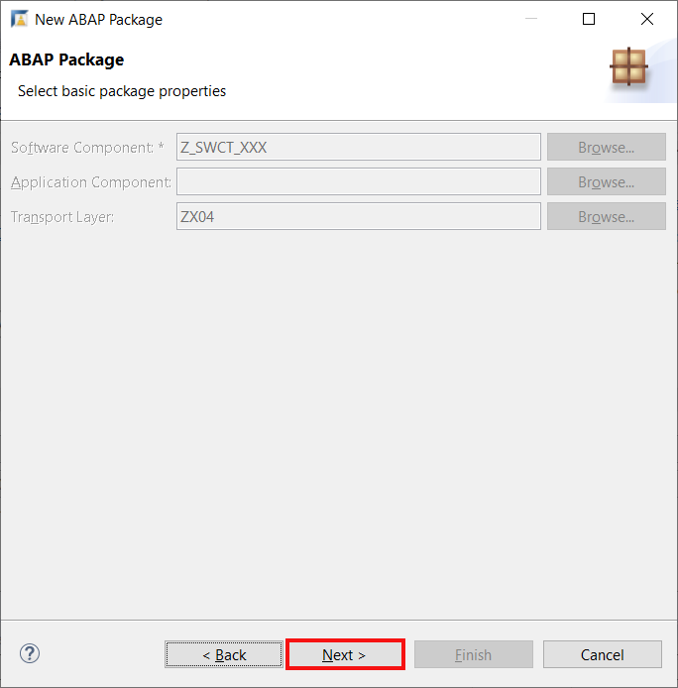

  6. Select **Create a new request**:
     - Request Description: **`TR123456`**

      Click **Finish**.

    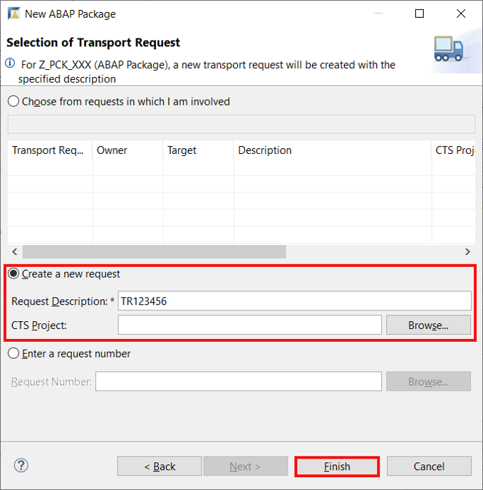

  7. Right-click on your package **`Z_PCK_XXX`** and select **ABAP Class**.

      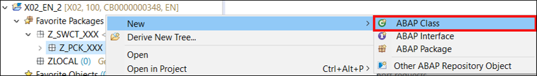

  8.  Create your **ABAP class:**
     - Name: **`Z_CL_XXX`**
     - Description: **`Class XXX`**

     Click **Next>**.

      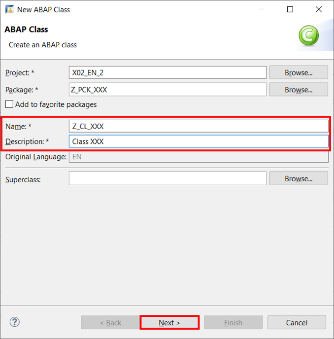

  9. Click **Finish**.

      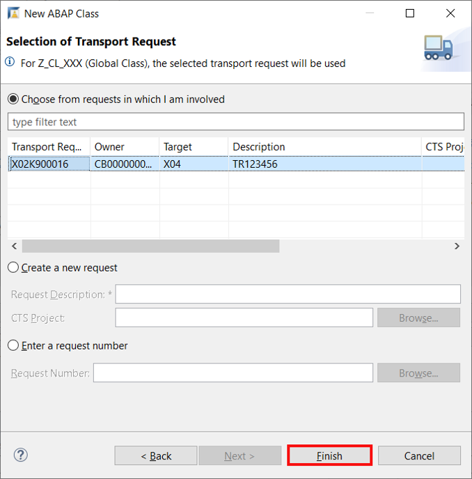

  10. Replace your code with following:

    ```ABAP
    class z_cl_xxx definition
    public
    final
    create public .

    public section.
    interfaces if_oo_adt_classrun.
    protected section.
    private section.
    ENDCLASS.

    CLASS z_cl_xxx IMPLEMENTATION.
    METHOD IF_OO_ADT_CLASSRUN~MAIN.
    out->write('Hello world!').
    ENDMETHOD.
    ENDCLASS.
    ```

      **Save** and **activate**.

[DONE]
[ACCORDION-END]


[ACCORDION-BEGIN [Step 4: ](Release transport request)]
  1. Select your class **`Z_CL_XXX`** and select **Transport Organizer** in your menu. Right-click on your transport task and select **Release**

      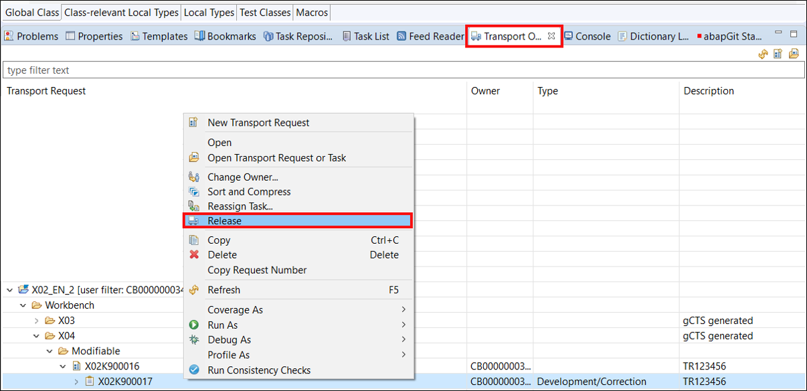

  2. Check your result and click **OK**.

      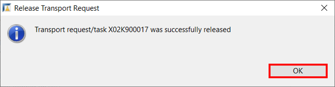

  3. Right-click on your transport request and select **Release**.

      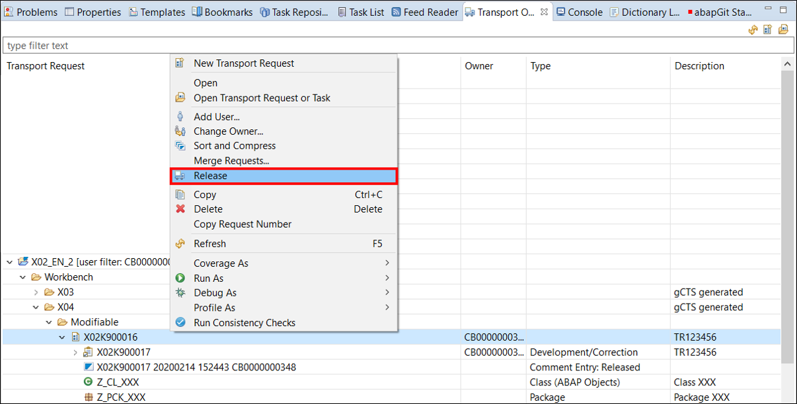

  4. Check your result and click **OK**.

      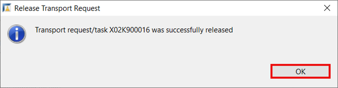


[DONE]
[ACCORDION-END]

[ACCORDION-BEGIN [Step 5: ](Create new branch)]
  1. Switch to your ABAP system in your SAP Fiori launchpad, open your software component **`Z_SWCT_XXX`** in **Manage Software Component**.

      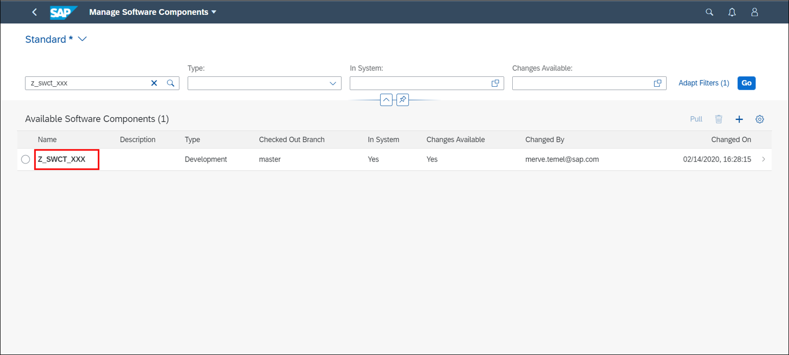

  2. Refresh your page by pressing **`F5`**.

      

  3. Select your master branch and click **`+`** to create a new branch.

      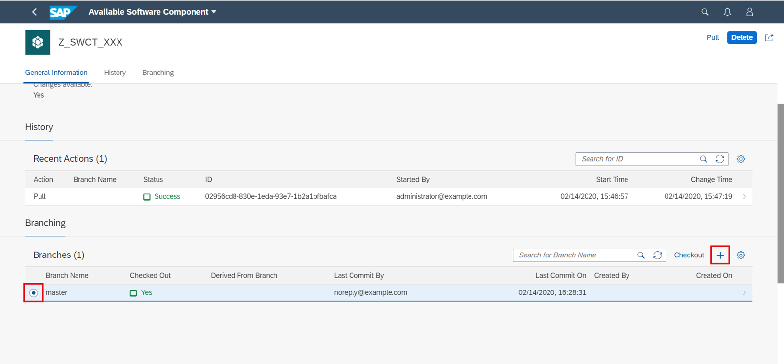

  4. Create new branch:
     - Branch Name: **`branch_xxx`**

      Click **Create**.

    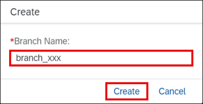

  5. Check your result. Now your new branch **`branch_xxx`** is created.

      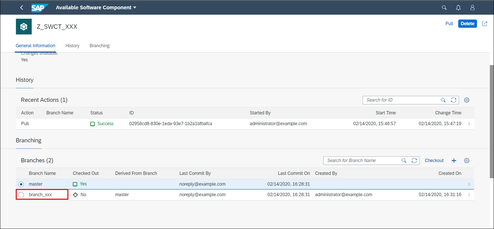


[DONE]
[ACCORDION-END]

[ACCORDION-BEGIN [Step 6: ](Test yourself)]

[VALIDATE_1]
[ACCORDION-END]
