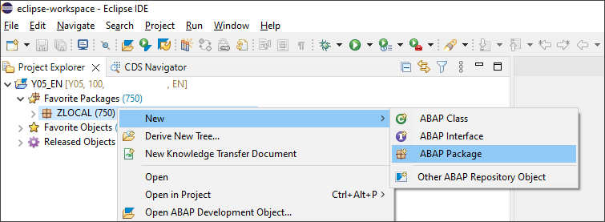
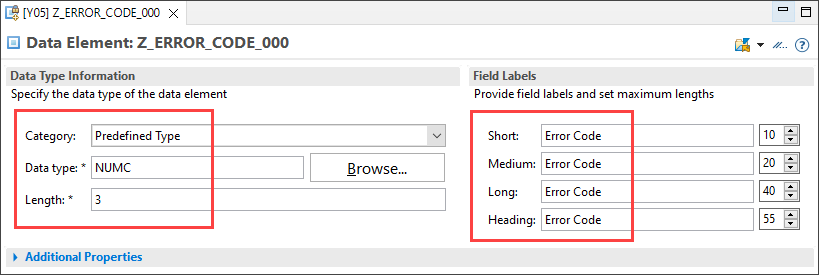
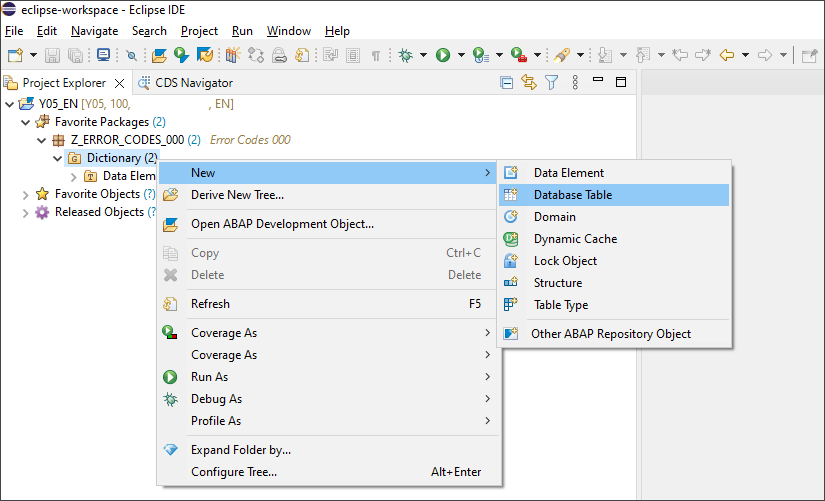
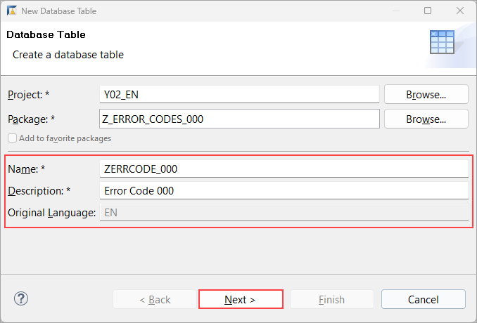
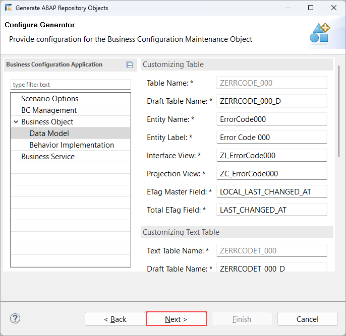

# Create Business Configuration Maintenance Object
<!-- description --> Create a Business Configuration Maintenance Object using the ABAP Repository Object Generator.

## Prerequisites  
- You need an SAP BTP, ABAP environment [trial user](abap-environment-trial-onboarding) or a license.
- This is the first tutorial of group [Create a SAP Fiori based Table Maintenance app](group.abap-env-factory). You must complete the tutorials in the given order.
- Install [ABAP Development Tools](https://tools.hana.ondemand.com/#abap) (3.26.2 or higher). You can also follow **step 1** of this [tutorial](abap-install-adt) to install ADT.

## You will learn  
- How to create Packages
- How to create Data Elements
- How to create Database Tables
- How to enable Log Changes
- How to generate a Business Configuration Maintenance Object

## Intro
This tutorial shows you how to create a **SAP Fiori based Table Maintenance app** using the [**ABAP RESTful Application Programming Model**](https://help.sap.com/viewer/923180ddb98240829d935862025004d6/Cloud/en-US/289477a81eec4d4e84c0302fb6835035.html) (RAP) and the [**Custom Business Configurations**](https://help.sap.com/viewer/65de2977205c403bbc107264b8eccf4b/Cloud/en-US/76384d8e68e646d6ae5ce8977412cbb4.html) (CUBCO) app. This tutorial is based on a simplified error code data base model.

>**Hint:** Don't forget to replace all occurrences of the placeholder ### with your ID of choice in the exercise steps below. You can use the ADT function Replace All (`CTRL+F`) for the purpose.

---
### Create Package


  1. Open your **ABAP Development Tools**, logon to your **ABAP system** and right-click on **`ZLOCAL`**, select **New** > **ABAP Package**.

      

  2. Create a new package:
     - Name: **`Z_ERROR_CODES_###`**
     - Description: **`Error Codes ###`**
     - Super-package: **`ZLOCAL`**
     - Check **Add to favorite packages**

      

      Click **Next >**.

  3. Enter a new transport request and click **Finish**.

      


### Create Data Elements


  1. Right-click on **`Z_ERROR_CODES_###`**, select **New** > **Other ABAP Repository Object**.

      

  2. Search for **`Data Element`**, select it and click **Next >**.

      

  3. Create a data element:
     - Name: **`Z_ERROR_CODE_###`**
     - Description: **`Error Code`**

     

      Click **Next >**.

  4. Select the previously created Transport request and click **Finish**.

      

  5. Select **`Predefined Type`** as **Category**, **`NUMC`** as **Data type**, 3 as **Length** and enter **`Error Code`** as **Field Labels**:

      

  6. Save and activate.

  7. Repeat **step 2.1. - 2.5** to create a second Data Element:

      - Name:  **`Z_CODE_DESCRIPTION_###`**
      - Description: **`Error Code Description`**
      - Category: **`Predefined Type`**
      - Data Type: **`CHAR`**
      - Length: **`120`**
      - Short Field Label: **`Text`**
      - Other Field Labels: **`Description`**

     
  8. Save and activate.


### Create Database Tables


  1. Right-click on Type Group **Dictionary** in package **`Z_ERROR_CODES_###`**, select **New** > **Database Table**.

      

  2. Create a Database Table:
     - Name: **`ZERRCODE_###`**
     - Description: **`Error Code ###`**

      

      Click **Next >**.

  3. Select Transport Request and click **Finish**.

  4. Replace your code with the following:

    ```ABAP
    @EndUserText.label : 'Error Code ###'
    @AbapCatalog.enhancement.category : #NOT_EXTENSIBLE
    @AbapCatalog.tableCategory : #TRANSPARENT
    @AbapCatalog.deliveryClass : #C
    @AbapCatalog.dataMaintenance : #ALLOWED
    define table zerrcode_### {
      key client            : abap.clnt not null;
      key error_code        : z_error_code_### not null;
      last_changed_at       : abp_lastchange_tstmpl;
      local_last_changed_at : abp_locinst_lastchange_tstmpl;
    }
    ```

  5. Save and activate.

  6. Repeat step **3.1.- 3.4** and create another Database Table:

     - Name: **`ZERRCODET_###`**
     - Description: **`Error Code Description ###`**

    ```ABAP
    @EndUserText.label : 'Error Code Description ###'
    @AbapCatalog.enhancement.category : #NOT_EXTENSIBLE
    @AbapCatalog.tableCategory : #TRANSPARENT
    @AbapCatalog.deliveryClass : #C
    @AbapCatalog.dataMaintenance : #ALLOWED
    define table zerrcodet_### {
      key client            : abap.clnt not null;
      @AbapCatalog.textLanguage
      key langu             : abap.lang not null;
      @AbapCatalog.foreignKey.keyType : #TEXT_KEY
      @AbapCatalog.foreignKey.screenCheck : false
      key error_code        : z_error_code_### not null
        with foreign key [0..*,1] zerrcode_###
          where client = zerrcodet_###.client
            and error_code = zerrcodet_###.error_code;
      description           : z_code_description_###;
      local_last_changed_at : abp_locinst_lastchange_tstmpl;
    }
    ```

  7. Save and activate.


### Enable Log Changes


To use the [**Business Configuration Change Logs**](https://help.sap.com/viewer/65de2977205c403bbc107264b8eccf4b/Cloud/en-US/5c6cf20499894f1083e80dba7c5963d4.html) app, activate the log changes function to keep track of configuration changes in your business configuration tables.

>For client dependent customizing tables, buffering is typically switched on by generic key with number of key fields equal to 1. For client dependent customizing text tables, buffering is typically switched on by generic key with number of key fields equal to 2 to include the language key field.

>Read operations on the CDS view entities do not benefit from the table buffer but have their own buffer mechanism see this [blog](https://blogs.sap.com/2022/01/27/buffering-cds-view-entities/). Consider reading directly from the buffered customizing tables in your application code.

The **Log Changes** flag has to be enabled in the technical settings for the table:


Save and activate.


### Create Business Configuration Maintenance Object


A [**Business Configuration Maintenance Object**](https://help.sap.com/products/BTP/65de2977205c403bbc107264b8eccf4b/61159c4dc45b45619b46b4620615c357.html) declares a [Service Binding](https://help.sap.com/viewer/923180ddb98240829d935862025004d6/Cloud/en-US/b58a3c27df4e406f9335d4b346f6be04.html) as relevant for business configuration. They are listed in the [**Custom Business Configurations**](https://help.sap.com/viewer/65de2977205c403bbc107264b8eccf4b/Cloud/en-US/76384d8e68e646d6ae5ce8977412cbb4.html) app. By selecting an entry in the app a SAP Fiori elements based UI is rendered to maintain the business configuration.

You can use the [ABAP Repository Generator](https://help.sap.com/docs/BTP/65de2977205c403bbc107264b8eccf4b/047e01c3bcdd4303a60b61364bd5b31d.html?version=Cloud) to create the necessary repository objects.

  1. Right-click on table **`ZERRCODE_###`** and select **Generate ABAP Repository Objects...**.

      

  2. Create a Business Configuration Maintenance Object:
      - Description: **`Maintain error codes`**
      - Generator: **`Business Configuration Maintenance Object`**

     

      Click **Next >**.

  3. The system generates a proposal for all input fields based on the description of the table. An additional database table is considered as the text table by the wizard if the annotation **`@AbapCatalog.foreignKey.keyType : #TEXT_KEY`** is used. If you encounter an error message stating a specific object already exists, change the corresponding name in the wizard.


      Click **Next >**.

      

  4. The list of repository objects that are going to be generated is shown. Click **Next >**.

  5. Select a Transport Request and click **Finish**.

  6. When the generation is completed, the new Business Configuration Maintenance Object is shown. Refresh your project explorer and check the other generated objects. If you publish the `Local Service Endpoint` of service binding `ZUI_ERRORCODE###_O4` you can already start the [**Custom Business Configurations**](https://help.sap.com/viewer/65de2977205c403bbc107264b8eccf4b/Cloud/en-US/76384d8e68e646d6ae5ce8977412cbb4.html) app from the SAP Build Work Zone and select the created Business Configuration Maintenance Object. However you will not be able to read or edit the configuration entries because your user is missing authorizations. Instead you will [provide authorization control for a Business Configuration Maintenance Object](abap-environment-authorization-control) in the next tutorial and then finally [use the Custom Business Configurations app](abap-environment-maintain-bc-app).

  7. If you only have a trial account you need to perform the following adjustments because you are not able to create Customizing Transport Requests or Business Roles. You can then also skip the following tutorial [Provide authorization control for a Business Configuration Maintenance Object](abap-environment-authorization-control) and continue with tutorial [Use Custom Business Configurations app](abap-environment-maintain-bc-app).
      - Edit class `ZBP_I_ERRORCODE###_S`, section **Local Types**. Delete the content of the following methods. Afterwards save and activate the class.
        - `GET_GLOBAL_AUTHORIZATIONS`
        - `LSC_ZI_ERRORCODE###_S→SAVE_MODIFIED`
        - `LHC_ZI_ERRORCODE###→VALIDATERECORDCHANGES`
        - `LHC_ZI_ERRORCODE###TEXT→VALIDATERECORDCHANGES`

      - Delete the generated `Access Control` objects

      

      - Publish the `Local Service Endpoint` of service binding `ZUI_ERRORCODE###_O4`

      

>More information about the Business Configuration Maintenance Object configuration can be found [here](https://help.sap.com/docs/BTP/5371047f1273405bb46725a417f95433/8ea18fd0f93f4cd48578d2c75f3c8c89.html). For example you can enable or disable [inline creation of table entries](https://help.sap.com/viewer/468a97775123488ab3345a0c48cadd8f/latest/en-US/cfb04f0c58e7409992feb4c91aa9410b.html).

>More information about defining CDS annotations for metadata-driven UIs can be found [here](https://help.sap.com/viewer/923180ddb98240829d935862025004d6/Cloud/en-US/9b4aa865c1e84634b6e105173fc3a5e7.html). For example you can adjust the visibility, positioning and labels of the fields. By default the field label is derived from the Data Element.

>Additional information about RAP BO with multi-inline-edit capabilities can be found [here](https://help.sap.com/viewer/923180ddb98240829d935862025004d6/Cloud/en-US/f713ec52bcb8405ca9262918cffa5d25.html)

>The content of a text table can also be maintained using the [**Maintain translations**](https://help.sap.com/viewer/65de2977205c403bbc107264b8eccf4b/Cloud/en-US/e2ca05c69dc94b98bf725396a0b13ace.html?q=maintain%20translations) app

>[Draft business objects](https://help.sap.com/viewer/923180ddb98240829d935862025004d6/Cloud/en-US/a81081f76c904b878443bcdaf7a4eb10.html) requires a total `Etag` field to ensure optimistic concurrency comparison.

>The [augment](https://help.sap.com/viewer/923180ddb98240829d935862025004d6/Cloud/en-US/fc374ac9b02e4dbcba356afc77432dc2.html) statement is used to enable the end user to maintain language dependent texts in their logon language

>See also [naming conventions for Development Objects](https://help.sap.com/viewer/923180ddb98240829d935862025004d6/Cloud/en-US/8b8f9d8f3cb948b2841d6045a255e503.html)


### Test yourself


---
