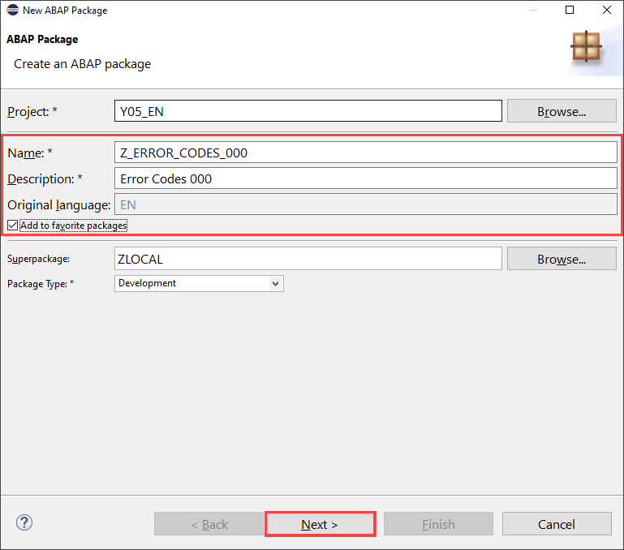
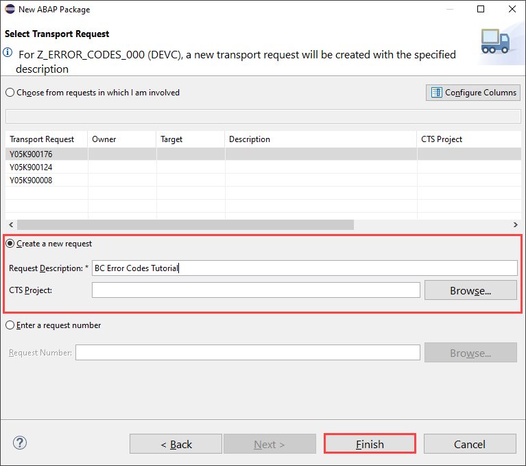
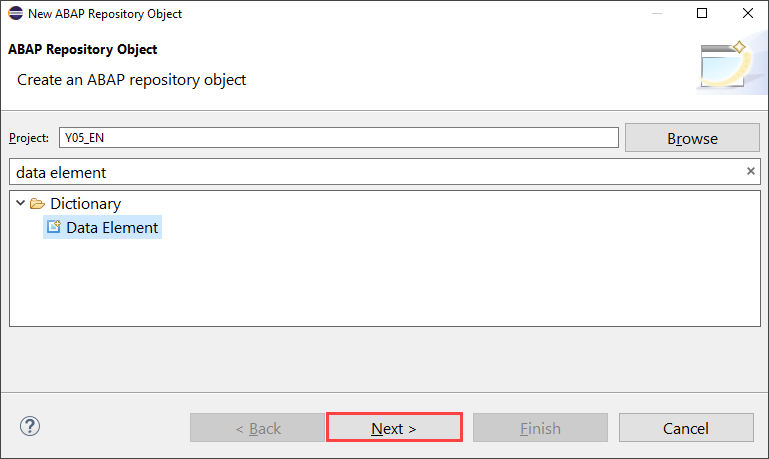
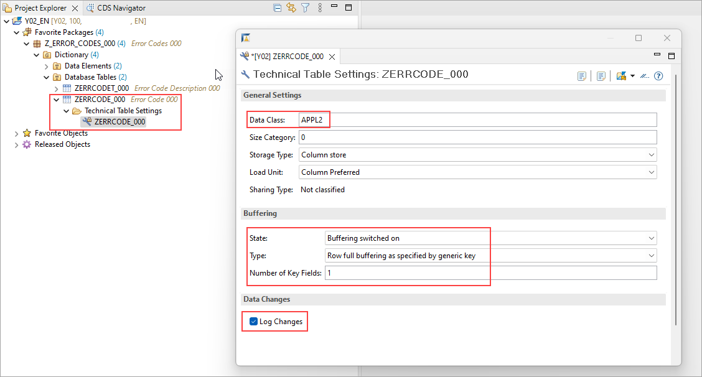
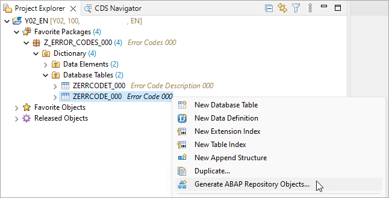
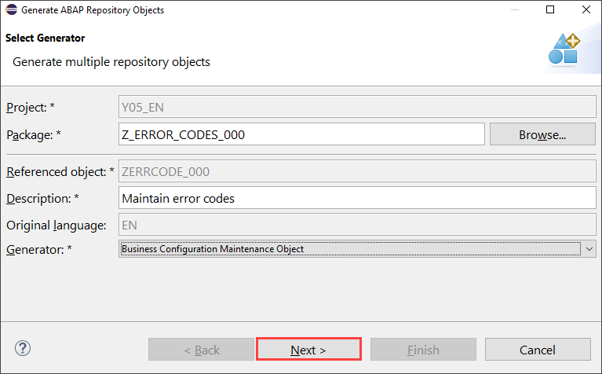

## Prerequisites  
- You need an SAP BTP, ABAP environment [trial user](abap-environment-trial-onboarding) or a license.
- Install [ABAP Development Tools](https://tools.hana.ondemand.com/#abap) (3.25 or higher). You can also follow **step 1** of this [tutorial](abap-install-adt) to install ADT.
- Inform yourself about the [naming conventions for Development Objects](https://help.sap.com/viewer/923180ddb98240829d935862025004d6/Cloud/en-US/8b8f9d8f3cb948b2841d6045a255e503.html)

## Details
### You will learn  
- How to create packages
- How to create data element and domain
- How to create database table
- How to create enable log changes
- How to generate business configuration maintenance object

This tutorial shows you how to create **business configuration UIs** using the [ABAP RESTful Application Programming Model](https://help.sap.com/viewer/923180ddb98240829d935862025004d6/Cloud/en-US/289477a81eec4d4e84c0302fb6835035.html) (RAP) and the [Maintain Business Configurations](https://help.sap.com/viewer/65de2977205c403bbc107264b8eccf4b/Cloud/en-US/76384d8e68e646d6ae5ce8977412cbb4.html) (MBC) app. This tutorial is based on a simplified factory calendar data base model.

>**Hint:** Don't forget to replace all occurrences of the placeholder ### with your ID of choice in the exercise steps below. You can use the ADT function Replace All (`CTRL+F`) for the purpose.


---
[ACCORDION-BEGIN [Step 1: ](Create package)]

  1. Open your **ABAP Development Tools**, logon to your **ABAP system** and right-click on **`ZLOCAL`**, select **New** > **ABAP Package**.

      

  2. Create a new package:
     - Name: **`Z_Calendar_###`**
     - Description: **`Calendar package ###`**
     - `Superpackage`: `ZLOCAL`

     Check **Add to favorite packages**.

      

      Click **Next >**.

  3. Enter a new transport request and click **Finish**.

      

[DONE]
[ACCORDION-END]

[ACCORDION-BEGIN [Step 2: ](Create data element and domain)]

  1. Right-click on **`Z_Calendar_###`**, select **New** > **Other ABAP Repository Object**.

      

  2. Search for **data element**, select it and click **Next >**.

      

  3. Create a data element:
     - Name: **`ZFCAL_DAY_###`**
     - Description: **`Day`**

     

      Click **Next >**.

  4. Click **Finish**.

      

  5. Select `Predefined Type` as category, `NUMC` as data type, 2 as length and provide following field labels:

      

  6. Save and activate data element **`ZFCAL_DAY_###`**.

  7. Create a new data element, therefore repeat **step 2.1. - 2.5**. Instead of using `Predefined Type` as category, use `Domain` instead.

    Create a new data element: **`ZFCAL_HOLIDAY_ID_###:`**:

      -  Category: `Domain`
      -  Data Type: `ZFCAL_HOLIDAY_ID_###`
      -  Description and Field Labels: `Holiday ID`

      

      Now a new domain needs to be created. Save but don't activate yet.

  8. Right-click on **Dictionary**, select **New** > **Domain**.
      

  9. Create a new domain:
     - Name: **`ZFCAL_HOLIDAY_ID_###`**
     - Description: Domain holiday

     

      Click **Next >**.

10. Click **Finish**.

     

11. Add your data type and length:
      - Data type: `CHAR`
      - Length: 30

    

12. Save and activate your domain **`ZFCAL_HOLIDAY_ID_###`** and data element **`ZFCAL_HOLIDAY_ID_###`**.

13. Repeat **step 2.1. - 2.5** to create further **data elements**:

  - **`ZFCAL_MONTH_###:`**
    Category: `Predefined Type`,
    Data Type: `NUMC`,
    Length: 2,
    Field Labels: `Month` (for all)

  - **`ZFCAL_DESCRIPTION_###:`**
    Category: `Predefined Type`,
    Data Type: `CHAR`,
    Length: 100,
    Field Labels: `Text` (for all)

  **Create, save and activate** all data elements.

[DONE]
[ACCORDION-END]

[ACCORDION-BEGIN [Step 3: ](Create database table)]

  1. Right-click on **`Z_Calendar_###`**, select **New** > **Other ABAP Repository Object**.

      

  2. Search for **database table**, select it and click **Next >**.

      

  3. Create a database table:
     - Name: **`ZFCAL_HDAY_###`**
     - Description: **`Holiday ###`**

      

      Click **Next >**.

  4. Click **Finish**.

      

  5. Replace your code with following:

    ```ABAP    
    @EndUserText.label : 'Holiday ###'
    @AbapCatalog.enhancement.category : #NOT_EXTENSIBLE
    @AbapCatalog.tableCategory : #TRANSPARENT
    @AbapCatalog.deliveryClass : #C
    @AbapCatalog.dataMaintenance : #ALLOWED
    define table zfcal_hday_### {
      key client            : abap.clnt not null;
      key holiday_id        : zfcal_holiday_id_### not null;
      month_of_holiday      : zfcal_month_###;
      day_of_holiday        : zfcal_day_###;
      last_changed_at       : abp_lastchange_tstmpl;
      local_last_changed_at : abp_locinst_lastchange_tstmpl;

    }
    ```

  6. Save and activate.

  7. Repeat step **3.1.- 3.4** and create a **database table**:

     - Name: **`ZFCAL_HDTXT_###`**
     - Description: **`Holiday Text`**

    ```ABAP
    @EndUserText.label : 'Holiday Text'
    @AbapCatalog.enhancement.category : #NOT_EXTENSIBLE
    @AbapCatalog.tableCategory : #TRANSPARENT
    @AbapCatalog.deliveryClass : #C
    @AbapCatalog.dataMaintenance : #ALLOWED
    define table zfcal_hdtxt_### {
      key client       : abap.clnt not null;
      @AbapCatalog.textLanguage
      key langu        : abap.lang not null;
      @AbapCatalog.foreignKey.keyType : #TEXT_KEY
      @AbapCatalog.foreignKey.screenCheck : false
      key holiday_id   : zfcal_holiday_id_### not null
        with foreign key [0..*,1] zfcal_hday_###
          where client = zfcal_hdtxt_###.client
            and holiday_id = zfcal_hdtxt_###.holiday_id;
      fcal_description : zfcal_description_###;
      local_last_changed_at : abp_locinst_lastchange_tstmpl;

    }
    ```

  8. Save and activate.

[DONE]
[ACCORDION-END]

[ACCORDION-BEGIN [Step 4: ](Enable log changes)]

To use the [**Business Configuration Change Logs**](https://help.sap.com/viewer/65de2977205c403bbc107264b8eccf4b/Cloud/en-US/5c6cf20499894f1083e80dba7c5963d4.html) app, activate the log changes function to keep track of configuration changes in your business configuration tables.

>**HINT:** For client dependent customizing tables, buffering is typically switched on by generic key with number of key fields equal to 1. For client dependent customizing text tables, buffering is typically switched on by generic key with number of key fields equal to 2 to include the language key field.

>Read operations on the CDS view entities do not benefit from the table buffer but have their own buffer mechanism see this [blog](https://blogs.sap.com/2022/01/27/buffering-cds-view-entities/). Consider reading directly from the buffered customizing tables in your application code.

The `Log Changes` flag has to be enabled in the technical settings for the table.



Save and activate.

[DONE]
[ACCORDION-END]


[ACCORDION-BEGIN [Step 5: ](Create business configuration maintenance object)]

A [business configuration maintenance object](https://help.sap.com/products/BTP/65de2977205c403bbc107264b8eccf4b/61159c4dc45b45619b46b4620615c357.html) declares a [service binding](https://help.sap.com/viewer/923180ddb98240829d935862025004d6/Cloud/en-US/b58a3c27df4e406f9335d4b346f6be04.html) as relevant for business configuration. They are listed in the [**Maintain Business Configurations**](https://help.sap.com/viewer/65de2977205c403bbc107264b8eccf4b/Cloud/en-US/76384d8e68e646d6ae5ce8977412cbb4.html) app. By selecting an entry in the app a SAP Fiori elements based UI is rendered to maintain the business configuration.

You can use the [ABAP Repository Generator](https://help.sap.com/viewer/25cf71e63940453397a32dc2b7676947/2202.500/en-US/7920415d9c8d43cfb11b8aa0724e7773.html) to create the necessary repository objects.

  1. Right-click on **`ZFCAL_HDAY_###`** and select **Generate ABAP Repository Objects...**.
    

  2. Create a business configuration maintenance object:
    - **Description:** Maintain public holidays
    - **Generator:** Business Configuration Maintenance Object

     

      Click **Next >**.

  3. An additional database table is considered as the text table by the wizard if the annotation `@AbapCatalog.foreignKey.keyType : #TEXT_KEY` is used.
    The system generates a proposal for all input fields based on the description of the table.

      Click **Next >**.

      

  4. Click **Next >**.

     

  5. Click **Finish**.

     

  6. When the generation is completed, the new Business Configuration Maintenance Object is shown. Refresh your project explorer (**F5**) and check the result.

     Part of the Business Logic is to [implement validations](https://help.sap.com/viewer/923180ddb98240829d935862025004d6/Cloud/en-US/abfbcd933c264fe4a4883d80d1e951d8.html) to check the values provided by the client. In this example, validations could be defined for fields `MonthOfHoliday` and `DayOfHoliday` to verify the validity of the date.
     More information about defining CDS annotations for metadata-driven UIs can be found [here](https://help.sap.com/viewer/923180ddb98240829d935862025004d6/Cloud/en-US/9b4aa865c1e84634b6e105173fc3a5e7.html).
     Additional information about RAP BO with multi-inline-edit capabilities can be found [here](https://help.sap.com/viewer/923180ddb98240829d935862025004d6/Cloud/en-US/f713ec52bcb8405ca9262918cffa5d25.html).
     The content of a text table can also be maintained using the [**Maintain translations**](https://help.sap.com/viewer/65de2977205c403bbc107264b8eccf4b/Cloud/en-US/e2ca05c69dc94b98bf725396a0b13ace.html?q=maintain%20translations) app.
     [Draft business objects](https://help.sap.com/viewer/923180ddb98240829d935862025004d6/Cloud/en-US/a81081f76c904b878443bcdaf7a4eb10.html) requires a total `ETag` field to ensure optimistic concurrency comparison.
     The [augment](https://help.sap.com/viewer/923180ddb98240829d935862025004d6/Cloud/en-US/fc374ac9b02e4dbcba356afc77432dc2.html) statement is used to enable the end user to maintain language dependent texts in their logon language.
     UI labels are defined in the Metadata Extension objects and derived from the field labels of the Data Elements.


[DONE]
[ACCORDION-END]

[ACCORDION-BEGIN [Step 6: ](Test yourself)]

[VALIDATE_1]
[ACCORDION-END]
---
