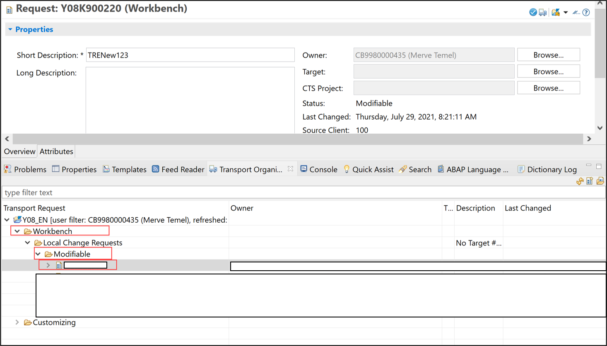
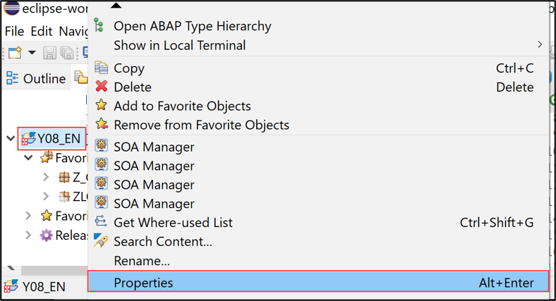
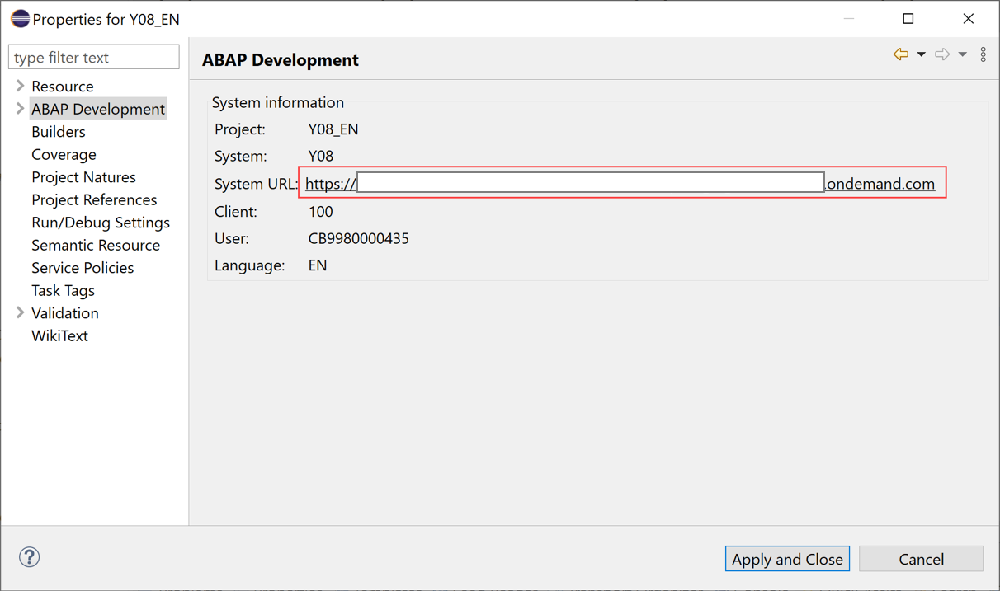
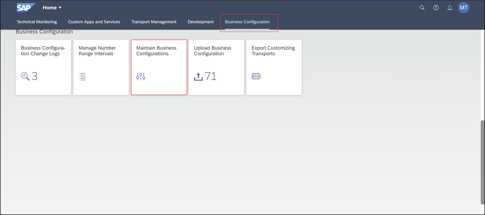
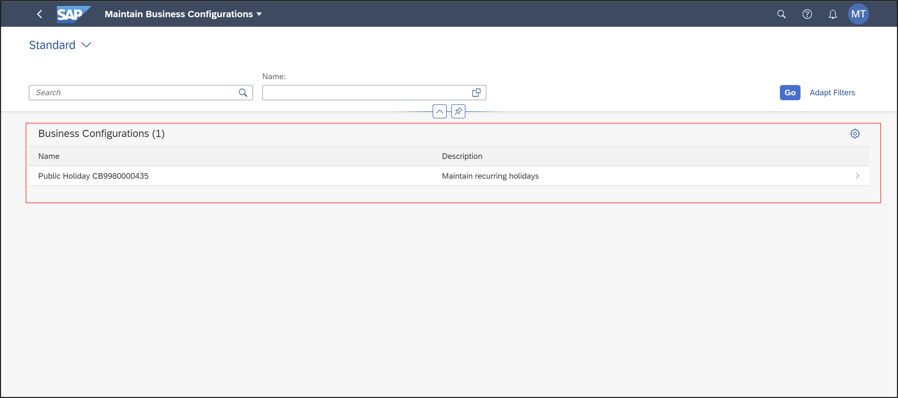
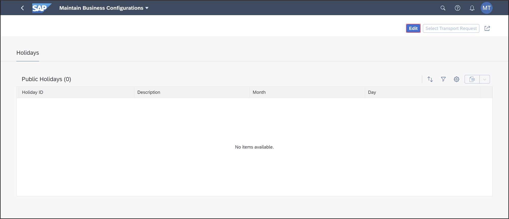
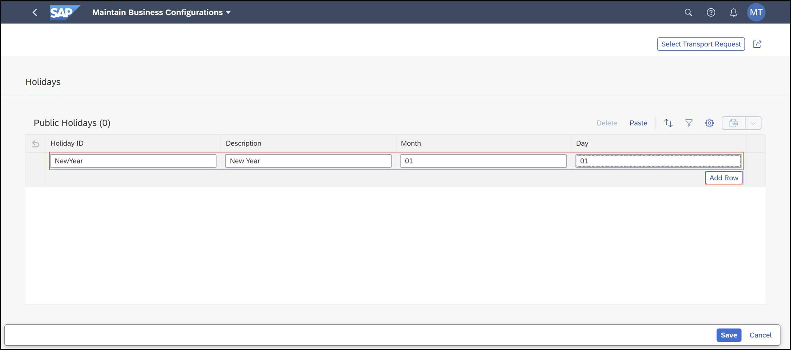
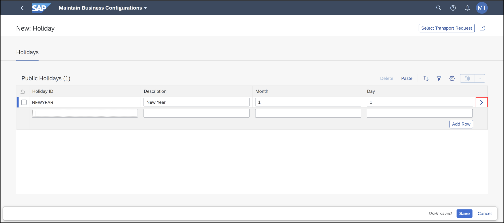
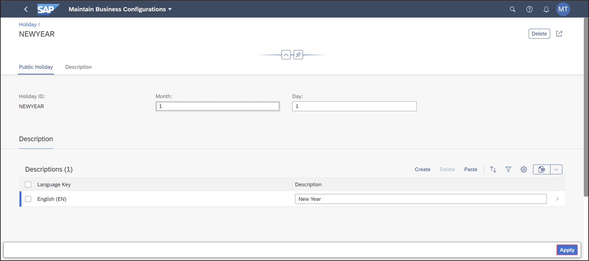
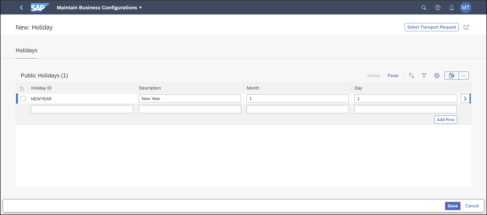

## Prerequisites  
- You need an SAP BTP, ABAP environment [trial user](abap-environment-trial-onboarding) or a license.
- Catalog `SAP_CA_BC_IC_LND_PC` needs to be assigned to business user, in order to work with **Maintain Business Configurations** App. The business catalog is contained in the business role template: `SAP_BR_BPC_EXPERT`.  

## Details
### You will learn  
- How to execute class to register business configuration


The **[Maintain Business Configurations](https://help.sap.com/viewer/65de2977205c403bbc107264b8eccf4b/Cloud/en-US/76384d8e68e646d6ae5ce8977412cbb4.html)** app serves as an entry point to the configuration objects provided by different applications or partners. You can use the app to adjust these configuration objects to change and influence the system behavior.


>**HINT:** You don't need to create your own Fiori app for a Business Configuration service if you are using the **Maintain Business Configurations** app.

---

[ACCORDION-BEGIN [Step 1: ](Execute class to register business configuration)]

You can now register your service with this app via the **[Maintain Business Configurations API](https://help.sap.com/viewer/65de2977205c403bbc107264b8eccf4b/Cloud/en-US/508d406ac92043dba95f694144803c26.html)**.

  1. Right-click on **Classes** and select **New** > **ABAP Class**.

    


  2. Create a new ABAP class:
     - Name: `ZCL_CAL_REGISTER_BC_XXX`
     - Description: `Class for business configuration`

     

      Click **Next >**.

  3.  Click **Finish**.

    


  4. Create a new class `ZCL_CAL_REGISTER_BC_XXX` and enter the following. If applicable, specify a namespace. As transport specify the **workbench transport request** where the other objects are recorded on. Available transport requests can be seen in the **Transport Organizer** tab in ADT.

    ```ABAP
    CLASS zcl_cal_register_bc_xxx DEFINITION
      PUBLIC
      INHERITING FROM cl_xco_cp_adt_simple_classrun
      FINAL
      CREATE PUBLIC .

      PUBLIC SECTION.
      PROTECTED SECTION.
        METHODS: main REDEFINITION.
      PRIVATE SECTION.
    ENDCLASS.

    CLASS ZCL_CAL_REGISTER_BC_XXX IMPLEMENTATION.
      METHOD main.
        DATA(lo_business_configuration) = mbc_cp_api=>business_configuration(
          iv_identifier = 'ZCAL_XXX' && sy-uname
          iv_namespace  = '' ).
        TRY.
            lo_business_configuration->create(
              iv_name                  = |Public Holiday XXX| && sy-uname
              iv_description           = 'Maintain recurring holidays'
              iv_service_binding       = 'ZCAL_UI_MCAL_O4_XXX'
              iv_service_name          = 'ZCAL_UI_MCAL_XXX'
              iv_service_version       = 0001
              iv_root_entity_set       = 'HolidayAll'
              iv_transport             = '##########'
              iv_skip_root_entity_list_rep = abap_true
            ).
            out->write( 'done' ).
          CATCH cx_mbc_api_exception INTO DATA(lx_err).
            out->write( lx_err ).
        ENDTRY.
      ENDMETHOD.
    ENDCLASS.
    ```

    >**HINT:** You can find the **workbench transport request** in the **transport organizer** tab in ADT. To copy the transport request navigate to **Workbench** > **Local Change Requests** > **Modifiable**. There you can find your transport request.

    >  


  5. Save and activate.

  6. Execute the class by pressing F9. Now you should see following in the ABAP console.

    

  7. Log on to the ABAP system. Therefore right-click your project and select **Properties**.

    

  8. Open the system URL in a browser of choice and log in.

    

  9. Select the **Maintain Business Configurations** tile. The user needs the catalog `SAP_CA_BC_IC_LND_PC` to be able to work with this app. The business catalog is contained in the business role template: `SAP_BR_BPC_EXPERT`.

    

 10. Click **Go** to see your result. Select the entry you registered.

    

    >**HINT:** The registered business configuration will only be shown in the list of maintainable business configurations if the user has the necessary authorization regarding the service of the business configuration.

    >Publishing the service as a local endpoint in the service binding definition will also grant the necessary authorization to the development user.

  11. Click **Edit**.

      

  12. Enter your first holiday and click on **Add Row**.

     

  12. Navigate to the details of this new entry by clicking on it to verify that the given description is annotated with the logon language.

     

  13. Click **Apply**.

     

  14. Click **Save**.

     

     You can create, modify or delete multiple Holidays in the main list report.

    >**HINT:** You can add multiple Holidays with copy & paste from [Microsoft Excel](https://ui5.sap.com/#/topic/f6a8fd2812d9442a9bba2f6fb296c42e).

    >You can export the current table content to [spreadsheet](https://ui5.sap.com/#/topic/4bab6f2043814257974b52d4dafe1dcd) and use it as a template for copy & paste.

[DONE]
[ACCORDION-END]

[ACCORDION-BEGIN [Step 2: ](Test yourself)]

[VALIDATE_1]
[ACCORDION-END]
---
