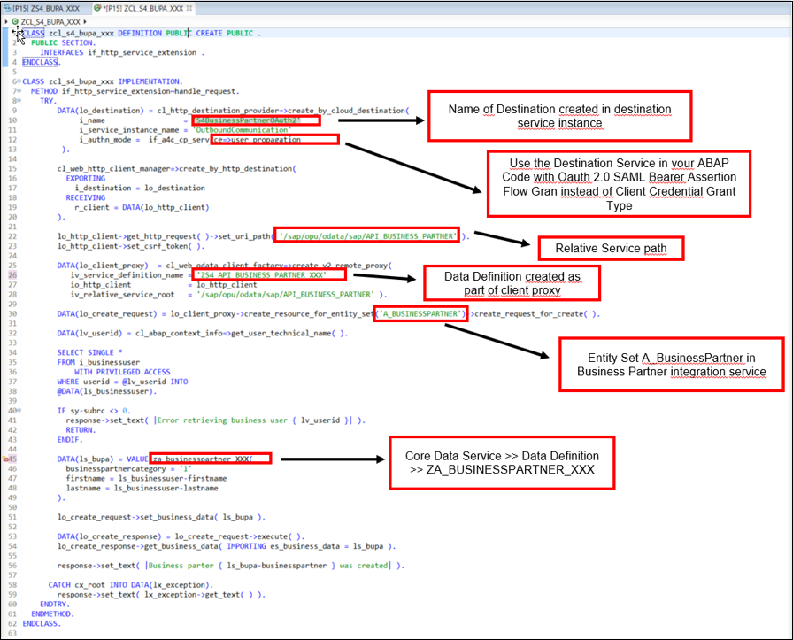

### Prerequisites  
- Communication arrangement for scenario `SAP_COM_0276` was created with service instance name  `OutboundCommunication`.
- Business user in SAP S/4 HANA Cloud has business role `SAP_BR_BUPA_MASTER_SPECIALIST` in order to create business partners in SAP S/4 HANA​.
- Integration between S/4 HANA Cloud and SAP Cloud Platform ABAP environment completed​.

## Details
### You will learn  
  - How to implement outbound service call from SAP Cloud Platform ABAP environment to S/4 HANA Cloud service
  - How to retrieve data of logged in business user in SAP Cloud Platform ABAP environment
  - Create business partner in S/4 HANA Cloud system based on data of business user in SAP Cloud Platform ABAP environment (use Business Partner Integration Service in SAP S/4 HANA)​
  - Return business partner id after creation

Create all ABAP artifacts with namespace `Z...` for local development.
In this tutorial, wherever `xxx` appears, use a number (e.g. `000`).

---

[ACCORDION-BEGIN [Step 1: ](Download service metadata)]

1. Copy the service URL from communication arrangement on S/4 HANA Cloud system in a browser.
2. Remove `–api` in the link and add `/$metadata` at the end of the link and press enter.

3. Right click on the page and save the Metadata as a `.edmx` file.

[DONE]
[ACCORDION-END]

[ACCORDION-BEGIN [Step 2: ](Create your own ABAP package)]

1. Open eclipse and connect to your system.
2. Right click on main package **ZLOCAL**  and choose **New** > **ABAP Package**.
3. Create your own ABAP development package `Z_PACKAGE_XXX`  as a sub package of **ZLOCAL**.
4. Click on **Next**.

5. Select package properties and press **Next**.

[DONE]
[ACCORDION-END]

[ACCORDION-BEGIN [Step 3: ](Select a transport request)]

Select a transport request and create your ABAP package with **Finish**.
You can add your package to **Favorite Packages**.

[DONE]
[ACCORDION-END]

[ACCORDION-BEGIN [Step 4: ](Add OData client proxy)]

1. Mark your package under **ZLOCAL** or in **Favorite Packages** and click on **File** and choose **New** > **Other…** > **OData Client Proxy**.

3. Click on **Next**.

[DONE]
[ACCORDION-END]

[ACCORDION-BEGIN [Step 5: ](Create OData client proxy)]

1. Enter the package name and a name for the service definition that will be generated as part of the client proxy.
2. Upload the `.edmx` file, which you saved before, in the Service Metadata File field.
3. Click **Next**.

[DONE]
[ACCORDION-END]

[ACCORDION-BEGIN [Step 6: ](Change ABAP artifact names)]

1. Add the `XXX` number at the end of each name.
2. Click on **Next**.

[DONE]
[ACCORDION-END]

[ACCORDION-BEGIN [Step 7: ](ABAP artifact generation list)]

1. Click on **Next** by artifact generation list.

2. Select a transport request.
3. Click on **Finish**.

[DONE]
[ACCORDION-END]

[ACCORDION-BEGIN [Step 8: ](Check created service definition)]

Open service definitions in your package and make sure if your new service definition is created successfully.

[DONE]
[ACCORDION-END]

[ACCORDION-BEGIN [Step 9: ](Add HTTP service)]

1. Right click on your package and choose **New** > **Other ABAP Repository Object** > **HTTP Service**.

2. Click **Next**.

[DONE]
[ACCORDION-END]

[ACCORDION-BEGIN [Step 10: ](Create HTTP service)]

1. Enter a name and a description.
2. Click **Next**.

3. Select a transport request and click on **Finish**.

[DONE]
[ACCORDION-END]

[ACCORDION-BEGIN [Step 11: ](Create handler class)]

1. Go to the HTTP Service that you created in the last step.
2. Open **Handler Class**.

3. Copy the code in the class and change it with your data.
4. Retrieve Name of `ZA_BusinessPartner_XXX` Data Definition.

[DONE]
[ACCORDION-END]

[ACCORDION-BEGIN [Step 12: ](Test service with business user)]

1. Navigate to HTTP service and click On URL.

2. Enter Business User email and password and click on Log on.
business user requires the `SAP_BR_BUPA_MASTER_SPECIALIST` business role.
This User has the same email-address for both S/4 HANA and SAP Cloud Platform ABAP environment.

You see that a Business Partner is created.
3. Copy the Business Partner number.

[DONE]
[ACCORDION-END]

[ACCORDION-BEGIN [Step 13: ](Open maintain business partner in SAP S/4 HANA)]

1. Open SAP Fiori Launchpad and login with the business user.

2. Navigate to **Business Partner Master** > **Maintain Business Partner**.

[DONE]
[ACCORDION-END]

[ACCORDION-BEGIN [Step 14: ](Verify business partner in SAP S/4 HANA)]

Enter created Business Partner number in the related field and press enter.
Check data of the created business service.

[DONE]
[ACCORDION-END]

[ACCORDION-BEGIN [Step 15: ](Test yourself)]

[VALIDATE_1]
[ACCORDION-END]
---
