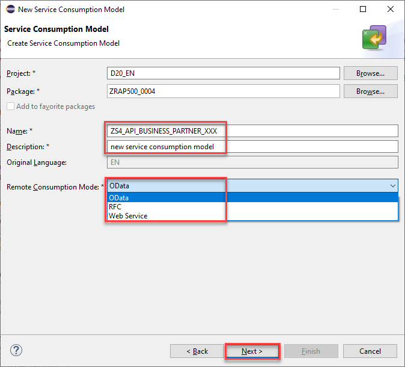

### Prerequisites
- Communication arrangement for scenario `SAP_COM_0008` was created in your SAP S/4HANA Cloud system as described in [Creating a Communication Arrangement in SAP S/4HANA Cloud](https://help.sap.com/viewer/65de2977205c403bbc107264b8eccf4b/Cloud/en-US/889fbe37b7b344deabfbdc78ab16e544.html).
- Destination `S4BusinessPartnerOAuth2` for the S/4Cloud system was created on subaccount level as described in [Creating the OAuth2SAMLBearerAssertion Destination to SAP S/4HANA Cloud](https://help.sap.com/viewer/65de2977205c403bbc107264b8eccf4b/Cloud/en-US/b968a25fe20e4f9a8f4366d1972fc7d4.html)
- Business user in SAP S/4 HANA Cloud has business role `SAP_BR_BUPA_MASTER_SPECIALIST` in order to create business partners in SAP S/4 HANA​.
- Integration between S/4 HANA Cloud and SAP BTP ABAP Environment completed​.

## Details
### You will learn
  - How to implement outbound service call from SAP BTP ABAP Environment to S/4 HANA Cloud service
  - How to retrieve data of logged in business user in SAP BTP ABAP Environment
  - Create business partner in S/4 HANA Cloud system based on data of business user in SAP BTP ABAP Environment (use Business Partner Integration Service in SAP S/4 HANA)​
  - Return business partner id after creation

Create all ABAP artifacts with namespace `Z...` for local development.
Always replace `XXX` with your initials or group number.

---

[ACCORDION-BEGIN [Step 1: ](Download service metadata)]
  1. Copy the service URL from communication arrangement on S/4 HANA Cloud system in a browser.

  2. Remove `-api` from your URL an add `/$metadata` at the end of the link and press enter. Login with your communication user and password.

      

  3. Right click the page and save the Metadata as a `.edmx` file.

      

[DONE]
[ACCORDION-END]


[ACCORDION-BEGIN [Step 2: ](Create your own ABAP package)]
Mark the steps 2 as completed by pressing `Done` if you have already created the package `Z_Package_XXX` (where XXX is your group number) in the previous tutorials.

  1. Open Eclipse and connect to your system.

  2. Right click the main package **ZLOCAL**  and choose **New** > **ABAP Package**.

  3. Create your own ABAP development package `Z_PACKAGE_XXX`  as a sub package of **ZLOCAL**.
      - Name: `Z_PACKAGE_XXX`
      - Description: `my new package`

  4. Click on **Next**.

      

  5. Select package properties and press **Next**.
      - Software Component: `ZLOCAL`

      

  6. Select a transport request and create your ABAP package with **Finish**.

      

You can add your package to **Favorite Packages**.

[DONE]
[ACCORDION-END]

[ACCORDION-BEGIN [Step 3: ](Add service consumption model)]
  1. Mark your package under **ZLOCAL** or in **Favorite Packages** and click on **File** and choose **New** > **Other…** > **Service Consumption Model**.

      

  3. Click on **Next**.

      

[DONE]
[ACCORDION-END]


[ACCORDION-BEGIN [Step 4: ](Create service consumption model)]
  1. Enter a name for your service consumption model, a service definition will be generated as part of the service consumption model with this name.

  2. Enter a description and choose **OData** as **Remote Consumption Mode**.

  3. Click **Next**.

      

  4. Upload the `.edmx` file, which you saved before, in the Service Metadata File field.

  5. Click **Next**.

      

[DONE]
[ACCORDION-END]


[ACCORDION-BEGIN [Step 5: ](Change ABAP artifact names)]
  1. Add the `_XXX` at the end of each name.

  2. Click on **Next**.

      

[DONE]
[ACCORDION-END]


[ACCORDION-BEGIN [Step 6: ](ABAP artifact generation list)]
  1. Click on **Next** by artifact generation list.

      

  2. Select a transport request.

  3. Click on **Finish**.

      

[DONE]
[ACCORDION-END]


[ACCORDION-BEGIN [Step 7: ](Check created service definition)]
Open service definitions in your package and make sure if your new service definition is created successfully.


[DONE]
[ACCORDION-END]


[ACCORDION-BEGIN [Step 8: ](Add HTTP service)]
  1. Right click your package and choose **New** > **Other ABAP Repository Object** > **HTTP Service**.

      

  2. Click **Next**.

      

[DONE]
[ACCORDION-END]


[ACCORDION-BEGIN [Step 9: ](Create HTTP service)]
  1. Enter a name and a description.
      - Name: `ZS4_BUPA_XXX`
      - Description: `call S/4 Business Partner`

  2. Click **Next**.

      

  3. Select a transport request and click on **Finish**.

      

[DONE]
[ACCORDION-END]


[ACCORDION-BEGIN [Step 10: ](Create handler class)]
  1. Go to the HTTP Service that you created in the last step.

  2. Open **Handler Class**.

      

  3. Copy the code in the class and change it with your data.

| --------------------------------- |---------------------------------------------------------------------------------- |
|   `i_service_instance_name`       | the value of the service instance name property of the communication arrangement  |
|           `i_name`                |                        the name of the destination                                |
|       `i_authn_mode`              |                   `if_a4c_cp_service`=>`user_propagation`                         |
|  `iv_service_definition_name`     |               Data definition created as part of client proxy                     |
Retrieve Name of `ZA_BusinessPartner_XXX` Data Definition.

```ABAP
CLASS zcl_s4_bupa_xxx DEFINITION PUBLIC CREATE PUBLIC .
  PUBLIC SECTION.
    INTERFACES if_http_service_extension .
ENDCLASS.

CLASS zcl_s4_bupa_xxx IMPLEMENTATION.
  METHOD if_http_service_extension~handle_request.
    TRY.
        DATA(lo_destination) = cl_http_destination_provider=>create_by_cloud_destination(
             i_name                  = 'S4BusinessPartnerOAuth2'
             i_authn_mode =  if_a4c_cp_service=>user_propagation
         ).

        cl_web_http_client_manager=>create_by_http_destination(
          EXPORTING
            i_destination = lo_destination
          RECEIVING
            r_client = DATA(lo_http_client)
        ).

**Relative service path**
        lo_http_client->get_http_request( )->set_uri_path( '/sap/opu/odata/sap/API_BUSINESS_PARTNER' ).
        lo_http_client->set_csrf_token( ).

        DATA(lo_client_proxy)  = cl_web_odata_client_factory=>create_v2_remote_proxy(
           iv_service_definition_name = 'ZS4_API_BUSINESS_PARTNER_XXX'
           io_http_client             = lo_http_client
           iv_relative_service_root   = '/sap/opu/odata/sap/API_BUSINESS_PARTNER' ).

**Entity set A_BUSINESSPARTNER in business partner integration service**
        DATA(lo_create_request) = lo_client_proxy->create_resource_for_entity_set('A_BUSINESSPARTNER')->create_request_for_create( ).

        DATA(lv_userid) = cl_abap_context_info=>get_user_technical_name( ).

        SELECT SINGLE *
        FROM i_businessuser
            WITH PRIVILEGED ACCESS
        WHERE userid = @lv_userid INTO
        @DATA(ls_businessuser).

        IF sy-subrc <> 0.
          response->set_text( |Error retrieving business user { lv_userid }| ).
          RETURN.
        ENDIF.

        DATA(ls_bupa) = VALUE za_businesspartner_XXX(
          businesspartnercategory = '1'
          firstname = ls_businessuser-firstname
          lastname = ls_businessuser-lastname
        ).

        lo_create_request->set_business_data( ls_bupa ).

        DATA(lo_create_response) = lo_create_request->execute( ).
        lo_create_response->get_business_data( IMPORTING es_business_data = ls_bupa ).

        response->set_text( |Business parter { ls_bupa-businesspartner } was created| ).

      CATCH cx_root INTO DATA(lx_exception).
        response->set_text( lx_exception->get_text( ) ).
    ENDTRY.
  ENDMETHOD.
ENDCLASS.

```

  4. Save and activate all objects that you created.

      


[DONE]
[ACCORDION-END]


[ACCORDION-BEGIN [Step 11: ](Test service with business user)]
  1. Navigate to HTTP service and click On URL.

      

  2. Enter business user email and password and click Log on.

      business user requires the `SAP_BR_BUPA_MASTER_SPECIALIST` business role.
      This User has the same email-address for both S/4 HANA and SAP BTP ABAP Environment.

      

      You see that a Business Partner is created.
  3. Copy the Business Partner number.

      

[DONE]
[ACCORDION-END]


[ACCORDION-BEGIN [Step 12: ](Open maintain business partner in SAP S/4 HANA)]
  1. Open SAP Fiori Launchpad and login with the business user.

      

  2. Navigate to **Business Partner Master** > **Maintain Business Partner**.

      

[DONE]
[ACCORDION-END]


[ACCORDION-BEGIN [Step 13: ](Verify business partner in SAP S/4 HANA)]
Enter created Business Partner number in the related field and press enter.
Check data of the created business service.


[DONE]
[ACCORDION-END]

[ACCORDION-BEGIN [Step 14: ](Test yourself)]

[VALIDATE_1]
[ACCORDION-END]
---
