## Details
### You will learn  
  - How to create a service definition
  - How to create a service binding
  - How to create a communication scenario

Always replace `XXX` with your initials or group number.

Create all business services with ABAP namespace `Z...`.

---

[ACCORDION-BEGIN [Step 1: ](Overview)]
You need to create an OData service by defining and binding a service based on the corresponding CDS view. As soon as the OData service is published in the local system repository, it is ready to be consumed by an OData client, such as a SAP Fiori app. To be able to use this exposed service and its related service binding, you need to create a published Communication Scenario. This published Communication Scenario will be assigned to a Communication Arrangement.

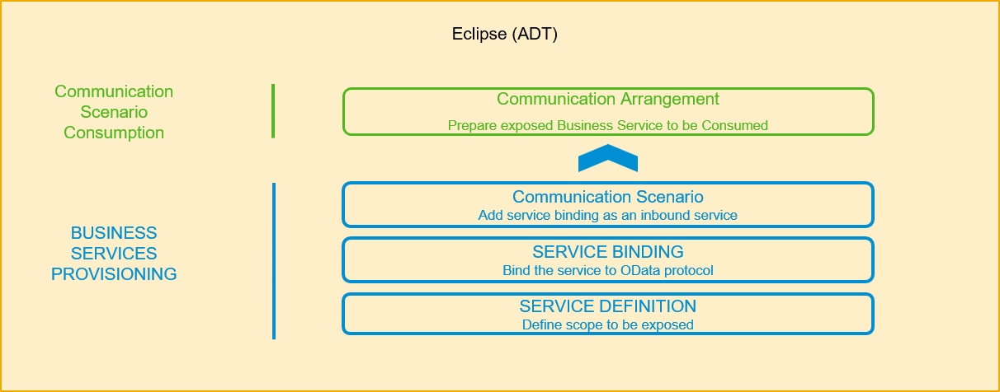

[DONE]
[ACCORDION-END]

[ACCORDION-BEGIN [Step 2: ](Install ADT)]
  1. In Eclipse, choose in the menu bar **Help** > **Install New Software...**.

      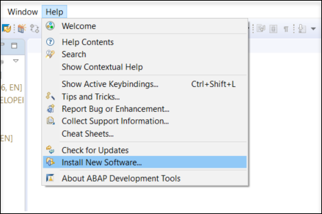

  2. For Eclipse Photon, add the URL `https://tools.hana.ondemand.com/photon` and press enter to display available features. Select **ABAP Development Tools** and choose **Next**.

      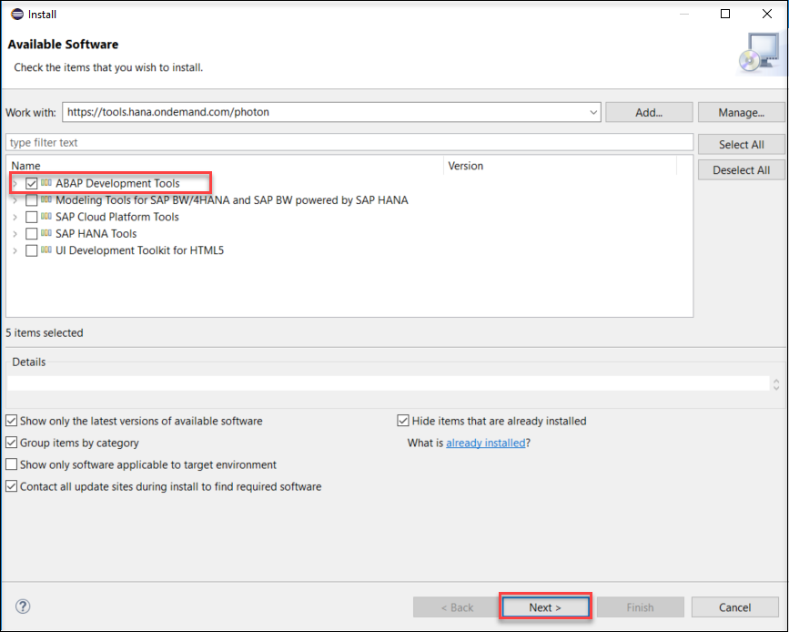      

  3. confirm the license agreements and choose **Finish** to start the installation. You will need to restart your Eclipse.

      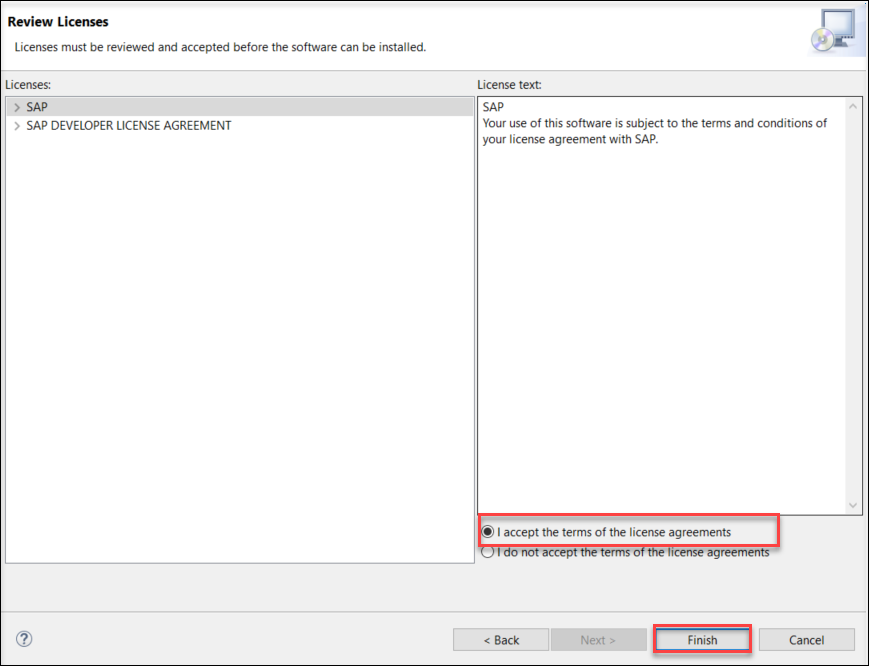

[DONE]
[ACCORDION-END]

[ACCORDION-BEGIN [Step 3: ](Create your own ABAP package)]
Mark this steps as completed by pressing `Done` if you have already created the package `Z_Package_XXX` (where XXX is your group number) in the previous tutorials.

  1. Open Eclipse and connect to your system.

  2. Right click the main package `ZLOCAL` choose **New** > **ABAP Package**.

  3. Create your own ABAP development package `Z_PACKAGE_XXX`  as a sub package of `ZLOCAL`.
      - Name: `Z_PACKAGE_XXX`
      - Description: `my new package`

  4. Click **Next**.

      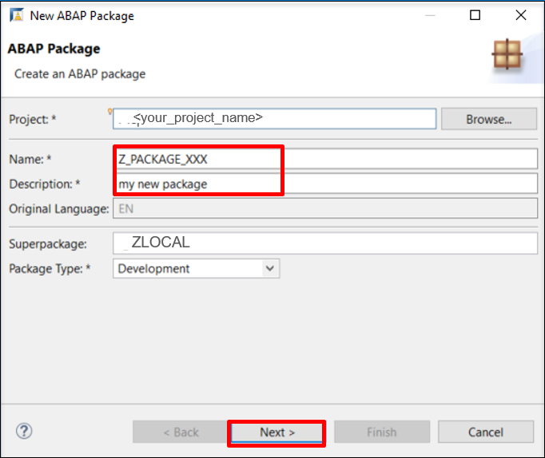

  5. Select package properties and click **Next**.
      - Software Component: `ZLOCAL`

      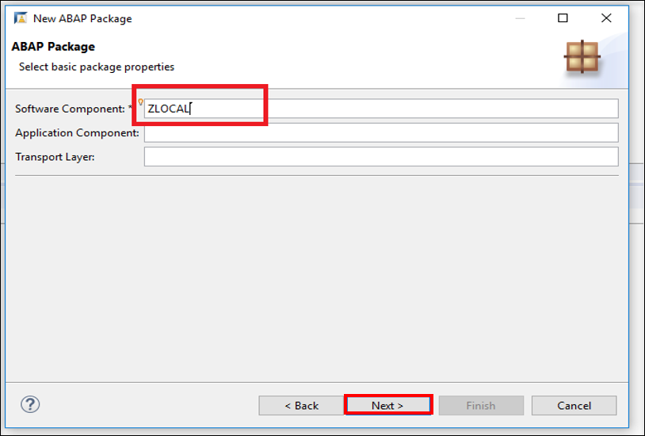

  6. Select a transport request and click **Finish**.

      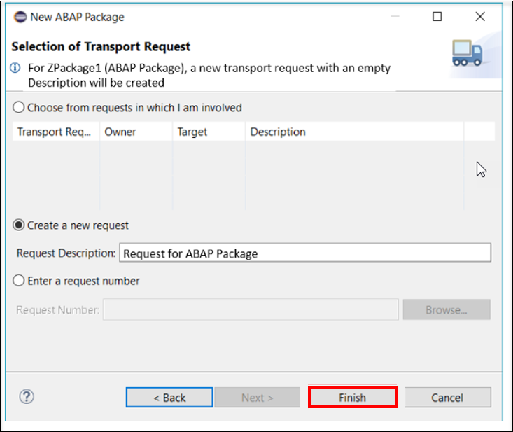

Add your package to **Favorite Packages**.

[DONE]
[ACCORDION-END]


[ACCORDION-BEGIN [Step 4: ](Create a service definition)]
We want to create service definition to expose CDS entities and their behavior.

  1. Right click your package and choose **New** > **Other ABAP Repository Object** > **Business Services** > **Service Definition**.

  2. Click **Next**.

      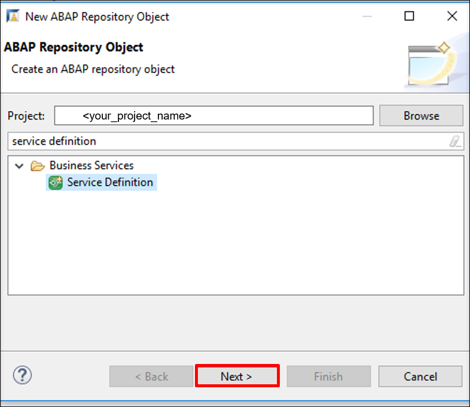

  3. Create a service definition by adding following information.
      - Name: `Z_DEF_XXX`
      - Description: `service definition`

  4. Click **Next**.

      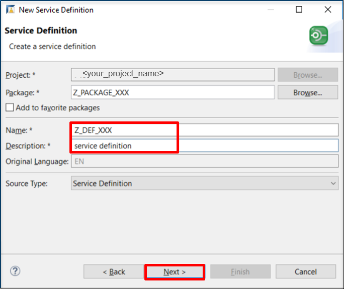

The Service definition is now created.


[DONE]
[ACCORDION-END]


[ACCORDION-BEGIN [Step 5: ](Expose CDS View)]
Exposition of the CDS view `I_Currency` and provide Currency as alias.
Do not forget to save and activate!

```ABAP
@EndUserText.label: 'Demo service Definition'
define service Z_DEF_XXX {
  expose I_Currency as Currency;
}
```

[DONE]
[ACCORDION-END]


[ACCORDION-BEGIN [Step 6: ](Create a service binding)]
We want to create service binding to bind service to a protocol and preview.

  1. Right click your package and choose **New** > **Other ABAP Repository Object** > **Business Services** > **Service Binding**.

  2. Click **Next**.

      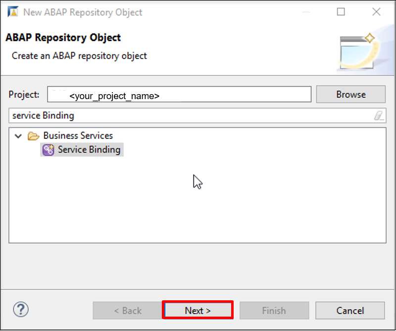

  3. Enter data for a new service binding. Use the service definition created in last step.
      - Name: `Z_BIND_XXX`
      - Description: `service binding`
      - Binding Type: ODATA V2 (UI - User Interface: Consumed in SAPUI5 Apps)

  4. Click **Next**.

      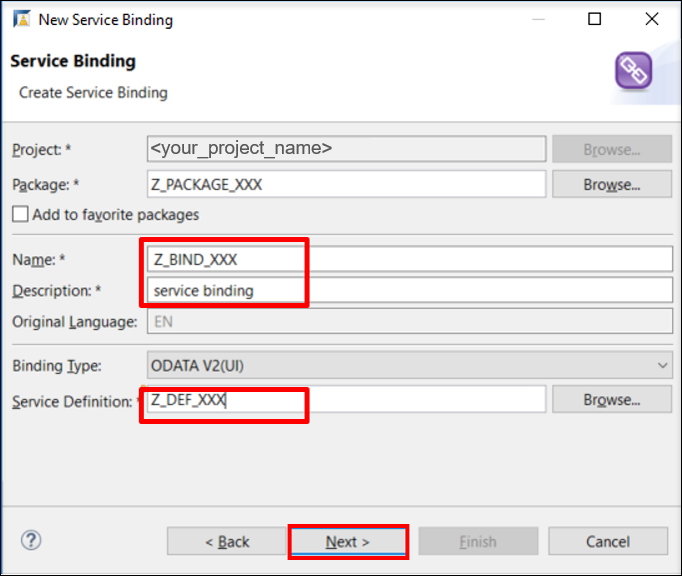

[DONE]
[ACCORDION-END]


[ACCORDION-BEGIN [Step 7: ](Activate your service binding)]
Click **Activate**, and then you will see the service name and service URL in the table.

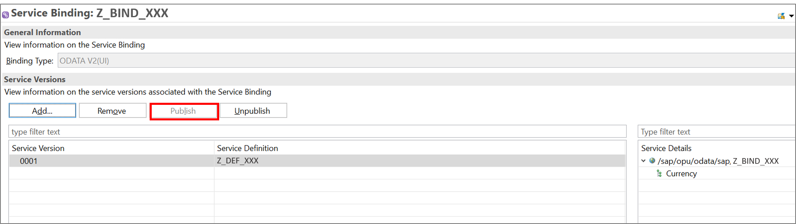

[DONE]
[ACCORDION-END]


[ACCORDION-BEGIN [Step 8: ](Preview your service binding)]
After publishing the business service, you can preview the published business service as SAP Fiori Elements app in the Service Binding editor:

  1. Go to the **Service Details** on the right side

  2. Either double-clicking on the entity Currency or right-clicking on it and then selecting **Open preview for Fiori Elements App**.

      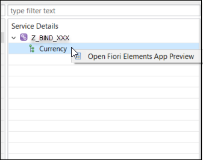

  3. Login with your username and password.

      

  4. To set some filters click on settings icon.

      

  5. Select fields that shall be displayed or select all and click **OK**.

      

  6. Click on **GO**.

      

  7. You can see the filtered data on UI.

      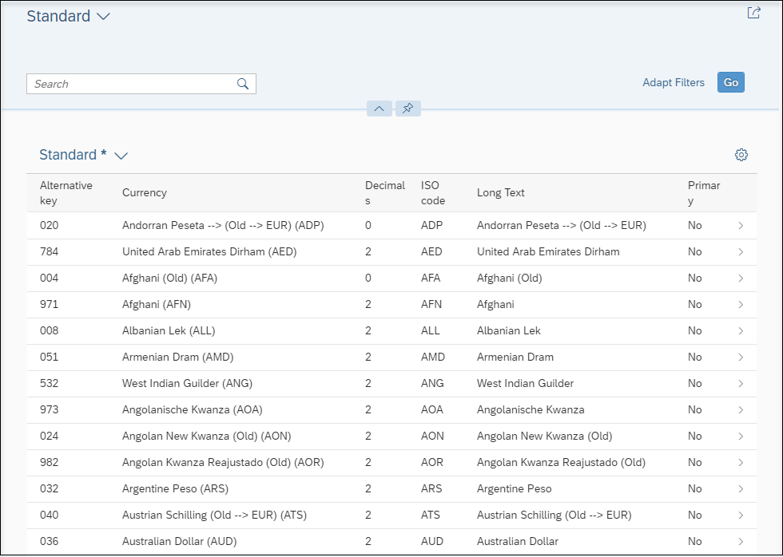


[DONE]
[ACCORDION-END]


[ACCORDION-BEGIN [Step 9: ](Create a communication scenario)]
  1. Right click your package and choose **New** > **Other ABAP Repository Object** > **Communication Management** > **Communication Scenario**.

  2. Click **Next**.

     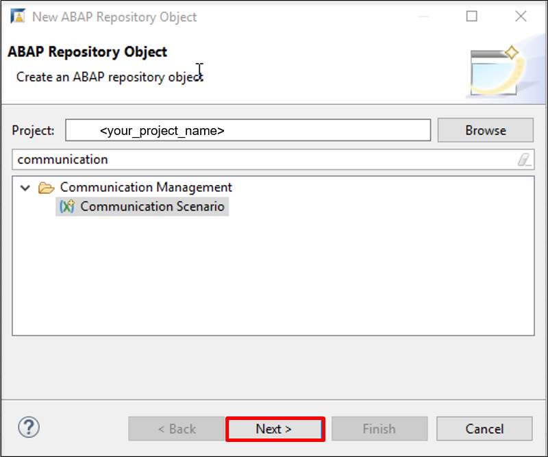

  3. Enter data for a communication scenario.
      - Name: `Z_COMMU_XXX`
      - Description: `communication scenario`

  4. Click **Next**.

      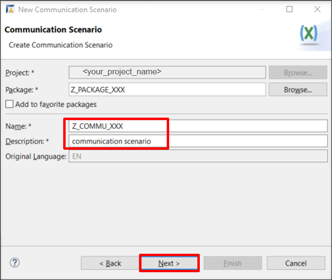

[DONE]
[ACCORDION-END]


[ACCORDION-BEGIN [Step 10: ](Add inbound into communication scenario)]
 1. Open the created communication scenario and navigate to **Inbound** tab.

 2. Check **Basic** under **Supported Authentication Methods**.

 3. Click **Add** inbound service.

 4. Browse the service binding created before, `Z_BIND_XXX`, and select inbound service ID `Z_BIND_XXX_IWSG` instead, where `XXX` is your group number.

      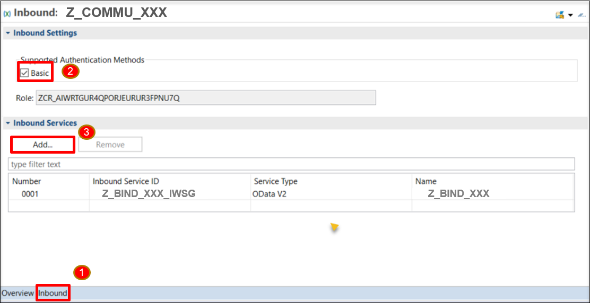

      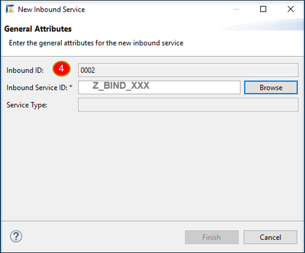

[DONE]
[ACCORDION-END]


[ACCORDION-BEGIN [Step 11: ](Publish communication scenario)]
Navigate to the **Overview** tab and publish the scenario locally.

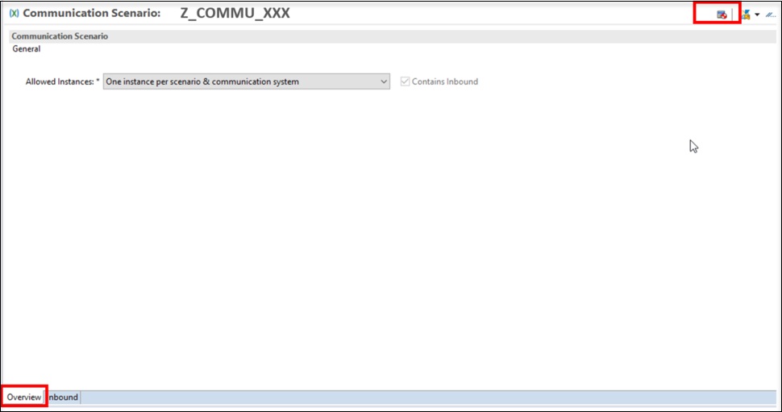

[DONE]
[ACCORDION-END]

[ACCORDION-BEGIN [Step 12: ](Test yourself)]

[VALIDATE_1]
[ACCORDION-END]


---
