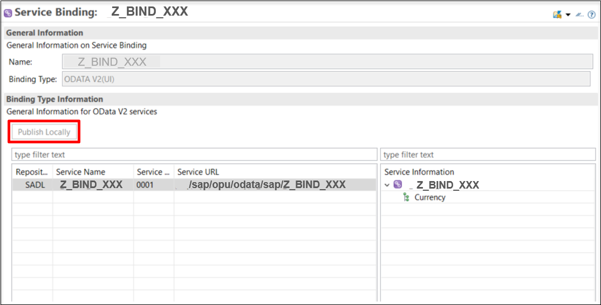

## Details
### You will learn  
  - How to create a service definition
  - How to create a service binding
  - How to create a communication scenario

In this tutorial, wherever `xxx` appears, use a number (e.g. `000`).

Create all Business services with ABAP namespace `Z...`.

---

[ACCORDION-BEGIN [Step 1: ](Create your own ABAP package)]

1. Open eclipse and connect to your system.
2. Right click on main package `ZLOCAL` choose **New** > **ABAP Package**.
3. Create your own ABAP development package `Z_PACKAGE_XXX`  as a sub package of `ZLOCAL`.
4. Click **Next**.

5. Select package properties and click **Next**.


[DONE]
[ACCORDION-END]


[ACCORDION-BEGIN [Step 2: ](Select a transport request)]

Select a transport request and click **Finish**.

Add your package to **Favorite Packages**.

[DONE]
[ACCORDION-END]


[ACCORDION-BEGIN [Step 3: ](Create a service definition)]

We want to create service definition to expose CDS entities and their behavior.

1. Right click on your package and choose **New** > **Other ABAP Repository Object** > **Business Services** > **Service Definition**.
2. Click **Next**.

3. Create a service definition by adding following information.
4. Click **Next**.


[DONE]
[ACCORDION-END]


[ACCORDION-BEGIN [Step 4: ](Add method)]

Add your method to your service definition.
Do not forget to save and activate!

```swift
@EndUserText.label: 'Demo service Definition'
define service Z_DEF_XXX {
  expose I_Currency as Currency;
}
```

[DONE]
[ACCORDION-END]


[ACCORDION-BEGIN [Step 5: ](Create a service binding)]

We want to create service binding to bind service to a protocol and preview.

1. Right click on your package and choose **New** > **Other ABAP Repository Object** > **Business Services** > **Service Binding**.
2. Click **Next**.

3. Enter data for a new service binding. Use the service definition created in last step. 
4. Click **Next**.


[DONE]
[ACCORDION-END]


[ACCORDION-BEGIN [Step 6: ](Publish your service binding)]

Click **Publish locally**, and then you will see the service name and service URL in the table.


[DONE]
[ACCORDION-END]


[ACCORDION-BEGIN [Step 7: ](Create a communication scenario)]

1. Right click on your package and choose **New** > **Other ABAP Repository Object** > **Communication Management** > **Communication Scenario**.
2. Click **Next**.

3. Enter data for a communication scenario.
4. Click **Next**.


[DONE]
[ACCORDION-END]


[ACCORDION-BEGIN [Step 8: ](Add inbound into communication scenario)]

1. Open the created communication scenario and navigate to **Inbound** tab.
2. Check **Basic** under **Supported Authentication Methods** and click **Add** inbound service. The service binding created before will be displayed in the table below.


[DONE]
[ACCORDION-END]


[ACCORDION-BEGIN [Step 9: ](Publish communication scenario)]

Navigate to the **Overview** tab and publish the scenario locally.


[DONE]
[ACCORDION-END]

[ACCORDION-BEGIN [Step 10: ](Test yourself)]
Define a service definition with following information:

 - annotation: `@EndUserText.label`: `'Test'`
 - service name: `service Z_Testyourself `
 - expose `I_Currency` as Currency

[VALIDATE_1]
[ACCORDION-END]


---
