   
## Prerequisites  
 - Existing OData service
 - Existing service catalog

## Details
### You will learn  
  - How to create UI on Neo
  - How to deploy the UI form Neo to the Cloud Foundry

---

[ACCORDION-BEGIN [Step 1: ](Create multi-target application)]

  1. Log in to your SAP Cloud Platform Cockpit with your global account and choose your Neo subaccount.

  2. Click on **Services** and choose **SAP Web IDE Full-Stack**.

      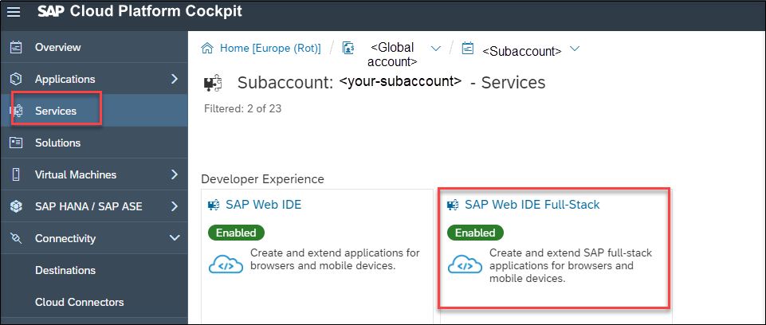

  3. Click on **Go to Service**.

      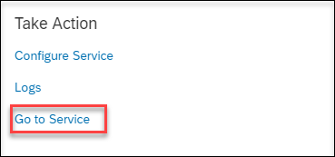

  4. Choose **New Project from Template**.

      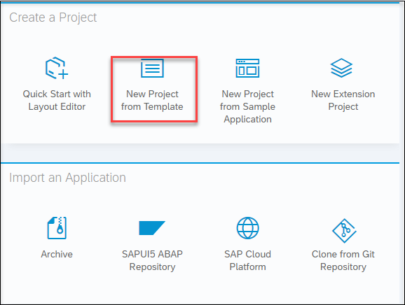

  5. Click on **Multi-Target Application** and **Next**.

      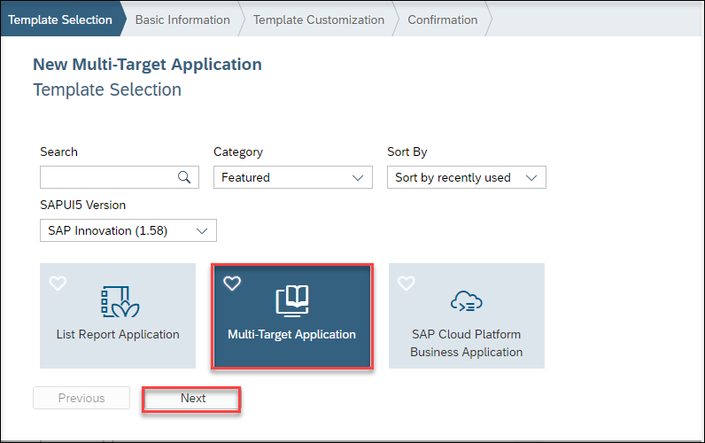

  6. Enter a **Project Name** and click on **Next**.

      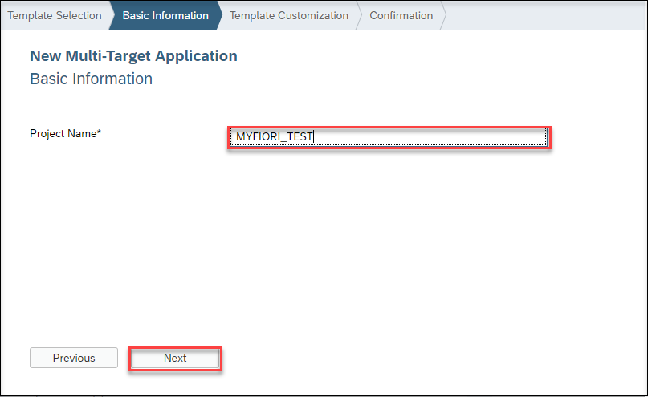

  7. Enter **Application ID** and **Application Version**. Check **Use HTML5 Application Repository** and click on **Finish**.

      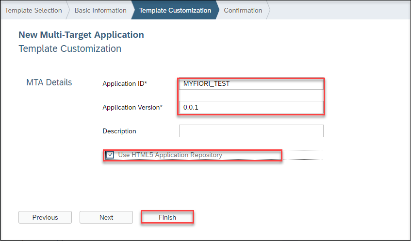

[DONE]
[ACCORDION-END]

[ACCORDION-BEGIN [Step 2: ](Create HTML5 module)]

  1. Open HTML5 Module with a right click on project name > **New** > **HTML5 Module**.

      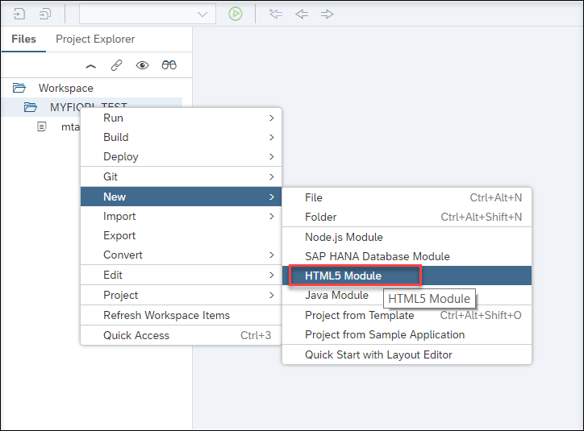

  2. Choose **List Report Application** and click on **Next**.

      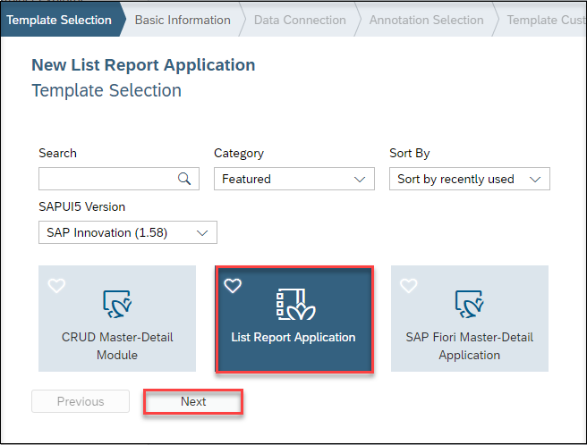

  3. Enter a **Module Name**, **Title** and click on **Next**.

      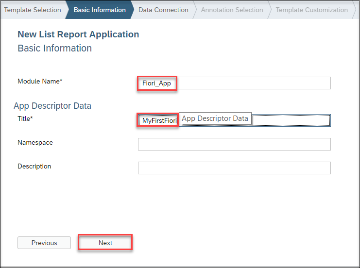

  4. Choose an existing **Service Catalog**, select a **Service** and click on **Next**.

      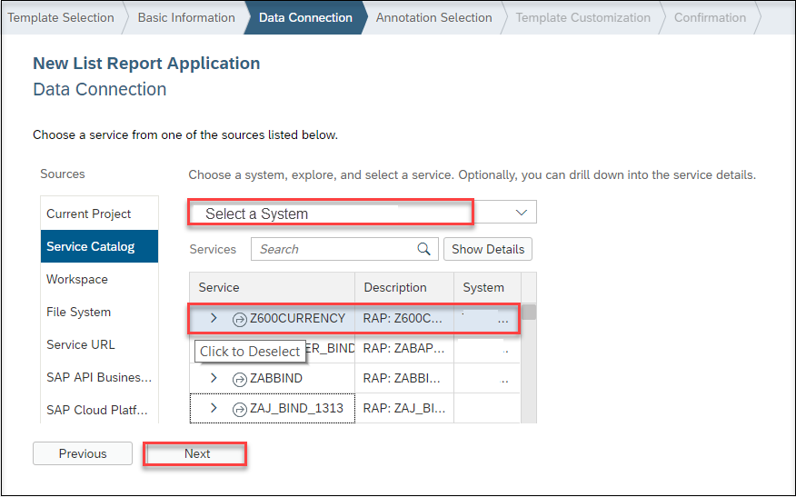

  5. Select an **Annotation**, click on **Next**, select an **OData Collection** and click on **Finish**.

      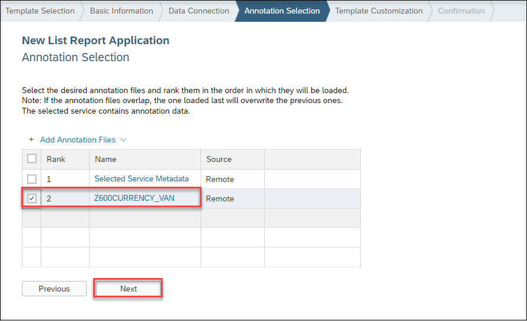

      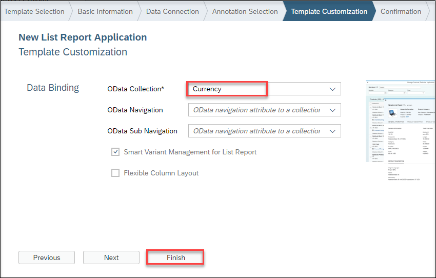

[DONE]
[ACCORDION-END]


[ACCORDION-BEGIN [Step 3: ](Create index.html file in webapp folder)]

  1. Do a right click on `webapp` folder under your application and choose **New** > **File**, enter a **File Name** like `index.html` and click on **OK**.

      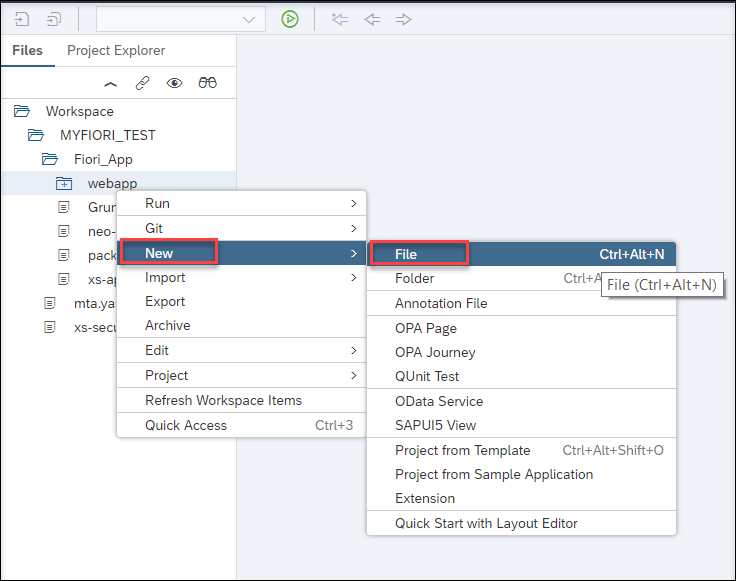

      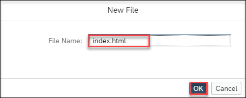

  2. Edit `index.html` file. Replace `Fiori_App` with your HTML5 module name.

```swift
  <!DOCTYPE html>​
<html>​
<head>​
    <meta http-equiv="X-UA-Compatible" content="IE=edge" />​
    <meta http-equiv="Content-Type" content="text/html;charset=UTF-8"/>​
    <meta name="viewport" content="width=device-width, initial-scale=1.0" />​
    <title>MyFirstFiori</title>​
    <!-- Bootstrapping UI5 -->​
    <script id="sap-ui-bootstrap"​
            src="https://sapui5.hana.ondemand.com/resources/sap-ui-core.js"​
            data-sap-ui-libs="sap.m"​
            data-sap-ui-theme="sap_bluecrystal"​
            data-sap-ui-compatVersion="edge"​
            data-sap-ui-preload="async"​
            data-sap-ui-resourceroots='{"Fiori_App": "."}'​
            data-sap-ui-frameOptions="trusted">​
    </script>​
    <script>​
        sap.ui.getCore().attachInit(function () {​
            sap.ui.require([​
                "sap/m/Shell",​
                "sap/ui/core/ComponentContainer"​
            ], function (Shell, ComponentContainer) {​
                // initialize the UI component​
                new Shell({​
                    app: new ComponentContainer({​
                        height : "100%",​
                        name : "Fiori_App"​
                    }),​
                    appWidthLimited : false​
                }).placeAt("content");​
            });​
        });​
    </script>​
</head>​
<!-- UI Content -->​
<body class="sapUiBody" id="content">​
</body>​
</html>​

```

[DONE]
[ACCORDION-END]

[ACCORDION-BEGIN [Step 4: ](Adapt neo-app.json and xs-app.json)]

  1. Open `neo-app.json` file and change the `welcmeFile` form `/webapp/test/flpSandbox.html` to `/webapp/index.html`.

      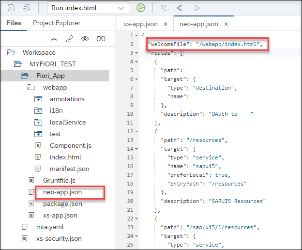

  2. Open `xs-app.json` file and change the `welcmeFile` form `/test/flpSandbox.html` to `index.html`. In routes change `authenticationType` to  `xsuaa` and `service` to `abapcp` and remove `destination`. If there is no `service`, you can add it yourself.

      

[DONE]
[ACCORDION-END]

[ACCORDION-BEGIN [Step 5: ](Delete local annotations (optional) )]

  1. Open `annotations.xml` and delete `UI.Facets` under **Local Annotation**.

      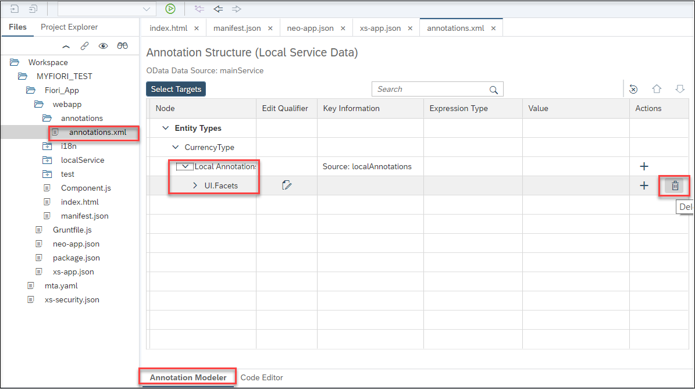

[DONE]
[ACCORDION-END]

[ACCORDION-BEGIN [Step 6: ](Test UI on Neo)]

  1. Do a right click on your application and choose **Run** > **Run as** > **Web Application**, and choose `index.html` as the file to run and click on **OK**.

      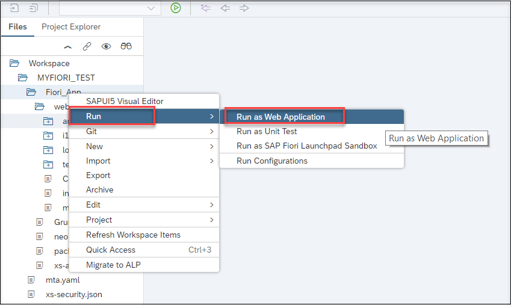

      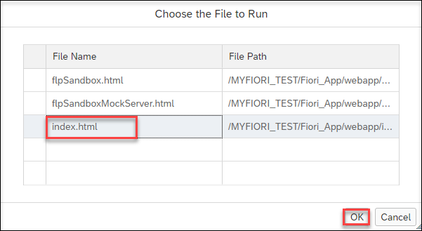

  2. Click on setting button and choose the fields which should be shown on UI and click on **OK** and then click on **Go** to see the fields.

      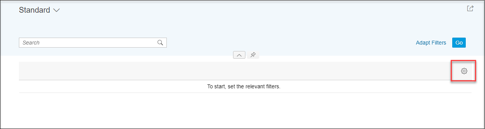

      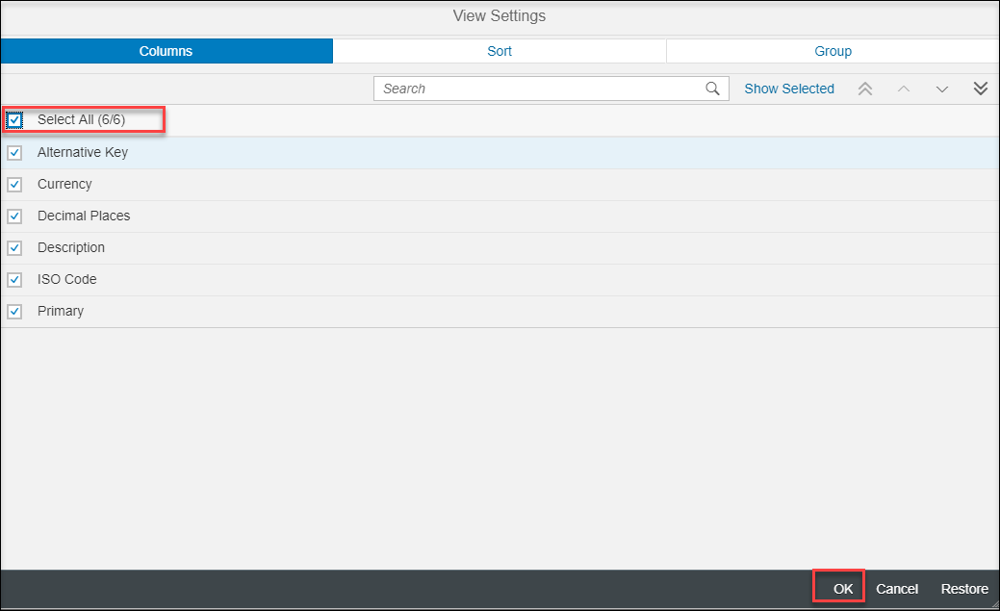

      

[DONE]
[ACCORDION-END]

[ACCORDION-BEGIN [Step 7: ](Adapt app router configuration)]

  1. Remove destination from MTA modules and resources. For that open the `mta.yaml` file and remove `dest_MYFIORI_TEST` from `MTA_TEST_appRouter` under **Modules** and under **Resources** as well.

      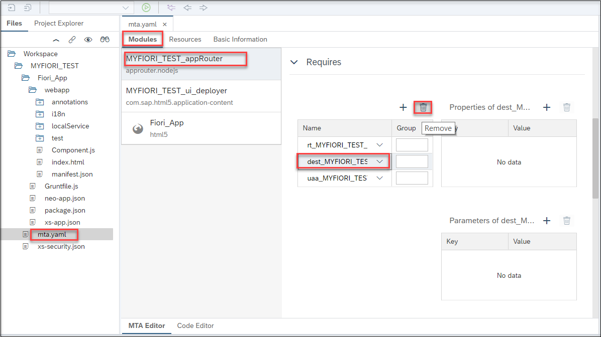

      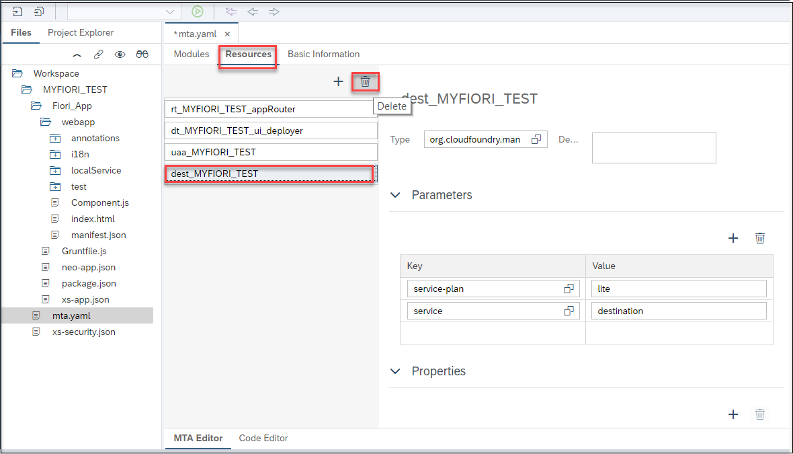

  2. Add ABAP application runtime instance as resource MTA. For that click on **+** button under **Resources**, enter `org.cloudfoundry.existing-service` as **Type**, `service-name` as **Key** and the name of ABAP service instance in space in Cloud Foundry subaccount as **Value**.

      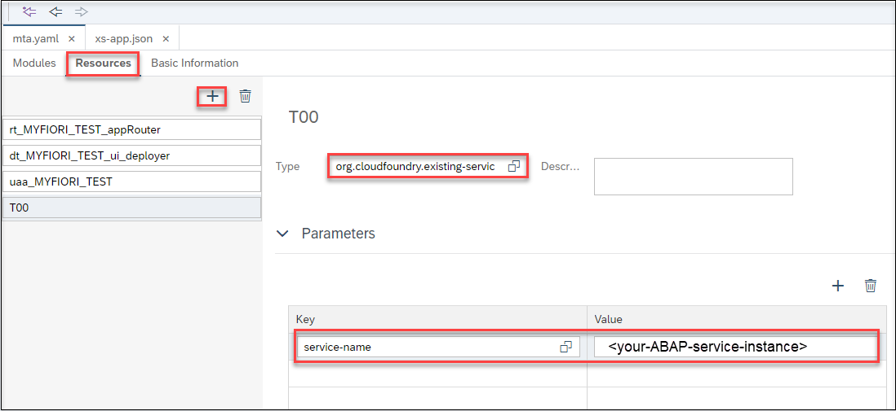

  3. Save `mta.yaml` file and close it and reopen the file.

  4. Add ABAP resource to **Requires** of `AppRouter`. For that click on **Modules**, click on `MTA_TEST_appRouter`, click on **+** button and find the created resource in the last step.

      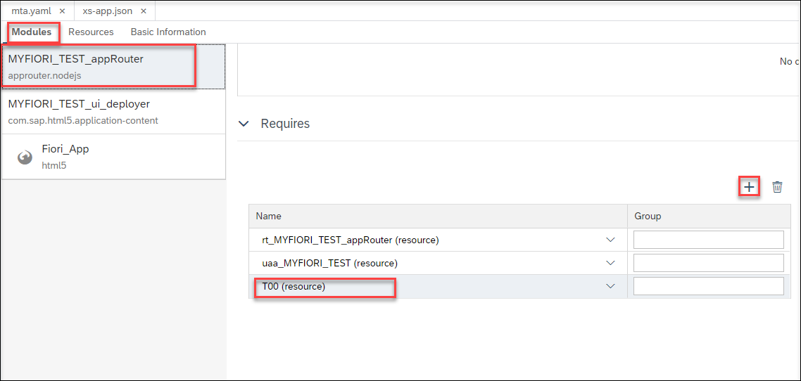

[DONE]
[ACCORDION-END]

[ACCORDION-BEGIN [Step 8: ](Deploy UI to Cloud Foundry)]

  1. Right click on your application and choose **Project** > **Project Settings**.

      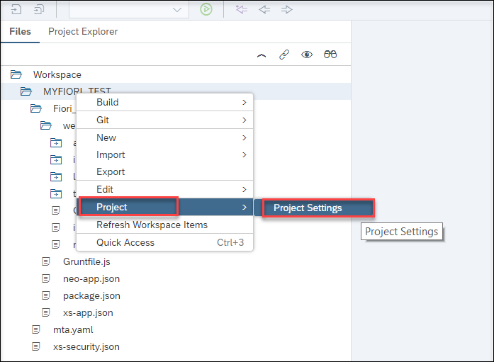

  2. Set details of **Use the following Cloud Foundry configuration** in **Cloud Foundry**. You will need to enter the **API Endpoint**, **Organization** and **Space**. Click **Install/Reinstall Builder** and **Save**.

      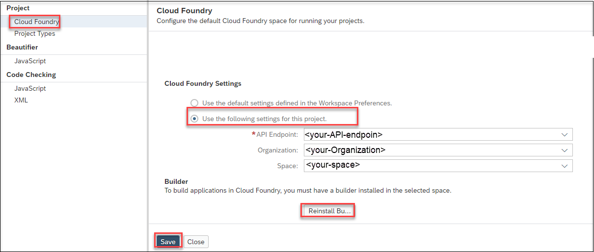

  3. Do again a right click on your application and choose **Build**. It will take a while and you can see the build result in `mta_archives`.

      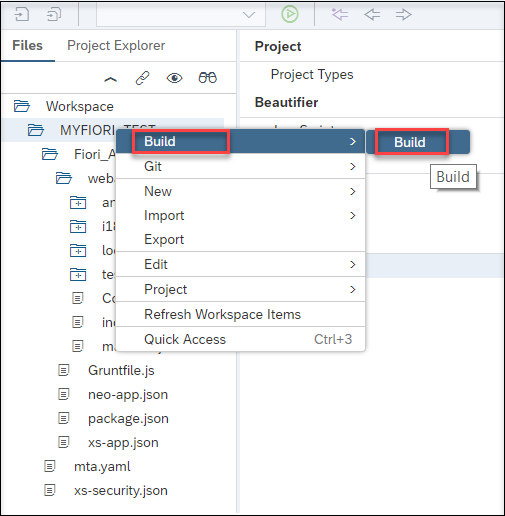

      

 4. Right click on `.mtar` file and choose **Deploy** > **Deploy to SAP Cloud Platform**. Choose again the **API Endpoint**, **Organization** and **Space**. Now click on **Deploy**.

      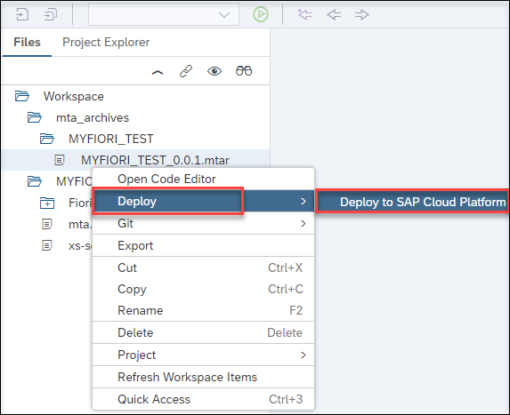

      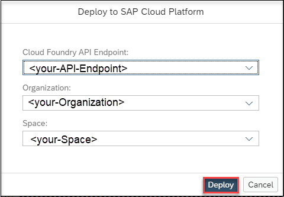

[DONE]
[ACCORDION-END]

[ACCORDION-BEGIN [Step 9: ](Check app existence on Cloud Foundry)]

  1. Log in to SAP Cloud Platform Cockpit, go to your space and choose **Application**. Check if your `appRouter` is started.

      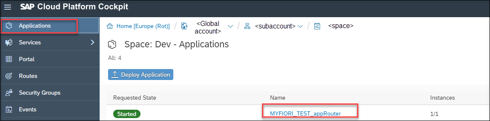

  2. Click on your `appRouter` and check the **Service Binding**.

      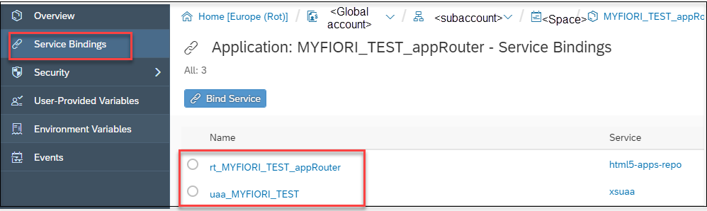

  3. Click on **Overview** and copy the link under **Application Routes**.

      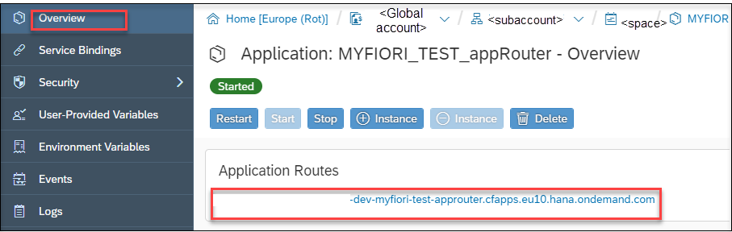

  4. Use following URL-Pattern to run the application: `<route-on-cf>/<id>.<version>`

      ID: id used in `webapp/manifest.json`.

      Version: `applicationVersion` provided in `webapp/manifest.json`.

      Example URL: `https://<link-from-application-routes>/Fiori_App-1.0.0/`.

  5. Now you can test your application UI. Click on setting button and choose the fields which should be shown on UI and click on **OK** and then click on **GO** to see the fields.

      

      

      


[DONE]
[ACCORDION-END]

[ACCORDION-BEGIN [Step 10: ](Test yourself)]


[VALIDATE_1]
[ACCORDION-END]


---
