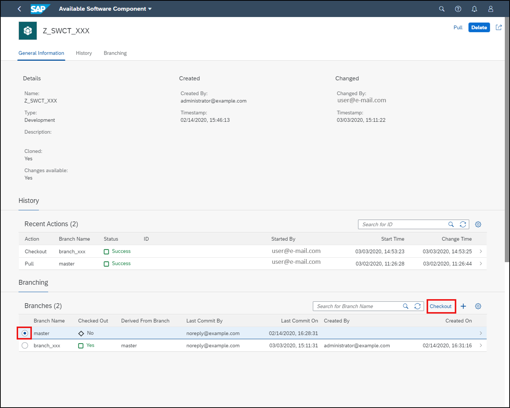
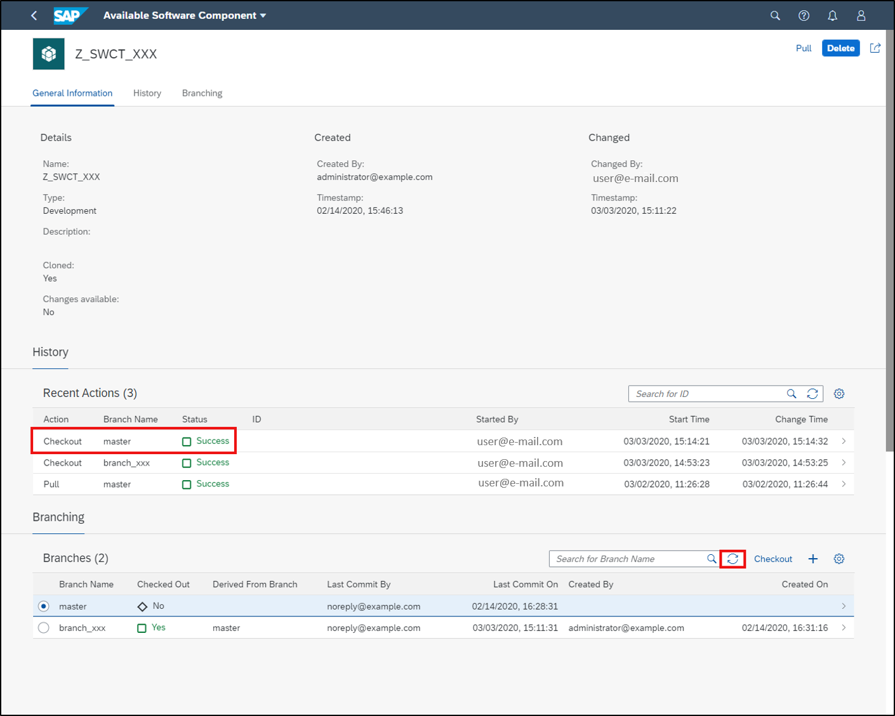
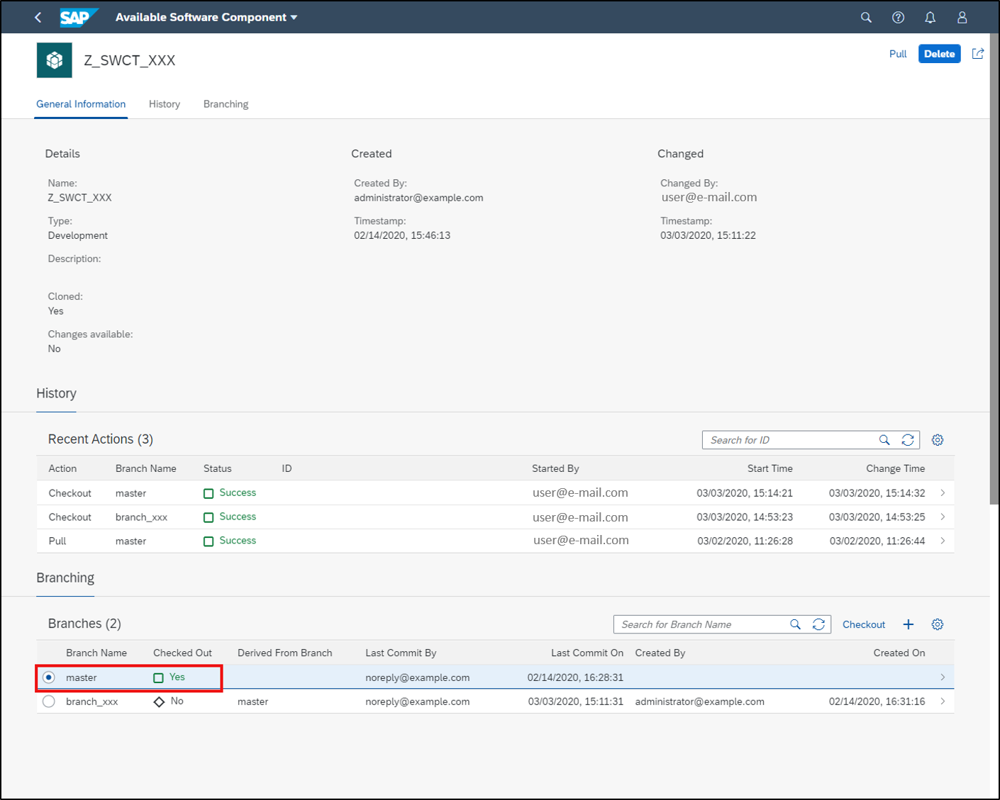

## Prerequisites  
  - SAP BTP, ABAP environment user
  - ADT version 2.96 or higher
  - Administrator role assigned to user
  - You have finished following tutorial:  [Create Branches with SAP BTP, ABAP Environment](abap-environment-branch).

## Details
### You will learn
  - How to checkout feature branch
  - How to change your coding
  - How to transport changes
  - How to checkout master branch
  - How to test changes

In this tutorial, wherever `XXX` appears, use a number (e.g. `000`).

---


[ACCORDION-BEGIN [Step 1: ](Checkout feature branch)]
1. Logon to your ABAP system in your SAP Fiori launchpad and open **Manage Software Components** application.

    

    Note: If you don't know the URL of your ABAP system, then you can open your **ABAP Development Tools (ADT)**, right-click on your **ABAP system** in your project explorer, select **Properties** and click on your **system URL**.

2. In your manage software components application search for your software component **`Z_SWCT_XXX`** and select it.

    

3. Select your feature branch **`branch_xxx`** and click **Checkout** to be active with your master branch.

    

4. Click **OK**.

    

5. Refresh your recent actions to see your result.

    

6. Now you can see, that your feature branch **`branch_xxx`** is checked out successfully.

    

[DONE]
[ACCORDION-END]


[ACCORDION-BEGIN [Step 2: ](Change your coding)]
1. Switch to your **ABAP Development Tools (ADT)**, logon to your **ABAP system**, right-click on your created ABAP class **`Z_CL_XXX`** and select **Refresh or Press `F5`** to refresh your ABAP class.

    

2. Now make changes in your ABAP class. Therefore replace your code of your ABAP class **`Z_CL_XXX`** with following:

    ```ABAP
    class z_cl_xxx definition
       public
       final
       create public .

       public section.
       interfaces if_oo_adt_classrun.
       protected section.
       private section.
     ENDCLASS.


     CLASS Z_CL_XXX IMPLEMENTATION.


       METHOD IF_OO_ADT_CLASSRUN~MAIN.
       out->write('Hello world! I am on branch_xxx now!').
       ENDMETHOD.
     ENDCLASS.
    ```

    

3. Save and activate.

    


[DONE]
[ACCORDION-END]

[ACCORDION-BEGIN [Step 3: ](Transport changes)]
  1. Select the transport organizer in your menu and refresh your workbench to transport your changes.

      

  2. Right-click on your transport task and select **Release**.

      

  3. Click **OK**.

      

  4. Right-click on your transport request and select **Release**.

      

  5. Click **OK**.

      


[DONE]
[ACCORDION-END]


[ACCORDION-BEGIN [Step 4: ](Checkout master branch)]
1. Switch to your software component **`Z_SWCT_XXX`** in **Manage Software Component**. Select your **master branch** and click **Checkout**.

    

2. Click **`OK`**.

    

3. Refresh your recent actions to see your result.

    

4. Now the master branch is checked out successfully. Refresh your branches as well.

    

5. Now you can see the result as well in the branches section. The master branch is checked out successfully.

    


[DONE]
[ACCORDION-END]

[ACCORDION-BEGIN [Step 5: ](Test changes)]
  1. Switch to ADT and open your ABAP class **`Z_CL_XXX`**. As you can see, you are still on the feature version.

      

  2. Right-click on your ABAP class **`Z_CL_XXX`** and click **Refresh**.

      

  3. Now you can see the coding of your master version again.

      


[DONE]
[ACCORDION-END]

[ACCORDION-BEGIN [Step 6: ](Test yourself)]

[VALIDATE_1]
[ACCORDION-END]
