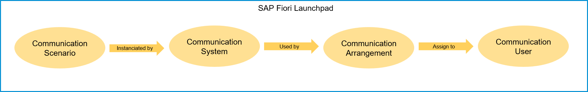

## Details
### You will learn  
- How to create a communication user
- How to create a communication system
- How to create a communication arrangement

In this tutorial, wherever `XXX` appears, use a number (e.g. `000`).

---

[ACCORDION-BEGIN [Step 1: ](Overview)]
In case you want to expose developed ABAP services for technical communication, you are expected to bundle them into a Communication Scenario. This Communication Scenario can then be consumed as a whole by different Communication Systems, represented by Communication Users. The combination of a Scenario, a System and a User is represented by a Communication Arrangement.

[DONE]
[ACCORDION-END]

[ACCORDION-BEGIN [Step 2: ](Login to SAP Fiori Launchpad)]
  1. Open Eclipse and do right click on your system and navigate to **Properties**.

      

  2. Navigate to **ABAP Development** and copy the **System URL**.

      

  3. Copy this URL in a browser and change the URL like this:

      Add `-web` after `.abap` and `/ui` at the end of URL.
      `https://<your-system>.abap-web.eu10.hana.ondemand.com/ui`.

      

  7. Login with the user `exp013-0##@teched.cloud.sap` provided on your handout.

      

[DONE]
[ACCORDION-END]

[ACCORDION-BEGIN [Step 3: ](Create communication user)]
  1. Navigate to **Maintain Communication User**.

      

  2. Create a new user by clicking **New**.

      

[DONE]
[ACCORDION-END]

[ACCORDION-BEGIN [Step 4: ](Add communication user data)]
  1. Enter user name `TEST_XXX` (where `XXX` is your group number) and description for your user.

  2. Use **propose password** button since the password has to be 20 characters and save the generated password in a text file for the following exercises.

  3. Click **Create**.

      

[DONE]
[ACCORDION-END]

[ACCORDION-BEGIN [Step 5: ](Create communication system)]
  1. Navigate back to Home and then to **Communication System**.

      

  2. Create a new communication system by clicking **New**.

      

[DONE]
[ACCORDION-END]

[ACCORDION-BEGIN [Step 6: ](Add system ID)]
  1. Add a system ID and system name.
      - System ID: `WEBIDE_BASIC_XXX`
      - System Name: `WEBIDE_BASIC_XXX`

  2. Click on **Create**.

A new communication system will be registered.

[DONE]
[ACCORDION-END]

[ACCORDION-BEGIN [Step 7: ](Add communication system data)]
  1. You can retrieve the system host name by right-clicking on your ABAP Cloud Project, selecting **Properties** from the context menu and clicking on **ABAP Development** in the hierarchy of properties. Copy the system URL and remove `https://` at its beginning.

      

  2. Click  **+** button to add the created communication user for inbound communication. Inbound communication means that the here defined system is used from a communication partner to call from external into the SAP S/4HANA system.

  3. Click **Save**.

      

      

[DONE]
[ACCORDION-END]

[ACCORDION-BEGIN [Step 8: ](Create communication arrangement)]
  1. Navigate back to Home and then to **Communication Arrangement**.

      

  2. Create a new communication arrangement by clicking **New**.

      

[DONE]
[ACCORDION-END]

[ACCORDION-BEGIN [Step 9: ](Select scenario)]
Select your scenario and click on **Create**.

[DONE]
[ACCORDION-END]

[ACCORDION-BEGIN [Step 10: ](Add communication arrangement data)]
  1. Add your communication system and select the communication user which you created in the first step in this tutorial.

  2. Copy this service URL / service interface from created communication arrangement, you will need it in next steps.

  3. Click **Save**.

      The URL from the communication arrangement should look as followed:

      `https://<your-system>-api.abap.eu10.hana.ondemand.com/sap/opu/odata/sap/Z_BIND_XXX` (where XXX is your group number)

      

[DONE]
[ACCORDION-END]

[ACCORDION-BEGIN [Step 11: ](Check the service URL)]
  1. Paste your service URL in a browser or in Postman.

  2. Remove `-api` from the link.

  3. Use the communication user and password.

  4. Check if you can connect to the service and there is no error.

      

      

[DONE]
[ACCORDION-END]

[ACCORDION-BEGIN [Step 12: ](Test yourself)]

[VALIDATE_1]
[ACCORDION-END]

---
