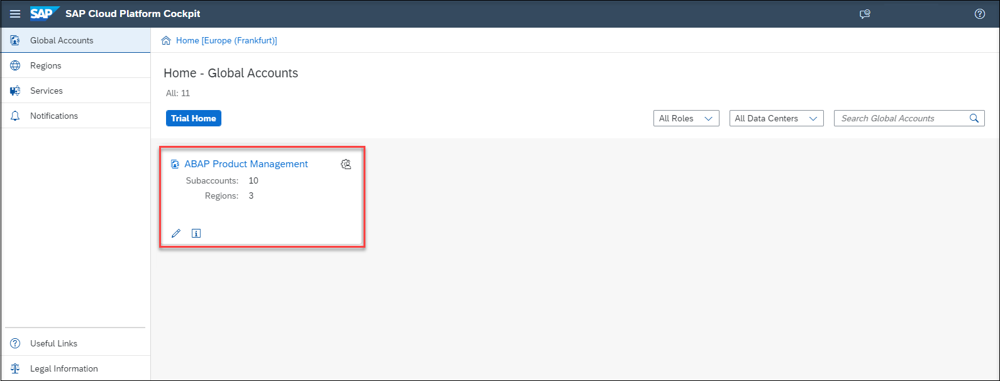
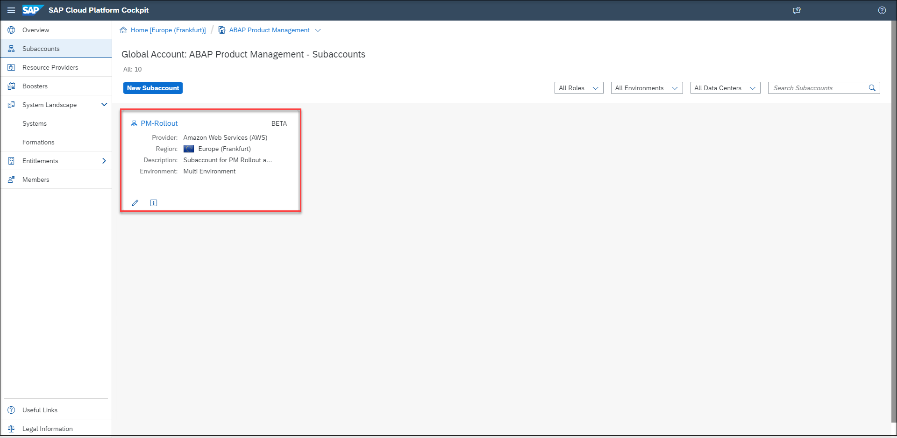
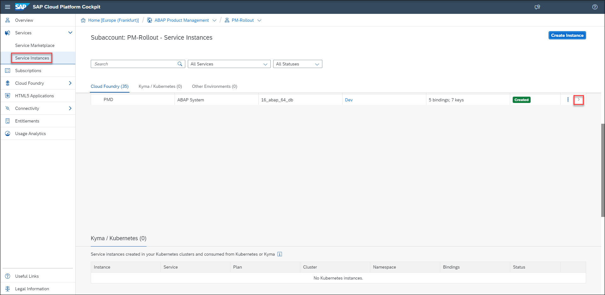
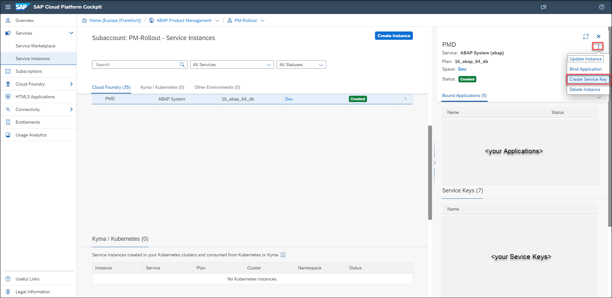
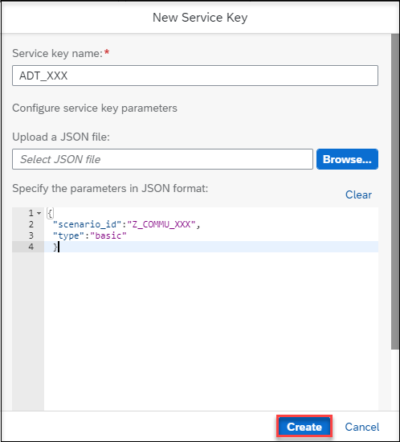

## Prerequisites  
- You have the business catalog **communication management (`SAP_CORE_BC_COM`)** assigned to your business user.

## Details
### You will learn  
- How to create a communication user
- How to create a communication system
- How to create a communication arrangement


Always replace `XXX` with your initials or group number.

---

[ACCORDION-BEGIN [Step 1: ](Overview)]
In case you want to expose developed ABAP services for technical communication, you are expected to bundle them into a Communication Scenario. This Communication Scenario can then be consumed as a whole by different Communication Systems, represented by Communication Users. The combination of a Scenario, a System and a User is represented by a Communication Arrangement.


[DONE]
[ACCORDION-END]

[ACCORDION-BEGIN [Step 2: ](Login to SAP Fiori Launchpad)]
  1. Open Eclipse and do right click your system and navigate to **Properties**.

      

  2. Navigate to **ABAP Development** and copy the **System URL**.

      


[DONE]
[ACCORDION-END]


[ACCORDION-BEGIN [Step 3: ](Create communication user)]
  1. Navigate to **Maintain Communication User**.

      

  2. Create a new user by clicking **New**.

      

[DONE]
[ACCORDION-END]


[ACCORDION-BEGIN [Step 4: ](Add communication user data)]
  1. Enter user name `TEST_XXX`, where `XXX` is your group number, and description for your user.

  2. Use **propose password** button since the password has to be 20 characters and save the generated password in a text file for the following exercises.

  3. Click **Create**.

      

[DONE]
[ACCORDION-END]


[ACCORDION-BEGIN [Step 5: ](Create communication system)]
  1. Navigate back to Home and then to **Communication System**.

      

  2. Create a new communication system by clicking **New**.

      

[DONE]
[ACCORDION-END]


[ACCORDION-BEGIN [Step 6: ](Add system ID)]
  1. Add a system ID and system name.
      - System ID: `WEBIDE_BASIC_XXX`
      - System Name: `WEBIDE_BASIC_XXX`

  2. Click **Create**.

A new communication system will be registered.


[DONE]
[ACCORDION-END]


[ACCORDION-BEGIN [Step 7: ](Add communication system data)]
  1. You can retrieve the system host name by right-clicking on your ABAP Cloud Project, selecting **Properties** from the context menu and clicking on **ABAP Development** in the hierarchy of properties. Copy the system URL and remove `https://` at its beginning.

      

  2. Click  **+** button to add the created communication user for inbound communication. Inbound communication means that the here defined system is used from a communication partner to call from external into the SAP S/4HANA system.

  3. Click **Save**.

      

      

[DONE]
[ACCORDION-END]


[ACCORDION-BEGIN [Step 8: ](Create communication arrangement)]
  1. Navigate back to Home and then to **Communication Arrangement**.

      

  2. Create a new communication arrangement by clicking **New**.

      

[DONE]
[ACCORDION-END]


[ACCORDION-BEGIN [Step 9: ](Select scenario)]
Select your communication scenario that you created in the last tutorial, `Expose a Standard Core Data Service for ABAP Environment`, and click **Create**.


[DONE]
[ACCORDION-END]


[ACCORDION-BEGIN [Step 10: ](Add communication arrangement data)]
  1. Add your communication system and select the communication user which you created in the first step in this tutorial.

  2. Copy this service URL / service interface from created communication arrangement, you will need it in next steps.

  3. Click **Save**.

      The URL from the communication arrangement should look as followed:

      `https://<your-system>.abap.eu10.hana.ondemand.com/sap/opu/odata/sap/Z_BIND_XXX` (where XXX is your group number)

      

[DONE]
[ACCORDION-END]


[ACCORDION-BEGIN [Step 11: ](Check the service URL via Postman)]
You can check your service URL via Postman. In Step 12 you'll learn how to check your communication scenario via SAP BTP Cockpit.

  1. Paste your service URL in a browser or in Postman.

  2. Use the communication user and password.

  3. Check if you can connect to the service and there is no error.

      

      

[DONE]
[ACCORDION-END]


[ACCORDION-BEGIN [Step 12: ](Check communication scenario via SAP BTP Cockpit)]
  1. Logon to your [SAP BTP Cockpit](https://account.hana.ondemand.com).

    

  2. Select your global account.

    

  3. Select Subaccounts.

    

  4. Select your subaccount.

    

  5. Select Service Instances and find your Instance and open it by clicking the arrow.

    

  6. Click Actions to create Service Key.

    

  7. Create Service key with the following parameters:
      - Name: ADT
      - Configuration Parameters (JSON):

    ```JSON
    {
     "scenario_id":"Z_COMMU_XXX",
     "type":"basic"
     }
    ```

    

  8. Now, your new service key is listed under Service Keys. The successful creation of the service key proves the existence of the communication scenario.


[DONE]
[ACCORDION-END]

[ACCORDION-BEGIN [Step 13: ](Test yourself)]

[VALIDATE_1]
[ACCORDION-END]

---
