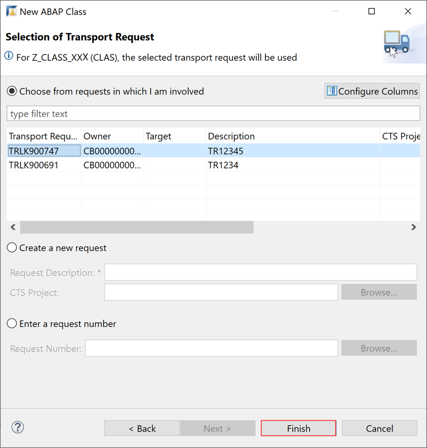
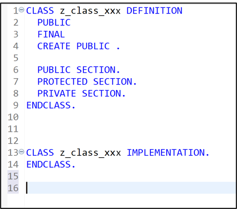

## Prerequisites  
  - SAP Cloud Platform ABAP Environment user
  - ADT version 2.96 or higher

## Details
### You will learn
  - How to create an ABAP Cloud Project in ADT
  - How to create an ABAP package
  - How to create an ABAP class
  - How to execute the application console

In this tutorial, wherever `XXX` appears, use a number (e.g. `000`).

---


[ACCORDION-BEGIN [Step 1: ](Open Eclipse)]
Open Eclipse on your desktop.


[DONE]
[ACCORDION-END]

[ACCORDION-BEGIN [Step 2: ](Create ABAP Cloud project in ADT)]
1. Go to ADT and select the menu path **File** > **New** > **Other**.

      

2. Filter **ABAP Cloud Project** and select it from the wizard. Click **Next**.

      

[DONE]
[ACCORDION-END]

[ACCORDION-BEGIN [Step 3: ](Select service instance connection)]
In the next wizard screen, select **Service Key** and click **Next**.


[DONE]
[ACCORDION-END]

[ACCORDION-BEGIN [Step 4: ](Provide connection settings)]
  1. Open the service key file **`T01.txt`** on your desktop. Copy the service key and insert it to the wizard screen. Click **Next**.

      

  2. Now provide your login credentials of the SAP Cloud Platform Identity Authentication Service (IAS) tenant to connect to the system and press **Log On**. Use following e-mail address `exp013-XXX@teched.cloud.sap` to log in.

     

  3. Connect to service instance by selecting **Next**.

      

  4. At this stage you may add your favorite packages and click **Finish** to complete your setup.

      

[DONE]
[ACCORDION-END]

[ACCORDION-BEGIN [Step 5: ](Create ABAP package)]
  1. Right-click on the **`ZLocal`** package and select **New** > **ABAP Package** from the context menu.

      

  2. Provide the required information and move on with **Next**.
      - Name: `ZPackage_XXX`
      - Description: My Package

      

  3. Move on with **Next**.

      

  4. Provide a description for the transport request and click **Finish**.

      
     The ABAP package is now created.

[DONE]
[ACCORDION-END]

[ACCORDION-BEGIN [Step 6: ](Create new ABAP class)]
  1. Add a new ABAP class to your package.

      

  2. Maintain the required information and click **Next** to move on:   
      - Name: `Z_Class_XXX`
      - Description: My Class

      

  3. Provide a transport request and click **Finish**.

      

  4. Your class is now created.

      

[DONE]
[ACCORDION-END]

[ACCORDION-BEGIN [Step 7: ](Implement Interface)]
  1. In the class definition, specify the interface `IF_OO_ADT_CLASSRUN` in the public section as shown on the screenshot. Now go to the class implementation and provide the implementation of the method `IF_OO_ADT_CLASSRUN~MAIN`. As shown on the screenshot, it should output the text Hello World! using the code line below
`out->write('Hello World!').`

    ```swift
      class Z_CLASS_XXX definition
      public
      final
      create public .

      public section.
      interfaces if_oo_adt_classrun.
      protected section.
      private section.
      ENDCLASS.

      CLASS Z_CLASS_XXX IMPLEMENTATION.
      METHOD IF_OO_ADT_CLASSRUN~MAIN.
      out->write('Hello world!').
      ENDMETHOD.
      ENDCLASS.
    ```

  2. Save and activate your changes.

      

[DONE]
[ACCORDION-END]

[ACCORDION-BEGIN [Step 8: ](Execute ABAP application)]
  1. Right-click your class and select **Run As** > **ABAP Application (Console)** or select your class and press **`F9`**.

      

  2. Check your result.

      

[DONE]
[ACCORDION-END]

[ACCORDION-BEGIN [Step 9: ](Test yourself)]
Write only the write statement with following information: Hello SAP Cloud Platform ABAP Environment!

[VALIDATE_1]
[ACCORDION-END]
