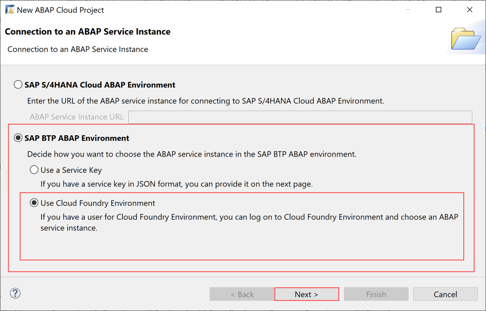

## Prerequisites  
  - SAP Cloud Platform ABAP environment user

## Details
### You will learn
  - How to create an ABAP class in Eclipse
  - How to create an ABAP package
  - How to execute an application


---

[ACCORDION-BEGIN [Step 1: ](Open ABAP cloud project)]
Open Eclipse, select **File** > **New** > **Other** > **ABAP Cloud Project**, then  click **Next**.


[ACCORDION-END]

[ACCORDION-BEGIN [Step 2: ](Select service instance connection)]
Select **SAP Cloud Platform Cloud Foundry Environment**, and click **Next**.



[ACCORDION-END]

[ACCORDION-BEGIN [Step 3: ](Setup connection settings)]
Connect to System and add following information:

- Region: **Europe**
- Email: **`<your_email_address>`**
- Password: **`<your_password>`**

and click **Next**.


[ACCORDION-END]

[ACCORDION-BEGIN [Step 4: ](Select service instance details)]
Drill down and select the following information:

- Organization: **`<your_organization>**`
- Space: **`<your_space>`**
- Service Instance: **`<your_service_instance>`**
and move on with **Next**.


[ACCORDION-END]

[ACCORDION-BEGIN [Step 5: ](Enter login credentials)]
Connect to your system by using your e-mail address and your Windows password.


[ACCORDION-END]

[ACCORDION-BEGIN [Step 6: ](Connect to service instance)]
Connect to service instance by selecting **Next**.


[ACCORDION-END]

[ACCORDION-BEGIN [Step 7: ](Add favorite packages)]
Add favorite packages and click **Finish** to complete your setup.


[ACCORDION-END]

[ACCORDION-BEGIN [Step 8: ](Add ABAP package)]
Add your own ABAP package to local package.


[ACCORDION-END]

[ACCORDION-BEGIN [Step 9: ](Create ABAP package)]
Name following fields:

- Name
- Description
Move on with **Next**.


[ACCORDION-END]

[ACCORDION-BEGIN [Step 10: ](Select package properties)]
Move on with **Next**.


[ACCORDION-END]

[ACCORDION-BEGIN [Step 11: ](Select transport request)]
 1. Add a description for the request.
 2. Click **Finish**.


 The ABAP package is now created.

[ACCORDION-END]

[ACCORDION-BEGIN [Step 12: ](Add new ABAP class)]
Add a new ABAP class to your package.


[ACCORDION-END]

[ACCORDION-BEGIN [Step 13: ](Create new ABAP class)]
Create an ABAP class by adding the following information:


Click **Next**.

[ACCORDION-END]

[ACCORDION-BEGIN [Step 14: ](Select transport request)]
Click **Finish** to create your transport request.


[ACCORDION-END]

[ACCORDION-BEGIN [Step 15: ](Add method)]
Add the following method to your ABAP class.

```swift
class Z_CLASS definition
public
final
create public .

public section.
interfaces if_oo_adt_classrun.
protected section.
private section.
ENDCLASS.

CLASS Z_CLASS IMPLEMENTATION.
METHOD IF_OO_ADT_CLASSRUN~MAIN.
out->write(`Hello world`).
ENDMETHOD.
ENDCLASS.

```
Save and activate your changes.

[ACCORDION-END]

[ACCORDION-BEGIN [Step 16: ](Execute ABAP application)]
Right-click your class and select **Run As** > **ABAP Application (Console)** or select your class and press **`F9`**.


This is your result:


[ACCORDION-END]
