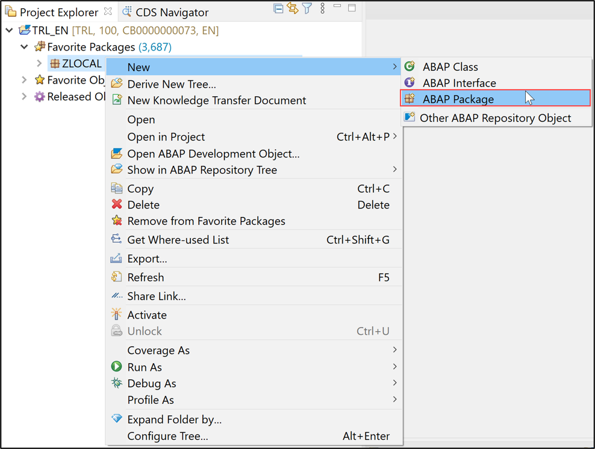
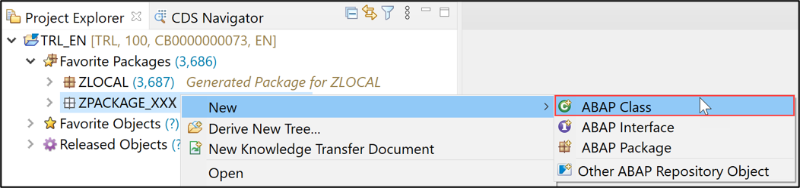
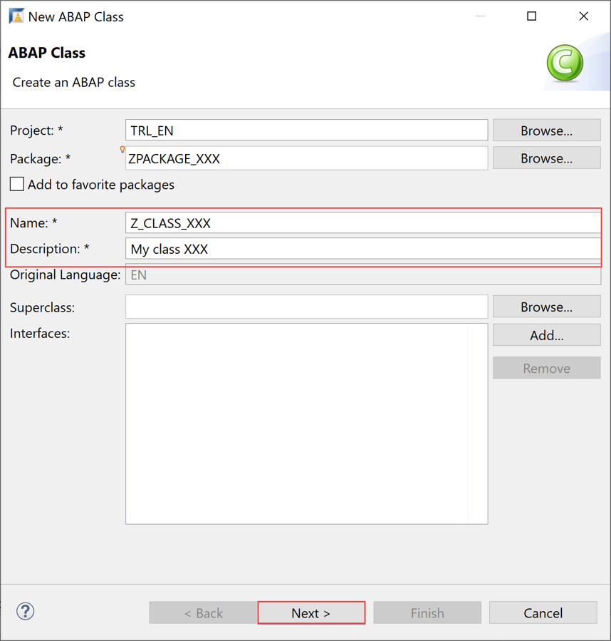

## Prerequisites  
  - SAP Cloud Platform ABAP Environment user
  - ADT version 2.96 or higher

## Details
### You will learn
  - How to create an ABAP Cloud Project in ADT
  - How to create an ABAP package
  - How to create an ABAP class
  - How to execute the application console

In this tutorial, wherever `XXX` appears, use a number (e.g. `000`).

---

[ACCORDION-BEGIN [Step 1: ](Open ABAP Development Tools in Eclipse)]
  1. Go to SAP on your Windows taskbar and click on the arrows.

      

  2. Select SAP Development Tools > ABAP in Eclipse - App Space - Oxygen

      

  3. Open the ABAP Perspective if not yet done.

      

[DONE]
[ACCORDION-END]

[ACCORDION-BEGIN [Step 2: ](Update ADT plugin)]
  1. Navigate to menu path Help > check for updates.

      

  2. If displayed in the wizard, then select ABAP Development Tools for SAP Net Weaver and move on with Next. If no ADT update is displayed then go ahead with step 3.

     

  3. Press Next on the following wizard screen.

      

  4. Accept the license agreements by selecting the appropriate entry on the wizard screen and press Finish to update your ADT installation.

      
     ADT will be updated and restarted.

[DONE]
[ACCORDION-END]

[ACCORDION-BEGIN [Step 3: ](Create ABAP Cloud project in ADT)]
Go to ADT and, select the menu path File > New > Other, filter and select ABAP Cloud Project from the wizard and then click Next.


[DONE]
[ACCORDION-END]

[ACCORDION-BEGIN [Step 4: ](Select service instance connection)]
In the next wizard screen, select SAP Cloud Platform Cloud Foundry Environment and click Next.


[DONE]
[ACCORDION-END]

[ACCORDION-BEGIN [Step 5: ](Provide connection settings)]
  1. Maintain the SAP Cloud Platform Foundry connection information and click **Next**:
        - Region: **`<your_region>`**
        - Email: **`<your_email_address>`**
        - Password: **`<your_password>`**

      

  2. Maintain the required Service Instance details by selecting the appropriate values from the drop-down lists and move on with **Next**.
        - Organization: **`<your_organization>`**
        - Space: **`<your_space>`**
        - Service Instance: **`<your_service_instance>`**

      

  3. Now provide your login credentials of the SAP Cloud Platform Identity Authentication Service (IAS) tenant to connect to the system and press Log On.

      

  4. Connect to service instance by selecting **Next**.

      

  5. At this stage you may add your favorite packages and click **Finish** to complete your setup.

      

[DONE]
[ACCORDION-END]

[ACCORDION-BEGIN [Step 6: ](Create ABAP package)]
  1. Right-click on the `ZLocal` package and select New > ABAP Package from the context menu.

      

  2. Provide the required information and move on with **Next**.
      - Name: `ZPackage_XXX`
      - Description: My Package

      

  3. Move on with **Next**.

      

  4. Provide a description for the transport request and click **Finish**.

      
     The ABAP package is now created.

[DONE]
[ACCORDION-END]

[ACCORDION-BEGIN [Step 7: ](Create new ABAP class)]
  1. Add a new ABAP class to your package.

      

  2. Maintain the required information and click **Next** to move on:   
      - Name: `Z_Class_XXX`
      - Description: My Class

      

  3. Provide a transport request and click **Finish**.

      

  4. Your class is now created.

      

[DONE]
[ACCORDION-END]

[ACCORDION-BEGIN [Step 8: ](Implement Interface)]
  1. In the class definition, specify the interface `IF_OO_ADT_CLASSRUN` in the public section as shown on the screenshot. Now go to the class implementation and provide the implementation of the method `IF_OO_ADT_CLASSRUN~MAIN`. As shown on the screenshot, it should output the text Hello World! using the code line below
`out->write('Hello World!').`

    ```swift
      class Z_CLASS_XXX definition
      public
      final
      create public .

      public section.
      interfaces if_oo_adt_classrun.
      protected section.
      private section.
      ENDCLASS.

      CLASS Z_CLASS_XXX IMPLEMENTATION.
      METHOD IF_OO_ADT_CLASSRUN~MAIN.
      out->write('Hello world!').
      ENDMETHOD.
      ENDCLASS.
    ```

  2. Save and activate your changes.

      

[DONE]
[ACCORDION-END]

[ACCORDION-BEGIN [Step 9: ](Execute ABAP application)]
  1. Right-click your class and select **Run As** > **ABAP Application (Console)** or select your class and press **`F9`**.

      

  2. Check your result.

      

[DONE]
[ACCORDION-END]

[ACCORDION-BEGIN [Step 10: ](Test yourself)]
Write only the write statement with following information: Hello SAP Cloud Platform ABAP Environment!

[VALIDATE_1]
[ACCORDION-END]
